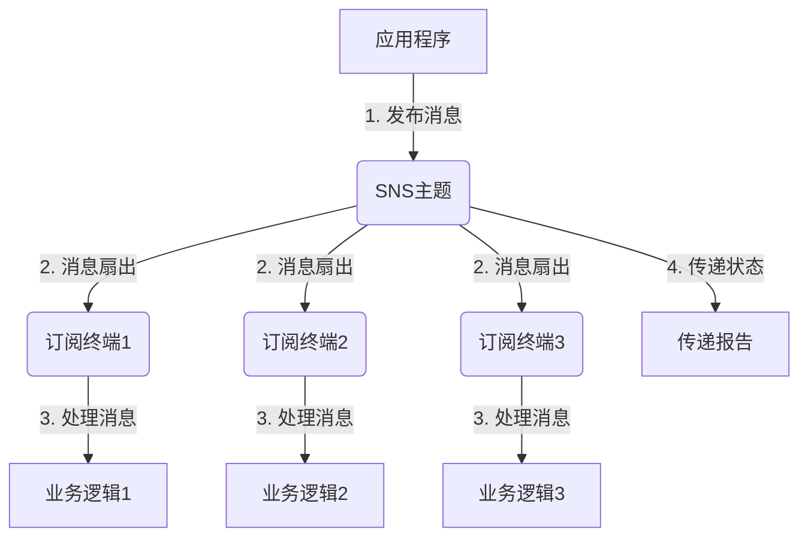

# AmazonSNS：云端发布订阅服务的最佳实践

## 1.背景介绍

### 1.1 什么是发布订阅模式？

发布订阅模式（Publish/Subscribe Pattern）是一种广泛使用的系统设计模式,它定义了一种一对多的依赖关系,使得当一个对象的状态发生变化时,所有依赖于它的对象都会得到通知并自动更新。这种模式常被用于构建事件驱动系统、消息传递系统、实时数据处理等应用场景。

在发布订阅模式中,有两个重要的角色:

- 发布者(Publisher):发布者负责发出事件或消息。
- 订阅者(Subscriber):订阅者对特定事件或消息主题感兴趣,并注册以接收相关通知。

发布订阅模式的核心思想是解耦发布者和订阅者,使它们之间没有直接依赖关系。发布者只需发布消息,而不需要知道谁来订阅。订阅者只需订阅感兴趣的主题,而不需要了解谁是发布者。这种松散耦合的设计有利于提高系统的可扩展性、灵活性和可维护性。

### 1.2 云端发布订阅服务的优势

随着云计算技术的兴起,各大云服务提供商都推出了自己的发布订阅服务,如 AWS 的 Amazon SNS、Microsoft Azure 的 Event Grid 和 Google Cloud 的 Cloud Pub/Sub 等。使用云端发布订阅服务可以带来诸多好处:

- **可靠性**:云服务提供商通常会保证消息传递的高可靠性,并提供故障恢复和重试机制,避免了自建消息系统的运维复杂性。
- **可扩展性**:云端服务具备出色的水平扩展能力,能够处理大量并发的发布订阅请求,满足高吞吐量和大规模场景需求。
- **全球部署**:云服务通常在全球多个地区部署,支持跨区域、跨账户的消息传递,方便构建分布式系统。
- **与其他服务集成**:发布订阅服务可与云提供商的其他服务(如计算、存储、数据库等)无缝集成,极大简化了应用程序的开发和部署。

本文将重点介绍 AWS 的 Amazon SNS(Simple Notification Service),它是一种高度可扩展、完全托管的发布订阅消息服务,可用于从云资源自动发送通知或消息到订阅终端,如 AWS Lambda、HTTP/S Webhook、Amazon SQS 队列、电子邮件地址或移动应用推送通知等。

## 2.核心概念与联系 

### 2.1 核心概念

要理解 Amazon SNS,需要掌握以下几个核心概念:

- **主题(Topic)**:发布消息的逻辑访问点。发布者将消息发送到主题,所有订阅该主题的订阅终端都会收到这些消息。
- **订阅(Subscription)**:订阅就是将主题与一个或多个目标终端(如SQS队列、Lambda函数等)关联起来。
- **发布(Publish)**:发布是指向主题发送消息或通知的行为。
- **终端节点(Endpoint)**:接收SNS消息的目标地址,可以是SQS队列、HTTP/S Webhook、Lambda函数、电子邮件地址或应用推送通知等。

### 2.2 Amazon SNS与其他AWS服务的关系

Amazon SNS可与AWS生态系统中的多个服务无缝集成,构建事件驱动的分布式应用程序:

- **AWS Lambda**: SNS可以直接将消息推送到Lambda函数,实现无服务器的事件驱动计算。
- **Amazon SQS**: 可将SNS消息发送到SQS队列,以实现消息缓冲和可靠的异步处理。
- **Amazon Kinesis**: SNS可以将数据流式传输到Kinesis数据流,实现实时数据流处理。
- **Amazon CloudWatch**: SNS可将通知发送到CloudWatch,从而触发自动化工作流程。

## 3.核心算法原理具体操作步骤

### 3.1 Amazon SNS工作原理

Amazon SNS的工作原理可以概括为以下几个步骤:

1. **创建主题(Topic)**:首先需要在SNS中创建一个主题,作为发布消息的逻辑通道。

2. **创建订阅(Subscription)**:然后为该主题创建一个或多个订阅,指定接收消息的目标终端(如SQS队列、Lambda函数等)。

3. **发布消息(Publish)**:应用程序或其他AWS服务向主题发布消息。

4. **消息扇出(Fan-Out)**:SNS服务会并行将消息推送到所有订阅了该主题的终端。

5. **终端处理(Endpoint Process)**:各个终端接收并处理消息,执行所需的业务逻辑。

6. **消息传递确认(Delivery Confirmation)**:SNS会持续重试未成功投递的消息,并为每个订阅提供传递状态。

SNS采用完全托管的服务模式,消除了自建消息系统的运维复杂性。它提供了水平扩展能力,能够处理大量的发布请求和订阅终端。

### 3.2 核心算法流程图

SNS的核心算法流程可以用下面这个流程图来表示:



上图阐释了SNS的核心工作流程:

1. 应用程序或其他AWS服务向SNS主题发布消息。
2. SNS并行将消息扇出(Fan-Out)到所有订阅该主题的终端。
3. 各个终端接收并处理消息,执行相应的业务逻辑。
4. SNS持续跟踪消息的传递状态,并提供传递报告。

## 4.数学模型和公式详细讲解举例说明

Amazon SNS的核心思想是解耦发布者和订阅者,通过引入主题(Topic)作为中间层来实现这种解耦。这种设计模式可以借助一些数学模型来更好地理解和分析。

### 4.1 发布订阅模型

发布订阅模型可以用一个四元组来表示:

$$
(P, S, M, T)
$$

其中:

- $P$ 表示发布者(Publisher)集合
- $S$ 表示订阅者(Subscriber)集合 
- $M$ 表示消息(Message)集合
- $T$ 表示主题(Topic)集合

发布者和订阅者通过主题进行间接交互,发布者向主题发布消息,订阅者从主题订阅感兴趣的消息。这种间接交互可以用两个函数来描述:

$$
\begin{align}
publish: P \times M \rightarrow T \\
subscribe: S \times T \rightarrow \{0, 1\}
\end{align}
$$

- $publish(p, m)$ 表示发布者 $p$ 向主题 $t$ 发布消息 $m$
- $subscribe(s, t)$ 表示订阅者 $s$ 是否订阅了主题 $t$,值为 1 表示订阅,0 表示未订阅

在这种模型下,发布者和订阅者是完全解耦的,它们只需关注自己的职责,而不需要知道对方的存在。

### 4.2 消息扇出模型

SNS在将消息推送到订阅终端时,采用了消息扇出(Fan-Out)机制。假设一个主题 $t$ 有 $n$ 个订阅者 $\{s_1, s_2, \ldots, s_n\}$,当发布者 $p$ 向主题 $t$ 发布消息 $m$ 时,SNS需要将 $m$ 并行推送到所有订阅者:

$$
\forall i \in \{1, 2, \ldots, n\}, \text{deliver}(m, s_i)
$$

其中 $\text{deliver}(m, s)$ 表示将消息 $m$ 投递到订阅者 $s$。

为了提高可靠性,SNS会为每个订阅者维护一个消息队列,对于未成功投递的消息,SNS会持续重试直到成功或达到最大重试次数。重试策略可以用以下公式描述:

$$
\begin{align}
n_r &= \min(n_{\max}, n_r + 1), & \text{if failed} \\
n_r &= 0, & \text{if succeeded}
\end{align}
$$

其中 $n_r$ 表示当前重试次数, $n_{\max}$ 表示最大重试次数。

通过上述数学模型,我们可以更好地理解和分析 Amazon SNS 的工作原理和算法。

## 4.项目实践:代码实例和详细解释说明

接下来,我们将通过一个实际的项目实践案例,来演示如何使用 AWS SDK 操作 Amazon SNS,并结合代码示例进行详细说明。

### 4.1 场景描述

假设我们有一个电子商务网站,当用户下单后,我们需要:

1. 将订单信息推送到 SQS 队列,由后端服务异步处理订单。
2. 同时通过 SNS 向用户发送电子邮件和移动推送通知,告知订单已提交成功。

为了实现这个需求,我们将使用 AWS SDK for Python (Boto3) 与 Amazon SNS 进行交互。

### 4.2 创建 SNS 主题

首先,我们需要创建一个 SNS 主题,作为发布订单通知的逻辑通道:

```python
import boto3

# 创建 SNS 客户端
sns = boto3.client('sns')

# 创建 SNS 主题
response = sns.create_topic(Name='order-notifications')
topic_arn = response['TopicArn']
print(f'SNS Topic ARN: {topic_arn}')
```

上述代码创建了一个名为 `order-notifications` 的 SNS 主题,并打印出该主题的 ARN (Amazon Resource Name)。ARN 是 AWS 资源的唯一标识符,我们将在后续步骤中使用它。

### 4.3 创建订阅

接下来,我们需要为主题创建两个订阅,分别用于推送电子邮件和移动推送通知:

```python
# 创建电子邮件订阅
email_subscription = sns.subscribe(
    TopicArn=topic_arn,
    Protocol='email',
    Endpoint='user@example.com'
)

# 创建移动推送订阅
mobile_subscription = sns.subscribe(
    TopicArn=topic_arn,
    Protocol='application',
    Endpoint='arn:aws:sns:us-west-2:123456789012:endpoint/GCM/gcmpushapp/xxxxxxx'
)
```

上述代码创建了两个订阅:

1. 电子邮件订阅,将通知发送到 `user@example.com`。
2. 移动推送订阅,将通知发送到指定的移动应用终端节点。

### 4.4 发布订单通知

当用户下单后,我们可以向 SNS 主题发布一条消息,通知所有订阅者:

```python
# 构建订单信息
order_info = {
    'order_id': '123456',
    'customer_name': 'John Doe',
    'total_amount': 99.99
}

# 发布 SNS 消息
response = sns.publish(
    TopicArn=topic_arn,
    Message=json.dumps(order_info),
    Subject='New Order Received'
)

print(f'MessageId: {response["MessageId"]}')
```

上述代码首先构建了一个包含订单信息的字典,然后使用 `sns.publish()` 方法向 SNS 主题发布一条消息。该消息会被推送到所有订阅了该主题的终端,包括电子邮件地址和移动推送终端。

### 4.5 处理订阅终端消息

最后,我们需要在订阅终端处理接收到的 SNS 消息,执行相应的业务逻辑。以下是一个示例 AWS Lambda 函数,用于处理 SQS 队列中的订单消息:

```python
import json

def lambda_handler(event, context):
    for record in event['Records']:
        payload = json.loads(record['body'])
        order_id = payload['order_id']
        customer_name = payload['customer_name']
        total_amount = payload['total_amount']
        
        # 处理订单逻辑
        print(f'Processing order {order_id} for {customer_name}, amount: ${total_amount}')
        
        # 执行其他业务逻辑,如