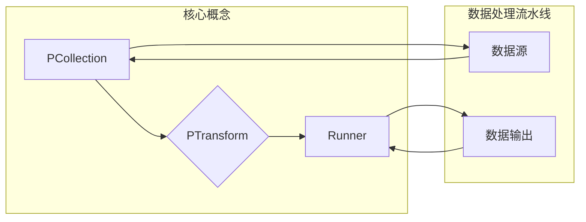

# Apache Beam: 可移植的流处理解决方案

作者：禅与计算机程序设计艺术

## 1. 背景介绍

### 1.1 大数据处理的演变

随着互联网和物联网的快速发展，全球数据量呈爆炸式增长，传统的单机数据处理模式已经无法满足海量数据的处理需求。为了应对这一挑战，分布式计算应运而生，并迅速发展成为大数据处理的主流技术。从早期的 Hadoop MapReduce 到后来的 Spark、Flink 等，分布式计算框架不断涌现，极大地提升了大数据的处理效率。

### 1.2 流处理技术的兴起

在大数据时代，数据产生的速度越来越快，实时性要求也越来越高。传统的批处理模式需要等待所有数据收集完毕才能进行处理，时效性较差，已经无法满足许多应用场景的需求。例如，在实时监控、欺诈检测、个性化推荐等领域，都需要对数据进行实时处理和分析。

流处理技术应运而生，它能够对实时产生的数据流进行连续不断的处理，并及时输出结果。与批处理相比，流处理具有以下优势：

* **低延迟：** 数据一旦到达即可进行处理，无需等待整个数据集收集完毕。
* **高吞吐量：** 能够处理高流量的数据流，满足实时性要求。
* **增量处理：** 可以对数据进行增量计算，避免重复计算，提高效率。

### 1.3 Apache Beam 的诞生

在流处理领域，存在着多种不同的开源框架，例如 Apache Spark Streaming、Apache Flink、Apache Storm 等。这些框架各有优缺点，但也存在一些共同的问题，例如：

* **API 不统一：** 不同的框架使用不同的 API，开发者需要学习不同的编程模型，增加了开发成本。
* **可移植性差：**  应用程序难以在不同的框架之间迁移，限制了代码的复用性。
* **生态系统割裂：**  不同的框架拥有自己的生态系统，难以整合不同的数据源和工具。

为了解决这些问题，Google 发起了 Apache Beam 项目。Beam 的目标是提供一个统一的编程模型和运行时环境，开发者可以使用 Beam 开发可移植、可扩展的流处理和批处理应用程序。

## 2. 核心概念与联系

### 2.1 数据处理流水线

Apache Beam 使用数据处理流水线（Pipeline）来描述数据处理过程。一个流水线由一系列数据处理步骤（Transform）组成，数据在流水线中流动并被依次处理。

### 2.2 数据集和数据流

Beam 中的数据模型分为两种：

* **PCollection：**  表示一个不可变的、分布式的数据集，可以是有限数据集或无限数据流。
* **PTransform：**  表示对 PCollection 进行数据处理的操作，例如过滤、转换、聚合等。

### 2.3  Runner

Runner 是 Beam 的执行引擎，负责将 Beam 流水线翻译成底层计算框架的作业并执行。Beam 支持多种不同的 Runner，例如：

* **DirectRunner：**  用于本地测试和调试，直接在本地机器上运行 Beam 流水线。
* **SparkRunner：**  将 Beam 流水线翻译成 Spark 作业，在 Spark 集群上运行。
* **FlinkRunner：**  将 Beam 流水线翻译成 Flink 作业，在 Flink 集群上运行。
* **DataflowRunner：**  将 Beam 流水线翻译成 Google Cloud Dataflow 作业，在 Google Cloud Platform 上运行。


### 2.4 核心概念联系图



## 3. 核心算法原理具体操作步骤

### 3.1 创建 Beam 流水线

使用 Beam 开发数据处理应用程序的第一步是创建 Beam 流水线。可以使用 `Pipeline` 对象来创建流水线，并指定 Runner 类型和流水线选项。

```python
import apache_beam as beam

with beam.Pipeline(options=pipeline_options) as pipeline:
    # 在这里定义数据处理流水线
    pass
```

### 3.2  创建 PCollection

创建 Beam 流水线后，需要创建 PCollection 对象来表示输入数据。可以使用 `pipeline.apply()` 方法从数据源创建 PCollection，例如：

* **从文本文件读取数据：**

```python
lines = pipeline | 'ReadFromText' >> beam.io.ReadFromText('gs://bucket/input.txt')
```

* **从数据库读取数据：**

```python
rows = pipeline | 'ReadFromJDBC' >> beam.io.ReadFromJdbc(
    driver_class_name='com.mysql.jdbc.Driver',
    url='jdbc:mysql://host:port/database',
    username='user',
    password='password',
    query='SELECT * FROM table'
)
```

### 3.3  应用 PTransform

创建 PCollection 后，可以使用 `apply()` 方法应用 PTransform 对数据进行处理。Beam 提供了丰富的 PTransform，例如：

* **ParDo：**  对 PCollection 中的每个元素进行处理，类似于 Map 操作。

```python
def process_line(line):
    # 对每行数据进行处理
    return processed_line

processed_lines = lines | 'ProcessLines' >> beam.ParDo(process_line)
```

* **GroupByKey：**  按照指定的 key 对 PCollection 中的元素进行分组，类似于 Shuffle 操作。

```python
grouped_data = data | 'GroupByKey' >> beam.GroupByKey()
```

* **CoGroupByKey：**  按照指定的 key 对多个 PCollection 中的元素进行分组，类似于 Join 操作。

```python
joined_data = (
    data1
    | 'KeyData1' >> beam.Map(lambda x: (x['key'], x))
    | 'CoGroupByKey' >> beam.CoGroupByKey()
    | 'ProcessJoinedData' >> beam.ParDo(process_joined_data)
)
```

* **CombinePerKey：**  对每个 key 对应的值进行聚合操作，例如求和、平均值等。

```python
sum_per_key = data | 'SumPerKey' >> beam.CombinePerKey(sum)
```

### 3.4  输出结果

处理完数据后，需要将结果输出到外部存储系统。可以使用 `io` 模块中的 PTransform 将 PCollection 写入到不同的数据源，例如：

* **写入文本文件：**

```python
processed_lines | 'WriteToText' >> beam.io.WriteToText('gs://bucket/output.txt')
```

* **写入数据库：**

```python
processed_data | 'WriteToJDBC' >> beam.io.WriteToJdbc(
    driver_class_name='com.mysql.jdbc.Driver',
    url='jdbc:mysql://host:port/database',
    username='user',
    password='password',
    table_name='table',
    insert_statement='INSERT INTO table (column1, column2) VALUES (?, ?)'
)
```

## 4. 数学模型和公式详细讲解举例说明

### 4.1  WordCount 示例

WordCount 是一个经典的数据处理案例，用于统计文本文件中每个单词出现的次数。下面是用 Beam 实现 WordCount 的示例代码：

```python
import apache_beam as beam

with beam.Pipeline() as pipeline:
    # 读取输入文件
    lines = pipeline | 'ReadFromText' >> beam.io.ReadFromText('input.txt')

    # 统计单词出现次数
    counts = (
        lines
        # 将每行文本分割成单词
        | 'SplitWords' >> beam.FlatMap(lambda line: line.split())
        # 将每个单词映射成 (word, 1) 的键值对
        | 'PairWithOne' >> beam.Map(lambda word: (word, 1))
        # 按照单词分组，并统计每个单词出现的次数
        | 'CountPerWord' >> beam.CombinePerKey(sum)
    )

    # 将结果写入输出文件
    counts | 'WriteToText' >> beam.io.WriteToText('output.txt')
```

### 4.2 数学模型

WordCount 的数学模型可以使用 MapReduce 模型来描述。

**Map 阶段：**

* 输入： 文本行
* 输出： (单词, 1) 的键值对

**Reduce 阶段：**

* 输入： (单词, [1, 1, 1, ...]) 的键值对列表
* 输出： (单词, 次数) 的键值对

### 4.3 公式

假设输入文本文件包含 $n$ 行文本，每行文本包含 $m_i$ 个单词，则：

* Map 阶段的输出数据量为 $\sum_{i=1}^{n} m_i$。
* Reduce 阶段的输入数据量为 Map 阶段的输出数据量。
* Reduce 阶段的输出数据量为单词的个数。

## 5. 项目实践：代码实例和详细解释说明

### 5.1  实时用户行为分析

**需求：**  对用户网站访问日志进行实时分析，统计每个页面的访问次数、每个用户的访问路径等信息。

**数据源：**  用户访问日志以 JSON 格式实时写入 Kafka。

**处理逻辑：**

1. 从 Kafka 读取用户访问日志。
2. 解析 JSON 格式的日志数据，提取页面 URL、用户 ID 等信息。
3. 统计每个页面的访问次数。
4. 按照用户 ID 分组，统计每个用户的访问路径。
5. 将结果写入 Redis，用于实时查询和展示。

**代码实例：**

```python
import apache_beam as beam
from apache_beam.io import ReadFromKafka
from apache_beam.io.kafka import WriteToKafka

class ParseLogFn(beam.DoFn):
    def process(self, element):
        # 解析 JSON 格式的日志数据
        log_data = json.loads(element.decode('utf-8'))
        yield {
            'url': log_data['url'],
            'user_id': log_data['user_id'],
            'timestamp': log_data['timestamp']
        }

class ExtractUserPathFn(beam.DoFn):
    def process(self, element, window=beam.DoFn.WindowParam):
        # 按照用户 ID 分组，并按照时间排序
        user_id, events = element
        sorted_events = sorted(events, key=lambda x: x['timestamp'])
        # 提取用户访问路径
        path = [event['url'] for event in sorted_events]
        yield (user_id, path)

with beam.Pipeline() as pipeline:
    # 从 Kafka 读取用户访问日志
    log_messages = pipeline | 'ReadFromKafka' >> ReadFromKafka(
        consumer_config={'bootstrap.servers': 'kafka:9092'},
        topics=['user_log']
    )

    # 解析日志数据
    parsed_logs = log_messages | 'ParseLog' >> beam.ParDo(ParseLogFn())

    # 统计页面访问次数
    page_counts = (
        parsed_logs
        | 'ExtractURL' >> beam.Map(lambda x: (x['url'], 1))
        | 'CountPerURL' >> beam.CombinePerKey(sum)
    )

    # 统计用户访问路径
    user_paths = (
        parsed_logs
        | 'ExtractUserEvents' >> beam.Map(lambda x: (x['user_id'], x))
        | 'GroupByUser' >> beam.GroupByKey()
        | 'ExtractUserPath' >> beam.ParDo(ExtractUserPathFn())
    )

    # 将结果写入 Redis
    page_counts | 'WriteToRedis' >> beam.io.WriteToRedis(
        key_prefix='page_count:',
        host='redis',
        port=6379
    )
    user_paths | 'WriteToRedis' >> beam.io.WriteToRedis(
        key_prefix='user_path:',
        host='redis',
        port=6379
    )
```

## 6. 工具和资源推荐

* **Apache Beam 官网：** https://beam.apache.org/
* **Beam Python SDK 文档：** https://beam.apache.org/documentation/programming-guide/#python
* **Google Cloud Dataflow：** https://cloud.google.com/dataflow/

## 7. 总结：未来发展趋势与挑战

### 7.1 未来发展趋势

* **统一编程模型：**  随着流处理和批处理界限的逐渐模糊，统一的编程模型将成为趋势，Beam 将在其中扮演重要角色。
* **云原生支持：**  越来越多的企业将数据处理任务迁移到云平台，Beam 对云原生的支持将更加完善。
* **机器学习集成：**  流处理和机器学习的结合将更加紧密，Beam 将提供更便捷的机器学习集成方案。

### 7.2 面临的挑战

* **性能优化：**  如何进一步提升 Beam 流水线的执行效率是一个挑战。
* **生态建设：**  Beam 的生态系统还需要进一步完善，吸引更多的开发者和企业使用。
* **标准化：**  流处理领域的标准化工作还需要进一步推进，Beam 需要积极参与其中。

## 8. 附录：常见问题与解答

### 8.1  Beam 和 Spark Streaming、Flink 的区别？

* **编程模型：**  Beam 提供了统一的编程模型，而 Spark Streaming 和 Flink 使用各自的 API。
* **可移植性：**  Beam 应用程序可以运行在不同的 Runner 上，而 Spark Streaming 和 Flink 应用程序只能运行在各自的集群上。
* **生态系统：**  Beam 的生态系统正在快速发展，但目前还不及 Spark Streaming 和 Flink 成熟。

### 8.2  Beam 支持哪些数据源和数据输出？

Beam 支持多种数据源和数据输出，包括：

* **数据源：**  文本文件、数据库、Kafka、Pub/Sub 等。
* **数据输出：**  文本文件、数据库、Kafka、BigQuery 等。

### 8.3  如何进行 Beam 应用程序的测试和调试？

可以使用 DirectRunner 在本地机器上测试和调试 Beam 应用程序。另外，Beam 还提供了一些测试工具，例如 `TestPipeline` 和 `beam.testing` 模块。
