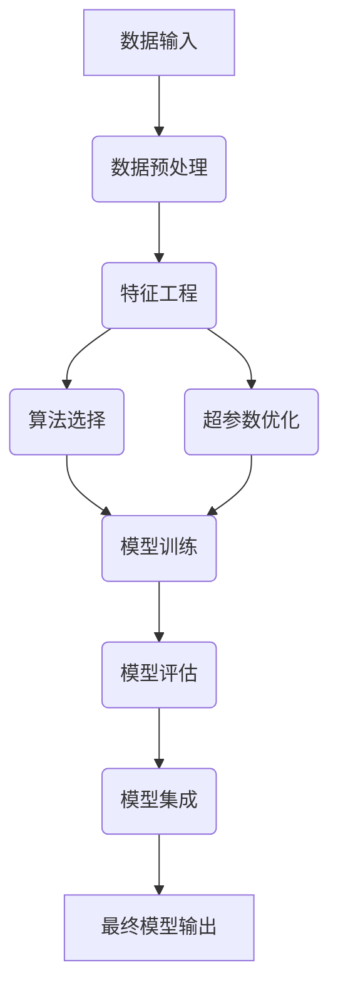

# AutoML原理与代码实例讲解

## 1.背景介绍

### 1.1 人工智能的发展历程

人工智能(Artificial Intelligence, AI)是现代计算机科学的一个分支领域,旨在研究模拟人类智能行为的理论、方法和技术。自20世纪50年代诞生以来,AI经历了几个重要的发展阶段。

- 1950s:AI的概念被正式提出,主要研究领域包括博弈、神经网络和逻辑推理等。
- 1960s-1970s:专家系统、机器学习和模式识别等技术逐渐兴起。
- 1980s-1990s:知识库、规则推理和不确定性推理成为热门研究方向。
- 21世纪初:深度学习的出现带来了AI的新一轮发展浪潮。

### 1.2 机器学习与AutoML的兴起

机器学习(Machine Learning, ML)是AI的一个重要分支,旨在使计算机能够从数据中自动分析、获取模式并做出决策。传统的机器学习流程需要由数据科学家进行大量的人工干预,包括数据预处理、特征工程、模型选择和调参等步骤。

随着数据量和算力的不断增长,以及深度学习等新型算法的出现,机器学习模型变得越来越复杂。人工干预的工作量也随之剧增,这促使了自动机器学习(Automated Machine Learning, AutoML)技术的兴起。AutoML旨在通过自动化的方式来选择和组合最优的算法、预处理步骤和超参数,从而减轻数据科学家的工作负担,提高机器学习流程的效率。

### 1.3 AutoML的重要性

AutoML技术的出现,为机器学习领域带来了革命性的变化。其主要意义体现在以下几个方面:

1. **提高效率**:AutoML自动化了许多繁琐的流程,大大减少了人力投入,缩短了模型开发周期。
2. **提升性能**:AutoML能够搜索到最优的算法组合和超参数配置,有助于获得更高的模型性能。
3. **降低门槛**:AutoML技术使非专业人员也能快速构建出高质量的机器学习模型。
4. **加速创新**:数据科学家能够把更多精力集中在理解业务和数据上,加速AI技术的创新应用。

## 2.核心概念与联系

### 2.1 AutoML主要组成部分

AutoML是一个庞大而复杂的系统,主要包括以下几个核心组成部分:

1. **算法库**:预先准备好各种机器学习算法的实现,如决策树、支持向量机、神经网络等。
2. **特征工程**:自动生成、选择和组合特征,提高模型的表达能力。
3. **超参数优化**:自动搜索最优的模型超参数配置,提升模型性能。
4. **模型集成**:将多个模型组合在一起,发挥集成的优势。
5. **神经架构搜索**:自动设计最优的神经网络架构。

### 2.2 AutoML工作流程

尽管不同的AutoML系统在具体实现上有所区别,但它们的工作流程大致遵循以下步骤:

1. **收集数据**:获取并清洗所需的训练数据集。
2. **数据分析**:对数据进行探索性分析,了解其统计特性。
3. **特征工程**:自动生成、选择和组合特征。
4. **算法选择**:从预设的算法库中选取适合的算法。
5. **超参数优化**:搜索算法的最优超参数配置。
6. **模型训练**:在训练数据上训练和调整模型。
7. **模型评估**:在测试数据上评估模型的性能。
8. **模型集成**:将多个模型组合,形成最终的模型。

### 2.3 AutoML系统框架

典型的AutoML系统框架如下所示:

上图展示了AutoML系统中各个模块之间的交互关系。数据预处理、特征工程、算法选择、超参数优化、模型训练和评估等步骤相互协作,最终输出一个高性能的机器学习模型。

## 3.核心算法原理具体操作步骤

AutoML涉及多种算法和技术,本节将重点介绍其中几个核心算法的原理和实现步骤。

### 3.1 贝叶斯优化

贝叶斯优化(Bayesian Optimization)是AutoML中最常用的超参数优化算法之一。它的核心思想是,利用高斯过程(Gaussian Process)建模目标函数,并在此基础上对超参数进行有效搜索。

贝叶斯优化算法的具体步骤如下:

1. 初始化:随机选择一些超参数配置点,在这些点上评估目标函数值。
2. 高斯过程建模:使用已有的配置点和函数值,通过高斯过程回归拟合目标函数。
3. 采集函数构建:基于高斯过程的均值和方差,构建一个采集函数(Acquisition Function),用于权衡exploration和exploitation。
4. 优化采集函数:优化采集函数,找到其最大值对应的新的配置点。
5. 迭代:在新的配置点上评估目标函数,重复步骤2-4,直到满足终止条件。

常用的采集函数包括期望提升(Expected Improvement, EI)、概率提升(Probability of Improvement, PI)和上确信bound(Upper Confidence Bound, UCB)等。

以PI为例,其计算公式为:

$$PI(x) = \Phi\left(\frac{\mu(x) - f(x^+) - \xi}{\sigma(x)}\right)$$

其中:
- $\Phi(\cdot)$为标准正态分布的累积分布函数
- $\mu(x)$和$\sigma(x)$分别为高斯过程在点$x$处的均值和标准差
- $f(x^+)$为目前为止最优的目标函数值
- $\xi$为一个trade-off参数,控制exploration和exploitation的权衡

### 3.2 进化算法

进化算法(Evolutionary Algorithm)是AutoML中另一种常用的优化算法,主要应用于神经架构搜索(Neural Architecture Search, NAS)。其灵感来源于生物进化过程,通过模拟自然选择、变异和遗传等机制,在搜索空间中不断进化,最终获得最优解。

进化算法的基本步骤如下:

1. 初始化:随机生成一个初始种群,每个个体对应一个神经网络架构。
2. 评估适应度:对每个个体训练神经网络,并在验证集上评估其性能作为适应度得分。
3. 选择:根据适应度得分,从种群中选择一部分个体作为父代。
4. 交叉变异:通过交叉和变异操作,从父代产生新的子代个体。
5. 替代:用子代中表现优秀的个体替换种群中的部分个体。
6. 迭代:重复步骤2-5,直到满足终止条件(如达到期望性能或迭代次数上限)。

进化算法的关键在于合理设计编码方式、选择策略、交叉变异操作等,以保证种群的多样性和算法的收敛性。

### 3.3 强化学习

除了贝叶斯优化和进化算法,强化学习(Reinforcement Learning)也可以应用于AutoML中的架构搜索和优化任务。强化学习的思路是,将AutoML的搜索过程建模为一个马尔可夫决策过程(Markov Decision Process, MDP),使用智能体(Agent)与环境(Environment)进行交互,通过不断试错获得经验并优化策略,最终找到最优解。

强化学习在AutoML中的应用步骤如下:

1. 定义状态空间、动作空间和奖励函数。
2. 初始化智能体(如深度神经网络),用于学习最优策略。
3. 进入环境,获取当前状态。
4. 智能体根据当前状态,选择一个动作(如修改架构或超参数)。
5. 环境执行动作,转移到新状态,并返回奖励值(如模型性能提升幅度)。
6. 智能体观测到新状态和奖励值,并更新策略网络的参数。
7. 重复步骤3-6,直到满足终止条件。

强化学习算法的关键在于如何合理设计状态空间、动作空间和奖励函数,以及选择合适的智能体结构和学习算法。常用的强化学习算法包括Q-Learning、策略梯度(Policy Gradient)等。

## 4.数学模型和公式详细讲解举例说明

本节将介绍AutoML中涉及的一些重要数学模型和公式,并结合具体例子进行说明。

### 4.1 高斯过程回归

高斯过程(Gaussian Process, GP)是一种常用的非参数概率模型,在贝叶斯优化和其他AutoML任务中发挥着重要作用。高斯过程可以看作是一个无限维的多元正态分布,其任意有限个点的联合分布均服从多元正态分布。

设$f(\cdot)$为我们希望拟合的潜在函数,高斯过程对其的建模可以表示为:

$$f(x) \sim \mathcal{GP}(m(x), k(x, x'))$$

其中:
- $m(x)$为均值函数(Mean Function),通常设为0
- $k(x, x')$为核函数(Kernel Function),用于描述不同输入点之间的相关性

常用的核函数包括高斯核(Gaussian Kernel)、Matern核和指数核(Exponential Kernel)等。以高斯核为例,其定义为:

$$k(x, x') = \sigma_f^2\exp\left(-\frac{||x - x'||^2}{2l^2}\right)$$

其中$\sigma_f^2$和$l$分别为信号方差和长度尺度超参数。

假设我们已经观测到一组训练数据$\{(x_i, y_i)\}_{i=1}^n$,其联合分布可表示为:

$$\begin{bmatrix}
    \mathbf{y} \\
    f_*
\end{bmatrix} \sim \mathcal{N}\left(\mathbf{0}, \begin{bmatrix}
    K(\mathbf{X}, \mathbf{X}) + \sigma_n^2\mathbf{I} & K(\mathbf{X}, \mathbf{x}_*) \\
    K(\mathbf{x}_*, \mathbf{X}) & K(\mathbf{x}_*, \mathbf{x}_*)
\end{bmatrix}\right)$$

其中:
- $\mathbf{X} = (x_1, x_2, \dots, x_n)^T$为训练输入
- $\mathbf{y} = (y_1, y_2, \dots, y_n)^T$为训练输出
- $\mathbf{x}_*$为测试输入
- $f_*$为测试输出的预测值
- $\sigma_n^2$为噪声方差
- $K(\cdot, \cdot)$为核矩阵,其中$K(\mathbf{X}, \mathbf{x}_*) = [k(x_1, x_*), k(x_2, x_*), \dots, k(x_n, x_*)]^T$

根据多元正态分布的性质,我们可以得到$f_*$的后验预测分布:

$$\begin{aligned}
    \mu_* &= K(\mathbf{x}_*, \mathbf{X})[K(\mathbf{X}, \mathbf{X}) + \sigma_n^2\mathbf{I}]^{-1}\mathbf{y} \\
    \sigma_*^2 &= K(\mathbf{x}_*, \mathbf{x}_*) - K(\mathbf{x}_*, \mathbf{X})[K(\mathbf{X}, \mathbf{X}) + \sigma_n^2\mathbf{I}]^{-1}K(\mathbf{X}, \mathbf{x}_*)
\end{aligned}$$

上式给出了在已知训练数据的情况下,高斯过程在测试点$\mathbf{x}_*$处的均值$\mu_*$和方差$\sigma_*^2$的计算方法。这种预测分布可用于贝叶斯优化、概率分类等任务。

### 4.2 期望提升

期望提升(Expected Improvement, EI)是贝叶斯优化中常用的一种采集函数。它旨在平衡exploration和exploitation,在高斯过程模型的指导下,选择最有希望提升目标函数值的下一个采样点。

设$f(\mathbf{