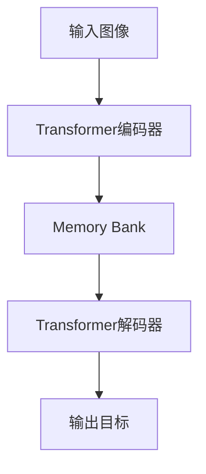

# "DETR在自然场景文本检测中的应用"

## 1.背景介绍

在自然场景文本检测任务中,我们需要从复杂背景中准确检测和识别文本区域。传统的基于区域提议和分类的方法往往存在着复杂的管道、慢的运行速度和对小物体不够鲁棒等缺陷。最近,基于Transformer的目标检测模型DETR(Detection Transformer)凭借其简单有效的端到端设计和出色的性能引起了广泛关注,为自然场景文本检测任务带来了新的解决方案。

### 1.1 自然场景文本检测的挑战

自然场景文本检测是计算机视觉领域的一个重要任务,其目标是从图像或视频中检测和识别任意方向、任意形状的文本实例。与通用目标检测相比,自然场景文本检测面临以下主要挑战:

- **复杂背景**:文本常出现在复杂的自然背景中,存在光照变化、遮挡、透视畸变等干扰因素。
- **多样性**:文本可能出现在各种尺寸、颜色、字体、语言和方向上,增加了检测的难度。
- **密集排列**:许多场景中存在密集排列的多行文本,增加了分割和识别的复杂性。

### 1.2 DETR模型概述  

DETR是2020年提出的一种基于Transformer的目标检测模型,其将目标检测任务建模为一个端到端的集合预测问题。与传统的基于区域提议和分类的方法不同,DETR直接从图像中平行预测所有目标的边界框和类别,避免了复杂的管道设计。DETR模型的主要优点包括:

- **简单有效**:DETR采用Transformer编码器-解码器结构,通过注意力机制直接从图像中预测目标,设计简单而有效。
- **端到端学习**:DETR不需要手工设计的组件,整个模型可以端到端进行训练和优化。
- **无需先验锚框**:与基于锚框的检测器不同,DETR可以直接基于注意力机制预测任意形状的目标。

尽管DETR在通用目标检测任务上表现出色,但在自然场景文本检测任务中的应用还存在一些挑战,需要针对性地进行模型改进和调整。

## 2.核心概念与联系

### 2.1 Transformer编码器-解码器架构

Transformer是一种基于自注意力机制的序列到序列模型,广泛应用于自然语言处理和计算机视觉任务。DETR采用了编码器-解码器的Transformer架构,如下图所示:



编码器将输入图像编码为一系列特征向量,解码器则从这些特征向量中解码出目标的边界框和类别。具体来说:

1. **编码器**:卷积神经网络(如ResNet)被用作编码器的底层,提取图像的特征映射。然后,一个Transformer编码器对这些特征映射进行编码,生成一个扁平的memory bank。
2. **解码器**:解码器是一个标准的Transformer解码器,它接收一个查询向量作为输入,通过注意力机制与memory bank交互,并输出一系列预测向量,对应着不同的目标边界框和类别。

通过端到端的训练,DETR可以学习直接从图像中预测目标,而无需复杂的手工设计组件。

### 2.2 生物传导注意力机制

自然场景文本检测任务中,由于文本实例具有任意方向和形状的特点,使用标准的注意力机制可能难以充分捕获文本的结构信息。为了解决这个问题,研究人员提出了生物传导注意力(Bio-Inspired Attention)机制,以更好地处理文本实例。

生物传导注意力机制的灵感来自于生物视觉系统,它模拟了视锥细胞和简单细胞在视觉皮层中的行为。具体来说,它由两个注意力模块组成:

1. **视锥注意力模块**:用于捕获文本实例的全局结构信息,类似于视锥细胞对整体形状的感知。
2. **简单注意力模块**:用于捕获文本实例的局部纹理信息,类似于简单细胞对局部边缘和纹理的感知。

通过将这两种注意力模块集成到DETR模型中,可以更好地捕获文本实例的结构和纹理信息,提高自然场景文本检测的性能。

## 3.核心算法原理具体操作步骤  

### 3.1 DETR模型训练

DETR模型的训练过程可以概括为以下步骤:

1. **数据预处理**:将输入图像缩放到固定尺寸,并使用卷积神经网络(如ResNet)提取特征映射。
2. **编码器**:Transformer编码器对特征映射进行编码,生成一个扁平的memory bank。
3. **解码器**:
   - 初始化一组学习的查询向量,代表潜在的目标。
   - 对每个查询向量,解码器执行以下操作:
     - 通过注意力机制与memory bank交互,获取相关的上下文信息。
     - 将注意力输出和查询向量进行融合,通过前馈网络生成新的查询向量。
     - 从新的查询向量中预测目标的边界框坐标和类别。
4. **损失计算**:将预测的边界框和类别与真实标注进行比较,计算损失函数。
5. **模型优化**:使用优化算法(如Adam)基于损失函数更新模型参数。

在训练过程中,DETR模型需要学习直接从图像特征中预测目标的边界框和类别,这是一个端到端的过程,无需复杂的手工设计组件。

### 3.2 DETR模型推理

在推理阶段,DETR模型的工作流程如下:

1. **输入图像**:将待检测的图像输入到模型中。
2. **特征提取**:使用卷积神经网络提取图像的特征映射。
3. **编码器**:Transformer编码器对特征映射进行编码,生成memory bank。
4. **解码器**:
   - 初始化一组固定数量的查询向量,代表潜在的目标。
   - 对每个查询向量,解码器执行以下操作:
     - 通过注意力机制与memory bank交互,获取相关的上下文信息。
     - 将注意力输出和查询向量进行融合,通过前馈网络生成新的查询向量。
     - 从新的查询向量中预测目标的边界框坐标和类别。
5. **后处理**:对预测的边界框和类别进行非极大值抑制等后处理,得到最终的检测结果。

在推理过程中,DETR模型无需生成候选区域proposals,而是直接从图像特征中并行预测所有目标的边界框和类别,大大简化了检测流程。

## 4.数学模型和公式详细讲解举例说明

### 4.1 Transformer编码器

DETR模型的编码器部分采用了标准的Transformer编码器结构。给定一个输入序列$X = (x_1, x_2, \dots, x_n)$,Transformer编码器的输出序列$Z = (z_1, z_2, \dots, z_n)$可以表示为:

$$z_i = \text{Encoder}(x_1, x_2, \dots, x_n)$$

其中,Encoder函数由多个编码器层组成,每个编码器层包含了多头自注意力(Multi-Head Attention)和前馈神经网络(Feed-Forward Network)两个子层。

多头自注意力子层的计算过程如下:

$$\text{MultiHead}(Q, K, V) = \text{Concat}(head_1, \dots, head_h)W^O$$
$$\text{where, } head_i = \text{Attention}(QW_i^Q, KW_i^K, VW_i^V)$$

其中,$Q$、$K$、$V$分别代表查询(Query)、键(Key)和值(Value),$W_i^Q$、$W_i^K$、$W_i^V$和$W^O$是可学习的线性投影参数。Attention函数计算注意力权重,并将值向量$V$加权求和,得到注意力输出。

前馈神经网络子层的计算过程如下:

$$\text{FFN}(x) = \max(0, xW_1 + b_1)W_2 + b_2$$

其中,$W_1$、$W_2$、$b_1$、$b_2$是可学习的参数。

通过堆叠多个编码器层,Transformer编码器可以从输入序列中捕获长程依赖关系,并生成对应的编码表示$Z$。

### 4.2 DETR解码器

DETR模型的解码器部分采用了标准的Transformer解码器结构,它与编码器类似,但增加了一个额外的交叉注意力(Cross-Attention)子层,用于关注编码器输出的memory bank。

给定编码器输出$Z$和一组可学习的查询向量$Y = (y_1, y_2, \dots, y_m)$,解码器的输出序列$O = (o_1, o_2, \dots, o_m)$可以表示为:

$$o_j = \text{Decoder}(y_j, Z)$$

其中,Decoder函数由多个解码器层组成,每个解码器层包含了多头自注意力、多头交叉注意力和前馈神经网络三个子层。

多头交叉注意力子层的计算过程如下:

$$\text{MultiHeadCrossAttention}(Q, K, V) = \text{Concat}(head_1, \dots, head_h)W^O$$
$$\text{where, } head_i = \text{Attention}(QW_i^Q, KW_i^K, VW_i^V)$$

其中,$Q$来自查询向量$y_j$,$K$和$V$来自编码器输出$Z$。通过关注编码器输出的memory bank,交叉注意力子层可以获取与当前查询向量相关的上下文信息。

在每个解码器层的输出上,DETR模型会使用一个前馈神经网络预测目标的边界框坐标和类别。具体来说,对于每个输出$o_j$,我们有:

$$b_j = W_b^T o_j + b_b$$
$$c_j = W_c^T o_j + b_c$$

其中,$b_j$代表预测的边界框坐标,$c_j$代表预测的目标类别logits,$W_b$、$W_c$、$b_b$、$b_c$是可学习的参数。

在训练阶段,DETR模型会将预测的边界框和类别与真实标注进行比较,计算损失函数,并使用优化算法更新模型参数。在推理阶段,DETR模型会对预测的边界框和类别进行后处理,得到最终的检测结果。

## 4.项目实践:代码实例和详细解释说明

在这一部分,我们将介绍如何使用Python和PyTorch库实现DETR模型,并应用于自然场景文本检测任务。

### 4.1 数据准备

首先,我们需要准备用于训练和评估的数据集。对于自然场景文本检测任务,常用的数据集包括ICDAR 2015、ICDAR 2017 MLT和ICDAR 2019 ArT等。这些数据集包含了来自街景、海报、标志等各种场景的图像,并提供了相应的文本实例标注。

我们可以使用PyTorch提供的`torchvision.datasets`模块加载这些数据集。以ICDAR 2015数据集为例:

```python
from torchvision.datasets import ImageFolder
from torchvision.transforms import ToTensor

# 加载数据集
dataset = ImageFolder('path/to/icdar2015', transform=ToTensor())

# 划分训练集和验证集
train_size = int(0.8 * len(dataset))
val_size = len(dataset) - train_size
train_dataset, val_dataset = torch.utils.data.random_split(dataset, [train_size, val_size])
```

### 4.2 模型实现

接下来,我们将使用PyTorch实现DETR模型。我们首先定义Transformer编码器和解码器模块:

```python
import torch
import torch.nn as nn

class TransformerEncoder(nn.Module):
    def __init__(self, ...):
        ...

    def forward(self, x):
        ...

class TransformerDecoder(nn.Module):
    def __init__(self, ...):
        ...

    def forward(self, y, memory):
        ...
```

然后,我们定义DETR模型的主体结构:

```python
class DETR(nn.Module):
    def __init__(self, ...