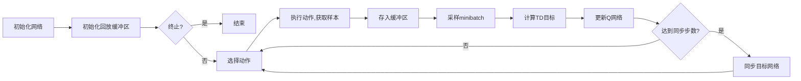

# DQN与其他强化学习算法的比较：选择最合适的算法

作者：禅与计算机程序设计艺术

## 1. 背景介绍
### 1.1 强化学习的定义与应用
强化学习(Reinforcement Learning, RL)是机器学习的一个重要分支,它旨在使智能体(Agent)通过与环境的交互来学习最优策略,以获得最大的累积奖励。强化学习已广泛应用于游戏AI、自动驾驶、机器人控制等领域,展现出巨大的潜力。

### 1.2 DQN的诞生
近年来,随着深度学习的蓬勃发展,将深度神经网络(Deep Neural Network, DNN)引入强化学习,形成了深度强化学习(Deep Reinforcement Learning, DRL)的研究热潮。其中,Deep Q-Network(DQN)算法[1]的提出是一个里程碑式的突破。DQN利用卷积神经网络来逼近最优Q函数,成功地在多个Atari游戏中达到甚至超越人类玩家的水平。

### 1.3 对比的意义
然而,DQN 并非适用于所有场景。为了选择最合适的强化学习算法,有必要对 DQN 和其他经典算法做全面的比较和分析。本文将从算法原理、适用场景、优缺点等方面,对DQN与其他算法展开深入探讨。

## 2. 核心概念与联系
### 2.1 马尔可夫决策过程
强化学习问题通常被建模为马尔可夫决策过程(Markov Decision Process, MDP)[2]。MDP由状态集合S、动作集合A、转移概率P、奖励函数 R 和折扣因子γ 组成。智能体与环境交互的过程可视为在MDP中进行序列决策,目标是最大化累积奖励的期望值。

### 2.2 价值函数与策略
在RL中,我们关注两个核心概念:价值函数(Value Function)和策略(Policy)。
- 状态价值函数 $V^{\pi}(s)$ 表示从状态s开始,遵循策略 $\pi$ 所能获得的期望累积奖励。
- 动作价值函数(Q函数)$Q^{\pi}(s,a)$ 表示在状态s下选择动作a,遵循策略 $\pi$ 所能获得的期望累积奖励。
- 策略 $\pi$ 定义了在每个状态下智能体选择动作的概率分布。

最优价值函数 $V^{*}(s)$ 和 $Q^{*}(s,a)$ 分别对应最优策略 $\pi^{*}$ 。RL的目标就是找到最优策略。

### 2.3 探索与利用
探索(Exploration)与利用(Exploitation)的平衡是RL的一大挑战。探索是尝试新的动作以发现潜在的高回报,利用则是执行已知的最优动作以获取稳定的回报。如何在二者间权衡取舍,是算法设计需要考虑的关键因素。

## 3. 核心算法原理
本章将重点介绍DQN算法和其他几种经典的强化学习算法,包括Q-Learning、Sarsa、Policy Gradient等,分析它们的核心思想和具体操作步骤。

### 3.1 DQN
#### 3.1.1 Q-Learning基础
DQN算法建立在Q-Learning的基础之上。Q-Learning 通过值迭代(Value Iteration)的思想,不断更新状态-动作价值函数:

$$Q(s,a) \leftarrow Q(s,a) + \alpha \left[ r + \gamma \max\limits_{a'} Q(s',a') - Q(s,a) \right] $$

其中,$(s,a,r,s')$ 表示一个转移四元组,α是学习率。该更新规则源自贝尔曼最优方程:

$$Q^{*}(s,a) = \mathbb{E}_{s' \sim P} \left[ r + \gamma \max\limits_{a'} Q^{*}(s',a') | s,a \right]$$

不难看出,Q-Learning 是一种异策略(Off-policy)的时序差分(Temporal-Difference,TD)学习方法。

#### 3.1.2 DQN创新点 
DQN在Q-Learning的基础上引入了两个创新:
1. 经验回放(Experience Replay)[3]:将转移四元组$(s,a,r,s')$存入回放缓冲区,并从中随机采样进行训练。这样做可以打破数据的关联性,避免梯度方差爆炸。
2. 目标网络(Target Network):克隆一个结构相同但参数不同步的神经网络,用它来计算TD目标值。定期将策略网络的参数复制给目标网络。这样做可以缓解训练不稳定的问题。

#### 3.1.3 DQN算法流程
结合以上讨论,DQN的主要操作流程如下:
1. 随机初始化Q网络的权重θ,复制得到目标网络的权重 $\hat{\theta}=\theta$。
2. 初始化回放缓冲区D。 
3. for episode = 1 to M do
    1. 初始化环境状态 s
    2. while s 不是终止状态 do 
        1. 根据 $\epsilon-greedy$ 策略选取一个动作a
        2. 执行a,观察奖励r和下一状态s'
        3. 将转移样本 $(s,a,r,s')$ 存入D
        4. 从D中随机采样一个批量的转移样本 $(s_j,a_j,r_j,s'_j)$
        5. 计算TD目标 $y_j = \begin{cases} r_j  & \text{if episode terminates at j+1} \\ r_j + \gamma \max\limits_{a'}Q(s'_j, a';\hat{\theta}) & \text{otherwise} \end{cases}$
        6. 最小化损失 $L(\theta) = \frac{1}{N}\sum_j \left(y_j - Q(s_j,a_j;\theta) \right)^2$ 更新Q网络 
        7. 每C步同步目标网络 $\hat{\theta} \leftarrow \theta$
        8. $s \leftarrow s'$

下图展示了DQN算法的工作流程:

### 3.2 Double DQN
Double DQN(DDQN)[5]是对DQN的一个重要改进。它利用双估计(Double Estimate)的思想来缓解Q值的过高估计问题。不同于DQN直接用目标网络来估计最大Q值:

$$y^{DQN}_j = r_j + \gamma \max\limits_{a'}Q(s'_j, a';\hat{\theta}) $$

DDQN用一个网络选择最优动作,另一个网络评估该动作的Q值:

$$y^{DDQN}_j = r_j + \gamma Q \left(s'_j, \arg\max\limits_{a'}Q(s'_j, a';\theta);\hat{\theta} \right) $$

这种解耦可以有效减小最大化偏差(maximization bias)。

### 3.3 Dueling DQN
Dueling DQN[6]从价值函数的角度出发,提出了一种新颖的网络架构。它将Q网络分为两个并行的分支:一个估计状态价值函数V(s),一个估计优势函数A(s,a),最终输出为它们的和:

$$Q(s,a) = V(s) + A(s,a) $$

这种分解使得网络能更有效地学习到状态价值,加速收敛。同时,由于打分函数的存在,状态价值估计更加鲁棒。Dueling架构常与DDQN结合使用。

### 3.4 IRE
Implicit Quantile Networks(IQN)[7]从分布的角度看待Q值。它用一组分位点(quantile)来近似Q值分布。相比DQN只估计期望,IQN能捕捉到收益分布的更多信息。此外,IQN在损失函数中使用了分位数回归,这使得它在面对噪声和异常值时更加稳健。

### 3.5 Policy Gradient
策略梯度(Policy Gradient)[4]是另一大类RL算法。有别于DQN等基于值函数(Value-based)的方法,PG直接对策略函数 $\pi_{\theta}(a|s)$ 建模并沿着性能梯度的方向去优化策略。它的核心是策略梯度定理:

$$ \nabla_{\theta} J(\theta) = \mathbb{E}_{\tau \sim \pi_{\theta}} \left[ \sum_{t=0}^{T} \nabla_{\theta} \log \pi_{\theta}(a_t|s_t) Q^{\pi_{\theta}}(s_t,a_t) \right]$$

其中, $\tau=(s_0,a_0,r_1,...s_T,a_T,r_T)$ 表示一条轨迹。

PG通过采样轨迹,计算梯度估计,再用随机梯度上升等方法来更新策略网络,以最大化期望累积回报。常见的PG算法包括REINFORCE、Actor-Critic等。

### 3.6 确定性策略梯度
确定性策略梯度(Deterministic PG,DPG)[8]结合了DQN和PG的优点,适用于连续动作空间。DPG包含一个确定性策略网络 $\mu_{\theta}(s)$ 和一个值函数近似器 $Q^w(s,a)$。策略网络用于确定性地选择动作,而Q函数则用于评估和指导策略更新。DDPG[9]在DPG的基础上加入了经验回放和目标网络,取得了很好的效果。

## 4. 数学模型和公式详解
本章选取几个代表性的公式,做详细的数学推导和举例说明。

### 4.1 贝尔曼方程
贝尔曼方程是强化学习的理论基石,揭示了最优策略、最优价值函数之间的递归关系。对于状态-动作值函数Q,其贝尔曼最优方程为:

$$ Q^*(s,a) = \sum_{s'} P(s'|s,a) [R(s,a,s') + \gamma \max\limits_{a'} Q^*(s',a')] \tag{1}$$

推导如下:
$$
\begin{aligned}
Q^{\pi}(s,a) &= \mathbb{E}_{\pi}[\sum_{k=0}^{\infty} \gamma^k r_{t+k+1} | S_t=s, A_t=a] \\
&= \mathbb{E}_{\pi}[r_{t+1} + \gamma \sum_{k=0}^{\infty} \gamma^k r_{t+k+2} | S_t=s, A_t=a] \\  
&= \sum_{s'} P(s'|s,a) \bigg[ R(s,a,s') + \gamma \mathbb{E}_{\pi} \Big[ \sum_{k=0}^{\infty} \gamma^k r_{t+k+2} | S_{t+1}=s' \Big]\bigg] \\
&= \sum_{s'} P(s'|s,a) [R(s,a,s') + \gamma \sum_{a'} \pi(a'|s') Q^{\pi}(s',a')] \\
\end{aligned}
$$

当 $\pi$ 是最优策略 $\pi^*$ 时,上式就成为贝尔曼最优方程(1)。直观地说,最优动作价值等于立即奖励加上折扣的次态最优价值的期望。基于贝尔曼方程,我们可以设计Q-Learning等经典算法。

**例**: 考虑一个简单的MDP。智能体在状态 s 下有两个可选动作 $a_1$ 和 $a_2$,奖励和转移概率如下表:

| 动作 | 奖励 | 转移概率 P(s'|s,a) |
| --- | --- | --- |
| $a_1$ | +1 | {$s_1$: 0.7, $s_2$: 0.3}  | 
| $a_2$ | -2 | {$s_1$: 0.4, $s_2$: 0.6}  |

假设折扣因子 $\gamma = 0.9$,状态 $s_1$ 和 $s_2$ 的最优价值分别为4和0。根据贝尔曼最优方程,我们可以计算 $Q^*(s,a_1)$:

$$
\begin{aligned}
Q^*(s,a_1) &= 1 + 0.9 \times (0.7 \times 4 + 0.3 \times 0) \\
           &= 3.52
\en