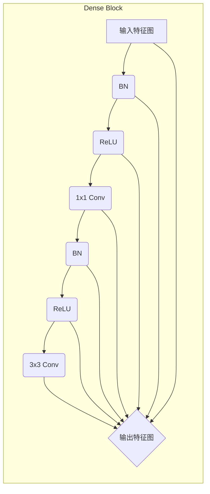
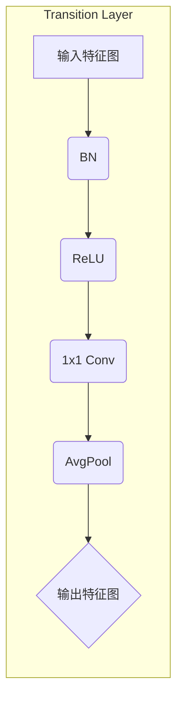

## 1. 背景介绍

### 1.1 深度学习中的网络深度问题

近年来，深度学习在图像识别、自然语言处理等领域取得了突破性进展。卷积神经网络 (CNN) 作为深度学习的代表性模型之一，在图像分类、目标检测等任务中表现出色。然而，随着网络深度的增加，CNN 也面临着一些挑战：

* **梯度消失/爆炸问题:**  在深度网络中，梯度在反向传播过程中可能会变得非常小或非常大，导致网络难以训练。
* **特征重用问题:**  浅层网络学习到的特征信息可能无法有效地传递到深层网络，导致深层网络难以充分利用所有层的特征信息。

### 1.2 DenseNet 的提出

为了解决上述问题，Huang 等人于 2017 年提出了 DenseNet（Densely Connected Convolutional Networks，密集连接卷积网络）。DenseNet 的核心思想是：**通过密集连接的方式，将每一层网络的输出特征图与后续所有层的输入特征图直接相连，从而实现特征的充分复用和信息的有效传递。**

## 2. 核心概念与联系

### 2.1 密集连接机制

DenseNet 中的密集连接机制是指：**对于每一层网络，其输入特征图是前面所有层的输出特征图的拼接。** 具体来说，假设网络有 $L$ 层，则第 $l$ 层的输入特征图 $x_l$ 可以表示为：

$$
x_l = H_l([x_0, x_1, ..., x_{l-1}])
$$

其中，$H_l(\cdot)$ 表示第 $l$ 层的非线性变换函数，$[x_0, x_1, ..., x_{l-1}]$ 表示将前面所有层的输出特征图按通道维度进行拼接。

### 2.2 Dense Block 和 Transition Layer

DenseNet 的网络结构由多个 Dense Block 和 Transition Layer 交替堆叠而成。

* **Dense Block:**  Dense Block 是由多个密集连接的卷积层组成的模块。在 Dense Block 中，每一层的输出特征图都会与后续所有层的输入特征图直接相连。
* **Transition Layer:**  Transition Layer 用于连接相邻的 Dense Block，并对特征图进行降维操作，以减少网络参数量和计算量。

### 2.3 核心概念之间的联系

* 密集连接机制是 DenseNet 的核心，它通过直接连接所有层的特征图，实现了特征的充分复用和信息的有效传递，从而解决了梯度消失/爆炸和特征重用问题。
* Dense Block 是 DenseNet 的基本组成单元，它通过堆叠多个密集连接的卷积层，实现了对输入特征的逐层抽象和提取。
* Transition Layer 用于连接相邻的 Dense Block，并对特征图进行降维操作，以减少网络参数量和计算量，提高网络的效率。

## 3. 核心算法原理具体操作步骤

### 3.1 Dense Block 的结构

Dense Block 的结构如 **图 1** 所示。



**图 1:** Dense Block 的结构

Dense Block 中的每个卷积层都包含以下操作：

1. **Batch Normalization (BN):**  对输入特征图进行归一化处理，加速网络收敛速度。
2. **ReLU 激活函数:**  引入非线性变换，增强网络的表达能力。
3. **1x1 卷积:**  对输入特征图进行降维操作，减少网络参数量和计算量。
4. **3x3 卷积:**  对输入特征图进行特征提取。

### 3.2 Transition Layer 的结构

Transition Layer 的结构如 **图 2** 所示。



**图 2:** Transition Layer 的结构

Transition Layer 中包含以下操作：

1. **Batch Normalization (BN):**  对输入特征图进行归一化处理，加速网络收敛速度。
2. **ReLU 激活函数:**  引入非线性变换，增强网络的表达能力。
3. **1x1 卷积:**  对输入特征图进行降维操作，减少网络参数量和计算量。
4. **Average Pooling:**  对输入特征图进行下采样操作，减少特征图的尺寸。

### 3.3 DenseNet 的训练过程

DenseNet 的训练过程与其他 CNN 模型类似，主要包括以下步骤：

1. **数据预处理:**  对输入数据进行预处理，例如数据增强、归一化等操作。
2. **前向传播:**  将输入数据送入网络，计算网络的输出结果。
3. **计算损失函数:**  根据网络的输出结果和真实标签，计算损失函数值。
4. **反向传播:**  根据损失函数值，计算网络参数的梯度。
5. **参数更新:**  使用优化算法（例如 SGD、Adam 等）更新网络参数。

## 4. 数学模型和公式详细讲解举例说明

### 4.1 密集连接机制的数学模型

DenseNet 中的密集连接机制可以表示为以下公式：

$$
x_l = H_l([x_0, x_1, ..., x_{l-1}]) = H_l(x_0 \oplus x_1 \oplus ... \oplus x_{l-1})
$$

其中，$\oplus$ 表示特征图的拼接操作。

### 4.2 1x1 卷积的降维作用

1x1 卷积可以看作是对输入特征图的每个像素点进行加权求和的操作。假设输入特征图的通道数为 $C_in$，输出特征图的通道数为 $C_out$，则 1x1 卷积核的尺寸为 $1 \times 1 \times C_in \times C_out$。当 $C_out < C_in$ 时，1x1 卷积可以起到降维的作用。

### 4.3 Average Pooling 的下采样作用

Average Pooling 是对输入特征图的每个区域进行平均池化操作。假设池化窗口的大小为 $k \times k$，步长为 $s$，则 Average Pooling 可以将输入特征图的尺寸缩小 $s$ 倍。

## 5. 项目实践：代码实例和详细解释说明

### 5.1 使用 PyTorch 实现 DenseNet

```python
import torch
import torch.nn as nn

class Bottleneck(nn.Module):
    def __init__(self, in_planes, growth_rate):
        super(Bottleneck, self).__init__()
        self.bn1 = nn.BatchNorm2d(in_planes)
        self.conv1 = nn.Conv2d(in_planes, 4*growth_rate, kernel_size=1, bias=False)
        self.bn2 = nn.BatchNorm2d(4*growth_rate)
        self.conv2 = nn.Conv2d(4*growth_rate, growth_rate, kernel_size=3, padding=1, bias=False)

    def forward(self, x):
        out = self.conv1(F.relu(self.bn1(x)))
        out = self.conv2(F.relu(self.bn2(out)))
        out = torch.cat([out, x], 1)
        return out


class Transition(nn.Module):
    def __init__(self, in_planes, out_planes):
        super(Transition, self).__init__()
        self.bn = nn.BatchNorm2d(in_planes)
        self.conv = nn.Conv2d(in_planes, out_planes, kernel_size=1, bias=False)

    def forward(self, x):
        out = self.conv(F.relu(self.bn(x)))
        out = F.avg_pool2d(out, 2)
        return out


class DenseNet(nn.Module):
    def __init__(self, block, nblocks, growth_rate=12, reduction=0.5, num_classes=10):
        super(DenseNet, self).__init__()
        self.growth_rate = growth_rate

        num_planes = 2*growth_rate
        self.conv1 = nn.Conv2d(3, num_planes, kernel_size=3, padding=1, bias=False)

        self.dense1 = self._make_dense_layers(block, num_planes, nblocks[0])
        num_planes += nblocks[0]*growth_rate
        out_planes = int(math.floor(num_planes*reduction))
        self.trans1 = Transition(num_planes, out_planes)
        num_planes = out_planes

        self.dense2 = self._make_dense_layers(block, num_planes, nblocks[1])
        num_planes += nblocks[1]*growth_rate
        out_planes = int(math.floor(num_planes*reduction))
        self.trans2 = Transition(num_planes, out_planes)
        num_planes = out_planes

        self.dense3 = self._make_dense_layers(block, num_planes, nblocks[2])
        num_planes += nblocks[2]*growth_rate
        out_planes = int(math.floor(num_planes*reduction))
        self.trans3 = Transition(num_planes, out_planes)
        num_planes = out_planes

        self.dense4 = self._make_dense_layers(block, num_planes, nblocks[3])
        num_planes += nblocks[3]*growth_rate

        self.bn = nn.BatchNorm2d(num_planes)
        self.linear = nn.Linear(num_planes, num_classes)

    def _make_dense_layers(self, block, in_planes, nblock):
        layers = []
        for i in range(nblock):
            layers.append(block(in_planes, self.growth_rate))
            in_planes += self.growth_rate
        return nn.Sequential(*layers)

    def forward(self, x):
        out = self.conv1(x)
        out = self.trans1(self.dense1(out))
        out = self.trans2(self.dense2(out))
        out = self.trans3(self.dense3(out))
        out = self.dense4(out)
        out = F.avg_pool2d(F.relu(self.bn(out)), 4)
        out = out.view(out.size(0), -1)
        out = self.linear(out)
        return out

# 创建 DenseNet-121 模型
model = DenseNet(Bottleneck, [6,12,24,16], growth_rate=32, reduction=0.5, num_classes=10)
```

### 5.2 代码解释

* `Bottleneck` 类实现了 Dense Block 中的瓶颈层，包含两个卷积层和两个 Batch Normalization 层。
* `Transition` 类实现了 Transition Layer，包含一个卷积层、一个 Batch Normalization 层和一个 Average Pooling 层。
* `DenseNet` 类实现了 DenseNet 模型，包含多个 Dense Block 和 Transition Layer。
* `_make_dense_layers` 函数用于构建 Dense Block。
* `forward` 函数定义了网络的前向传播过程。

## 6. 实际应用场景

DenseNet 在图像分类、目标检测、语义分割等计算机视觉任务中都有广泛的应用。

### 6.1 图像分类

DenseNet 在 ImageNet 图像分类数据集上取得了 state-of-the-art 的结果。

### 6.2 目标检测

DenseNet 可以作为目标检测模型的骨干网络，例如 Faster R-CNN、YOLO 等。

### 6.3 语义分割

DenseNet 可以用于语义分割任务，例如 FCN、SegNet 等。

## 7. 工具和资源推荐

### 7.1 PyTorch

PyTorch 是一个开源的深度学习框架，提供了丰富的 API 和工具，方便用户构建、训练和部署深度学习模型。

### 7.2 TensorFlow

TensorFlow 是另一个开源的深度学习框架，由 Google 开发维护，也提供了丰富的 API 和工具。

### 7.3 Keras

Keras 是一个高级神经网络 API，可以运行在 TensorFlow、Theano 或 CNTK 之上，提供了简单易用的接口，方便用户快速构建深度学习模型。

## 8. 总结：未来发展趋势与挑战

### 8.1 未来发展趋势

* **更深的网络结构:**  随着计算能力的提升，未来可能会出现更深的 DenseNet 模型，以进一步提高模型的性能。
* **更高效的网络结构:**  研究人员也在探索更高效的 DenseNet 变体，例如 PeleeNet、DenseNAS 等。
* **更广泛的应用领域:**  DenseNet 在其他领域，例如自然语言处理、语音识别等，也具有潜在的应用价值。

### 8.2 面临的挑战

* **计算复杂度:**  DenseNet 的计算复杂度较高，需要大量的计算资源进行训练和推理。
* **内存占用:**  DenseNet 需要存储所有层的特征图，因此内存占用较大。

## 9. 附录：常见问题与解答

### 9.1 为什么 DenseNet 可以解决梯度消失/爆炸问题？

DenseNet 通过密集连接的方式，将每一层网络的输出特征图与后续所有层的输入特征图直接相连，从而缩短了梯度传播的路径，缓解了梯度消失/爆炸问题。

### 9.2 DenseNet 与 ResNet 的区别是什么？

DenseNet 和 ResNet 都是为了解决梯度消失/爆炸问题而提出的网络结构，但它们的核心思想不同：

* **ResNet:**  ResNet 通过残差连接的方式，将输入特征图与输出特征图相加，从而使得梯度可以绕过中间层直接传播。
* **DenseNet:**  DenseNet 通过密集连接的方式，将每一层网络的输出特征图与后续所有层的输入特征图直接相连，从而实现特征的充分复用和信息的有效传递。

### 9.3 如何选择 DenseNet 的超参数？

DenseNet 的超参数包括网络深度、增长率、压缩率等。选择合适的超参数需要根据具体的应用场景和数据集进行调整。一般来说，可以使用网格搜索、随机搜索等方法进行超参数优化。
