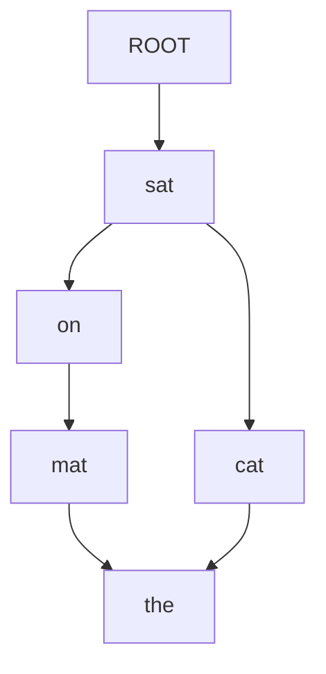

# Dependency Parsing 原理与代码实战案例讲解

## 1.背景介绍

### 1.1 什么是依存句法分析

依存句法分析(Dependency Parsing)是自然语言处理(NLP)中一种基础且广泛应用的任务。它的目标是确定句子中单词之间的依存关系,构建一棵依存树(Dependency Tree)来表示句子的语法结构。与短语结构句法不同,依存句法分析直接捕捉单词之间的修饰关系,更加简洁高效。

### 1.2 依存句法分析的重要性

依存句法分析对于许多自然语言处理任务至关重要,例如:

- 机器翻译:依存关系有助于准确地转换不同语言的句子结构
- 信息抽取:从依存树中可直接提取主语、谓语、宾语等核心信息
- 问答系统:通过分析问句的依存结构,准确理解问题的意图
- 语义分析:依存关系是句子语义理解的基础
- 等等

由于依存句法分析的广泛应用,发展出许多高效的算法和模型,成为自然语言处理领域的基础技术之一。

## 2.核心概念与联系

### 2.1 依存关系与依存树

在依存句法分析中,一个句子可以表示为一棵有向无环树,即依存树(Dependency Tree)。树中的每个节点对应句子中的一个单词,节点之间的有向边表示依存关系。

例如句子"The cat sat on the mat":



- "sat"是句子的核心,作为根节点
- "cat"依赖于"sat",是主语
- "on"依赖于"sat",是介词
- "mat"依赖于"on",是宾语
- "the"分别依赖于"cat"和"mat",是限定词

通过分析句子的依存树,可以直接获取主语、谓语、宾语等核心语法信息。

### 2.2 依存关系类型

依存关系除了表示单词之间的修饰关系外,还可以进一步细分不同的语法关系类型,如:

- 主语关系(nsubj): 主语修饰动词
- 直接宾语关系(dobj): 直接宾语修饰动词
- 介词关系(prep): 介词修饰动词,宾语修饰介词
- 形容词修饰关系(amod): 形容词修饰名词
- 等等

不同语言的依存关系类型集合会有所区别,但都反映了该语言的核心语法规则。准确识别依存关系类型有助于语义理解和下游任务。

### 2.3 依存句法分析与词性标注

依存句法分析通常建立在词性标注(Part-of-Speech Tagging)的基础之上。词性标注为句子中每个单词确定其词性,如名词、动词、形容词等,这是理解句子语法结构的第一步。

词性信息对依存句法分析非常重要,因为不同词性的单词扮演不同的语法角色,具有不同的依存关系模式。例如,动词往往是句子的核心,而形容词通常修饰名词。利用词性标注信息可以极大缩小依存关系的搜索空间,提高分析效率和准确性。

## 3.核心算法原理具体操作步骤 

### 3.1 过渡式依存句法分析

过渡式(Transition-based)依存句法分析是一种流行的算法框架,将依存树的构建过程建模为一系列操作的执行序列。主要思想是通过一个堆栈和一个缓冲区来维护部分构建的依存树。

算法伪码如下:

```
输入: 句子词序列 
初始化: 
    栈 = [] 
    缓冲区 = 词序列
    依存树 = {}

while 缓冲区非空 or 栈非空:
    获取栈顶元素s,缓冲区首元素b
    根据(s,b)特征,通过分类器预测最优操作a
    执行操作a,更新栈、缓冲区、依存树
    
返回: 依存树
```

常见的操作包括:

- SHIFT: 将缓冲区首元素压入栈
- LEFT-ARC: 栈顶元素作为修饰语附加到次顶元素
- RIGHT-ARC: 次顶元素作为修饰语附加到栈顶元素
- 等等

通过序列标注或分类模型学习操作序列预测器,根据栈、缓冲区和部分依存树信息作出操作决策。

算法高效简洁,可以线性扫描句子构建依存树。但缺点是操作存在部分不可回复,错误操作会导致无法构建正确依存树。

### 3.2 图形化建模依存句法分析

图形化建模(Graph-based)依存句法分析则将任务等价于在完全连接的词对图中找到一个最大生成树(Maximum Spanning Tree),作为最优依存树。每个单词是一个节点,节点间边的权重表示它们之间存在依存关系的概率分数。

最常用的是基于边分数的投射算法:

1. 计算任意词对之间存在依存关系的分数
2. 在满足树约束的前提下,寻找全局最大生成树

其中第一步可以通过分类或结构化预测模型来学习,第二步则可以通过权重矩阵的特殊形式高效解码。

图形化建模方法的优点是全局学习和解码,可以较好避免操作级别错误的传播。但缺点是计算复杂度较高,需要构建和存储较大的词对分数矩阵。

### 3.3 基于深度学习的依存句法分析

近年来,基于深度学习的依存句法分析模型取得了卓越的成绩,主要有两种范式:

1. **端到端结构化预测**
    
    将整个依存树视为一个结构化输出,直接对其进行端到端的结构化预测。常用的方法包括基于注意力机制的Sequence-to-Sequence模型、基于图神经网络的模型等。这种方式灵活高效,但需要对结构化输出进行特殊设计。

2. **基于编码-解码框架的建模**

    首先使用编码器(如BERT/RoBERTa等)获取句子的上下文化表示,然后使用解码器(如Biaffine等)基于编码器输出进行依存关系或依存树的建模和预测。这种分步骤的方式更加直接,利用了预训练语言模型的优势,但存在误差累积的问题。

无论哪种范式,深度学习模型都能够自动从大规模语料中学习有效的特征表示,不再需要手工设计复杂的特征工程,因此往往能够取得更加优秀的性能。

## 4.数学模型和公式详细讲解举例说明

### 4.1 过渡式算法的操作序列建模

在过渡式算法中,我们需要根据栈、缓冲区和部分依存树的状态,预测出当前最优的操作。这可以通过分类或序列标注模型来实现。

假设当前状态的特征向量表示为 $\boldsymbol{x}$,我们需要预测操作 $y \in \mathcal{Y}$,其中 $\mathcal{Y}$ 是所有可能操作的集合。

#### 4.1.1 多项逻辑回归分类器

最简单的做法是使用多项逻辑回归模型:

$$P(y|\boldsymbol{x}) = \mathrm{softmax}(\boldsymbol{W}\boldsymbol{x} + \boldsymbol{b})$$

其中 $\boldsymbol{W}$ 和 $\boldsymbol{b}$ 是可学习的权重参数。在训练时,我们最大化操作序列的对数似然:

$$\begin{aligned}
\mathcal{L}(\boldsymbol{W},\boldsymbol{b}) &= \log P(\boldsymbol{y}|\boldsymbol{X}) \\
&= \sum_{t=1}^{T}\log P(y_t|\boldsymbol{x}_t,\boldsymbol{W},\boldsymbol{b})
\end{aligned}$$

其中 $\boldsymbol{X}=\{\boldsymbol{x}_1,\ldots,\boldsymbol{x}_T\}$ 是一个句子的状态序列, $\boldsymbol{y}=\{y_1,\ldots,y_T\}$ 是对应的操作序列。

#### 4.1.2 结构化预测建模

除了逐点建模,我们还可以直接对整个操作序列建模:

$$P(\boldsymbol{y}|\boldsymbol{X};\boldsymbol{\theta}) = \prod_{t=1}^{T}P(y_t|\boldsymbol{x}_t,\boldsymbol{\theta})$$

其中 $\boldsymbol{\theta}$ 是所有可学习参数。这样的建模能够更好地捕捉操作之间的依赖关系,提高预测的一致性。

无论采用哪种建模方式,我们都可以使用神经网络模型来学习特征表示,例如基于LSTM/GRU的序列模型、基于Transformer的自注意力模型等。

### 4.2 图形化建模中的边分数评分

在图形化建模中,我们需要预测任意词对之间存在依存关系的分数,进而寻找全局最优依存树。

假设句子包含 $n$ 个单词,我们定义一个 $n \times n$ 的矩阵 $\boldsymbol{A}$,其中 $A_{ij}$ 表示第 $i$ 个单词依赖于第 $j$ 个单词的分数。这些分数可以通过分类模型或结构化预测模型来学习。

#### 4.2.1 Biaffine 分数函数

常用的评分函数是双仿射(Biaffine)函数:

$$\mathrm{Biaffine}(\boldsymbol{x}_i,\boldsymbol{x}_j) = \boldsymbol{x}_i^{\top}\boldsymbol{W}^{(1)}\boldsymbol{x}_j + \boldsymbol{W}^{(2)}(\begin{bmatrix}\boldsymbol{x}_i \\ \boldsymbol{x}_j\end{bmatrix}) + b$$

其中 $\boldsymbol{x}_i$ 和 $\boldsymbol{x}_j$ 分别是第 $i$ 和第 $j$ 个单词的表示向量,参数 $\boldsymbol{W}^{(1)}$、$\boldsymbol{W}^{(2)}$ 和 $b$ 是可学习的。

该分数函数能够有效地建模单词对之间的双向关系,并通过双线性核来捕捉它们之间的相互作用。

#### 4.2.2 边分数矩阵的解码

给定边分数矩阵 $\boldsymbol{A}$,我们需要寻找一棵最大生成树作为最优依存树。这可以通过 Eisner 算法或 Chu-Liu-Edmonds 算法等有效算法求解。

例如,Eisner 算法的时间复杂度为 $\mathcal{O}(n^3)$,可以在 $\mathcal{O}(n)$ 空间内完成解码。算法通过动态规划,递归地构建出最优依存树。

需要注意的是,不是任意的边分数矩阵都能够解码出一棵合法的依存树。为了保证可解码性,我们通常需要对矩阵加入一些结构化约束,例如确保存在一个根节点、无环等。

## 4.项目实践:代码实例和详细解释说明

本节将通过一个基于 PyTorch 的实战项目,展示如何使用过渡式算法进行依存句法分析。完整代码可在 [这里](https://github.com/codingAsian/DependencyParser) 获取。

### 4.1 数据预处理

我们使用 Penn Treebank 数据集进行实验。首先需要对原始语料进行预处理,包括词性标注、构建依存树等。以下是一个处理样例句子的示例:

```python
from nltk.tokenize import word_tokenize
from nltk import pos_tag
from nltk.corpus import treebank

# 原始句子
sent = treebank.sents()[0]
print('Original:', ' '.join(sent))
# Original: Pierre Vinken , 61 years old , will join the board as a nonexecutive director Nov. 29 .

# 分词和词性标注
tokens = word_tokenize(' '.join(sent))
pos_tags = pos_tag(tokens)

# 构建依存树
dep_tree = build_dep_tree(sent)
print('Dependency Tree:')
print(dep_tree)
```

其中 `build_dep_tree` 函数通过句子的括号化树状表示,构建出依存树的数据结构。输出的依存树如下:

```
Dependency Tree:
[(0, 'ROOT'), (1, 'Pierre/NN