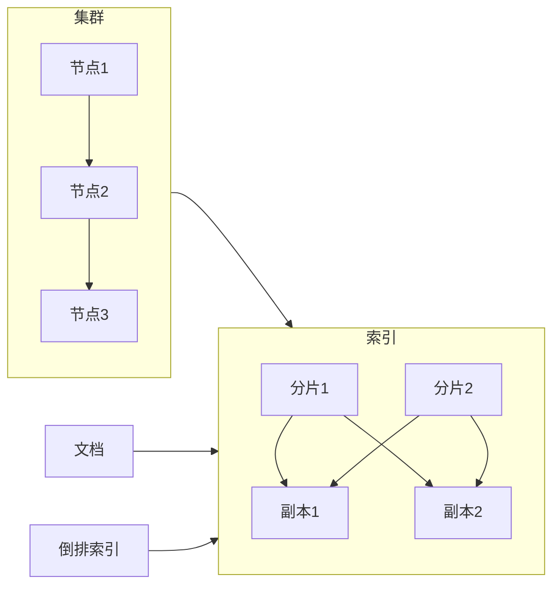

## 1. 背景介绍

### 1.1  大数据时代的数据检索挑战

随着互联网和移动技术的飞速发展，数据量呈爆炸式增长，如何快速高效地存储、检索和分析海量数据成为企业面临的巨大挑战。传统的关系型数据库在处理海量数据时显得力不从心，难以满足高并发、低延迟的需求。

### 1.2  ElasticSearch的诞生与发展

ElasticSearch 是一款开源的分布式搜索和分析引擎，基于 Lucene 构建，旨在解决海量数据的实时检索和分析问题。它具有高可用性、可扩展性和易用性等特点，被广泛应用于日志分析、安全监控、搜索引擎、商业智能等领域。

### 1.3  ElasticSearch的优势

* **高性能**:  ElasticSearch 采用倒排索引技术，能够快速高效地处理海量数据。
* **可扩展性**:  ElasticSearch 采用分布式架构，可以轻松扩展到数百个节点，处理 PB 级数据。
* **高可用性**:  ElasticSearch 支持数据分片和副本机制，即使部分节点故障，仍然可以保证数据可用性。
* **易用性**:  ElasticSearch 提供 RESTful API 和丰富的客户端库，方便用户进行数据操作和查询。

## 2. 核心概念与联系

### 2.1  节点与集群

* **节点**:  ElasticSearch 的基本单元，负责存储数据、处理请求和参与集群管理。
* **集群**:  由多个节点组成的逻辑单元，共同完成数据存储、检索和分析任务。

### 2.2  索引与文档

* **索引**:  类似于关系型数据库中的数据库，用于存储和组织文档。
* **文档**:  ElasticSearch 中的基本数据单元，类似于关系型数据库中的行，以 JSON 格式存储。

### 2.3  分片与副本

* **分片**:  将索引水平拆分为多个部分，分布在不同的节点上，提高数据存储和检索效率。
* **副本**:  分片的复制品，用于提高数据可用性和容错能力。

### 2.4  倒排索引

* **倒排索引**:  一种数据结构，将文档中的单词映射到包含该单词的文档列表，用于快速检索包含特定单词的文档。

### 2.5  核心概念关系图



## 3. 核心算法原理具体操作步骤

### 3.1  数据写入流程

1. 客户端发送数据写入请求到 Elasticsearch 集群。
2. 集群根据数据路由规则选择目标分片。
3. 目标分片所在的节点将数据写入本地磁盘。
4. 数据同步到副本分片。
5. 数据写入成功后，返回响应给客户端。

### 3.2  数据检索流程

1. 客户端发送数据检索请求到 Elasticsearch 集群。
2. 集群根据查询条件选择相关的分片。
3. 分片所在的节点从倒排索引中查找匹配的文档。
4. 节点聚合查询结果，返回给客户端。

### 3.3  数据更新流程

1. 客户端发送数据更新请求到 Elasticsearch 集群。
2. 集群根据数据路由规则选择目标分片。
3. 目标分片所在的节点更新本地磁盘上的数据。
4. 数据同步到副本分片。
5. 数据更新成功后，返回响应给客户端。

### 3.4  数据删除流程

1. 客户端发送数据删除请求到 Elasticsearch 集群。
2. 集群根据数据路由规则选择目标分片。
3. 目标分片所在的节点删除本地磁盘上的数据。
4. 数据同步到副本分片。
5. 数据删除成功后，返回响应给客户端。

## 4. 数学模型和公式详细讲解举例说明

### 4.1  TF-IDF算法

TF-IDF 算法用于计算单词在文档中的重要程度，其公式如下：

```
TF-IDF(t, d) = TF(t, d) * IDF(t)
```

其中：

* **TF(t, d)**:  单词 t 在文档 d 中出现的频率。
* **IDF(t)**:  单词 t 的逆文档频率，表示单词 t 在所有文档中的稀缺程度。

**举例说明**:

假设有以下三个文档：

* 文档 1:  "The quick brown fox jumps over the lazy dog."
* 文档 2:  "The quick brown fox jumps over the lazy cat."
* 文档 3:  "The quick brown fox jumps over the lazy fox."

计算单词 "fox" 在文档 1 中的 TF-IDF 值：

* **TF("fox", 文档 1)** = 2 / 9 (单词 "fox" 在文档 1 中出现了 2 次，文档 1 中共有 9 个单词)
* **IDF("fox")** = log(3 / 2) (单词 "fox" 出现在 2 个文档中，总共有 3 个文档)
* **TF-IDF("fox", 文档 1)** = (2 / 9) * log(3 / 2) = 0.12

### 4.2  BM25算法

BM25 算法是 TF-IDF 算法的一种改进版本，其公式如下：

```
BM25(d, q) = \sum_{i=1}^{n} IDF(q_i) * \frac{f(q_i, d) * (k_1 + 1)}{f(q_i, d) + k_1 * (1 - b + b * \frac{|d|}{avgdl})}
```

其中：

* **d**:  文档
* **q**:  查询
* **q_i**:  查询中的第 i 个单词
* **f(q_i, d)**:  单词 q_i 在文档 d 中出现的频率
* **|d|**:  文档 d 的长度
* **avgdl**:  所有文档的平均长度
* **k_1**:  调节参数，用于控制单词频率的影响
* **b**:  调节参数，用于控制文档长度的影响

**举例说明**:

假设有以下三个文档：

* 文档 1:  "The quick brown fox jumps over the lazy dog."
* 文档 2:  "The quick brown fox jumps over the lazy cat."
* 文档 3:  "The quick brown fox jumps over the lazy fox."

查询 "quick brown fox" 的 BM25 值：

* **|d|**:  文档 1 的长度为 9
* **avgdl**:  所有文档的平均长度为 9
* **k_1**:  设置为 1.2
* **b**:  设置为 0.75

```
BM25(文档 1, "quick brown fox") = IDF("quick") * (f("quick", 文档 1) * (1.2 + 1)) / (f("quick", 文档 1) + 1.2 * (1 - 0.75 + 0.75 * 9 / 9)) + IDF("brown") * (f("brown", 文档 1) * (1.2 + 1)) / (f("brown", 文档 1) + 1.2 * (1 - 0.75 + 0.75 * 9 / 9)) + IDF("fox") * (f("fox", 文档 1) * (1.2 + 1)) / (f("fox", 文档 1) + 1.2 * (1 - 0.75 + 0.75 * 9 / 9))
```

## 5. 项目实践：代码实例和详细解释说明

### 5.1  安装 ElasticSearch

```
# 下载 ElasticSearch 安装包
wget https://artifacts.elastic.co/downloads/elasticsearch/elasticsearch-8.4.3-linux-x86_64.tar.gz

# 解压安装包
tar -zxvf elasticsearch-8.4.3-linux-x86_64.tar.gz

# 进入 ElasticSearch 目录
cd elasticsearch-8.4.3
```

### 5.2  启动 ElasticSearch

```
# 启动 ElasticSearch
./bin/elasticsearch
```

### 5.3  创建索引

```python
from elasticsearch import Elasticsearch

# 连接 ElasticSearch
es = Elasticsearch()

# 创建索引
es.indices.create(index='my_index')
```

### 5.4  插入文档

```python
# 插入文档
es.index(index='my_index', document={'name': 'John Doe', 'age': 30})
```

### 5.5  检索文档

```python
# 检索文档
results = es.search(index='my_index', query={'match': {'name': 'John Doe'}})

# 打印结果
print(results)
```

## 6. 实际应用场景

### 6.1  日志分析

ElasticSearch 可以用于收集、存储和分析日志数据，帮助企业快速定位问题、优化系统性能。

### 6.2  安全监控

ElasticSearch 可以用于实时监控安全事件，例如入侵检测、恶意行为分析等，帮助企业及时发现并应对安全威胁。

### 6.3  搜索引擎

ElasticSearch 可以用于构建高性能的搜索引擎，例如电商网站的商品搜索、新闻网站的文章搜索等，提供快速准确的搜索结果。

### 6.4  商业智能

ElasticSearch 可以用于分析海量商业数据，例如用户行为分析、市场趋势预测等，帮助企业做出更明智的商业决策。

## 7. 工具和资源推荐

### 7.1  Kibana

Kibana 是一款开源的数据可视化工具，可以与 ElasticSearch 配合使用，用于创建交互式仪表盘、图表和地图，帮助用户直观地了解数据。

### 7.2  Logstash

Logstash 是一款开源的数据采集工具，可以收集各种来源的数据，例如日志文件、数据库、消息队列等，并将数据传输到 ElasticSearch 进行存储和分析。

### 7.3  Elastic 官方文档

Elastic 官方文档提供了丰富的 ElasticSearch 相关信息，包括安装指南、用户手册、API 文档等，是学习和使用 ElasticSearch 的最佳资源。

## 8. 总结：未来发展趋势与挑战

### 8.1  未来发展趋势

* **云原生**:  ElasticSearch 将更加紧密地与云计算平台集成，提供更便捷的部署和管理体验。
* **机器学习**:  ElasticSearch 将集成更多机器学习功能，用于数据分析、异常检测等场景。
* **实时分析**:  ElasticSearch 将进一步提升实时分析能力，支持更复杂的查询和分析任务。

### 8.2  挑战

* **数据安全**:  随着数据量的增长，数据安全问题变得越来越重要，ElasticSearch 需要不断提升安全机制，保护用户数据安全。
* **性能优化**:  随着数据规模的扩大，ElasticSearch 需要不断优化性能，以满足用户对高并发、低延迟的需求。
* **生态建设**:  ElasticSearch 需要不断完善生态系统，吸引更多开发者和合作伙伴，共同推动 ElasticSearch 的发展。

## 9. 附录：常见问题与解答

### 9.1  ElasticSearch 与 Lucene 的关系是什么？

ElasticSearch 是基于 Lucene 构建的，Lucene 提供了底层的索引和搜索功能，ElasticSearch 在 Lucene 的基础上增加了分布式架构、RESTful API 等功能。

### 9.2  ElasticSearch 如何实现高可用性？

ElasticSearch 通过数据分片和副本机制实现高可用性。每个分片都有多个副本，分布在不同的节点上，即使部分节点故障，仍然可以保证数据可用性。

### 9.3  ElasticSearch 如何实现可扩展性？

ElasticSearch 采用分布式架构，可以轻松扩展到数百个节点，处理 PB 级数据。用户可以根据需要添加或删除节点，动态调整集群规模。
