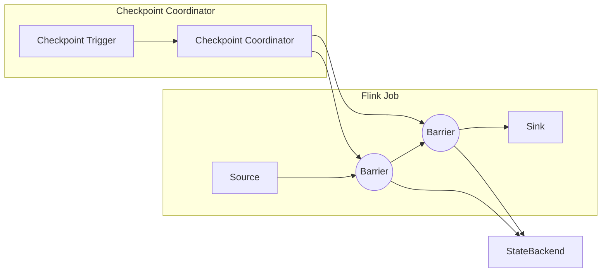

# Flink Checkpoint容错机制原理与代码实例讲解

作者：禅与计算机程序设计艺术

## 1. 背景介绍

在当今数据爆炸式增长的时代，实时数据处理已成为企业数字化转型的重要方向。作为一款优秀的开源分布式流处理引擎，Apache Flink以其高吞吐、低延迟、高可靠性等特性，在实时数据处理领域得到了广泛应用。然而，在实际生产环境中，Flink应用程序难免会遇到各种故障，例如网络抖动、机器宕机、磁盘故障等，这些故障可能导致数据丢失或计算结果错误，严重影响应用程序的可靠性和稳定性。

为了解决上述问题，Flink提供了一套完善的容错机制，其中Checkpoint（检查点）机制是其核心组成部分。Checkpoint机制能够定期地将应用程序的状态保存到外部存储系统中，当应用程序发生故障时，可以从最近一次成功的Checkpoint点恢复应用程序的状态，从而保证数据处理的Exactly-Once语义。

### 1.1 流式计算容错的挑战

与传统的批处理系统不同，流式计算系统需要持续不断地处理数据流，因此其容错机制面临着更大的挑战：

- **数据无限性:** 流式数据是无限的，无法像批处理系统那样将所有数据加载到内存中进行处理，因此需要一种机制能够定期地将应用程序的状态持久化到外部存储系统中。
- **状态一致性:** 流式计算应用程序通常需要维护一些状态信息，例如计数器、窗口聚合结果等，在发生故障时，需要保证这些状态信息的一致性，避免出现数据丢失或重复计算。
- **低延迟:** 流式计算系统对延迟的要求非常高，因此容错机制不能引入过大的延迟开销。

### 1.2 Flink Checkpoint机制概述

Flink Checkpoint机制通过定期地创建应用程序状态的一致性快照来实现容错。Checkpoint机制的核心思想是：

- **周期性触发:** Flink会周期性地触发Checkpoint操作，将应用程序的状态保存到外部存储系统中。
- **轻量级快照:** Checkpoint操作采用异步、非阻塞的方式进行，不会中断应用程序的正常运行。
- **Exactly-Once语义:** Flink Checkpoint机制保证了Exactly-Once语义，即每个数据记录只会被处理一次，即使发生故障也不会丢失数据或重复计算。

## 2. 核心概念与联系

### 2.1 Checkpoint

Checkpoint是Flink容错机制的核心概念，它表示应用程序状态的一致性快照。Checkpoint包含了以下信息：

- **数据源的偏移量:** 记录了每个数据源当前已读取数据的偏移量，用于在故障恢复后从正确的位置继续读取数据。
- **算子的状态:** 记录了每个算子当前的状态信息，例如窗口聚合结果、计数器等。

### 2.2 Barrier

Barrier是一种特殊的标记数据，用于协调分布式环境下的Checkpoint操作。Barrier会随着数据流一起流动，当某个算子接收到所有输入流的Barrier时，就会触发该算子的Checkpoint操作。

### 2.3 StateBackend

StateBackend是Flink用于存储Checkpoint数据的外部存储系统，常见的StateBackend包括：

- **MemoryStateBackend:** 将Checkpoint数据存储在内存中，适用于测试环境或状态数据量较小的应用程序。
- **FsStateBackend:** 将Checkpoint数据存储在文件系统中，例如HDFS、S3等，适用于生产环境。
- **RocksDBStateBackend:** 将Checkpoint数据存储在RocksDB数据库中，适用于状态数据量非常大的应用程序。

### 2.4 Checkpoint Coordinator

Checkpoint Coordinator是Flink JobManager中的一个组件，负责协调整个Checkpoint流程，包括：

- 触发Checkpoint操作。
- 监控Checkpoint的执行进度。
- 选择合适的Checkpoint点进行恢复。

### 2.5 核心概念联系

下图展示了Flink Checkpoint机制中各个核心概念之间的联系：



## 3. 核心算法原理具体操作步骤

Flink Checkpoint机制的实现原理可以概括为以下几个步骤：

### 3.1 触发Checkpoint

Checkpoint Coordinator会周期性地向所有Source算子发送Barrier，触发Checkpoint操作。

### 3.2 Barrier对齐

Barrier会随着数据流一起流动，当某个算子接收到所有输入流的Barrier时，就会触发该算子的Checkpoint操作。

### 3.3 状态快照

算子在进行Checkpoint操作时，会将当前的状态信息保存到StateBackend中。

### 3.4 完成Checkpoint

当所有算子的Checkpoint操作都完成后，Checkpoint Coordinator会将本次Checkpoint标记为完成。

### 3.5 故障恢复

当应用程序发生故障时，Flink会从最近一次成功的Checkpoint点恢复应用程序的状态，并从数据源的正确偏移量开始重新处理数据。

## 4. 数学模型和公式详细讲解举例说明

Flink Checkpoint机制的数学模型可以使用Chandy-Lamport算法来描述。Chandy-Lamport算法是一种分布式快照算法，用于在分布式系统中创建一致性快照。

### 4.1 Chandy-Lamport算法

Chandy-Lamport算法的核心思想是：

1. **标记发送:** 当需要创建快照时，发起进程向所有其他进程发送标记消息。
2. **标记接收:** 当进程接收到标记消息时，会记录当前状态，并向所有与其相邻的进程发送标记消息。
3. **状态收集:** 当进程接收到所有相邻进程的标记消息后，会将自身的状态发送给发起进程。

### 4.2 Flink Checkpoint机制中的应用

在Flink Checkpoint机制中，Barrier可以看作是Chandy-Lamport算法中的标记消息。当Checkpoint Coordinator需要创建Checkpoint时，会向所有Source算子发送Barrier。Barrier会随着数据流一起流动，当某个算子接收到所有输入流的Barrier时，就会触发该算子的Checkpoint操作，相当于Chandy-Lamport算法中的标记接收阶段。算子在进行Checkpoint操作时，会将当前的状态信息保存到StateBackend中，相当于Chandy-Lamport算法中的状态收集阶段。

## 5. 项目实践：代码实例和详细解释说明

### 5.1 代码实例

```java
public class WordCountCheckpointExample {

    public static void main(String[] args) throws Exception {
        // 创建执行环境
        StreamExecutionEnvironment env = StreamExecutionEnvironment.getExecutionEnvironment();

        // 设置Checkpoint间隔时间
        env.enableCheckpointing(1000);

        // 设置StateBackend
        env.setStateBackend(new FsStateBackend("file:///tmp/checkpoints"));

        // 创建数据源
        DataStream<String> text = env.fromElements("hello world", "flink checkpoint");

        // 统计单词出现次数
        DataStream<Tuple2<String, Integer>> counts = text
                .flatMap(new Flat