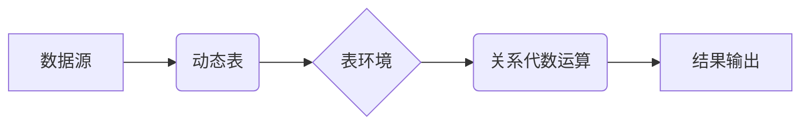

# Flink Table API和SQL原理与代码实例讲解

作者：禅与计算机程序设计艺术

## 1. 背景介绍

### 1.1  什么是流处理？

在当今时代，数据以惊人的速度不断产生，从社交媒体互动到传感器读数，再到金融交易数据，不一而足。为了从这些数据流中提取有价值的信息，我们需要一种能够实时处理它们的机制。这就是流处理的用武之地。与传统的批处理不同，流处理能够在数据生成时就对其进行处理，从而实现毫秒级的延迟和实时分析。

### 1.2  为什么选择Flink？

Apache Flink是一个开源的分布式流处理和批处理框架，以其高吞吐量、低延迟和容错性而闻名。Flink提供了多种API，包括DataStream API用于低级操作，以及Table API和SQL用于更高级的声明式查询。

### 1.3  Table API和SQL的优势

Flink的Table API和SQL提供了一种更高级、更易用的方式来处理流数据，其优势包括：

* **声明式语法:**  用户只需描述想要的结果，而无需指定具体的实现细节，这使得代码更简洁易懂，也更容易维护。
* **逻辑优化:** Flink的优化器可以对Table API和SQL查询进行优化，以提高性能。
* **可扩展性:** Table API和SQL可以轻松地扩展到大型集群，以处理海量数据。
* **代码复用:**  Table API和SQL查询可以在不同的应用程序和环境中复用。

## 2. 核心概念与联系

### 2.1  表（Table）

在Flink Table API和SQL中，表是数据的逻辑表示，类似于关系型数据库中的表。表由行和列组成，每一列都有一个名称和数据类型。Flink支持多种数据类型，包括基本类型（如INT、LONG、STRING）、复合类型（如ARRAY、MAP）和用户自定义类型。

### 2.2  动态表（Dynamic Table）

动态表是Flink Table API和SQL的核心概念，它表示一个随时间变化的数据流。动态表可以看作是一个不断追加数据的表，新数据会不断地添加到表的末尾。

### 2.3  表环境（TableEnvironment）

表环境是Table API和SQL的入口点，它提供了用于创建、执行和管理表和查询的方法。

### 2.4  关系代数运算

Flink Table API和SQL支持丰富的关系代数运算，例如：

* **选择（Selection）:** 从表中选择满足特定条件的行。
* **投影（Projection）:**  选择表的特定列。
* **连接（Join）:**  根据指定的条件将两个表合并成一个表。
* **聚合（Aggregation）:** 对表中的数据进行分组聚合，例如求和、平均值、最大值、最小值等。
* **窗口操作（Window Operations）:**  将数据流按照时间或其他条件划分成一个个窗口，并在每个窗口上进行计算。

### 2.5  核心概念联系图



## 3. 核心算法原理具体操作步骤

### 3.1  创建表环境

首先，我们需要创建一个表环境，它是使用Table API和SQL的入口点。

```java
// 创建一个流式表环境
StreamExecutionEnvironment env = StreamExecutionEnvironment.getExecutionEnvironment();
StreamTableEnvironment tableEnv = StreamTableEnvironment.create(env);
```

### 3.2  注册数据源

接下来，我们需要将数据源注册为一个表。Flink支持多种数据源，例如Kafka、CSV文件、Socket等。

```java
// 从Kafka读取数据
DataStream<Order> orderStream = env.addSource(new FlinkKafkaConsumer<>(...));

// 将DataStream转换为Table
Table orderTable = tableEnv.fromDataStream(orderStream);

// 注册表
tableEnv.createTemporaryView("orders", orderTable);
```

### 3.3  编写SQL查询

现在，我们可以使用SQL语句对注册的表进行查询。

```sql
// 计算每个用户的订单总额
SELECT userId, SUM(amount) AS totalAmount 
FROM orders 
GROUP BY userId;
```

### 3.4  执行查询

最后，我们需要执行SQL查询并将结果输出到目标位置。

```java
// 执行SQL查询
Table resultTable = tableEnv.sqlQuery(sql);

// 将结果输出到控制台
tableEnv.toAppendStream(resultTable, Row.class).print();

// 启动Flink作业
env.execute("Flink SQL Example");
```

## 4. 数学模型和公式详细讲解举例说明

### 4.1  窗口函数

窗口函数是流处理中常用的操作，它可以将数据流按照时间或其他条件划分成一个个窗口，并在每个窗口上进行计算。Flink Table API和SQL支持多种窗口函数，例如：

* **滚动窗口（Tumbling Window）:**  将数据流划分成固定大小、不重叠的窗口。
* **滑动窗口（Sliding Window）:**  将数据流划分成固定大小、滑动步长可变的窗口。
* **会话窗口（Session Window）:**  将数据流划分成以 inactivity gap 分隔的窗口。

#### 4.1.1  滚动窗口

滚动窗口将数据流划分成固定大小、不重叠的窗口。例如，以下代码定义了一个1分钟的滚动窗口：

```sql
TUMBLE(ts, INTERVAL '1' MINUTE)
```

其中，`ts` 是时间属性，`INTERVAL '1' MINUTE` 指定窗口大小为1分钟。

#### 4.1.2  滑动窗口

滑动窗口将数据流划分成固定大小、滑动步长可变的窗口。例如，以下代码定义了一个1分钟的滑动窗口，滑动步长为30秒：

```sql
HOP(ts, INTERVAL '30' SECOND, INTERVAL '1' MINUTE)
```

其中，`ts` 是时间属性，`INTERVAL '30' SECOND` 指定滑动步长为30秒，`INTERVAL '1' MINUTE` 指定窗口大小为1分钟。

#### 4.1.3  会话窗口

会话窗口将数据流划分成以 inactivity gap 分隔的窗口。例如，以下代码定义了一个会话窗口，inactivity gap 为30分钟：

```sql
SESSION(ts, INTERVAL '30' MINUTE)
```

其中，`ts` 是时间属性，`INTERVAL '30' MINUTE` 指定 inactivity gap 为30分钟。

### 4.2  聚合函数

聚合函数用于对窗口内的数据进行聚合计算。Flink Table API和SQL支持多种聚合函数，例如：

* `SUM(expression)`:  计算窗口内 `expression` 的总和。
* `AVG(expression)`:  计算窗口内 `expression` 的平均值。
* `MAX(expression)`:  计算窗口内 `expression` 的最大值。
* `MIN(expression)`:  计算窗口内 `expression` 的最小值。
* `COUNT(*)`:  统计窗口内的记录数。
* `COUNT(expression)`:  统计窗口内 `expression` 不为空的记录数。

## 5. 项目实践：代码实例和详细解释说明

### 5.1  需求描述

假设我们有一个电商网站，用户可以在网站上浏览商品、下单、支付等。现在我们需要实时统计每个用户的订单总额，并将其输出到控制台。

### 5.2  数据格式

我们假设数据源是一个Kafka topic，数据格式如下：

```
userId: INT
orderId: STRING
amount: DOUBLE
timestamp: LONG
```

### 5.3  代码实现

```java
import org.apache.flink.api.common.functions.MapFunction;
import org.apache.flink.api.java.tuple.Tuple4;
import org.apache.flink.streaming.api.datastream.DataStream;
import org.apache.flink.streaming.api.environment.StreamExecutionEnvironment;
import org.apache.flink.table.api.Table;
import org.apache.flink.table.api.bridge.java.StreamTableEnvironment;

public class FlinkSQLExample {

    public static void main(String[] args) throws Exception {

        // 创建一个流式执行环境
        StreamExecutionEnvironment env = StreamExecutionEnvironment.getExecutionEnvironment();

        // 创建一个表环境
        StreamTableEnvironment tableEnv = StreamTableEnvironment.create(env);

        // 从Kafka读取数据
        DataStream<String> kafkaStream = env.addSource(new FlinkKafkaConsumer<>(...));

        // 将Kafka数据转换为Tuple4
        DataStream<Tuple4<Integer, String, Double, Long>> orderStream = kafkaStream.map(new MapFunction<String, Tuple4<Integer, String, Double, Long>>() {
            @Override
            public Tuple4<Integer, String, Double, Long> map(String value) throws Exception {
                String[] fields = value.split(",");
                return new Tuple4<>(
                        Integer.parseInt(fields[0]),
                        fields[1],
                        Double.parseDouble(fields[2]),
                        Long.parseLong(fields[3])
                );
            }
        });

        // 将DataStream转换为Table
        Table orderTable = tableEnv.fromDataStream(orderStream, "userId, orderId, amount, timestamp");

        // 注册表
        tableEnv.createTemporaryView("orders", orderTable);

        // 编写SQL查询
        String sql = "SELECT userId, SUM(amount) AS totalAmount " +
                "FROM orders " +
                "GROUP BY userId";

        // 执行SQL查询
        Table resultTable = tableEnv.sqlQuery(sql);

        // 将结果输出到控制台
        tableEnv.toAppendStream(resultTable, Row.class).print();

        // 启动Flink作业
        env.execute("Flink SQL Example");
    }
}
```

### 5.4  代码解释

1. 首先，我们创建了一个流式执行环境和一个表环境。
2. 然后，我们从Kafka读取数据，并将数据转换为`Tuple4`类型。
3. 接下来，我们将`DataStream`转换为`Table`，并注册为一个名为`orders`的表。
4. 然后，我们编写了一个SQL查询，用于计算每个用户的订单总额。
5. 最后，我们执行SQL查询，并将结果输出到控制台。

## 6. 实际应用场景

Flink Table API和SQL可以应用于各种流处理场景，例如：

* **实时报表和仪表盘:** 实时监控关键指标，例如网站流量、销售额、用户行为等。
* **异常检测:**  识别数据流中的异常模式，例如信用卡欺诈、网络攻击等。
* **实时推荐:**  根据用户的实时行为和偏好提供个性化推荐。
* **数据管道:** 将数据从一个系统实时传输到另一个系统，例如将数据从Kafka写入HBase。

## 7. 工具和资源推荐

* **Apache Flink官网:** https://flink.apache.org/
* **Flink Table API文档:** https://ci.apache.org/projects/flink/flink-docs-stable/docs/dev/table/tableapi/
* **Flink SQL文档:** https://ci.apache.org/projects/flink/flink-docs-stable/docs/dev/table/sql/

## 8. 总结：未来发展趋势与挑战

Flink Table API和SQL是流处理领域的重要发展方向，它们为用户提供了更高级、更易用的方式来处理流数据。未来，Flink Table API和SQL将继续发展，以满足不断增长的流处理需求。

**未来发展趋势:**

* **更强大的功能:** 支持更多SQL语法和函数，例如窗口函数、用户自定义函数等。
* **更高的性能:**  优化查询执行引擎，提高查询性能。
* **更好的易用性:** 提供更友好的API和工具，简化开发和运维。

**挑战:**

* **语义一致性:** 确保Table API和SQL的语义一致性，避免用户困惑。
* **状态管理:**  高效地管理和维护查询状态，以支持高吞吐量和低延迟。
* **与其他系统的集成:**  与其他大数据生态系统组件无缝集成，例如Kafka、HBase、Hive等。

## 9. 附录：常见问题与解答

### 9.1  Table API和SQL的区别是什么？

Table API和SQL都是Flink提供的用于处理结构化数据的API，它们的功能基本相同。Table API使用Java或Scala语言编写，而SQL使用标准的SQL语法。

### 9.2  如何选择使用Table API还是SQL？

如果用户熟悉SQL语法，则可以选择使用SQL。如果用户需要更灵活的操作，例如用户自定义函数，则可以选择使用Table API。

### 9.3  如何处理迟到数据？

Flink提供了多种机制来处理迟到数据，例如水印、侧输出等。用户可以根据实际情况选择合适的机制。

### 9.4  如何进行性能调优？

Flink提供了多种性能调优工具，例如Web UI、指标监控等。用户可以通过分析指标和日志来识别性能瓶颈，并进行相应的优化。
