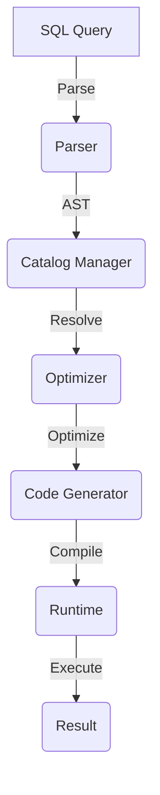
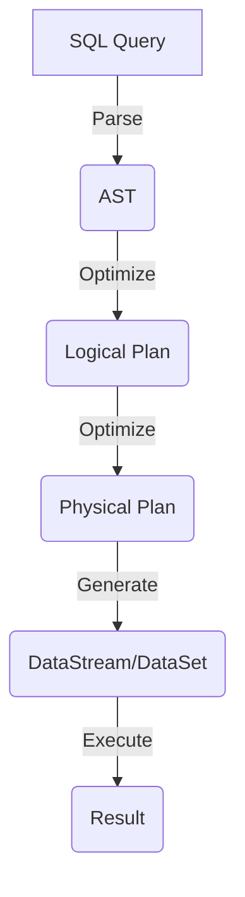

# Flink Table原理与代码实例讲解

## 1.背景介绍

### 1.1 大数据处理的挑战

在当今数据爆炸式增长的时代，企业和组织面临着处理海量数据的巨大挑战。传统的数据处理系统难以满足实时性、高吞吐量和可扩展性等需求。因此,需要一种新的大数据处理范式来应对这些挑战。

### 1.2 流处理和批处理的融合

Apache Flink是一个开源的分布式流处理框架,它将流处理和批处理统一到同一个运行时环境中。Flink的核心是流处理,但它也支持批处理,并且可以无缝地将二者结合起来。这种融合使得Flink能够高效地处理持续到来的数据流,同时也能够处理有界的数据集。

### 1.3 Flink Table & SQL

Flink Table & SQL是Flink提供的一种声明式API,它允许用户使用类SQL语句来编写流处理和批处理应用程序。这种方式降低了编程的复杂性,使开发人员能够更加专注于业务逻辑,而不必过多关注底层执行细节。

## 2.核心概念与联系

### 2.1 Table & SQL的核心概念

Flink Table & SQL的核心概念包括:

- **Table**: 一种逻辑概念,表示一个数据集合,可以是有界的批处理数据,也可以是无界的数据流。
- **Schema**: 定义了Table的结构,包括字段名、字段类型等。
- **Query**: 用于对Table执行转换和计算的声明式查询语句。
- **Job Graph**: 由多个Query组成的有向无环图,表示整个作业的执行流程。

### 2.2 Table API 和 SQL 的关系

Flink Table API 和 SQL 是紧密相关的:

- Table API 是一种嵌入式的、集成式的查询API,可以在Java/Scala/Python等语言中使用。
- SQL 则是一种独立的、外部的查询语言,遵循标准SQL语法。

两者都基于同一个核心执行引擎,可以相互转换和混合使用。

### 2.3 Flink Table & SQL 架构

Flink Table & SQL 架构主要包括以下几个核心组件:

1. **Parser**: 将SQL查询解析为抽象语法树(AST)。
2. **Catalog Manager**: 管理元数据,如数据库、表、视图、函数等。
3. **Optimizer**: 基于优化规则对AST进行逻辑优化和代数优化。
4. **Code Generator**: 将优化后的AST转换为可执行的DataStream或DataSet程序。
5. **Runtime**: Flink的分布式流处理引擎,执行生成的DataStream或DataSet作业。



## 3.核心算法原理具体操作步骤

Flink Table & SQL将声明式查询转换为分布式执行计划,主要包括以下几个步骤:

### 3.1 SQL 解析

SQL Parser将SQL查询解析为抽象语法树(AST),这是整个查询处理过程的起点。

### 3.2 逻辑查询优化

Optimizer会对AST进行一系列逻辑优化,如投影剪裁、Filter下推、子查询重写等,生成优化后的逻辑查询计划。

### 3.3 关系代数优化

逻辑查询计划会被转换为关系代数表示,Optimizer会对其进行代数优化,如连接重排序、连接转换、分区剪裁等,生成优化后的物理执行计划。

### 3.4 代码生成

Code Generator会将优化后的物理执行计划转换为可执行的DataStream或DataSet程序。

### 3.5 作业执行

生成的DataStream或DataSet程序被提交到Flink Runtime进行分布式执行。



## 4.数学模型和公式详细讲解举例说明

在Flink Table & SQL中,一些核心算法涉及到数学模型和公式,如代价模型、连接重排序等。

### 4.1 代价模型

代价模型用于估计查询执行的代价,从而指导查询优化。Flink采用基于启发式规则的代价模型,主要考虑以下几个因素:

- 数据量: 表示输入数据的大小,影响处理时间。
- 数据分布: 表示数据在集群节点上的分布情况,影响数据传输开销。
- CPU开销: 表示运算操作的CPU消耗,影响处理速度。
- 内存开销: 表示内存消耗,影响内存利用率和性能。

代价模型的目标是找到最优的执行计划,使得总代价最小化。总代价可以表示为:

$$
Cost = \sum_{i=1}^{n} w_i \cdot c_i
$$

其中:
- $n$是考虑的代价因素个数
- $w_i$是第$i$个因素的权重
- $c_i$是第$i$个因素的代价值

### 4.2 连接重排序

连接重排序是一种优化技术,通过调整连接顺序来减少中间结果的数据量,从而提高查询性能。

假设有三个表$R$、$S$和$T$,需要执行$R \Join S \Join T$。如果$R$和$S$的中间结果数据量较大,那么先执行$R \Join S$会产生大量中间结果,降低性能。相反,如果先执行$S \Join T$产生较小的中间结果,再与$R$连接,可以减少数据传输和处理开销。

连接重排序的目标是找到一个最优的连接顺序,使得中间结果数据量最小化。可以使用动态规划算法求解:

令$C(R_1, R_2, ..., R_n)$表示执行$R_1 \Join R_2 \Join ... \Join R_n$的代价,则最优连接顺序的代价为:

$$
\min_{1 \leq i < j \leq n} \{C(R_1, ..., R_i) + C(R_{i+1}, ..., R_j) + R_1 \Join ... \Join R_i \Join R_{i+1} \Join ... \Join R_j\}
$$

该公式通过枚举所有可能的划分方式,找到代价最小的连接顺序。

## 4.项目实践: 代码实例和详细解释说明

下面我们通过一个实际的代码示例,展示如何使用Flink Table & SQL进行流处理和批处理。

### 4.1 创建表

首先,我们需要创建表。对于流处理,我们使用Kafka作为数据源;对于批处理,我们使用文件系统作为数据源。

```scala
// 创建流处理表
val orderStream: DataStream[Order] = ...
val orderTable = orderStream
  .toTable(tableEnv, 'order_id, 'product, 'amount, 'timestamp.rowtime)

// 创建批处理表  
val productsTable = tableEnv
  .executeSql("CREATE TEMPORARY TABLE products (product STRING, category STRING, price DECIMAL(10,2)) WITH ('connector' = 'filesystem', 'path' = '/path/to/products.csv')")
```

### 4.2 查询转换

接下来,我们可以使用SQL或Table API对表进行查询转换。

```sql
-- SQL
SELECT o.product, o.amount, p.price, o.amount * p.price AS revenue
FROM orders o
JOIN products p ON o.product = p.product
```

```scala
// Table API
orderTable
  .join(productsTable, $"product" === $"product")
  .select($"product", $"amount", $"price", $"amount" * $"price" as "revenue")
```

这个查询会将订单流与产品表进行连接,计算每个订单的收入。

### 4.3 输出结果

最后,我们可以将查询结果输出到不同的sink中。

```scala
// 输出到Kafka
resultTable.executeInsert("orders_output", QueryConfig.kafkaSink(...))

// 输出到文件系统
resultTable.executeInsert("orders_output", QueryConfig.fileSink(...))
```

完整的代码示例:

```scala
import org.apache.flink.streaming.api.scala._
import org.apache.flink.table.api.bridge.scala._

object FlinkTableExample {

  case class Order(order_id: Long, product: String, amount: Int, timestamp: Long)

  def main(args: Array[String]): Unit = {
    val env = StreamExecutionEnvironment.getExecutionEnvironment
    val tableEnv = StreamTableEnvironment.create(env)

    // 创建流处理表
    val orderStream: DataStream[Order] = ...
    val orderTable = orderStream
      .toTable(tableEnv, 'order_id, 'product, 'amount, 'timestamp.rowtime)

    // 创建批处理表
    val productsTable = tableEnv
      .executeSql("CREATE TEMPORARY TABLE products (product STRING, category STRING, price DECIMAL(10,2)) WITH ('connector' = 'filesystem', 'path' = '/path/to/products.csv')")

    // 查询转换
    val resultTable = orderTable
      .join(productsTable, $"product" === $"product")
      .select($"product", $"amount", $"price", $"amount" * $"price" as "revenue")

    // 输出结果
    resultTable.executeInsert("orders_output", QueryConfig.kafkaSink(...))

    env.execute()
  }
}
```

在这个示例中,我们首先创建了一个流处理表`orderTable`和一个批处理表`productsTable`。然后,我们使用Table API对两个表执行了连接和投影转换,计算每个订单的收入。最后,我们将结果表输出到Kafka中。

通过这个示例,您可以看到使用Flink Table & SQL进行流处理和批处理是多么简单和高效。声明式的API使代码更加简洁、易读,同时Flink的优化器会自动优化查询执行计划,提供出色的性能。

## 5.实际应用场景

Flink Table & SQL可以应用于多种场景,包括但不限于:

### 5.1 实时数据分析

通过连续查询数据流,可以实现对实时数据的分析,如网络流量监控、用户行为分析、物联网设备数据处理等。

### 5.2 数据湖分析

将数据湖中的批处理数据和实时数据统一处理,实现更全面的分析。

### 5.3 ETL 管道

利用Flink Table & SQL的强大功能,可以构建高效的数据提取、转换和加载(ETL)管道。

### 5.4 机器学习特征工程

通过SQL查询对数据进行特征提取和预处理,为机器学习模型做准备。

### 5.5 业务智能(BI)

将Flink Table & SQL与BI工具集成,为企业决策提供实时数据支持。

## 6.工具和资源推荐

在使用Flink Table & SQL的过程中,以下工具和资源可以为您提供帮助:

### 6.1 Flink SQL Client

Flink SQL Client是一个命令行工具,允许您直接在命令行中执行SQL查询。它非常适合快速原型开发和调试。

### 6.2 Flink Table API

除了SQL,Flink还提供了Table API,允许您使用Java/Scala/Python等语言编写查询。Table API和SQL可以无缝集成,为您提供更大的灵活性。

### 6.3 Flink Table Store

Flink Table Store是一个存储层,可以持久化动态表的数据和元数据。它支持ACID事务,确保数据的一致性和可靠性。

### 6.4 Flink ML

Flink ML是Flink的机器学习库,支持在流数据和批量数据上训练和评估机器学习模型。它可以与Flink Table & SQL无缝集成,实现端到端的机器学习工作流。

### 6.5 Apache Zeppelin

Apache Zeppelin是一个基于Web的笔记本环境,支持多种语言,包括Flink SQL。它非常适合数据探索和可视化。

### 6.6 Flink Forward

Flink Forward是Apache Flink社区的年度大会,是了解Flink最新进展、交流经验的绝佳机会。

## 7.总结: 未来发展趋势与挑战

Flink Table & SQL为大数据处理带来了全新的范式,但它仍在不断发展和完善。未来,Flink Table & SQL可能会面临以下趋势和挑战:

### 7.1 更智能的优化器

优化器是Flink Table & SQL的核心组件之一。未来,优化器可能会采用更先进的技术,如基于成本模型的自动优化、自适应查询优化等,以进一步提高查询性能。

### 7.2 更丰富的语言特性

SQL标准在不断发展,未来Flink Table &