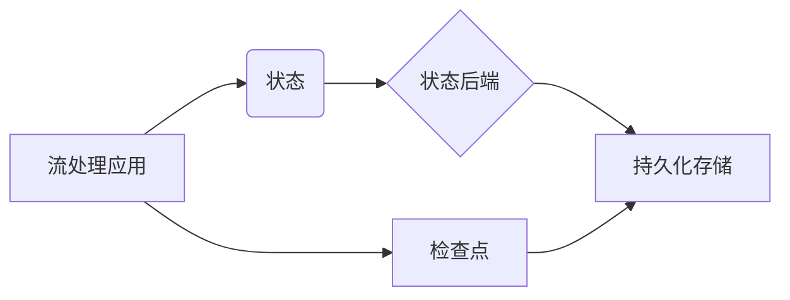

## 1. 背景介绍

### 1.1 大数据时代的流处理技术

在当今大数据时代，数据量呈爆炸式增长，数据的实时性和准确性对企业决策和业务发展至关重要。传统的批处理技术难以满足实时性要求，而流处理技术应运而生。流处理技术能够实时地处理连续不断的数据流，并根据业务需求进行分析和计算，为企业提供实时洞察和决策支持。

### 1.2 Apache Flink：新一代流处理引擎

Apache Flink 是新一代开源流处理引擎，它具备高吞吐、低延迟、高可靠性等特点，能够满足各种流处理场景的需求。Flink 支持多种编程模型，包括 DataStream API 和 SQL，方便用户进行流处理应用的开发和部署。

### 1.3 有状态流处理：处理更复杂业务逻辑的关键

传统的流处理框架大多是无状态的，即每个数据元素的处理过程独立于其他数据元素。然而，在实际应用中，很多业务逻辑需要考虑数据元素之间的关系，例如：

* 统计每个用户的访问次数
* 检测连续的异常事件
* 维护用户会话状态

这些场景都需要流处理框架具备状态管理能力，即能够存储和更新每个数据元素相关的状态信息。Flink 提供了强大的状态管理机制，支持多种状态类型和状态后端，方便用户实现各种有状态流处理应用。

## 2. 核心概念与联系

### 2.1 状态 (State)

在 Flink 中，状态是指与特定计算相关的信息，这些信息可以在处理过程中被访问和更新。状态可以是任何 Java 或 Scala 对象，例如：

* 计数器 (Counter)
* 列表 (List)
* 映射 (Map)

Flink 提供了多种状态类型，包括：

* **ValueState:** 存储单个值
* **ListState:** 存储一个列表
* **MapState:** 存储键值对
* **ReducingState:** 存储一个聚合值
* **AggregatingState:** 存储一个聚合值，并允许访问中间结果

### 2.2 状态后端 (State Backends)

状态后端负责存储和管理状态数据。Flink 支持多种状态后端，包括：

* **MemoryStateBackend:** 将状态存储在内存中，速度快但容量有限。
* **FsStateBackend:** 将状态存储在文件系统中，容量大但速度较慢。
* **RocksDBStateBackend:** 将状态存储在 RocksDB 数据库中，兼顾速度和容量。

### 2.3 检查点 (Checkpoint)

检查点是 Flink 用于实现容错机制的核心概念。Flink 定期地将应用程序的状态保存到持久化存储中，形成检查点。当应用程序发生故障时，Flink 可以从最近的检查点恢复状态，并从故障点继续处理数据。

### 2.4 核心概念联系

下图展示了 Flink 中状态、状态后端和检查点之间的关系：



## 3. 核心算法原理具体操作步骤

### 3.1 状态访问和更新

Flink 提供了 `RuntimeContext` 接口，用于访问和更新状态。`RuntimeContext` 接口提供了以下方法：

* `getState(StateDescriptor descriptor)`: 获取指定状态的句柄。
* `getListState(ListStateDescriptor descriptor)`: 获取指定列表状态的句柄。
* `getMapState(MapStateDescriptor descriptor)`: 获取指定映射状态的句柄。

状态句柄提供了以下方法：

* `value()`: 获取状态值。
* `update(T value)`: 更新状态值。
* `clear()`: 清除状态值。

### 3.2 检查点机制

Flink 的检查点机制基于 Chandy-Lamport 算法，该算法是一种分布式快照算法，用于在分布式系统中创建一致性快照。Flink 的检查点机制包括以下步骤：

1. **暂停数据处理:** Flink 暂停所有数据源的输入，并等待所有正在处理的数据完成处理。
2. **创建状态快照:** Flink 将所有状态数据保存到持久化存储中，形成状态快照。
3. **记录 barrier:** Flink 在数据流中插入 barrier，用于标记检查点边界。
4. **恢复数据处理:** Flink 恢复所有数据源的输入，并继续处理数据。

### 3.3 容错恢复

当应用程序发生故障时，Flink 可以从最近的检查点恢复状态，并从故障点继续处理数据。容错恢复过程包括以下步骤：

1. **识别故障:** Flink 检测到应用程序发生故障。
2. **加载状态快照:** Flink 从持久化存储中加载最近的检查点状态。
3. **重置数据源:** Flink 将所有数据源重置到检查点边界。
4. **恢复数据处理:** Flink 恢复所有数据源的输入，并从检查点边界继续处理数据。

## 4. 数学模型和公式详细讲解举例说明

### 4.1 状态一致性

Flink 的检查点机制保证了状态的一致性，即所有算子在同一时间点看到的状态是一致的。Flink 使用 Chandy-Lamport 算法创建分布式快照，该算法通过以下步骤保证状态一致性：

1. **发送 marker 消息:** 每个算子向其下游算子发送 marker 消息，用于标记快照边界。
2. **记录状态:** 当算子收到 marker 消息时，它记录当前状态。
3. **转发 marker 消息:** 算子将 marker 消息转发到其下游算子。
4. **合并状态:** 当所有算子都收到 marker 消息并记录状态后，Flink 合并所有状态，形成全局快照。

### 4.2 检查点间隔

检查点间隔是指两次检查点之间的时间间隔。检查点间隔越短，状态恢复时间越短，但检查点开销也越大。Flink 允许用户配置检查点间隔，以平衡状态恢复时间和检查点开销。

### 4.3 检查点超时

检查点超时是指 Flink 等待检查点完成的最长时间。如果检查点在超时时间内未完成，Flink 将取消检查点并抛出异常。Flink 允许用户配置检查点超时时间，以防止检查点阻塞应用程序。

## 5. 项目实践：代码实例和详细解释说明

### 5.1 WordCount 示例

以下代码展示了一个简单的 WordCount 示例，该示例使用 Flink 的状态管理机制统计每个单词的出现次数：

```java
public class WordCount {

    public static void main(String[] args) throws Exception {
        // 创建执行环境
        StreamExecutionEnvironment env = StreamExecutionEnvironment.getExecutionEnvironment();

        // 设置状态后端
        env.setStateBackend(new FsStateBackend("file:///tmp/checkpoints"));

        // 设置检查点间隔
        env.enableCheckpointing(1000);

        // 读取数据源
        DataStream<String> text = env.fromElements("To be, or not to be, that is the question");

        // 拆分单词
        DataStream<String> words = text.flatMap(new FlatMapFunction<String, String>() {
            @Override
            public void flatMap(String value, Collector<String> out) throws Exception {
                for (String word : value.toLowerCase().split("\\W+")) {
                    out.collect(word);
                }
            }
        });

        // 统计单词出现次数
        DataStream<Tuple2<String, Integer>> counts = words
                .keyBy(0)
                .map(new RichMapFunction<String, Tuple2<String, Integer>>() {
                    private transient ValueState<Integer> countState;

                    @Override
                    public void open(Configuration parameters) throws Exception {
                        ValueStateDescriptor<Integer> descriptor =
                                new ValueStateDescriptor<>("count", Integer.class);
                        countState = getRuntimeContext().getState(descriptor);
                    }

                    @Override
                    public Tuple2<String, Integer> map(String word) throws Exception {
                        Integer count = countState.value();
                        if (count == null) {
                            count = 0;
                        }
                        count++;
                        countState.update(count);
                        return Tuple2.of(word, count);
                    }
                });

        // 打印结果
        counts.print();

        // 执行程序
        env.execute("WordCount");
    }
}
```

### 5.2 代码解释

* `env.setStateBackend(new FsStateBackend("file:///tmp/checkpoints"))`: 设置状态后端为 FsStateBackend，并将检查点存储在 `/tmp/checkpoints` 目录中。
* `env.enableCheckpointing(1000)`: 启用检查点机制，并将检查点间隔设置为 1000 毫秒。
* `ValueStateDescriptor<Integer> descriptor = new ValueStateDescriptor<>("count", Integer.class)`: 创建一个 ValueStateDescriptor，用于描述状态类型和名称。
* `countState = getRuntimeContext().getState(descriptor)`: 获取指定状态的句柄。
* `countState.value()`: 获取状态值。
* `countState.update(count)`: 更新状态值。

## 6. 实际应用场景

### 6.1 实时数据分析

Flink 的状态管理机制可以用于实时数据分析，例如：

* 统计网站访问量
* 分析用户行为
* 检测异常事件

### 6.2 事件驱动架构

Flink 的状态管理机制可以用于构建事件驱动架构，例如：

* 处理用户请求
* 触发业务流程
* 监控系统状态

### 6.3 机器学习

Flink 的状态管理机制可以用于在线机器学习，例如：

* 训练模型
* 预测结果
* 更新模型参数

## 7. 工具和资源推荐

### 7.1 Apache Flink 官网

Apache Flink 官网提供了 Flink 的官方文档、教程和示例代码。

### 7.2 Flink 社区

Flink 社区是一个活跃的开发者社区，用户可以在社区中获取帮助、分享经验和参与讨论。

### 7.3 Flink 相关书籍

市面上有很多 Flink 相关书籍，可以帮助用户深入了解 Flink 的原理和应用。

## 8. 总结：未来发展趋势与挑战

### 8.1 未来发展趋势

Flink 的未来发展趋势包括：

* 更强大的状态管理机制
* 更灵活的容错机制
* 更高效的资源利用

### 8.2 面临挑战

Flink 面临的挑战包括：

* 状态管理的复杂性
* 容错机制的效率
* 资源利用的优化

## 9. 附录：常见问题与解答

### 9.1 如何选择状态后端？

选择状态后端需要考虑以下因素：

* 状态大小
* 访问频率
* 容错要求

### 9.2 如何配置检查点间隔？

配置检查点间隔需要考虑以下因素：

* 状态恢复时间
* 检查点开销
* 应用程序的容错能力

### 9.3 如何处理检查点失败？

当检查点失败时，Flink 会抛出异常。用户可以捕获异常并进行相应的处理，例如：

* 重试检查点
* 调整检查点间隔
* 调整检查点超时时间
