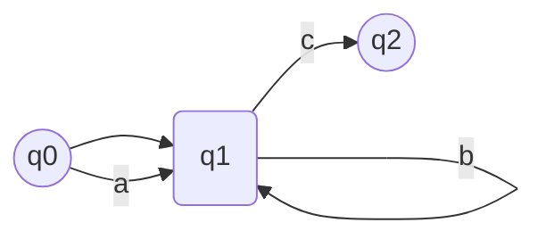
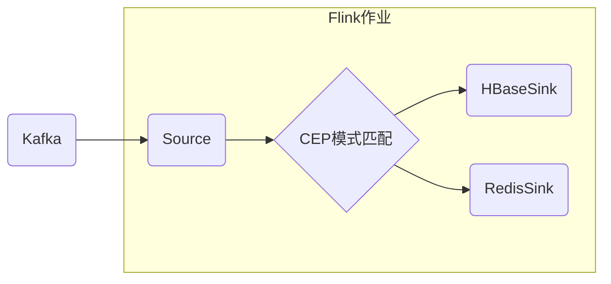

# FlinkCEP代码实例精讲：与外部系统集成

## 1.背景介绍

### 1.1 什么是Flink CEP

Apache Flink是一个开源的分布式流处理框架,支持有状态计算和准确一次的状态一致性,可以在大规模有状态的流处理应用中提供低延迟和高吞吐量。Flink CEP(Complex Event Processing)是Flink提供的用于复杂事件处理的库,它允许你在无边界的事件流上进行模式匹配,从而检测出潜在有价值的事件序列。

Flink CEP基于非确定性有限自动机(NFA)来实现模式匹配,并提供了声明式的模式API,使得定义模式变得非常简单。CEP可以广泛应用于各种场景,如网络安全监控、物联网设备监控、业务活动监控等。

### 1.2 外部系统集成的重要性

在实际应用中,流处理系统往往需要与其他外部系统进行集成。比如:

- 从消息队列(如Kafka)中读取数据
- 将处理结果写入数据库(如HBase)
- 与缓存系统(如Redis)交互
- 调用第三方Web服务

能够无缝集成外部系统对于构建端到端的流处理应用至关重要。本文将重点介绍如何将Flink CEP与Kafka、HBase、Redis等外部系统集成,并展示具体的代码示例。

## 2.核心概念与联系 

### 2.1 Flink CEP核心概念

在深入代码之前,我们先了解一下Flink CEP的几个核心概念:

1. **事件流(Event Stream)**: 无边界的事件序列
2. **模式(Pattern)**: 用于描述待匹配的复杂事件序列
3. **部分匹配(Partial Match)**: 与模式部分匹配的事件序列
4. **完全匹配(Complete Match)**: 与模式完全匹配的事件序列

模式通过模式语法来定义,包括单个事件、事件序列、循环等。当检测到完全匹配时,CEP会输出对应的匹配事件序列。

### 2.2 与外部系统集成概念

为了将CEP与外部系统集成,我们需要理解以下概念:

1. **Source**: 从外部源(如消息队列)读取数据到Flink
2. **Sink**: 将Flink处理结果输出到外部系统(如数据库)
3. **状态管理**: 在做检查点时,需要持久化作业状态到外部系统
4. **异步I/O**: Flink提供异步I/O模型,允许与外部系统交互时不阻塞作业

理解这些概念有助于编写与外部系统集成的CEP应用程序。

## 3.核心算法原理具体操作步骤

### 3.1 NFA算法原理

Flink CEP的模式匹配是基于**非确定有限状态自动机(NFA)**的算法实现的。NFA由状态、输入符号和转移函数组成。

给定一个模式,CEP会先将其转换为NFA,然后使用NFA在事件流上做模式匹配。每个到来的事件会作为NFA的输入符号,根据当前状态和输入符号,NFA会转移到下一个状态。当转移到某个接受状态时,就检测到一个匹配。

NFA算法的优点是:

- 支持非确定性模式,如循环、并行等
- 单个NFA可以同时检测多个模式
- 高效的状态共享,可以复用部分匹配

### 3.2 模式匹配操作步骤

使用Flink CEP进行模式匹配的基本步骤如下:

1. **获取数据流**
2. **定义模式序列**
3. **将模式应用到数据流**
4. **处理匹配到的复杂事件**

我们通过一个具体的代码示例来展示上述步骤:

```java
// 1.获取数据流
DataStream<Event> input = env.fromElements(...);

// 2.定义模式
Pattern<Event, ?> pattern = Pattern.<Event>begin("start")
    .next("next")
    .times(2)
    .consecutive()
    .followedBy("end");

// 3.将模式应用到数据流
PatternStream<Event> patternStream = CEP.pattern(input, pattern);

// 4.处理匹配事件
DataStream<Alert> alerts = patternStream.process(
    new PatternProcessFunction<Event, Alert>() {...}
);
```

在这个例子中,我们先获取了`Event`的数据流,然后定义了一个模式序列`start -> next -> next -> end`。接着将这个模式应用到数据流上,生成了一个`PatternStream`。最后通过`process`操作符对匹配到的复杂事件进行进一步处理。

## 4.数学模型和公式详细讲解举例说明

在Flink CEP中,NFA的数学模型可以形式化地定义如下:

一个NFA被定义为五元组$\mathcal{N} = (Q, \Sigma, \delta, q_0, F)$,其中:

- $Q$是有限状态集合
- $\Sigma$是有限输入符号集合
- $\delta: Q \times \Sigma \rightarrow \mathcal{P}(Q)$是转移函数
- $q_0 \in Q$是初始状态 
- $F \subseteq Q$是一组接受状态

转移函数$\delta$定义了在给定当前状态$q \in Q$和输入符号$a \in \Sigma$时,NFA将转移到状态集合$\delta(q, a)$。

对于一个模式序列$\alpha = a_1 a_2 \ldots a_n$,其中$a_i \in \Sigma$,我们说NFA $\mathcal{N}$**接受**$\alpha$,如果存在一个状态序列$r_0, r_1, \ldots, r_n$,使得:

1. $r_0 = q_0$ (初始状态)
2. $r_n \in F$ (接受状态)
3. $\forall i \in \{1, \ldots, n\}: r_i \in \delta(r_{i-1}, a_i)$

也就是说,从初始状态开始,通过依次读入$\alpha$中的每个符号并转移状态,最终能到达某个接受状态,则NFA接受该序列。

我们用一个简单的例子来说明NFA如何工作。假设模式为`"a b+ c?"`(其中`b+`表示一个或多个`b`,`c?`表示零个或一个`c`)。对应的NFA如下图所示:



在这个NFA中:

- 初始状态为$q_0$ 
- 接受状态为$q_2$
- 符号`a`会从$q_0$转移到$q_1$
- 符号`b`会从$q_1$转移回$q_1$本身(这样可以匹配多个`b`)
- 符号`c`会从$q_1$转移到接受状态$q_2$

因此,这个NFA可以接受诸如`"ab"`,`"abbc"`,`"abbbc"`等序列,但不接受`"abc"`或`"acb"`。

通过上面的数学模型和例子,我们可以更好地理解Flink CEP是如何使用NFA在事件流上进行模式匹配的。

## 4.项目实践:代码实例和详细解释说明

在这一节,我们将通过一个完整的示例项目,展示如何将Flink CEP与Kafka、HBase、Redis集成,并详细解释代码实现。

### 4.1 项目概述

我们将构建一个基于CEP的实时网络入侵检测系统。该系统从Kafka消费网络流量数据,使用CEP在数据流上检测匹配特定模式的攻击行为,并将检测结果持久化到HBase和Redis。

整个项目的系统架构如下:



### 4.2 与Kafka集成

我们先看看如何从Kafka消费网络流量数据,作为Flink CEP的输入源。

```java
// 定义Kafka消费者属性
Properties kafkaProps = new Properties();
kafkaProps.setProperty("bootstrap.servers", kafkaAddress);
kafkaProps.setProperty("group.id", "network-monitor");
// ...其他属性

// 创建Kafka消费者
FlinkKafkaConsumer<NetEvent> kafkaConsumer = new FlinkKafkaConsumer<>(
    "network-topic",
    new NetEventDeserializationSchema(),
    kafkaProps
);

// 添加Kafka消费者作为Source
DataStream<NetEvent> networkStream = env
    .addSource(kafkaConsumer)
    .assignTimestampsAndWatermarks(...);
```

这里我们使用了`FlinkKafkaConsumer`从Kafka的`network-topic`主题消费`NetEvent`数据,并将其作为Source添加到Flink作业中。我们还需要提供Kafka的配置属性,以及一个`DeserializationSchema`用于反序列化Kafka消息。

`assignTimestampsAndWatermarks`方法用于从事件数据中提取事件时间戳,并生成Watermark,以支持窗口和其他基于时间的操作。

### 4.3 CEP模式匹配

接下来定义攻击模式,并在网络流量流上进行模式匹配:

```java
// 定义攻击模式序列
Pattern<NetEvent, ?> pattern = Pattern.<NetEvent>begin("BEGIN")
    .next("SCAN")
    .times(3, 5)  // 3到5次扫描
    .consecutive()
    .followedBy("ATTACK")
    .within(Time.seconds(30)); // 30秒内完成整个序列

// 检测攻击事件序列
PatternStream<NetEvent> patternStream = CEP.pattern(
    networkStream,
    pattern
);

// 处理匹配结果
DataStream<Alert> alertStream = patternStream.process(
    new PatternProcessFunction<NetEvent, Alert>() {...}
);
```

这个模式序列表示:先出现一个BEGIN事件,然后是3到5次连续的SCAN事件,最后在30秒内出现一个ATTACK事件。如果检测到这种序列,就会触发攻击警报。

我们使用`CEP.pattern`方法将模式应用到网络流量流上,生成一个`PatternStream`。然后通过`process`操作符对匹配到的攻击序列进行进一步的处理,比如发送警报等。

### 4.4 与HBase集成

将检测到的攻击事件写入HBase:

```java
// 定义HBase输出格式
HBaseOutputFormat<Alert> hbaseOutFormat = new HBaseOutputFormat<>(
    new SerializableConfiguration(hbaseConfig),
    new Put.Entry<Alert>() {...}
);

// 创建HBaseSink
HBaseSink<Alert> hbaseSink = new HBaseSink<>(
    hbaseOutFormat,
    new AlertHBaseMapper()
);

// 添加HBaseSink
alertStream.addSink(hbaseSink);
```

这里我们先定义了一个`HBaseOutputFormat`作为HBase的输出格式,包括HBase的配置和如何将`Alert`对象序列化为HBase的Put对象。

然后创建一个`HBaseSink`,将其与`alertStream`连接,就可以将警报数据写入HBase了。`AlertHBaseMapper`用于指定将数据写入HBase的哪个表和列族。

### 4.5 与Redis集成

我们还可以将检测到的攻击事件写入Redis,用于临时存储和查询:

```java
// 定义Redis配置
FlinkJedisPoolConfig redisConfig = new FlinkJedisPoolConfig
    .Builder()
    .setHost(redisHost)
    .setPort(redisPort)
    .build();

// 创建RedisSink
RedisSink<Alert> redisSink = new RedisSink<>(
    redisConfig,
    new RedisAlertMapper()
);

// 添加RedisSink 
alertStream.addSink(redisSink);
```

这里我们先创建了一个`FlinkJedisPoolConfig`对象,配置Redis的主机和端口。然后创建一个`RedisSink`,并提供一个`RedisAlertMapper`实现,用于指定如何将`Alert`对象存储到Redis中。最后将`RedisSink`连接到`alertStream`上。

### 4.6 作业执行

最后,我们启动这个Flink CEP作业:

```java
env.execute("NetworkMonitor");
```

通过`env.execute`方法提交并执行这个流处理作业。当作业运行时,它会从Kafka消费网络流量数据,使用CEP检测攻击模式,并将检测结果分别写入HBase和Redis。

这个示例展示了如何将Flink CEP与Kafka、HBase和Redis集成,构建一个端到端的流处理应用。你可以根据实际需求,将CEP与其他外部系统(如Web服务等)集成。

## 5.实际应用场景

Flink CEP与外部系统集成后,可以应用于很多实