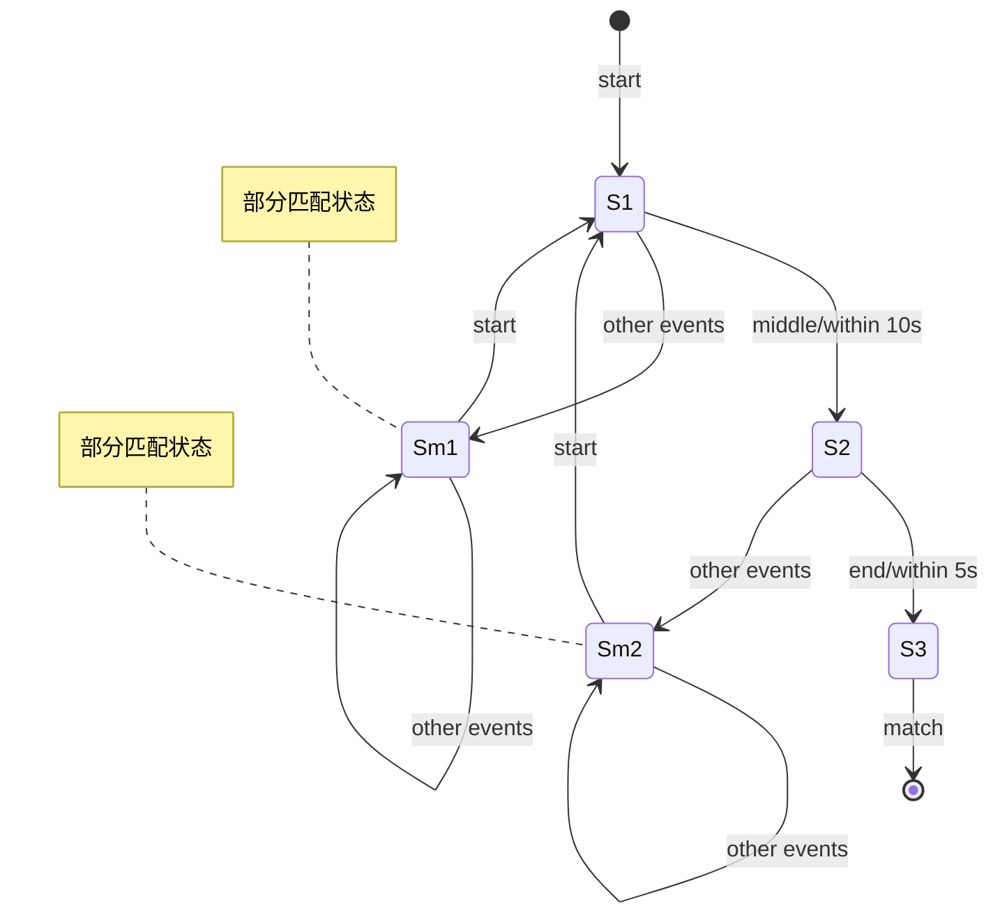

# FlinkPatternAPI的学习路线图

## 1.背景介绍

### 1.1 什么是Flink

Apache Flink 是一个开源的分布式流处理框架,用于对无界和有界数据流进行有状态计算。它被设计用于在所有常见的集群环境中运行,以内存速度执行计算。Flink提供了一个富有表现力的数据流API,用于对事件流进行有状态转换。

### 1.2 Flink的特点

- **事件驱动型(Event-driven)**: Flink是一个真正的流执行引擎,支持事件驱动的应用程序。
- **分布式&高可用**: Flink程序可以在集群上运行,具有高度的容错能力。
- **低延迟&高吞吐**: Flink使用优化的内存管理和直接模式(direct model)来实现低延迟和高吞吐。
- **支持事件时间(Event Time)和有状态计算**: Flink提供了对事件时间和有状态计算的一流支持。
- **精确一次(Exactly-once)的状态一致性**: Flink的有状态计算保证精确一次的状态一致性。
- **可维护性和错误处理**: Flink提供了一个支持更新的API,使应用程序可以在运行时更新。

### 1.3 Flink中的Pattern API

Flink的Pattern API是一个复杂事件处理(CEP)库,用于识别数据流中的模式。它允许你在无限流上查询事件序列,并根据匹配的复杂事件序列执行相关操作。Pattern API提供了一种声明式的方式来定义模式,并将其应用于输入流。

## 2.核心概念与联系

### 2.1 Pattern API的关键概念

1. **Pattern**: 定义要在数据流中搜索的模式,由多个模式原语组成。

2. **Pattern原语**: 构建模式的基本单元,包括:
   - 单例模式(单个事件)
   -循环模式(连续相同事件序列)
   -严格连续模式(连续不同事件序列)
   -松散连续模式(非连续事件序列)
   
3. **模式组合**: 使用逻辑操作符(AND,OR,NOT等)组合模式原语形成复杂模式。

4. **侧输出流(Side Output)**: 在检测到部分匹配模式时,可以发出部分匹配事件到侧输出流。

5. **时间约束**: 在模式中添加时间约束,例如在事件之间施加时间条件。

6. **PatternStream**: 模式匹配的结果数据流,包含匹配到的复杂事件序列。

### 2.2 Pattern API与其他Flink API的关系

Flink提供了多种API用于构建流处理应用程序:

- **DataStream API**: 用于基本的流处理转换。
- **DataSet API**: 用于批处理转换。
- **Table API和SQL**: 用于关系型流/批处理。
- **Pattern API**: 用于复杂事件处理。

Pattern API构建在DataStream API之上,使用DataStream作为输入源。模式匹配的结果以PatternStream的形式输出,可以与其他DataStream进一步转换和处理。

## 3.核心算法原理具体操作步骤 

### 3.1 模式定义

Pattern API使用一种类似正则表达式的语法来定义模式。以下是一些常见的模式原语:

1. **单例模式**:
   - `start.next("start").where(...)`
   - `next.next("next").where(...)`
   - `end.next("end").where(...)`

2. **循环模式**:
   - `.oneOrMore().optional()`
   - `.times(#ofTimes)`
   - `.times(#ofTimes, #ofTimes)`
   
3. **严格连续模式**:
   - `.next("name1").next("name2")...`

4. **松散连续模式**:
   - `.followedBy("name1").followedBy("name2")...`

其中`.where(...)`用于添加过滤条件。

### 3.2 模式检测

定义好模式后,需要将其应用到输入数据流上进行模式匹配:

```java
DataStream<Event> input = ...

PatternStream<Event> patternStream = CEP.pattern(input, pattern);
```

`CEP.pattern`静态方法将输入流与定义的模式相结合,生成一个`PatternStream`。

### 3.3 结果处理

对于匹配到的复杂事件序列,可以使用以下方法进行处理:

- `patternStream.select(...)`: 对匹配事件执行转换操作。
- `patternStream.flatSelect(...)`: 对匹配事件执行flatMap操作。
- `patternStream.sideOutputLateData(...)`: 发出延迟数据到侧输出流。
- `patternStream.sideOutputPattern(...)`: 发出部分匹配模式到侧输出流。

例如,假设要对匹配的事件序列执行求和操作:

```java
patternStream.select(
    (pattern, flatResult) -> flatResult.getSumOfPrices()
).print();
```

## 4. 数学模型和公式详细讲解举例说明

在Pattern API中,时间约束扮演着重要角色。时间约束可以应用于模式原语,以限制事件之间的最大时间间隔。这对于处理具有时间相关性的事件流非常有用。

假设我们想匹配一个由三个事件组成的模式,其中第一个和第二个事件之间的时间间隔不超过10秒,第二个和第三个事件之间的时间间隔不超过5秒。我们可以使用以下模式定义:

```java
Pattern<Event, ?> pattern = Pattern.<Event>begin("start")
    .next("middle")
    .within(Time.seconds(10))
    .next("end")
    .within(Time.seconds(5));
```

上述模式使用了`within`方法来指定时间约束。`Time.seconds(10)`表示10秒的时间间隔。

在模式匹配过程中,Flink使用一种称为**非确定性有限自动机(Non-deterministic Finite Automaton, NFA)**的数学模型来检测模式。NFA是一种用于识别正则表达式的模型,可以高效地处理包含时间约束的复杂模式。

NFA的工作原理可以用一个状态转移图来描述。每个状态代表模式的一部分,边表示事件的发生。当一个事件到达时,NFA会根据当前状态和事件类型进行状态转移。如果到达了接受状态,则表示模式被成功匹配。

下图展示了上述模式对应的NFA状态转移图:



在上图中,S1、S2和S3分别表示匹配第一个、第二个和第三个事件的状态。Sm1和Sm2是部分匹配状态,表示模式暂时无法继续匹配,需要等待下一个start事件到来重新开始匹配。

当一个事件到达时,NFA会根据当前状态和事件类型进行状态转移。例如,如果当前状态是S1,收到一个middle事件,并且该事件与上一个start事件的时间间隔小于10秒,则NFA会转移到状态S2。如果时间间隔超过10秒,则NFA会转移到部分匹配状态Sm1,等待下一个start事件到来。

通过NFA,Pattern API可以高效地检测包含时间约束的复杂模式,并输出匹配的事件序列。

## 4. 项目实践: 代码实例和详细解释说明

让我们通过一个实际的项目案例来演示如何使用Flink的Pattern API。我们将构建一个简单的在线购物检测系统,用于识别异常购买行为。

### 4.1 数据源

我们将使用一个模拟的购买事件流作为输入源。每个事件包含以下字段:

- `userId`: 用户ID
- `itemId`: 商品ID
- `purchaseTime`: 购买时间

示例事件:

```
1,1,2022-03-15 10:05:32
2,2,2022-03-15 10:10:11
1,3,2022-03-15 10:10:45
...
```

### 4.2 定义模式

我们想检测以下异常购买行为模式:

1. **短时间内重复购买同一商品**: 同一用户在5分钟内购买了同一商品两次或更多次。
2. **短时间内疯狂购物**: 同一用户在10分钟内购买了5个或更多不同商品。

我们可以使用Pattern API定义这两个模式:

```java
// 1. 重复购买同一商品
Pattern<PurchaseEvent, ?> repeatPurchasePattern = Pattern
    .<PurchaseEvent>begin("start")
    .where(event -> /* filter for start event */)
    .next("next")
    .where(event -> /* filter for next event */)
    .where(new SimpleCondition<PurchaseEvent>() {
        private static final long FIVE_MINUTES = 5 * 60 * 1000;

        @Override
        public boolean filter(PurchaseEvent start, PurchaseEvent next) {
            return start.userId == next.userId
                && start.itemId == next.itemId
                && next.purchaseTime.getTime() - start.purchaseTime.getTime() < FIVE_MINUTES;
        }
    });

// 2. 疯狂购物
Pattern<PurchaseEvent, ?> frenzyShoppingPattern = Pattern
    .<PurchaseEvent>begin("start")
    .where(event -> /* filter for start event */)
    .next("next")
    .where(event -> /* filter for next event */)
    .times(4) // 至少 5 次不同的购买
    .within(Time.minutes(10)); // 在 10 分钟内
```

在第一个模式中,我们使用`.next("next")`定义了一个严格连续模式,并使用`.where(...)`添加了过滤条件。过滤条件检查两个事件是否来自同一用户、购买同一商品,并且时间间隔小于5分钟。

在第二个模式中,我们使用`.times(4)`表示模式需要重复出现至少5次,并使用`.within(Time.minutes(10))`添加了一个10分钟的时间约束。

### 4.3 模式匹配

定义好模式后,我们需要将其应用到输入流上进行模式匹配:

```java
DataStream<PurchaseEvent> input = ...

PatternStream<PurchaseEvent> repeatPurchaseMatches = CEP
    .pattern(input, repeatPurchasePattern);

PatternStream<PurchaseEvent> frenzyShoppingMatches = CEP
    .pattern(input, frenzyShoppingPattern);
```

### 4.4 结果处理

对于匹配到的模式,我们可以执行相应的操作,例如输出警告或采取进一步的措施:

```java
repeatPurchaseMatches
    .select((pattern, typedResult) -> typedResult.toString())
    .print("Repeat Purchase Warning");

frenzyShoppingMatches
    .select((pattern, typedResult) -> typedResult.toString())
    .print("Frenzy Shopping Warning");
```

在这个示例中,我们只是简单地打印出匹配的事件序列。在实际应用中,你可以执行更复杂的操作,如发送警报、记录日志或调用外部系统。

## 5. 实际应用场景

Pattern API在许多领域都有广泛的应用,尤其是在需要对复杂事件序列进行实时检测和处理的场景。以下是一些常见的应用场景:

1. **网络安全**: 检测网络入侵模式、垃圾邮件模式、病毒传播模式等。

2. **物联网(IoT)**: 监测传感器数据,识别异常模式,如设备故障、环境变化等。

3. **电子商务**: 检测欺诈交易模式、异常购买行为等。

4. **金融服务**: 识别交易欺诈模式、洗钱活动等。

5. **制造业**: 监控生产线数据,检测设备故障模式、质量问题等。

6. **交通运输**: 检测交通拥堵模式、异常行车路线等。

7. **医疗保健**: 监测生理数据,识别疾病模式、异常生命体征等。

8. **推荐系统**: 根据用户行为模式提供个性化推荐。

总的来说,Pattern API可以应用于任何需要从复杂数据流中识别特定事件序列模式的场景。它为构建实时复杂事件处理应用程序提供了强大的工具。

## 6. 工具和资源推荐

在学习和使用Flink Pattern API的过程中,以下工具和资源可能会对你有所帮助:

1. **Apache Flink官网**: https://flink.apache.org/
   - 官