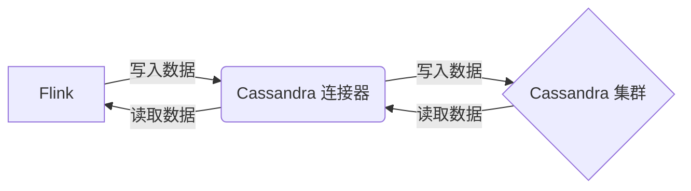
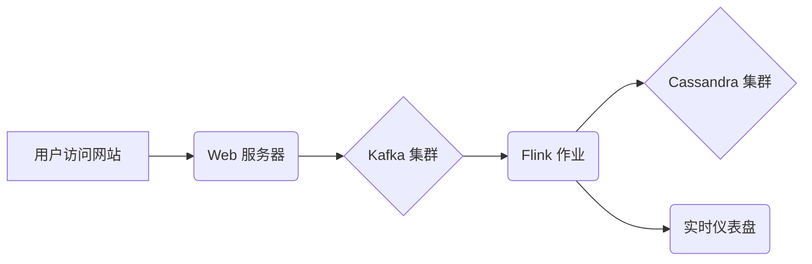

# Flink 与 Cassandra 集成：构建高可用数据存储

作者：禅与计算机程序设计艺术

## 1. 背景介绍

### 1.1 大数据时代的数据存储挑战

随着互联网和物联网的快速发展，全球数据量呈爆炸式增长。传统的数据库管理系统难以满足海量数据的存储和处理需求，因此，分布式数据库应运而生。分布式数据库具有高可用性、高扩展性和高性能等优点，成为大数据时代数据存储的首选方案。

### 1.2 Flink 与 Cassandra 简介

Apache Flink 是一个开源的分布式流处理和批处理框架，能够高效地处理实时和离线数据。Flink 提供了丰富的数据源和数据汇，可以方便地与各种数据存储系统集成。

Apache Cassandra 是一种开源的 NoSQL 分布式数据库管理系统，具有高可用性、高容错性和可线性扩展性等特点。Cassandra 采用去中心化的架构，没有单点故障，能够保证数据的高可用性。

### 1.3 Flink 与 Cassandra 集成的优势

将 Flink 与 Cassandra 集成，可以充分发挥两者的优势，构建高可用、高性能的数据存储和处理平台。

* **高可用性：** Cassandra 的去中心化架构和 Flink 的容错机制，可以保证系统在任何情况下都能正常运行。
* **高扩展性：** Cassandra 和 Flink 都可以轻松扩展，以满足不断增长的数据量和处理需求。
* **高性能：** Flink 可以高效地处理实时数据流，Cassandra 可以快速地写入和读取数据。
* **灵活的数据模型：** Cassandra 的灵活数据模型可以满足各种数据存储需求。

## 2. 核心概念与联系

### 2.1 Flink 核心概念

* **数据流（DataStream）：** Flink 中的数据表示形式，是一个无限的数据记录流。
* **算子（Operator）：** 对数据流进行处理的逻辑单元，例如 map、filter、reduce 等。
* **数据源（Source）：** 数据流的来源，例如 Kafka、文件系统等。
* **数据汇（Sink）：** 数据流的目的地，例如 Cassandra、MySQL 等。

### 2.2 Cassandra 核心概念

* **集群（Cluster）：** 由多个节点组成的 Cassandra 实例。
* **数据中心（Datacenter）：** 用于容错和数据一致性的逻辑单元，通常包含多个节点。
* **表（Table）：** Cassandra 中的数据存储单元，类似于关系型数据库中的表。
* **行（Row）：** 表中的一条记录。
* **列（Column）：** 行中的一个字段。

### 2.3 Flink 与 Cassandra 集成架构

Flink 可以通过 Cassandra 连接器与 Cassandra 集成，连接器充当 Flink 和 Cassandra 之间的桥梁，负责数据的读写操作。



## 3. 核心算法原理具体操作步骤

### 3.1 Flink 写入数据到 Cassandra

1. 创建 Cassandra 连接器：使用 Flink 提供的 `CassandraSink` 类创建 Cassandra 连接器，并配置 Cassandra 集群地址、表名等信息。
2. 定义数据写入逻辑：使用 Flink 的算子对数据流进行处理，并将处理后的数据写入 Cassandra 连接器。
3. 执行 Flink 作业：启动 Flink 作业，数据将被写入 Cassandra 集群。

```java
// 创建 Cassandra 连接器
CassandraSink<Tuple2<String, Integer>> sink = CassandraSink
    .addSink(
        // 数据写入逻辑
        dataStream.map(new MapFunction<String, Tuple2<String, Integer>>() {
            @Override
            public Tuple2<String, Integer> map(String value) throws Exception {
                // 数据处理逻辑
                return new Tuple2<>(value, 1);
            }
        })
    )
    // 配置 Cassandra 集群地址
    .setHost("localhost")
    // 配置 Cassandra 表名
    .setQuery("INSERT INTO example.word_count (word, count) VALUES (?, ?)")
    .build();

// 执行 Flink 作业
env.execute("Flink Cassandra Integration");
```

### 3.2 Flink 从 Cassandra 读取数据

1. 创建 Cassandra 连接器：使用 Flink 提供的 `CassandraSource` 类创建 Cassandra 连接器，并配置 Cassandra 集群地址、表名等信息。
2. 定义数据读取逻辑：使用 Flink 的算子对 Cassandra 中的数据进行处理。
3. 执行 Flink 作业：启动 Flink 作业，数据将从 Cassandra 集群读取并进行处理。

```java
// 创建 Cassandra 连接器
CassandraSource<Tuple2<String, Integer>> source = CassandraSource
    .<Tuple2<String, Integer>>builder()
    // 配置 Cassandra 集群地址
    .withHost("localhost")
    // 配置 Cassandra 表名
    .withTable("example", "word_count")
    // 数据读取逻辑
    .map(new MapFunction<Row, Tuple2<String, Integer>>() {
        @Override
        public Tuple2<String, Integer> map(Row value) throws Exception {
            // 数据处理逻辑
            return new Tuple2<>(value.getString("word"), value.getInt("count"));
        }
    })
    .build();

// 执行 Flink 作业
env.fromCollection(source).print();
env.execute("Flink Cassandra Integration");
```

## 4. 数学模型和公式详细讲解举例说明

本节介绍 Flink 与 Cassandra 集成中涉及的一些数学模型和公式，并结合实例进行讲解。

### 4.1 数据一致性模型

Cassandra 使用了一种称为“最终一致性”的数据一致性模型。这意味着，在写入数据后，不同节点上的数据副本可能暂时不一致，但在一段时间后，所有副本最终都会达到一致状态。

为了保证数据一致性，Cassandra 使用了以下机制：

* **写时复制（Write-Ahead Logging）：** 所有写入操作都会先写入提交日志，然后再写入内存表和磁盘。
* **读时修复（Read Repair）：** 当读取数据时，如果发现数据副本不一致，Cassandra 会自动修复数据。

### 4.2 数据分区和复制

Cassandra 使用一致性哈希算法将数据分区到不同的节点上。每个节点负责存储一部分数据，并且数据会复制到多个节点上，以保证数据的高可用性。

假设有一个 Cassandra 集群包含 3 个节点，复制因子设置为 2。当写入数据时，数据会被写入到两个节点上。如果其中一个节点发生故障，另一个节点仍然可以提供数据服务。

## 5. 项目实践：代码实例和详细解释说明

本节将通过一个具体的项目实例，演示如何使用 Flink 和 Cassandra 构建一个实时数据分析系统。

### 5.1 项目背景

假设我们需要构建一个实时用户行为分析系统，用于跟踪用户的网站访问行为，并实时分析用户的兴趣爱好。

### 5.2 系统架构



* 用户访问网站，Web 服务器记录用户的访问日志，并将日志发送到 Kafka 集群。
* Flink 作业从 Kafka 集群读取用户访问日志，并进行实时分析，例如统计用户访问次数、页面停留时间等。
* 分析结果写入 Cassandra 集群，用于后续查询和分析。
* 实时仪表盘从 Cassandra 集群读取分析结果，并以图表的形式展示给用户。

### 5.3 代码实现

**Flink 作业代码：**

```java
public class UserBehaviorAnalysis {

    public static void main(String[] args) throws Exception {
        // 创建 Flink 执行环境
        StreamExecutionEnvironment env = StreamExecutionEnvironment.getExecutionEnvironment();

        // 创建 Kafka 数据源
        Properties kafkaProps = new Properties();
        kafkaProps.setProperty("bootstrap.servers", "localhost:9092");
        kafkaProps.setProperty("group.id", "user-behavior-analysis");
        FlinkKafkaConsumer<String> consumer = new FlinkKafkaConsumer<>(
            "user-access-log",
            new SimpleStringSchema(),
            kafkaProps
        );

        // 创建 Cassandra 连接器
        CassandraSink<UserBehavior> sink = CassandraSink
            .addSink(
                env.fromCollection(consumer)
                    // 解析用户访问日志
                    .map(new MapFunction<String, UserBehavior>() {
                        @Override
                        public UserBehavior map(String value) throws Exception {
                            // 解析逻辑
                            return new UserBehavior();
                        }
                    })
                    // 统计用户访问次数
                    .keyBy("userId")
                    .reduce(new ReduceFunction<UserBehavior>() {
                        @Override
                        public UserBehavior reduce(UserBehavior value1, UserBehavior value2) throws Exception {
                            // 统计逻辑
                            return new UserBehavior();
                        }
                    })
            )
            // 配置 Cassandra 集群地址
            .setHost("localhost")
            // 配置 Cassandra 表名
            .setQuery("INSERT INTO user_behavior (user_id, access_count) VALUES (?, ?)")
            .build();

        // 执行 Flink 作业
        env.execute("UserBehaviorAnalysis");
    }

    // 用户行为数据结构
    public static class UserBehavior {
        public String userId;
        public long accessCount;

        // 构造函数、getter 和 setter 方法
    }
}
```

**Cassandra 表结构：**

```sql
CREATE TABLE user_behavior (
  user_id text PRIMARY KEY,
  access_count bigint
);
```

## 6. 工具和资源推荐

### 6.1 Flink

* **官方网站：** https://flink.apache.org/
* **文档：** https://flink.apache.org/docs/latest/

### 6.2 Cassandra

* **官方网站：** https://cassandra.apache.org/
* **文档：** https://cassandra.apache.org/doc/latest/

## 7. 总结：未来发展趋势与挑战

### 7.1 未来发展趋势

* **实时数据分析：** 随着物联网和人工智能的发展，实时数据分析需求将越来越大，Flink 和 Cassandra 的集成可以提供高性能的实时数据处理能力。
* **混合云架构：** 企业将越来越多地采用混合云架构，Flink 和 Cassandra 的云原生特性可以方便地部署和管理。
* **人工智能应用：** Flink 和 Cassandra 可以与人工智能技术结合，实现更智能的数据分析和决策。

### 7.2 面临的挑战

* **数据一致性：** Cassandra 的最终一致性模型可能会导致数据不一致的问题，需要采取措施保证数据的一致性。
* **数据规模：** 随着数据量的不断增长，Cassandra 集群的扩展性和性能需要不断优化。
* **安全性：** 数据安全是大数据应用的重要问题，需要采取措施保证 Flink 和 Cassandra 集群的安全性。

## 8. 附录：常见问题与解答

### 8.1 如何保证 Flink 与 Cassandra 集成的数据一致性？

可以使用 Flink 的状态管理功能和 Cassandra 的轻量级事务来保证数据一致性。

### 8.2 如何监控 Flink 与 Cassandra 集成的性能？

可以使用 Flink 和 Cassandra 提供的监控工具来监控系统的性能，例如 Flink Web UI、Cassandra OpsCenter 等。

### 8.3 如何解决 Flink 与 Cassandra 集成的数据倾斜问题？

可以使用 Flink 的数据预处理功能和 Cassandra 的数据模型设计来解决数据倾斜问题。
