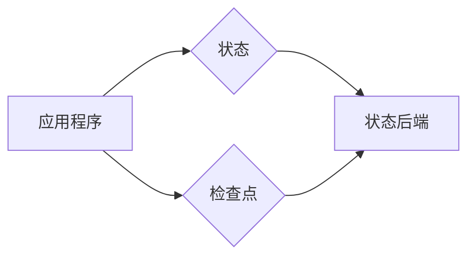

# Flink容错机制:状态管理与检查点

作者：禅与计算机程序设计艺术

## 1. 背景介绍

### 1.1 流处理与容错

在当今大数据时代，实时数据处理需求日益增长，流处理技术应运而生。与传统的批处理不同，流处理强调数据的实时性和持续性，这就对系统的容错性提出了更高的要求。试想一下，如果一个流处理应用在运行过程中突然崩溃，所有中间状态丢失，那么就需要从头开始重新计算，这对于实时性要求高的应用来说是不可接受的。

### 1.2 Flink的容错机制概述

Apache Flink作为一个高吞吐、低延迟的流处理框架，其强大的容错机制是其重要特性之一。Flink通过结合**状态管理**和**检查点**机制，实现了Exactly-Once语义，保证了即使在发生故障的情况下，也能够从中断处恢复，并保证结果的正确性。

## 2. 核心概念与联系

### 2.1 状态（State）

在流处理中，状态是指能够在不同事件之间传递和共享的信息。这些信息可以是简单的计数器，也可以是复杂的机器学习模型参数。Flink提供了多种状态类型，包括：

* **ValueState:** 存储单个值，例如计数器。
* **ListState:** 存储一个列表，例如最近访问过的商品列表。
* **MapState:** 存储键值对，例如用户画像信息。

### 2.2 检查点（Checkpoint）

检查点是Flink用于保存应用程序状态的机制。Flink会定期将应用程序的状态快照保存到外部存储系统中，例如HDFS或RocksDB。当发生故障时，Flink可以从最近的检查点恢复应用程序状态，并从中断处继续处理数据。

### 2.3 状态后端（State Backend）

状态后端是负责存储和管理Flink应用程序状态的组件。Flink提供了多种状态后端实现，包括：

* **MemoryStateBackend:** 将状态存储在内存中，速度最快，但容量有限。
* **FsStateBackend:** 将状态存储在文件系统中，例如HDFS，容量较大，但速度较慢。
* **RocksDBStateBackend:** 将状态存储在嵌入式RocksDB数据库中，兼顾了速度和容量。

### 2.4 关系图



## 3. 核心算法原理具体操作步骤

### 3.1 检查点算法

Flink的检查点算法基于Chandy-Lamport算法，该算法是一种分布式快照算法，能够在不停止系统运行的情况下，获取一致的系统状态快照。其基本思想是：

1. **注入检查点标记:** 当触发检查点时，Flink JobManager会向所有数据源注入一个特殊的检查点标记。
2. **传播检查点标记:**  数据源收到标记后，会将其向下游传递。每个算子在收到标记后，都会将当前状态进行异步快照，并将标记继续向下游传递。
3. **完成检查点:** 当所有算子都完成状态快照，并将标记传递到数据汇后，检查点完成。

### 3.2 状态恢复

当发生故障时，Flink会从最近的检查点恢复应用程序状态。其具体步骤如下：

1. **选择检查点:** Flink JobManager会选择最近一次成功的检查点。
2. **加载状态:**  每个算子从状态后端加载其对应的状态快照。
3. **重置数据源:**  数据源根据检查点的信息，重置到对应的位置，重新开始读取数据。
4. **继续处理:**  所有算子从恢复的状态开始，继续处理数据。

## 4. 数学模型和公式详细讲解举例说明

### 4.1 检查点间隔与恢复时间

检查点间隔是指两次检查点之间的时间间隔。间隔越短，状态丢失的风险越小，但检查点操作也会更加频繁，影响性能。恢复时间是指从故障中恢复所需的时间，恢复时间越短，对实时性的影响越小。

假设检查点间隔为 $T$，平均恢复时间为 $R$，则状态丢失的平均时间为 $T/2$，应用程序的平均运行时间为 $T + R$。因此，为了最小化状态丢失带来的影响，需要选择合适的检查点间隔，使得 $T/2$ 远小于应用程序的平均运行时间。

### 4.2 状态大小与检查点性能

状态大小是指应用程序状态占用的存储空间大小。状态越大，检查点操作所需的时间越长，对性能的影响也越大。

假设状态大小为 $S$，网络带宽为 $B$，则检查点操作所需的时间约为 $S/B$。因此，为了提高检查点性能，可以考虑以下优化措施：

* **减少状态大小:**  例如，使用增量状态更新，只存储状态的变化部分。
* **提高网络带宽:**  例如，使用更高效的网络协议或硬件。

## 5. 项目实践：代码实例和详细解释说明

### 5.1 配置检查点

```java
StreamExecutionEnvironment env = StreamExecutionEnvironment.getExecutionEnvironment();

// 设置检查点间隔为1分钟
env.enableCheckpointing(60000);

// 设置检查点模式为 EXACTLY_ONCE
env.getCheckpointConfig().setCheckpointingMode(CheckpointingMode.EXACTLY_ONCE);

// 设置状态后端为 RocksDB
env.setStateBackend(new RocksDBStateBackend("file:///path/to/rocksdb"));
```

### 5.2 使用状态

```java
DataStream<Tuple2<String, Integer>> wordCountStream = env
        .fromElements("hello world", "hello flink")
        .flatMap(new FlatMapFunction<String, Tuple2<String, Integer>>() {
            @Override
            public void flatMap(String value, Collector<Tuple2<String,