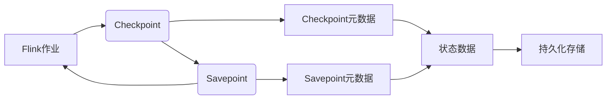
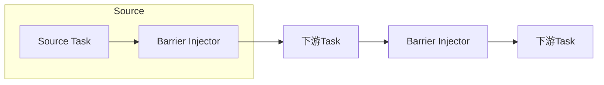

# Flink的Checkpoint机制：状态的持久化和恢复

## 1.背景介绍

### 1.1 什么是Flink

Apache Flink是一个开源的分布式流处理框架,用于对无限数据流进行有状态的计算。作为一种新型的大数据处理引擎,Flink被广泛应用于事件驱动应用程序、数据分析和反应式系统等领域。它能够在有限的时间内处理有限或无限的数据,并确保即使在发生故障的情况下也能够恢复并从上次中断的位置继续处理数据。

### 1.2 Flink的应用场景

Flink可以广泛应用于各种领域,包括但不限于:

- 实时数据分析:如网络日志分析、用户行为分析、在线机器学习等
- 事件驱动应用程序:如电商推荐系统、社交网络分析、物联网应用等
- 流式ETL:对数据进行实时清洗、转换和加载
- 传统批处理:Flink也可以用于离线批处理任务

### 1.3 有状态计算的重要性

对于流处理应用程序,状态管理是一个非常关键的问题。有状态计算意味着程序的执行不仅依赖于当前的输入,还依赖于之前处理过的数据所积累的状态。比如计算每个用户最近一小时内浏览的页面数量,就需要保存每个用户的状态。

有状态计算带来的主要挑战是:如何在发生故障时保证状态的一致性,并从故障中恢复继续处理。这就需要一种可靠的状态持久化和恢复机制。

### 1.4 Checkpoint机制的作用

Flink的Checkpoint机制正是为了解决上述状态一致性问题。它定期在分布式环境中为状态做快照,将快照持久化存储,以便在发生故障时从最近的一次快照恢复,实现精确一次(Exactly-Once)的状态恢复,确保计算结果的正确性。

## 2.核心概念与联系

### 2.1 状态分类

在Flink中,状态可以分为以下几种类型:

- **Keyed State**: 根据键(key)对状态进行分区,每个键对应一个状态实例,常见于窗口操作。
- **Operator State**: 由算子的一个并行实例所存储和维护,不会在并行实例之间进行分区。
- **Broadcast State**: 可以在所有并行实例之间广播状态。

### 2.2 Checkpoint与Savepoint

**Checkpoint** 是一种轻量级的快照,用于在作业失败或手动取消时恢复状态。它由Flink自身协调,定期触发,不会阻塞作业的执行。

**Savepoint** 则是一种手动触发的全量快照,将作业的完整状态数据持久化存储,常用于有计划的手动备份、版本升级、暂停作业等场景。



上图展示了Checkpoint和Savepoint的关系。Checkpoint由Flink自动协调触发,生成Checkpoint元数据和状态数据快照,持久化存储。Savepoint则是手动触发的全量快照,包含Savepoint元数据和完整的状态数据快照。两者都可以用于故障恢复。

### 2.3 Checkpoint流程

Checkpoint的执行过程可以分为以下几个阶段:

1. **启动Checkpoint**: JobManager向所有的TaskManager发送启动Checkpoint的命令。
2. **暂存状态数据**: TaskManager中的每个Task将其状态数据异步持久化存储到StateBackend。
3. **暂存检查点元数据**: 所有Task的状态数据持久化完成后,JobManager为此次Checkpoint生成一个唯一的CheckpointId,并将元数据持久化存储到指定路径。
4. **通知作业完成**: JobManager向所有TaskManager发送Checkpoint完成的命令,并丢弃之前的Checkpoint。

整个过程是异步和流水线化的,状态数据的持久化不会阻塞作业的执行。

### 2.4 Checkpoint恢复

当发生故障时,Flink会自动从最近一次成功的Checkpoint进行恢复:

1. 重新启动JobManager和TaskManager进程。
2. 根据Checkpoint元数据,分发并部署作业。
3. 从持久化存储中读取状态数据,重建Task的状态。
4. 从上次Checkpoint位置继续处理数据流。

通过以上过程,Flink能够在发生故障后恢复作业并保证精确一次的状态一致性。

## 3. 核心算法原理具体操作步骤

Flink的Checkpoint机制涉及多个核心算法,下面我们逐一介绍。

### 3.1 Barrier插入算法

为了保证状态数据能够一致性地被Checkpoint,Flink采用了基于Barrier的一致性快照算法。Barrier是一种控制消息,用于划分数据流的界限。

当JobManager发出Checkpoint命令时,会向每个Source Task注入Barrier。Source Task接收到Barrier后,会先处理所有之前的数据,再将Barrier注入到输出数据流,并通知JobManager已经处理完成。



每个下游Task在接收到Barrier后,会先处理所有之前的数据,再将Barrier传递给下游,并通知JobManager。这种方式确保了每个Task在Checkpoint时都处理完所有之前的数据,从而达到数据和状态的一致性。

当所有Task都完成并通知JobManager时,这次Checkpoint就正式完成了。

### 3.2 异步Checkpoint算法

Flink采用了异步Checkpoint算法,将状态数据的持久化与作业的执行解耦,避免阻塞整个作业。具体来说:

1. TaskManager启动Checkpoint时,会为每个Task创建一个Checkpoint Barrier实例。
2. Task在收到Barrier时,会先将其当前状态异步持久化到StateBackend,再将Barrier注入到数据流中。
3. Task持久化完成后,会通知JobManager。
4. 当所有Task都完成时,JobManager就可以确认Checkpoint完成了。

通过这种异步持久化的方式,Checkpoint过程不会阻塞作业的正常执行,从而提高了系统的吞吐量。

### 3.3 RocksDB增量Checkpoint算法

Flink的状态数据默认使用RocksDB作为本地存储引擎。为了提高Checkpoint性能,Flink采用了基于RocksDB的增量Checkpoint算法。

具体来说,Flink会为每个Task维护一个RocksDB实例,实例中包含两个Column Family:

- **数据Column Family**: 存储实际的状态数据。
- **元数据Column Family**: 存储状态数据的元数据,如键、值的长度等。

在进行Checkpoint时,Task只需要将元数据Column Family持久化存储即可,而不需要复制整个状态数据。这是因为RocksDB在内部使用了写时复制(Copy-on-Write)技术,只有在数据发生变化时才会创建新的数据文件。

因此,Flink在进行Checkpoint时,只需要将元数据Column Family的数据持久化存储,然后将其与上一次Checkpoint的数据Column Family组合,就能还原出完整的状态数据了。这种增量Checkpoint大大减少了数据复制的开销,从而提高了Checkpoint性能。

### 3.4 异步Savepoint算法

Savepoint与Checkpoint的原理类似,但需要对整个作业的状态做全量持久化。Flink采用了异步Savepoint算法来实现:

1. JobManager向所有TaskManager发出Savepoint触发命令。
2. 每个TaskManager会为其管理的Task创建一个Savepoint Barrier实例。
3. Task在收到Barrier时,会将当前状态全量异步持久化到StateBackend。
4. Task持久化完成后,会通知JobManager。
5. 当所有Task都完成后,JobManager就会将元数据持久化存储,标志着Savepoint完成。

与Checkpoint类似,这种异步持久化方式不会阻塞作业执行,但由于需要全量复制状态数据,所以Savepoint的开销较大。

## 4. 数学模型和公式详细讲解举例说明

在介绍Flink的Checkpoint机制时,我们无需过多涉及复杂的数学模型。但是,有一个相关的理论模型值得一提,那就是"一致性快照"(Consistent Snapshot)问题。

### 4.1 一致性快照问题

在分布式系统中,如何获取一个全局状态的一致性快照是一个经典的问题。一致性快照意味着获取的状态数据必须反映系统在某个时间点的一致状态,而不会包含部分状态更新的数据。

形式化地,假设有n个进程$P_1, P_2, \dots, P_n$,它们通过发送消息$m_{ij}$进行通信,我们希望在不阻塞进程的情况下,获取系统在某个时间点t的一致性快照。

### 4.2 Chandy-Lamport算法

Chandy和Lamport在1985年提出了一种分布式快照算法,用于获取一致性快照。该算法的核心思想是使用控制消息(Marker)来划分数据流,确保每个进程在Marker到达之前处理完所有之前的消息。

算法的执行步骤如下:

1. 某个进程$P_i$发起快照请求。
2. $P_i$给自己发送一个Marker消息,将自身状态记录到快照中。
3. 当进程$P_k$收到Marker消息时:
    - 如果$P_k$为空闲状态,则立即将其状态记录到快照中。
    - 如果$P_k$正在执行,则先执行到空闲状态,再将状态记录到快照中。
4. 在记录完自身状态后,$P_k$向所有邻居进程转发Marker消息。
5. 重复步骤3和4,直到所有进程都收到并转发了Marker消息。

通过这种方式,每个进程在Marker到达之前都会处理完之前的消息,从而确保了状态的一致性。Flink的Barrier插入算法正是借鉴了这一思想。

### 4.3 Chandy-Lamport算法的证明

我们可以通过数学归纳法证明Chandy-Lamport算法的正确性。

假设有n个进程,定义$C(i,j)$表示进程$P_i$在快照中记录的关于进程$P_j$的最新消息,那么一致性快照就等价于对所有进程对满足:

$$\forall i, j: C(i,j) = C(j,i)$$

也就是说,每对进程在快照中记录的关于对方的消息是一致的。

**基础步骤**:对于发起快照的进程$P_i$,它在发送Marker之前就已经将自身状态记录到快照中,所以$C(i,i)$是最新的。

**归纳步骤**:假设对于所有进程$P_j$,我们已经有$C(i,j) = C(j,i)$。现在考虑进程$P_k$收到Marker并记录自身状态后,我们需要证明:

$$\forall l: C(k,l) = C(l,k)$$

根据算法的执行步骤,在$P_k$记录自身状态之前,它必须先处理完所有之前的消息。也就是说,在$P_k$记录状态时,$C(k,l)$已经是最新的了。

同时,由于$P_k$会向所有邻居进程发送Marker,因此所有与$P_k$通信的进程$P_l$在收到Marker后,也必须先处理完之前的消息,从而使$C(l,k)$成为最新的。

因此,我们可以得出$C(k,l) = C(l,k)$,证明了算法的正确性。

Chandy-Lamport算法为分布式快照理论奠定了基础,Flink的Barrier插入算法正是借鉴了这一思想,从而保证了Checkpoint时状态数据的一致性。

## 5. 项目实践:代码实例和详细解释说明

接下来,我们通过一个实际的Flink作业示例,演示如何启用和配置Checkpoint机制。

### 5.1 Flink作业示例

我们将构建一个简单的实时词频统计作业。它将从Kafka消费数据流,对单词进行计数统计,并将结果输出到另一个Kafka主题。

```scala
import org.apache.flink.api.java.utils.ParameterTool
import org.apache.flink.streaming.api.