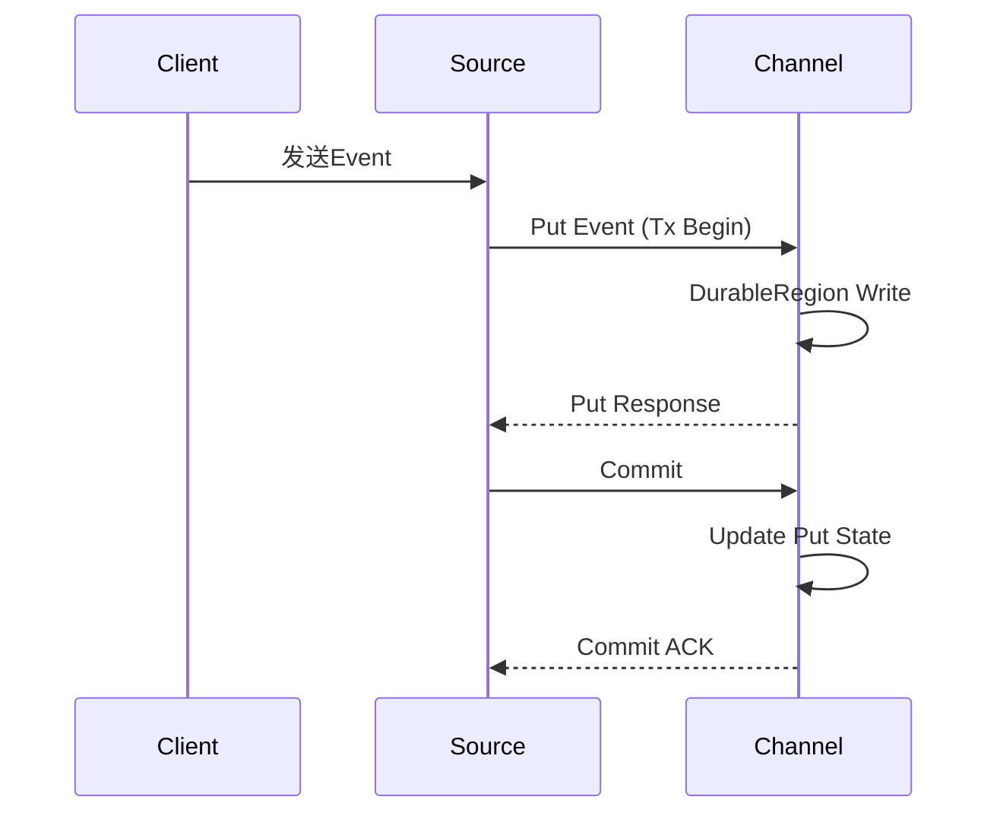

# Flume事务机制：保障数据一致性

作者：禅与计算机程序设计艺术

## 1. 背景介绍

### 1.1 大数据时代的数据采集挑战

在大数据时代,海量数据的实时采集、传输和处理已成为各行各业的核心需求之一。然而,在数据从源头流向目的地的过程中,如何保证数据的一致性和可靠性,是一个巨大的挑战。

### 1.2 Flume的优势与不足 

Apache Flume是一个分布式、可靠、高可用的数据采集系统,在业界得到了广泛应用。它具有灵活的架构、可插拔的组件、强大的容错能力等优点。但Flume的早期版本在事务机制方面存在一些不足,影响了端到端的数据一致性保证。

### 1.3 事务机制对数据一致性的重要意义

事务机制是保障数据一致性的关键。它能够确保数据要么全部成功提交,要么完全回滚,避免出现数据丢失或重复等异常情况。对于分布式系统而言,事务机制的重要性更加凸显。

## 2. 核心概念与关系

### 2.1 Agent 

- 2.1.1 Source
- 2.1.2 Channel 
- 2.1.3 Sink

### 2.2 Transaction
- 2.2.1 Put事务
- 2.2.2 Take事务  

### 2.3 Batch
- 2.3.1 Batch Size
- 2.3.2 Batch Timeout

### 2.4 Delivery Guarantee
- 2.4.1 End-to-end
- 2.4.2 Store on failure

## 3. 事务算法原理与步骤

### 3.1 Put事务算法
- 3.1.1 Durable Region
- 3.1.2 两阶段提交

### 3.2 Take事务算法  
- 3.2.1 Sink Processor协调
- 3.2.2 Commit/Rollback

### 3.3 故障处理
- 3.3.1 Data Drive模式
- 3.3.2 Redelivery机制

## 4. 数学建模与公式推导

### 4.1 吞吐量建模

$$Throughput = \frac{Total \, Events}{Total \, Time}$$

### 4.2 Channel容量估算

$$Capacity = Max(\frac{E_{in} - E_{out}}{\Delta t})$$

### 4.3 平均事务耗时 

$$AvgTxnTime = \frac{\sum_{i=0}^{n}T_i}{n}$$ 

## 5. 代码实例与详细解释

### 5.1 配置事务参数
```properties
a1.channels = c1
a1.channels.c1.transactionCapacity = 1000
a1.channels.c1.checkpointInterval = 30000
```

### 5.2 自定义Sink
```java
public class MySink extends AbstractSink implements Configurable {
  private long batchSize;
  private long batchTimeout; 
  
  @Override
  public void configure(Context context) {
    batchSize = context.getLong("batchSize", 100);
    batchTimeout = context.getLong("batchTimeout", 30000);
  }
  
  @Override
  public Status process() throws EventDeliveryException {
    Transaction transaction = channel.getTransaction();
    transaction.begin();
    
    try {
      int count;
      long firstEventTime = System.currentTimeMillis();
      
      for (count = 0; count < batchSize; ++count) {
        Event event = channel.take();
        if (event == null) break;
        
        // Send event to destination
        
        if (System.currentTimeMillis() - firstEventTime >= batchTimeout) {
          break;
        }
      }
      
      transaction.commit();
      return Status.READY;
    } catch (Throwable t) {
      transaction.rollback();
      return Status.BACKOFF;
    } finally {
      transaction.close();
    }
  }
}
```

### 5.3 两阶段提交时序图



## 6. 应用场景与案例

### 6.1 日志聚合
Flume广泛应用于服务器日志、访问日志等的集中采集,支撑离线数据分析、实时监控等需求。

### 6.2 数据同步
利用Flume可以在异构系统之间实现增量数据的准实时同步,保障数据的一致性。

### 6.3 流式数据接入
Flume可作为流式数据(如传感器数据)的接入层,实现与Spark、Flink等流处理引擎的无缝对接。

## 7. 工具和资源推荐

### 7.1 Flume官网
http://flume.apache.org/ 

### 7.2 Flume User Guide 
http://flume.apache.org/releases/content/1.11.0/FlumeUserGuide.html

### 7.3 Flume Github仓库
https://github.com/apache/flume

### 7.4 Cloudera Flume文档
https://docs.cloudera.com/documentation/enterprise/latest/topics/admin_flume.html

## 8.总结与未来展望

### 8.1 Flume事务机制总结
- 端到端、原子性、一致性
- 两种提交模式、故障恢复机制
- 批处理与性能权衡

### 8.2 Flume发展趋势与挑战
- 云原生环境适配
- 超大规模场景优化 
- 与流批一体架构融合

## 9.附录：常见问题解答

### 9.1 如何选择Channel类型?
根据可靠性、吞吐量、容量等需求权衡Memory Channel和File Channel。

### 9.2 Sink Processor如何配置?  
对于多Sink场景,根据故障隔离、负载均衡需求选择Default或Failover Sink Processor。

### 9.3 Flume采集会丢数据吗?
只要配置得当、资源充足,Flume能够通过Channel、事务、重传等机制实现可靠的数据传输。

希望这篇文章能让大家对Flume的事务机制有更加全面和深入的认识,更好地应对大数据时代海量数据采集与一致性保障的挑战。大数据之路任重道远,让我们携手并进,砥砺前行!