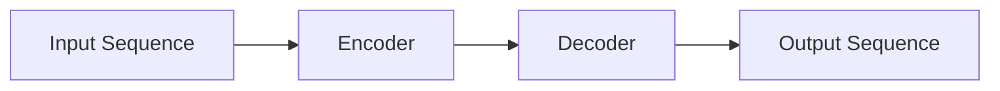

# GPT-3原理与代码实例讲解

## 1.背景介绍

### 1.1 人工智能的发展历程

人工智能(Artificial Intelligence, AI)是当代最具变革性的技术之一,它旨在赋予机器人或软件程序类似人类的认知能力,如学习、推理、感知、规划和问题解决等。人工智能的发展可以追溯到20世纪50年代,当时一些先驱者提出了"智能"的概念,并开始探索如何将人类智能赋予机器。

早期的人工智能系统主要专注于特定的任务,如棋类游戏、自动定理证明和专家系统等。随着计算能力和数据的不断增长,人工智能逐渐扩展到更广泛的领域,如计算机视觉、自然语言处理、机器学习和机器人技术等。

### 1.2 深度学习的兴起

21世纪初,深度学习(Deep Learning)的出现成为人工智能发展的重大突破。深度学习是机器学习的一种技术,它模仿人脑神经网络的结构和功能,通过训练多层神经网络来自动学习特征表示和建模复杂数据。

凭借强大的数据驱动能力,深度学习在多个领域取得了卓越的成就,如计算机视觉、自然语言处理、语音识别等,极大地推动了人工智能的发展。然而,传统的深度学习模型需要大量标注数据进行监督学习,这在某些领域存在瓶颈。

### 1.3 GPT-3的崛起

2020年,OpenAI发布了GPT-3(Generative Pre-trained Transformer 3),这是一种基于transformer架构的大型语言模型。GPT-3在海量文本数据上进行了自监督预训练,获得了强大的语言理解和生成能力。

GPT-3的出现开启了人工智能的新纪元,特别是在自然语言处理领域。它可以执行广泛的任务,如问答、文本生成、代码生成、翻译等,而无需针对每个任务进行大量的监督微调。GPT-3展现了令人惊叹的语言理解和推理能力,引起了学术界和工业界的广泛关注。

## 2.核心概念与联系

### 2.1 自然语言处理(NLP)

自然语言处理(Natural Language Processing, NLP)是人工智能的一个重要分支,旨在使计算机能够理解和生成人类语言。NLP技术广泛应用于机器翻译、问答系统、文本分类、信息检索、情感分析等领域。

传统的NLP任务通常需要设计复杂的特征工程和规则,并针对每个任务构建专门的模型。这种方法存在一些局限性,例如难以捕捉语言的复杂语义,并且需要大量的人工努力。

### 2.2 transformer架构

transformer是一种全新的神经网络架构,由谷歌的研究人员在2017年提出,旨在解决序列到序列(sequence-to-sequence)的建模问题。transformer完全基于注意力机制(attention mechanism),不依赖于循环神经网络(RNN)或卷积神经网络(CNN),从而克服了这些传统架构的一些局限性。

transformer架构在机器翻译、语音识别、图像分类等多个领域取得了优异的表现,成为自然语言处理和其他序列建模任务的主流架构。

### 2.3 预训练语言模型(Pre-trained Language Model)

预训练语言模型是一种新兴的NLP范式,旨在通过在大量无标注文本数据上进行自监督预训练,获得通用的语言表示能力。预训练模型可以捕捉语言的丰富语义和上下文信息,为下游的NLP任务提供强大的语言理解和生成能力。

预训练语言模型的核心思想是:首先在海量文本数据上进行自监督预训练,学习通用的语言表示;然后针对特定的NLP任务,通过少量的监督微调(fine-tuning),即可快速获得出色的性能。这种范式大大降低了对大量标注数据的需求,显著提高了模型的泛化能力。

### 2.4 GPT-3与预训练语言模型

GPT-3是基于transformer架构的大型预训练语言模型,由OpenAI开发。它在超过4亿个网络文本数据上进行了自监督预训练,获得了强大的语言理解和生成能力。

与之前的预训练语言模型相比,GPT-3的规模和能力都有了质的飞跃。它包含1750亿个参数,是当时最大的语言模型。GPT-3展现出了令人惊叹的语言理解、推理和生成能力,可以执行广泛的NLP任务,如问答、文本生成、代码生成、翻译等,而无需针对每个任务进行大量的监督微调。

GPT-3的出现引发了人工智能界的热烈讨论和关注,被视为通向人工通用智能(Artificial General Intelligence, AGI)的一个重要里程碑。

## 3.核心算法原理具体操作步骤

### 3.1 transformer架构原理

transformer架构主要由编码器(encoder)和解码器(decoder)两个核心组件组成,如下图所示:

#### 3.1.1 编码器(Encoder)

编码器的主要作用是将输入序列映射为一系列连续的表示(continuous representations),这些表示捕捉了输入序列中每个位置的上下文信息。编码器由多个相同的层组成,每一层由两个子层构成:

1. **多头自注意力机制(Multi-Head Attention)**:这个子层对输入序列进行自注意力计算,捕捉不同位置之间的依赖关系。

2. **前馈神经网络(Feed-Forward Neural Network)**:这个子层对每个位置的表示进行非线性变换,以提供更加复杂的特征表示。

#### 3.1.2 解码器(Decoder)

解码器的作用是根据编码器的输出表示和输入序列,生成目标输出序列。与编码器类似,解码器也由多个相同的层组成,每一层由三个子层构成:

1. **掩码多头自注意力机制(Masked Multi-Head Attention)**:这个子层对已生成的输出序列进行自注意力计算,但会掩码未来的位置,以保证模型的自回归属性。

2. **编码器-解码器注意力机制(Encoder-Decoder Attention)**:这个子层计算解码器的表示与编码器的表示之间的注意力,以捕捉输入和输出序列之间的依赖关系。

3. **前馈神经网络(Feed-Forward Neural Network)**:与编码器中的子层相同,对每个位置的表示进行非线性变换。

通过上述层次结构,transformer架构可以有效地捕捉长距离依赖关系,并基于注意力机制进行并行计算,从而提高了模型的性能和训练效率。

### 3.2 GPT-3预训练过程

GPT-3的预训练过程采用了自监督学习(Self-Supervised Learning)的方式,通过掩码语言模型(Masked Language Modeling, MLM)和下一句预测(Next Sentence Prediction, NSP)两个任务,在大量文本数据上学习通用的语言表示。

#### 3.2.1 掩码语言模型(MLM)

在MLM任务中,模型需要预测被掩码的单词。具体操作步骤如下:

1. 从训练语料库中随机采样一个序列(如一个句子或一段文本)。
2. 在序列中随机选择15%的单词位置,并用特殊的[MASK]标记替换这些单词。
3. 将掩码后的序列输入到transformer模型中,模型需要预测被掩码的单词。
4. 计算模型预测结果与真实单词之间的交叉熵损失,并通过反向传播算法更新模型参数。

通过MLM任务,模型可以学习到单词与上下文之间的关系,从而获得强大的语言理解能力。

#### 3.2.2 下一句预测(NSP)

在NSP任务中,模型需要判断两个句子是否相关和连贯。具体操作步骤如下:

1. 从训练语料库中随机采样两个句子A和B。
2. 以50%的概率将A和B连接成一个序列,或者随机交换A和B的顺序,构成一个不连贯的序列。
3. 在序列开头添加一个特殊标记[CLS],用于表示这个序列的分类标签。
4. 将构建的序列输入到transformer模型中,模型需要预测[CLS]标记处的分类标签,即判断这两个句子是否连贯。
5. 计算模型预测结果与真实标签之间的交叉熵损失,并通过反向传播算法更新模型参数。

通过NSP任务,模型可以学习到句子与句子之间的关系,从而获得更好的语义理解能力。

在GPT-3的预训练过程中,MLM和NSP两个任务被同时使用,以学习更加丰富和通用的语言表示。预训练采用了自回归(auto-regressive)的方式,即每个位置的单词都依赖于之前所有位置的单词,这使得模型可以更好地捕捉语言的顺序性和上下文信息。

### 3.3 GPT-3微调过程

GPT-3预训练后获得了强大的语言理解和生成能力,但要将其应用于特定的NLP任务,仍需要进行少量的监督微调(fine-tuning)。微调过程的具体步骤如下:

1. **准备微调数据**:根据目标NLP任务,准备相应的标注数据集,如问答数据集、文本分类数据集等。
2. **数据预处理**:将数据集转换为transformer模型可接受的格式,例如将输入序列和目标序列用特殊标记(如[CLS]和[SEP])分隔开。
3. **设置微调超参数**:根据任务的特点,设置合适的微调超参数,如学习率、批量大小、训练轮数等。
4. **微调模型**:将预训练的GPT-3模型加载到训练管道中,使用准备好的数据集和超参数进行监督微调。在微调过程中,只需要对模型的部分参数进行更新,而保留大部分预训练参数不变。
5. **模型评估**:在验证集上评估微调后的模型性能,根据具体任务选择合适的评估指标,如精确率、召回率、F1分数等。
6. **模型部署**:如果模型性能满足要求,即可将微调后的模型部署到生产环境中,用于实际的NLP应用。

通过少量的监督微调,GPT-3可以快速适应特定的NLP任务,而无需从头开始训练整个模型。这种预训练加微调的范式大大提高了模型的泛化能力和训练效率,成为当前NLP领域的主流方法。

## 4.数学模型和公式详细讲解

在transformer架构和GPT-3模型中,涉及到了多种数学模型和公式,包括注意力机制、位置编码、层归一化等。下面我们将详细讲解其中的一些核心公式。

### 4.1 注意力机制(Attention Mechanism)

注意力机制是transformer架构的核心部分,它允许模型在编码和解码时动态地关注输入序列的不同部分,从而捕捉长距离依赖关系。

#### 4.1.1 缩放点积注意力(Scaled Dot-Product Attention)

缩放点积注意力是transformer中使用的基本注意力机制,它的计算公式如下:

$$\text{Attention}(Q, K, V) = \text{softmax}\left(\frac{QK^T}{\sqrt{d_k}}\right)V$$

其中:

- $Q$ 是查询矩阵(Query Matrix)
- $K$ 是键矩阵(Key Matrix)
- $V$ 是值矩阵(Value Matrix)
- $d_k$ 是键的维度大小

该公式的计算过程如下:

1. 计算查询矩阵 $Q$ 与键矩阵 $K$ 的点积,得到一个注意力分数矩阵 $QK^T$。
2. 将注意力分数矩阵除以缩放因子 $\sqrt{d_k}$,以避免较大的点积值导致softmax函数的梯度过小。
3. 对缩放后的注意力分数矩阵应用softmax函数,得到注意力权重矩阵。
4. 将注意力权重矩阵与值矩阵 $V$ 相乘,得到加权后的值矩阵,即注意力的输出。

通过这种方式,注意力机