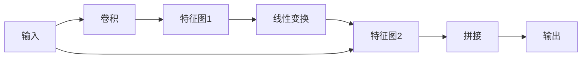

# GhostNet+对抗训练:提高模型鲁棒性的新方案

作者：禅与计算机程序设计艺术

## 1. 背景介绍

### 1.1 深度学习模型的脆弱性问题

近年来，深度学习模型在计算机视觉、自然语言处理等领域取得了巨大的成功。然而，研究表明，深度学习模型容易受到对抗样本的攻击。对抗样本是指在原始样本中添加微小的扰动，使得模型对其进行错误分类的样本。这些扰动通常难以被人眼察觉，但却可以轻易地欺骗深度学习模型。

### 1.2 对抗训练：增强模型鲁棒性的有效方法

为了提高深度学习模型的鲁棒性，对抗训练应运而生。对抗训练的基本思想是在训练过程中，将对抗样本加入训练集，并引导模型对这些样本进行正确分类。通过这种方式，模型可以学习到对抗样本的特征，从而提高对对抗攻击的抵抗能力。

### 1.3 GhostNet：轻量级卷积神经网络

GhostNet 是一种轻量级的卷积神经网络架构，其设计目标是在保持高性能的同时，显著减少模型的参数量和计算量。GhostNet 的核心思想是利用线性变换来生成特征图，而不是传统的卷积操作。这种方法可以有效地减少模型的计算复杂度，同时保持较高的准确率。

### 1.4 本文的研究目标

本文旨在研究 GhostNet 与对抗训练相结合，以提高模型鲁棒性的新方案。具体而言，我们将 GhostNet 作为基础模型，并结合对抗训练技术，探索如何构建更加鲁棒的轻量级深度学习模型。

## 2. 核心概念与联系

### 2.1 GhostNet

#### 2.1.1 Ghost 模块

GhostNet 的核心组件是 Ghost 模块，其结构如下图所示：



Ghost 模块首先使用一个普通的卷积层对输入特征图进行处理，得到一组特征图。然后，利用一系列廉价的线性变换操作，对这些特征图进行扩展，生成更多的特征图。最后，将所有特征图拼接在一起，作为 Ghost 模块的输出。

#### 2.1.2 GhostNet 架构

GhostNet 的整体架构与 MobileNetV3 类似，主要由一系列 Ghost 瓶颈模块组成。Ghost 瓶颈模块是 Ghost 模块的变体，其结构如下图所示：

```mermaid
graph LR
    输入 --> 点卷积 --> Ghost 模块 --> 点卷积 --> 输出
    输入 --> -------------------------> 输出
```

Ghost 瓶颈模块首先使用一个点卷积层对输入特征图进行降维，然后使用 Ghost 模块进行特征提取，最后使用另一个点卷积层进行升维。

### 2.2 对抗训练

#### 2.2.1 对抗样本生成

对抗样本的生成方法有很多种，其中最常用的是基于梯度的攻击方法，例如 FGSM、PGD 等。这些方法的基本思想是计算损失函数关于输入样本的梯度，并根据梯度方向对输入样本进行微调，以最大化损失函数的值。

#### 2.2.2 对抗训练过程

对抗训练的过程可以简单概括如下：

1. 对每个训练样本，生成对应的对抗样本。
2. 将原始样本和对抗样本一起输入模型进行训练。
3. 使用交叉熵损失函数计算模型对所有样本的预测误差。
4. 根据误差反向传播更新模型参数。

### 2.3 GhostNet+对抗训练

本文提出的 GhostNet+对抗训练方案，即将 GhostNet 作为基础模型，并结合对抗训练技术，以提高模型的鲁棒性。具体而言，我们将在训练 GhostNet 模型时，使用对抗样本生成方法生成对抗样本，并将对抗样本加入训练集，以增强模型对对抗攻击的抵抗能力。

## 3. 核心算法原理具体操作步骤

### 3.1 GhostNet 模型构建

首先，我们需要构建一个 GhostNet 模型。可以使用 TensorFlow 或 PyTorch 等深度学习框架来实现。

**代码示例 (PyTorch):**

```python
import torch
import torch.nn as nn

class GhostModule(nn.Module):
    def __init__(self, inp, oup, kernel_size=1, ratio=2, dw_size=3, stride=1, relu=True):
        super(GhostModule, self).__init__()
        self.oup = oup
        init_channels = math.ceil(oup / ratio)
        new_channels = init_channels *