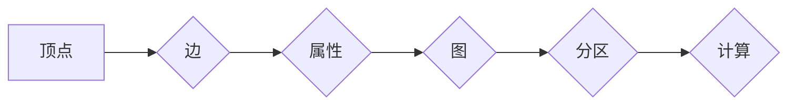

## 1. 背景介绍

### 1.1 大数据时代的图计算

随着互联网和移动设备的普及，数据规模呈爆炸式增长，其中包含大量的关联数据，如社交网络、电子商务交易、交通流量等。为了有效地分析和利用这些关联数据，图计算应运而生。图计算是一种以图为抽象模型，利用图论算法进行数据分析和挖掘的技术。

### 1.2 分布式图计算框架的兴起

传统的图计算框架往往难以处理海量数据，因此分布式图计算框架应运而生。这些框架利用分布式计算的优势，将图数据和计算任务分配到多个节点上并行处理，从而实现高效的图计算。

### 1.3 GraphX：Spark生态圈的图计算引擎

GraphX 是 Apache Spark 生态圈中的一个分布式图计算框架，它继承了 Spark 的高效性和可扩展性，并提供了丰富的图算法和操作接口。GraphX 能够处理数十亿级别的顶点和边，并支持多种图算法，如 PageRank、最短路径、连通分量等。

## 2. 核心概念与联系

### 2.1 图的表示

GraphX 中的图由顶点和边组成。

*   **顶点（Vertex）**:  图中的实体，可以表示用户、商品、网页等。每个顶点都有一个唯一的 ID。
*   **边（Edge）**:  连接两个顶点的关系，可以表示用户之间的关注关系、商品之间的购买关系、网页之间的链接关系等。每条边都有一个源顶点 ID 和一个目标顶点 ID。

### 2.2 属性图

GraphX 支持属性图，即顶点和边可以携带属性。

*   **顶点属性**:  描述顶点的特征，如用户的年龄、性别、职业等。
*   **边属性**:  描述边的特征，如用户之间的关注时间、商品之间的购买数量、网页之间的链接类型等。

### 2.3 图的存储

GraphX 将图数据存储在分布式文件系统（如 HDFS）中，并使用 RDD 进行数据管理。

*   **顶点 RDD**:  存储图的顶点信息，每个元素是一个顶点 ID 和其属性。
*   **边 RDD**:  存储图的边信息，每个元素是一个源顶点 ID、目标顶点 ID 和边的属性。

### 2.4 图的划分

为了实现分布式计算，GraphX 将图数据划分为多个分区，每个分区由多个顶点和边组成。

### 2.5 图的计算

GraphX 提供了丰富的图算法和操作接口，用于对图数据进行分析和挖掘。

*   **结构化操作**:  如获取邻居顶点、计算顶点的度等。
*   **图算法**:  如 PageRank、最短路径、连通分量等。

## 3. 核心算法原理具体操作步骤

### 3.1 PageRank算法

PageRank 算法用于衡量网页的重要性。其基本思想是：一个网页的重要性与其链接的网页的重要性之和成正比。

#### 3.1.1 算法步骤

1.  初始化所有网页的 PageRank 值为 1/N，其中 N 为网页总数。
2.  迭代计算每个网页的 PageRank 值：
    *   对于每个网页，将其 PageRank 值平均分配给其链接的网页。
    *   将所有网页接收到的 PageRank 值求和，并乘以阻尼系数（通常为 0.85）。
    *   将结果加上一个常数项（(1 - 阻尼系数) / N）。
3.  重复步骤 2，直到 PageRank 值收敛。

#### 3.1.2 GraphX实现

```scala
// 创建图
val graph = Graph(vertices, edges)

// 运行 PageRank 算法
val ranks = graph.pageRank(0.0001).vertices

// 打印结果
ranks.foreach(println)
```

### 3.2 最短路径算法

最短路径算法用于计算图中两个顶点之间的最短路径。

#### 3.2.1 算法步骤

1.  初始化起始顶点的距离为 0，其他顶点的距离为无穷大。
2.  将起始顶点加入队列。
3.  循环执行以下操作，直到队列为空：
    *   从队列中取出一个顶点。
    *   遍历该顶点的邻居顶点。
    *   如果邻居顶点的距离大于当前顶点的距离加上边的权重，则更新邻居顶点的距离。
    *   将邻居顶点加入队列。

#### 3.2.2 GraphX实现

```scala
// 创建图
val graph = Graph(vertices, edges)

// 运行最短路径算法
val shortestPaths = graph.shortestPaths.landmarks(Seq(startVertexId)).run()

// 打印结果
shortestPaths.vertices.foreach(println)
```

### 3.3 连通分量算法

连通分量算法用于将图划分为多个连通子图。

#### 3.3.1 算法步骤

1.  初始化每个顶点所属的连通分量 ID 为其自身 ID。
2.  迭代执行以下操作，直到连通分量 ID 不再变化：
    *   对于每条边，将源顶点和目标顶点所属的连通分量 ID 更新为较小的 ID。

#### 3.3.2 GraphX实现

```scala
// 创建图
val graph = Graph(vertices, edges)

// 运行连通分量算法
val connectedComponents = graph.connectedComponents().vertices

// 打印结果
connectedComponents.foreach(println)
```

## 4. 数学模型和公式详细讲解举例说明

### 4.1 PageRank算法的数学模型

PageRank 算法的数学模型可以表示为以下公式：

$$
PR(p_i) = (1 - d) / N + d \sum_{p_j \in M(p_i)} PR(p_j) / L(p_j)
$$

其中：

*   $PR(p_i)$ 表示网页 $p_i$ 的 PageRank 值。
*   $d$ 表示阻尼系数，通常为 0.85。
*   $N$ 表示网页总数。
*   $M(p_i)$ 表示链接到网页 $p_i$ 的网页集合。
*   $L(p_j)$ 表示网页 $p_j$ 的出链数量。

### 4.2 最短路径算法的数学模型

最短路径算法的数学模型可以表示为以下公式：

$$
dist(v) = \min_{u \in N(v)} \{dist(u) + w(u, v)\}
$$

其中：

*   $dist(v)$ 表示顶点 $v$ 到起始顶点的距离。
*   $N(v)$ 表示顶点 $v$ 的邻居顶点集合。
*   $w(u, v)$ 表示顶点 $u$ 到顶点 $v$ 的边的权重。

### 4.3 连通分量算法的数学模型

连通分量算法的数学模型可以表示为以下公式：

$$
CC(v) = \min\{CC(u), CC(v)\}
$$

其中：

*   $CC(v)$ 表示顶点 $v$ 所属的连通分量 ID。
*   $u$ 表示与顶点 $v$ 相邻的顶点。

## 5. 项目实践：代码实例和详细解释说明

### 5.1 社交网络分析

#### 5.1.1 数据准备

```scala
// 创建顶点 RDD
val users = sc.parallelize(Array(
  (1L, ("Alice", 28)),
  (2L, ("Bob", 27)),
  (3L, ("Charlie", 29)),
  (4L, ("David", 26)),
  (5L, ("Eve", 25))
))

// 创建边 RDD
val relationships = sc.parallelize(Array(
  Edge(1L, 2L, "friend"),
  Edge(2L, 3L, "friend"),
  Edge(3L, 4L, "friend"),
  Edge(4L, 5L, "friend"),
  Edge(5L, 1L, "friend")
))

// 创建图
val graph = Graph(users, relationships)
```

#### 5.1.2 PageRank分析

```scala
// 运行 PageRank 算法
val ranks = graph.pageRank(0.0001).vertices

// 打印结果
ranks.foreach(println)
```

#### 5.1.3 最短路径分析

```scala
// 运行最短路径算法
val shortestPaths = graph.shortestPaths.landmarks(Seq(1L)).run()

// 打印结果
shortestPaths.vertices.foreach(println)
```

#### 5.1.4 连通分量分析

```scala
// 运行连通分量算法
val connectedComponents = graph.connectedComponents().vertices

// 打印结果
connectedComponents.foreach(println)
```

### 5.2 电商推荐系统

#### 5.2.1 数据准备

```scala
// 创建顶点 RDD
val products = sc.parallelize(Array(
  (1L, ("iPhone", "Electronics")),
  (2L, ("MacBook Pro", "Electronics")),
  (3L, ("Kindle", "Books")),
  (4L, ("The Lord of the Rings", "Books")),
  (5L, ("Harry Potter", "Books"))
))

// 创建边 RDD
val purchases = sc.parallelize(Array(
  Edge(1L, 2L, 1),
  Edge(2L, 3L, 1),
  Edge(3L, 4L, 1),
  Edge(4L, 5L, 1),
  Edge(5L, 1L, 1)
))

// 创建图
val graph = Graph(products, purchases)
```

#### 5.2.2 商品推荐

```scala
// 获取用户的购买历史
val userPurchases = graph.edges.filter(_.srcId == userId).map(_.dstId)

// 获取用户购买过的商品的邻居商品
val recommendedProducts = graph.collectNeighborIds(EdgeDirection.Out).lookup(userPurchases.collect(): _*)

// 打印结果
recommendedProducts.foreach(println)
```

## 6. 工具和资源推荐

*   **Apache Spark**:  GraphX 的底层计算引擎。
*   **Gephi**:  用于图数据可视化的工具。
*   **GraphFrames**:  Spark SQL 的图计算扩展。

## 7. 总结：未来发展趋势与挑战

### 7.1 图计算的未来发展趋势

*   **图数据库**:  专门用于存储和查询图数据的数据库。
*   **图神经网络**:  将图计算与深度学习相结合，用于解决更复杂的图分析问题。
*   **实时图计算**:  支持实时图数据分析和挖掘。

### 7.2 图计算面临的挑战

*   **数据规模**:  图数据规模不断增长，对图计算框架的可扩展性提出了更高的要求。
*   **算法效率**:  图算法的效率是图计算的关键，需要不断优化算法和框架。
*   **应用场景**:  图计算的应用场景不断扩展，需要开发更丰富的图算法和工具。

## 8. 附录：常见问题与解答

### 8.1 GraphX 和 GraphFrames 的区别

GraphX 是 Spark 的原生图计算框架，而 GraphFrames 是 Spark SQL 的图计算扩展。GraphFrames 提供了更方便的 API，并支持使用 SQL 查询图数据。

### 8.2 如何选择合适的图计算框架

选择图计算框架需要考虑以下因素：

*   数据规模
*   算法效率
*   应用场景
*   开发成本

### 8.3 如何学习图计算

学习图计算可以参考以下资源：

*   Apache Spark 官方文档
*   图计算书籍和论文
*   在线课程和教程

### 8.4 GraphX的核心概念 Mermaid流程图


