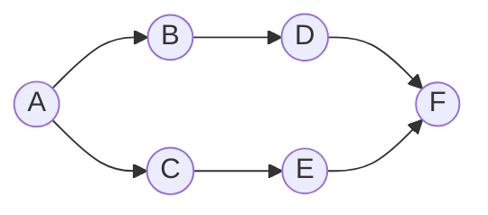

# GraphX在金融风险传染分析中的应用

## 1. 背景介绍

### 1.1 金融风险传染的重要性

在高度相互关联的现代金融体系中,风险传染是一个无法回避的问题。单一金融机构的风险可能会通过复杂的关联网络迅速蔓延,引发系统性金融危机。2008年的次贷危机就是一个典型的风险传染事件,当时美国次级房贷市场的风险通过金融机构之间的联系,在全球范围内造成了灾难性的后果。因此,有效识别和量化金融风险的传染路径和影响范围,对于维护金融体系的稳定性至关重要。

### 1.2 传统风险传染分析方法的局限性

传统的风险传染分析方法主要依赖于计量经济学模型,通过建立变量之间的线性或非线性回归关系来研究风险的扩散机制。然而,这些模型过于简单化,难以有效捕捉复杂金融网络中的高阶相互影响。此外,它们通常假设风险源是已知的,而在实际情况下,风险源的识别本身就是一个挑战。

## 2. 核心概念与联系

### 2.1 图理论在金融网络分析中的应用

图论为研究复杂网络提供了强有力的工具。在金融领域,我们可以将金融机构视为节点,机构之间的风险暴露关系视为边,从而构建一个加权有向图。这种表示方式能够自然地描述金融网络的拓扑结构,为进一步的网络分析奠定基础。

### 2.2 Apache GraphX简介

Apache GraphX是Spark生态系统中用于图形计算和图分析的核心组件。它提供了一种高效的分布式图数据结构,以及丰富的图算法库,支持大规模图数据的并行处理。GraphX的设计理念是将图计算视为数据流模型,通过函数式编程的方式进行图转换和图算法实现,从而实现高效、可扩展的图分析。

### 2.3 GraphX在金融风险传染分析中的作用

利用GraphX,我们可以构建分布式金融网络图,并应用各种图算法来分析风险的传播路径和影响范围。例如,可以使用PageRank算法识别潜在的系统重要性节点,使用最短路径算法追踪风险的传播链条,使用社区发现算法识别高风险群集等。与传统方法相比,GraphX提供了更加灵活和可扩展的解决方案,能够更好地捕捉金融网络的复杂拓扑结构和动态特征。

## 3. 核心算法原理具体操作步骤  

在金融风险传染分析中,GraphX提供了多种有用的图算法,下面我们将重点介绍PageRank算法和图社区发现算法的原理和实现步骤。

### 3.1 PageRank算法

PageRank算法最初被用于度量网页的重要性,在金融网络分析中,我们可以将其用于识别具有系统重要性的金融机构。算法的核心思想是,一个节点的重要性不仅取决于它自身,还取决于指向它的其他重要节点的数量和权重。具体地,PageRank算法通过迭代的方式计算每个节点的PR值,其中:

$$PR(u) = (1-d) + d * \sum_{v \in Bu}\frac{PR(v)}{L(v)}$$

其中:
- $PR(u)$表示节点u的PageRank值
- $Bu$是所有出边指向u的节点集合
- $L(v)$是节点v的出度数
- d是阻尼系数,通常取值0.85

在GraphX中,可以使用`staticRankOps.staticRankOuterJoinVertices()`运算符来并行计算PR值。具体步骤如下:

1. 从HDFS/对象存储读入金融机构节点数据和风险暴露边数据,构建图对象。
2. 调用`staticRankOps`的`staticRankOuterJoinVertices()`方法,传入图对象和阻尼系数,获得包含PR值的节点RDD。
3. 对PR值排序,筛选出前K个具有最高系统重要性的金融机构。

### 3.2 图社区发现算法

在金融网络中,通常存在一些节点之间关联更为紧密的群集,称为社区。识别这些高风险社区对于监控和控制风险传播至关重要。常用的社区发现算法包括标签传播算法(Label Propagation Algorithm,LPA)和Louvain算法等。

以LPA算法为例,其基于这样一个观察:在一个好的社区划分中,一个节点的大部分邻居应该属于同一个社区。因此,算法通过迭代地更新每个节点的标签(即社区ID),直至收敛。具体步骤如下:

1. 初始化:给每个节点指定一个唯一的标签
2. 迭代:每个节点更新其标签为其邻居标签中最多的那个
3. 重复步骤2,直至标签不再发生变化
4. 将具有相同标签的节点归为一个社区

在GraphX中,我们可以使用`LabelPropagation`运算符来实现LPA算法,代码示例如下:

```scala
import org.apache.spark.graphx.lib.LabelPropagation

val communities = LabelPropagation.run(graph, maxIter)
```

其中`maxIter`指定最大迭代次数。`communities`是一个RDD,每个元素是(节点ID,社区ID)对。通过分组统计,我们可以得到每个社区的规模,并识别出高风险社区群集。

## 4. 数学模型和公式详细讲解举例说明

在金融风险传染分析中,常常需要量化风险在网络中的扩散程度。下面我们将介绍一种基于网络拓扑结构的风险扩散模型,以及相关的数学公式推导。

### 4.1 风险传染模型

假设金融网络由N个节点(金融机构)组成,用$G=(V,E,W)$表示,其中$V=\{1,2,...,N\}$是节点集合,$E \subseteq V \times V$是边集合,表示机构之间的风险暴露关系,而$W$是边权重矩阵,其中$W_{ij}$表示i到j的风险暴露量。

进一步假设,每个节点i有一个内生风险值$R_i^0$,代表该机构自身的风险水平。通过网络连接,风险可以在节点之间传播。我们用$R_i^t$表示节点i在时刻t的风险水平,用$\lambda$表示风险在网络中的传播速率。于是,我们可以建立如下动态方程:

$$R_i^{t+1} = \lambda \sum_{j \in N_i} \frac{W_{ji}}{\sum_{k \in N_j}W_{jk}} R_j^t + (1 - \lambda)R_i^0$$

其中,$N_i$表示节点i的邻居节点集合。方程的含义是,节点i在t+1时刻的风险水平,等于其邻居机构传播过来的风险之和(第一项),加上自身原有风险的残余部分(第二项)。

这个模型可以用矩阵形式紧凑地表示为:

$$\vec{R}^{t+1} = \lambda \cdot \hat{W}^T \vec{R}^t + (1 - \lambda) \vec{R}^0$$

其中,$\vec{R}^t$是t时刻的风险状态向量,$\hat{W}$是归一化的权重矩阵,定义为:

$$\hat{W}_{ij} = \frac{W_{ij}}{\sum_{k \in N_j}W_{jk}}$$

通过迭代计算,我们可以模拟风险在网络中的动态传播过程。当$t \rightarrow \infty$时,方程将收敛到一个稳定的均衡状态:

$$\vec{R}^* = (1 - \lambda)(I - \lambda \hat{W}^T)^{-1} \vec{R}^0$$

其中$\vec{R}^*$给出了每个节点的最终风险水平。

利用这个模型,我们可以分析风险在网络中的扩散路径,识别出高风险节点和高风险社区,从而为金融监管和风险管理提供依据。

### 4.2 实例:6节点金融网络

为了帮助理解上述模型,我们构造一个简单的6节点金融网络示例,如下图所示:



假设各节点的初始内生风险值为:$\vec{R}^0 = (0.2, 0.1, 0.3, 0.05, 0.15, 0.1)^T$,边的权重矩阵为:

$$W = \begin{pmatrix}
0 & 0.4 & 0.6 & 0 & 0 & 0\\
0 & 0 & 0 & 1.0 & 0 & 0\\
0 & 0 & 0 & 0 & 0.7 & 0\\
0 & 0 & 0 & 0 & 0 & 0.3\\
0 & 0 & 0 & 0 & 0 & 0.8\\
0 & 0 & 0 & 0 & 0 & 0\\
\end{pmatrix}$$

取$\lambda = 0.6$,代入风险传播模型,经过数次迭代,我们得到均衡状态下各节点的最终风险水平为:

$$\vec{R}^* = (0.3307, 0.4228, 0.4447, 0.3098, 0.4982, 0.5468)^T$$

从结果可以看出,节点F承受了最大的风险传染影响,而最初风险值最高的节点C的风险也被大量传播到了其他节点。这说明了网络效应对风险扩散的重要影响。

通过这一实例,我们可以直观地理解风险传播模型的工作原理,并体会图分析方法在金融风险管理中的应用价值。在实际场景中,该模型可以扩展到大规模复杂网络,并结合机器学习等技术,为风险监测和决策提供有力支持。

## 5. 项目实践:代码实例和详细解释说明

为了实现上述风险传播模型,我们可以利用GraphX提供的图形计算功能。下面给出一个基于Spark的Scala代码示例:

```scala
import org.apache.spark.graphx._
import org.apache.spark.rdd.RDD

// 读入节点和边数据
val nodes: RDD[(VertexId, Double)] = sc.parallelize(
  List((1, 0.2), (2, 0.1), (3, 0.3), (4, 0.05), (5, 0.15), (6, 0.1))
)
val edges: RDD[Edge[Double]] = sc.parallelize(
  List(Edge(1, 2, 0.4), Edge(1, 3, 0.6), Edge(2, 4, 1.0), 
       Edge(3, 5, 0.7), Edge(4, 6, 0.3), Edge(5, 6, 0.8))
)

// 构建图
val graph = Graph(nodes, edges)

// 定义风险传播函数
def riskPropagation(tple: (VertexId, Double, Double), lambda: Double): (VertexId, Double) = {
  val id = tple._1
  val oldRisk = tple._2
  val neighborRisks = tple._3
  val newRisk = lambda * neighborRisks + (1 - lambda) * oldRisk
  (id, newRisk)
}

// 风险传播迭代
val lambda = 0.6
val staticRiskGraph = graph.staticRiskGraph
val initialRisks = staticRiskGraph.mapValues((id, attr) => attr)

val resultRisks = staticRiskGraph.iterateRisk(initialRisks, riskPropagation(_, lambda), numIter)

// 输出结果
resultRisks.vertices.foreach(println)
```

上述代码首先从外部数据源读入节点和边数据,构建一个图对象`graph`。然后定义了一个`riskPropagation`函数,用于实现风险传播模型中的动态方程。这个函数接受一个三元组`(vertexId, oldRisk, neighborRisks)`作为输入,计算出新的风险值`newRisk`。

接下来,代码调用`graph.staticRiskGraph`方法,将图对象转换为静态视图,以支持风险传播的并行计算。`mapValues`运算符将每个节点的初始风险值封装为`(id, risk)`对,得到`initialRisks` RDD。

`iterateRisk`方法是我们实现的一个自定义图算子,它以`initialRisks`为起点,在每一轮迭代中应用`riskPropagation`函数,直到达到收敂或达到最大迭代次数。最终的结果`resultRisks`包含了均衡