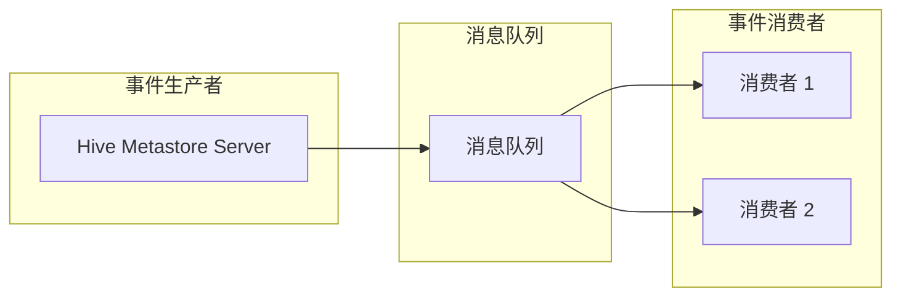
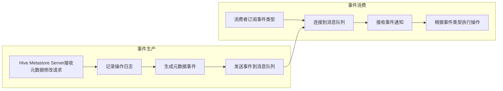

# HCatalogNotification机制内部原理深度剖析

## 1. 背景介绍

### 1.1. 数据仓库与元数据管理

随着大数据时代的到来，海量数据的存储、管理和分析成为了企业面临的巨大挑战。数据仓库作为一种集中式的数据存储和分析平台，应运而生。然而，随着数据规模的不断增长以及数据源的多样化，传统的数据库管理系统在处理大规模数据时显得力不从心。为了解决这些问题，Hadoop生态系统应运而生，其中Hive作为数据仓库的核心组件，提供了类似SQL的查询语言和数据仓库的结构化数据存储功能。

为了有效地管理和组织Hive中的海量数据，元数据管理至关重要。元数据是描述数据的数据，例如数据表的schema、数据文件的存储路径、数据的分区信息等。HCatalog作为Hadoop生态系统中的元数据管理服务，为Hive、Pig等数据处理框架提供了统一的元数据访问接口。

### 1.2. 数据变更捕获与通知机制

在数据仓库的应用场景中，数据的更新和变化是非常常见的操作。为了保证数据的一致性和实时性，及时捕获数据的变更并通知相关应用程序至关重要。传统的数据库管理系统通常采用基于日志或触发器的方式实现数据变更捕获和通知，但这些方法在处理大规模数据时效率低下，且难以扩展。

HCatalog Notification机制应运而生，它提供了一种高效、可靠、可扩展的数据变更捕获和通知解决方案，能够实时地将Hive元数据的变更信息通知给订阅者。

## 2. 核心概念与联系

### 2.1. 元数据事件

HCatalog Notification机制的核心概念是元数据事件。元数据事件是指对Hive元数据的任何更改，例如创建表、删除表、添加分区、删除分区、修改表属性等。HCatalog将这些元数据事件抽象为统一的数据结构，并通过消息队列将事件通知给订阅者。

### 2.2. 事件生产者与消费者

HCatalog Notification机制中包含两个主要角色：事件生产者和事件消费者。

- **事件生产者**：负责捕获Hive元数据的变更，并生成相应的元数据事件。在HCatalog中，Hive Metastore Server充当了事件生产者的角色。
- **事件消费者**：订阅感兴趣的元数据事件，并在接收到事件通知后执行相应的操作。例如，数据仓库的ETL任务可以订阅表创建事件，并在新的数据表创建后自动加载数据。

### 2.3. 消息队列

HCatalog Notification机制使用消息队列来传递元数据事件。消息队列是一种异步通信机制，它允许事件生产者将消息发送到队列中，而事件消费者则可以从队列中接收消息。消息队列解耦了事件生产者和事件消费者，使得它们可以独立地进行扩展和维护。

### 2.4. 核心概念关系图



## 3. 核心算法原理具体操作步骤

### 3.1. 事件生产流程

1. 当Hive Metastore Server接收到对Hive元数据的修改请求时，会首先记录操作日志，并将操作封装成一个元数据事件。
2. 事件生产者将元数据事件发送到预先配置好的消息队列中。

### 3.2. 事件消费流程

1. 事件消费者订阅感兴趣的元数据事件类型，并连接到消息队列。
2. 当消息队列中存在新的元数据事件时，事件消费者会接收到事件通知。
3. 事件消费者根据事件类型和内容执行相应的操作。

### 3.3. 核心算法流程图



## 4. 数学模型和公式详细讲解举例说明

HCatalog Notification机制本身不涉及复杂的数学模型和公式，其核心是基于消息队列的事件驱动架构。

## 5. 项目实践：代码实例和详细解释说明

### 5.1. 配置HCatalog Notification

1. 配置Hive Metastore Server，启用事件通知功能，并指定消息队列的连接信息。

```xml
<property>
  <name>hive.metastore.event.listeners</name>
  <value>org.apache.hive.metastore.events.EventMessageSender</value>
</property>
<property>
  <name>hive.metastore.messaging.queue</name>
  <value>jms:jndi:JmsXA</value>
</property>
```

2. 创建事件消费者应用程序，订阅感兴趣的元数据事件类型，并连接到消息队列。

```java
import org.apache.hadoop.hive.metastore.messaging.EventMessage;
import org.apache.hadoop.hive.metastore.messaging.MessageFactory;

// 创建消息工厂
MessageFactory msgFactory = MessageFactory.getInstance();

// 创建事件消费者
EventMessageConsumer consumer = msgFactory.getConsumer(props);

// 订阅事件类型
consumer.subscribe(Arrays.asList(EventType.CREATE_TABLE, EventType.DROP_TABLE));

// 处理事件
while (true) {
  EventMessage msg = consumer.receive();
  // 处理事件
}
```

### 5.2. 代码实例解释

- `hive.metastore.event.listeners`属性指定了事件监听器类，这里使用的是`org.apache.hive.metastore.events.EventMessageSender`，它负责将事件发送到消息队列。
- `hive.metastore.messaging.queue`属性指定了消息队列的连接信息。
- `MessageFactory`类用于创建消息生产者和消费者。
- `EventMessageConsumer`接口定义了事件消费者的操作方法。
- `subscribe()`方法用于订阅感兴趣的事件类型。
- `receive()`方法用于接收事件通知。

## 6. 实际应用场景

### 6.1. 数据同步

HCatalog Notification机制可以用于实时同步Hive元数据到其他系统，例如关系型数据库、搜索引擎等。当Hive中创建新的数据表或分区时，事件消费者可以将这些信息同步到其他系统，以保持数据的一致性。

### 6.2. 数据质量监控

HCatalog Notification机制可以用于监控Hive数据的质量。例如，可以订阅表更新事件，并在数据更新后对数据进行校验，如果发现数据质量问题，则可以及时发出告警。

### 6.3. ETL任务调度

HCatalog Notification机制可以用于触发ETL任务的执行。例如，可以订阅表创建事件，并在新的数据表创建后自动触发ETL任务，将数据加载到数据仓库中。

## 7. 总结：未来发展趋势与挑战

### 7.1. 未来发展趋势

- **更丰富的事件类型**: HCatalog Notification机制未来将会支持更丰富的事件类型，例如数据表schema变更、数据文件格式变更等。
- **更灵活的事件过滤**: 事件消费者可以根据更灵活的条件过滤感兴趣的事件，例如只订阅特定数据库或数据表的事件。
- **更完善的事件处理框架**: HCatalog Notification机制未来将会提供更完善的事件处理框架，例如事件路由、事件聚合等。

### 7.2. 面临挑战

- **消息队列的性能和可靠性**: HCatalog Notification机制依赖于消息队列来传递事件，因此消息队列的性能和可靠性至关重要。
- **事件处理的效率**: 当事件量很大时，事件处理的效率会成为一个瓶颈。
- **事件消费者的开发和维护**: 开发和维护事件消费者需要一定的技术门槛。

## 8. 附录：常见问题与解答

### 8.1. HCatalog Notification机制支持哪些消息队列？

HCatalog Notification机制支持多种消息队列，例如Apache Kafka、ActiveMQ、RabbitMQ等。

### 8.2. 如何保证事件消费的顺序性？

HCatalog Notification机制本身不保证事件消费的顺序性。如果需要保证事件消费的顺序性，可以使用消息队列提供的顺序消费功能。

### 8.3. 如何处理事件消费失败？

事件消费者可以捕获事件消费过程中的异常，并进行相应的处理，例如重试、记录日志等。