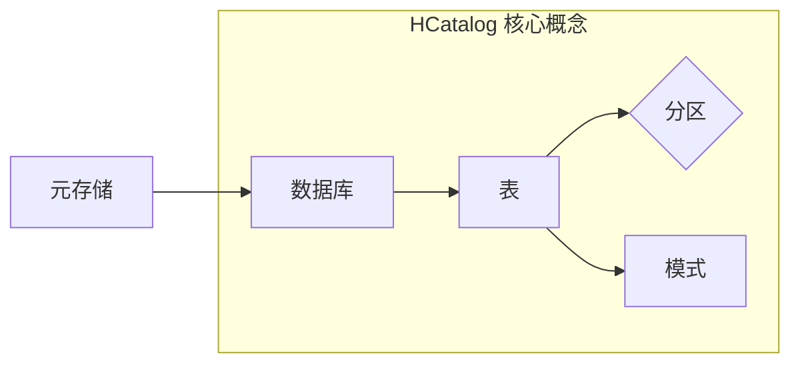

# HCatalog原理与代码实例讲解

作者：禅与计算机程序设计艺术

## 1. 背景介绍

### 1.1 大数据与元数据管理挑战

随着大数据时代的到来，企业积累的数据量呈爆炸式增长，数据种类繁多，存储位置分散。这给数据的管理和使用带来了巨大挑战，尤其是**元数据管理**方面。元数据是关于数据的数据，描述了数据的结构、含义、关系等信息，是数据价值挖掘和应用的基础。

在大数据环境下，元数据管理面临以下挑战：

* **海量数据规模**: 元数据的数量和复杂度随着数据量的增加而急剧增长，传统的元数据管理工具难以应对。
* **数据异构性**: 大数据环境中数据类型多样，包括结构化、半结构化和非结构化数据，存储在不同的系统中，如关系型数据库、NoSQL数据库、文件系统等。
* **数据变化频繁**: 大数据环境下数据更新速度快，元数据需要及时更新以保证其准确性和一致性。

### 1.2 HCatalog的诞生背景

为了解决上述挑战，Apache Hive项目推出了HCatalog，一个用于管理和访问存储在 Hadoop 集群中的数据的表和元数据信息的系统。HCatalog 提供了一个统一的接口，用于访问存储在不同数据存储系统中的元数据，并提供了一种将数据模式信息发布到 Pig 和 MapReduce 等数据处理工具的方法。

### 1.3 HCatalog 的优势和价值

HCatalog 的主要优势和价值包括：

* **统一的元数据管理**: HCatalog 提供了一个集中式存储库，用于存储和管理来自不同数据源的元数据，简化了元数据的管理和访问。
* **数据发现和访问**: HCatalog 提供了丰富的 API 和工具，方便用户发现和访问所需的数据，提高了数据的使用效率。
* **数据共享和重用**: HCatalog 允许用户共享和重用数据模式信息，避免了重复定义和维护数据模式，提高了数据开发效率。
* **与 Hadoop 生态系统集成**: HCatalog 与 Hadoop 生态系统中的其他工具和框架紧密集成，例如 Hive、Pig、MapReduce 等，方便用户在 Hadoop 平台上进行数据处理和分析。

## 2. 核心概念与联系

### 2.1 表 (Table)

HCatalog 中的表是逻辑概念，用于描述存储在 Hadoop 集群中的数据的结构和组织方式。一个 HCatalog 表可以映射到存储在不同数据存储系统中的数据，例如 Hive 表、HBase 表、RCFile 文件等。

### 2.2 分区 (Partition)

分区是 HCatalog 表的可选部分，用于将表数据划分成更小的逻辑单元。分区通常基于时间、地域等维度进行划分，可以提高数据查询效率。

### 2.3 模式 (Schema)

模式定义了 HCatalog 表中数据的结构，包括字段名称、数据类型、注释等信息。HCatalog 支持多种数据类型，例如 int、string、array、map 等。

### 2.4 数据库 (Database)

数据库是 HCatalog 中用于组织表的逻辑容器。一个 HCatalog 数据库可以包含多个 HCatalog 表。

### 2.5 元存储 (Metastore)

元存储是 HCatalog 的核心组件，用于存储和管理所有元数据信息，包括数据库、表、分区、模式等。HCatalog 默认使用 Apache Derby 数据库作为元存储，也可以配置使用 MySQL、PostgreSQL 等关系型数据库。

### 2.6 核心概念关系图



## 3. 核心算法原理具体操作步骤

### 3.1 创建数据库

```sql
CREATE DATABASE IF NOT EXISTS database_name;
```

### 3.2 创建表

```sql
CREATE TABLE IF NOT EXISTS database_name.table_name (
  column_name1 data_type1 COMMENT 'column_comment1',
  column_name2 data_type2 COMMENT 'column_comment2',
  ...
)
COMMENT 'table_comment'
PARTITIONED BY (
  partition_column1 data_type1,
  partition_column2 data_type2,
  ...
)
STORED AS file_format;
```

**参数说明:**

* `database_name`: 数据库名称
* `table_name`: 表名称
* `column_name`: 字段名称
* `data_type`: 数据类型
* `column_comment`: 字段注释
* `table_comment`: 表注释
* `partition_column`: 分区字段名称
* `file_format`: 文件格式，例如 TEXTFILE、ORC、PARQUET 等

**示例:**

```sql
CREATE TABLE IF NOT EXISTS my_database.my_table (
  id INT COMMENT '用户 ID',
  name STRING COMMENT '用户姓名',
  age INT COMMENT '用户年龄'
)
COMMENT '用户表'
PARTITIONED BY (
  dt STRING
)
STORED AS ORC;
```

### 3.3 添加分区

```sql
ALTER TABLE database_name.table_name ADD PARTITION (partition_spec);
```

**参数说明:**

* `partition_spec`: 分区规范，例如 `dt='2024-05-22'`

**示例:**

```sql
ALTER TABLE my_database.my_table ADD PARTITION (dt='2024-05-22');
```

### 3.4 查询元数据

```sql
SHOW DATABASES;
SHOW TABLES IN database_name;
DESCRIBE database_name.table_name;
SHOW PARTITIONS database_name.table_name;
```

## 4. 数学模型和公式详细讲解举例说明

HCatalog 中不涉及复杂的数学模型和公式。

## 5. 项目实践：代码实例和详细解释说明

### 5.1 Java API 示例

```java
import org.apache.hive.hcatalog.api.HCatClient;
import org.apache.hive.hcatalog.api.HCatCreateTableDesc;
import org.apache.hive.hcatalog.api.HCatSchema;
import org.apache.hive.hcatalog.common.HCatException;
import org.apache.hive.hcatalog.data.schema.HCatFieldSchema;

import java.util.ArrayList;
import java.util.List;

public class HCatalogExample {

    public static void main(String[] args) throws HCatException {
        // 创建 HCatalog 客户端
        HCatClient client = HCatClient.create(new HiveConf());

        // 创建数据库
        client.createDatabase("my_database", true);

        // 创建表模式
        List<HCatFieldSchema> columns = new ArrayList<>();
        columns.add(new HCatFieldSchema("id", HCatFieldSchema.Type.INT, "用户 ID"));
        columns.add(new HCatFieldSchema("name", HCatFieldSchema.Type.STRING, "用户姓名"));
        columns.add(new HCatFieldSchema("age", HCatFieldSchema.Type.INT, "用户年龄"));
        HCatSchema schema = new HCatSchema(columns);

        // 创建表
        HCatCreateTableDesc tableDesc = HCatCreateTableDesc
                .create("my_database", "my_table", schema)
                .comment("用户表")
                .partitionedBy("dt", HCatFieldSchema.Type.STRING)
                .storedAs("ORC")
                .build();
        client.createTable(tableDesc);

        // 关闭 HCatalog 客户端
        client.close();
    }
}
```

### 5.2 代码解释说明

* 首先，需要创建一个 HCatalog 客户端，用于连接到 HCatalog 服务。
* 然后，可以使用 `createDatabase` 方法创建数据库。
* 创建表需要定义表模式，包括字段名称、数据类型、注释等信息。
* 使用 `HCatCreateTableDesc` 类创建表描述，包括表名称、表模式、注释、分区信息、存储格式等信息。
* 最后，使用 `createTable` 方法创建表。

## 6. 实际应用场景

### 6.1 数据仓库和数据湖

HCatalog 可以作为数据仓库和数据湖的元数据管理工具，用于管理和访问存储在 Hadoop 集群中的各种数据。

### 6.2 ETL 和数据集成

HCatalog 可以与 ETL 工具和数据集成工具集成，用于元数据管理和数据 lineage 追踪。

### 6.3 数据治理和数据安全

HCatalog 可以与数据治理和数据安全工具集成，用于元数据管理、数据访问控制和数据审计。

## 7. 总结：未来发展趋势与挑战

### 7.1 未来发展趋势

* **云原生元数据管理**: 随着云计算的普及，HCatalog 需要支持云原生环境下的元数据管理，例如对象存储、容器化部署等。
* **机器学习和人工智能**: HCatalog 可以与机器学习和人工智能工具集成，用于特征工程、模型训练和模型部署等方面的元数据管理。
* **数据血缘和数据溯源**: 数据血缘和数据溯源是数据治理的重要方面，HCatalog 需要提供更强大的数据 lineage 追踪功能。

### 7.2 面临挑战

* **性能和可扩展性**: 随着数据量的增加，HCatalog 需要不断提升性能和可扩展性，以应对海量元数据的管理和访问需求。
* **安全性**: 元数据包含敏感信息，HCatalog 需要提供完善的安全机制，以保护元数据的安全。
* **易用性**: HCatalog 需要提供更友好的用户界面和 API，降低用户使用门槛。

## 8. 附录：常见问题与解答

### 8.1 HCatalog 和 Hive Metastore 的区别是什么？

Hive Metastore 是 Hive 的元数据存储组件，而 HCatalog 是一个独立的元数据管理系统，可以管理来自不同数据源的元数据，包括 Hive Metastore。

### 8.2 HCatalog 支持哪些数据存储格式？

HCatalog 支持多种数据存储格式，包括 TEXTFILE、ORC、PARQUET、AVRO 等。

### 8.3 如何查看 HCatalog 表的模式信息？

可以使用 `DESCRIBE` 命令查看 HCatalog 表的模式信息，例如：

```sql
DESCRIBE my_database.my_table;
```
