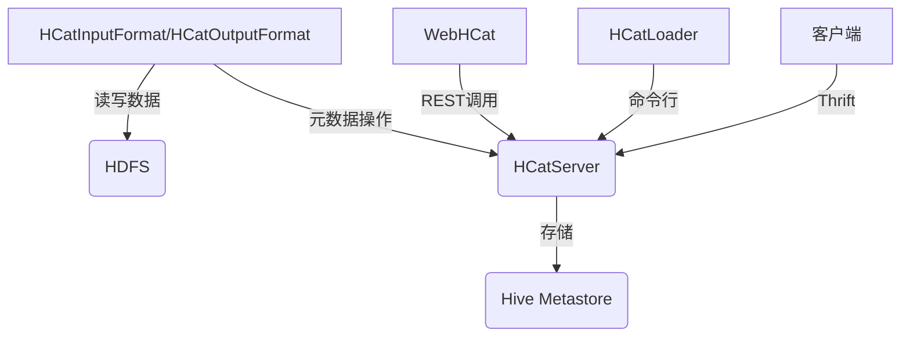

# HCatalog在云环境中的部署与应用

## 1.背景介绍

### 1.1 大数据时代的数据管理挑战

随着大数据时代的到来,传统的数据管理方式面临着巨大挑战。海量的结构化和非结构化数据的快速增长,以及来自不同数据源的数据需要被集中管理和分析。这对数据存储、数据共享和数据治理提出了新的需求。

### 1.2 Apache Hive与HCatalog

Apache Hive作为构建于Hadoop之上的数据仓库基础工具,为结构化数据分析提供了SQL类查询能力。然而,Hive的元数据存储在Hive内部,缺乏与其他数据处理系统的互操作性。

HCatalog应运而生,作为Hive的元数据服务层,允许不同的数据处理系统读写相同的数据集,并共享统一的元数据。它将Hive的元数据抽象成了表和分区,提供了RESTful API和命令行工具,使得外部系统能够轻松地集成Hive的元数据服务。

### 1.3 云环境的数据处理需求

在云计算环境中,数据处理系统需要具备可伸缩性、高可用性和成本效益等特点。HCatalog作为Hive的元数据服务层,可以帮助实现跨云环境的数据共享和集成,满足云计算场景下的数据管理需求。

## 2.核心概念与联系  

### 2.1 HCatalog架构

HCatalog由以下几个核心组件组成:

- **HCatInputFormat/HCatOutputFormat**: 用于从HCatalog读写数据的InputFormat和OutputFormat实现。
- **WebHCat**: HCatalog的REST服务,提供对元数据的CRUD操作。
- **HCatLoader**: 命令行工具,用于创建和管理HCatalog表。
- **HCatServer**: HCatalog的RPC服务器,支持Thrift协议。
- **HCatMetadataServerProtocol**: 客户端与HCatServer通信的协议。
- **HCatalogMetastoreSupportUtilities**: 提供了一些工具类,用于迁移和升级元数据。



### 2.2 HCatalog与Hive的关系

HCatalog并不是替代Hive,而是作为其元数据服务层,使Hive的元数据能够被其他系统共享和访问。HCatalog与Hive的关系如下:

- HCatalog使用Hive的MetaStore作为后端存储,存储表和分区的元数据。
- HCatalog提供RESTful API和命令行工具,使外部系统能够访问Hive的元数据。
- HCatalog读写数据时,使用HCatInputFormat和HCatOutputFormat与HDFS交互,而不直接与Hive交互。

通过HCatalog,Hive的元数据服务被解耦和抽象出来,促进了数据生态系统的互操作性。

## 3.核心算法原理具体操作步骤

HCatalog的核心算法和操作步骤包括以下几个方面:

### 3.1 表和分区的元数据管理

HCatalog将Hive的表和分区元数据抽象为一组RESTful资源,支持创建、读取、更新和删除(CRUD)操作。以下是相关的API和命令行工具:

1. **创建表和分区**

   - REST API: `POST /tables` 和 `POST /tables/{table}/partitions`
   - 命令行: `hcat -c create_table ...` 和 `hcat -c add_partition ...`

2. **读取表和分区元数据**

   - REST API: `GET /tables/{table}` 和 `GET /tables/{table}/partitions`
   - 命令行: `hcat -c show_table ...` 和 `hcat -c list_partitions ...`

3. **更新表和分区**

   - REST API: `PUT /tables/{table}` 和 `PUT /tables/{table}/partitions/{partition_spec}`
   - 命令行: `hcat -c alter_table ...` 和 `hcat -c alter_partition ...`

4. **删除表和分区**

   - REST API: `DELETE /tables/{table}` 和 `DELETE /tables/{table}/partitions/{partition_spec}`
   - 命令行: `hcat -c drop_table ...` 和 `hcat -c drop_partition ...`

这些API和命令行工具允许外部系统对HCatalog中的表和分区进行完整的生命周期管理。

### 3.2 数据读写

HCatalog通过HCatInputFormat和HCatOutputFormat实现了与HDFS的数据读写交互,其核心算法步骤如下:

1. **获取元数据**: 根据表名和分区过滤条件,从HCatalog Server获取相应的表和分区元数据。

2. **构建InputSplit**: 根据元数据中的文件路径和文件格式,构建InputSplit列表,用于并行读取数据。

3. **读取数据**: 每个MapReduce任务根据自己的InputSplit,从HDFS读取相应的数据块。

4. **解析数据格式**: 根据元数据中指定的数据格式(TextFile、SequenceFile等),解析原始数据到记录(record)对象。

5. **应用自定义代码**: 用户可以提供自定义的Mapper、Reducer等代码,对解析后的记录对象进行进一步处理。

6. **输出数据**: 如果是输出操作,HCatOutputFormat会根据元数据中的输出路径和格式,将处理后的数据写入HDFS。

通过这些步骤,HCatalog实现了与HDFS的无缝数据读写集成,并利用了MapReduce的并行处理能力。

## 4.数学模型和公式详细讲解举例说明

在大数据处理中,数学模型和公式通常用于描述和优化数据分布、数据分区和任务调度等方面。HCatalog作为元数据服务层,主要关注元数据管理,但也需要一些数学模型来支持分区策略和数据局部性优化。

### 4.1 分区策略

分区是将表按某些列的值进行逻辑分组,每个分组称为一个分区。合理的分区策略可以提高查询效率。HCatalog支持多种分区策略,包括:

- **范围分区(Range Partitioning)**: 按某个列的值范围划分,如按年份划分 (year <= 2010, 2010 < year <= 2015, ...)

- **哈希分区(Hash Partitioning)**: 根据某个列的哈希值进行分区,通常用于实现负载均衡。

- **列表分区(List Partitioning)**: 按某个列的枚举值进行分区,如按国家/地区划分。

假设我们有一个表存储网站访问日志,按天进行范围分区。设$n$为分区数量, $d_i$为第$i$天的记录数,则第$i$个分区中记录数可表示为:

$$r_i = \sum_{j=1}^{d_i} x_j$$

其中$x_j$为第$j$条记录的大小(字节数)。我们的目标是使各分区的记录数尽量平衡,即最小化目标函数:

$$\min \sum_{i=1}^{n}(r_i - \overline{r})^2$$

其中$\overline{r} = \frac{1}{n}\sum_{i=1}^{n}r_i$为所有分区记录数的平均值。

通过优化分区策略,可以提高查询效率,因为查询时可以跳过不相关的分区,只扫描必要的分区数据。

### 4.2 数据局部性优化

在分布式系统中,无法避免的网络开销会影响整体性能。因此,充分利用数据局部性非常重要。HCatalog通过元数据管理,可以优化作业的数据局部性。

假设有$m$个MapReduce作业,每个作业$j$由$k_j$个Map任务组成,且第$i$个Map任务需要处理$s_{ij}$个数据块。令$x_{ij}$为0-1变量,表示第$i$个Map任务是否就近读取了相应的数据块。我们的目标是最大化总的数据局部性:

$$\max \sum_{j=1}^{m}\sum_{i=1}^{k_j}s_{ij}x_{ij}$$

约束条件为:

- 每个Map任务至多读取一个数据块: $\sum_{j=1}^{m}x_{ij}\leq 1$
- 每个数据块至多被一个Map任务读取: $\sum_{i=1}^{k_j}x_{ij}\leq 1$

通过构建这个整数线性规划模型,并结合启发式算法求解,HCatalog可以优化作业的数据局部性,从而提高整体性能。

## 5.项目实践:代码实例和详细解释说明

为了更好地理解HCatalog的使用,我们将通过一个实际项目案例,演示如何在云环境中部署和使用HCatalog。

### 5.1 环境准备

我们将在AWS EMR(Elastic MapReduce)上部署一个Hadoop集群,其中包含Hive和HCatalog组件。

1. **创建EMR集群**

   使用AWS管理控制台或CLI创建一个EMR集群,选择合适的EC2实例类型和数量。启用Hive和HCatalog组件。

2. **配置HDFS**

   连接到EMR集群的主节点,创建HDFS目录用于存储数据,并设置合适的权限。

   ```bash
   hadoop fs -mkdir /user/hive/warehouse
   hadoop fs -chmod 777 /user/hive/warehouse
   ```

3. **启动HCatalog服务**

   在主节点上启动HCatalog的REST和Thrift服务。

   ```bash
   sudo /home/hadoop/lib/hcatalog/sbin/webhcat_server.sh start
   sudo /home/hadoop/lib/hcatalog/sbin/hcatserver.sh start
   ```

### 5.2 创建HCatalog表

现在,我们将使用HCatLoader命令行工具在HCatalog中创建一个表。

```bash
hcat -c create_table sales_record \
  -d '{"name": "Sales Records", "comment": "Online sales data"}' \
  -r '{"inputFormat": "org.apache.hadoop.mapred.TextInputFormat", \
        "outputFormat": "org.apache.hadoop.hive.ql.io.HiveIgnoreKeyTextOutputFormat", \
        "serdeClass": "org.apache.hadoop.hive.serde2.lazy.LazySimpleSerDe", \
        "serdeProps": {"field.delim": ",", "serialization.format": ","}
       }' \
  -f '{"cols": [{"name": "txn_id", "type": "string"}, \
                {"name": "product", "type": "string"}, \
                {"name": "amount", "type": "double"}, \
                {"name": "purchase_date", "type": "string"}], \
       "partitionedBy": [{"name": "year", "type": "int"}, \
                         {"name": "month", "type": "int"}, \
                         {"name": "day", "type": "int"}]}' \
  -p '{"location": "hdfs:///user/hive/warehouse/sales_record", \
        "inputFormat": "org.apache.hadoop.mapred.TextInputFormat", \
        "outputFormat": "org.apache.hadoop.hive.ql.io.HiveIgnoreKeyTextOutputFormat"}'
```

上面的命令创建了一个名为`sales_record`的表,包含4个列:`txn_id`、`product`、`amount`和`purchase_date`。该表按年、月、日三级分区存储,数据格式为CSV。

我们可以使用`hcat -c show_table sales_record`命令查看表的详细元数据。

### 5.3 加载数据到HCatalog表

接下来,我们将一些样本数据加载到新创建的表中。

1. **准备样本数据**

   在本地创建一个`sales_data.csv`文件,包含如下数据:

   ```
   1001,Product1,19.99,2022-06-15
   1002,Product2,29.99,2022-06-16
   1003,Product1,14.99,2022-06-17
   ```

2. **上传数据到HDFS**

   使用`hadoop fs`命令将数据文件上传到HDFS:

   ```bash
   hadoop fs -put sales_data.csv /user/hive/warehouse/sales_record/year=2022/month=6/day=15
   ```

3. **添加分区元数据**

   由于我们上传的数据属于2022年6月15日这个分区,需要在HCatalog中添加相应的分区元数据:

   ```bash
   hcat -c add_partition sales_record '{"cols": ["2022", "6", "15"]}' \
     -d '{"location": "/user/hive/warehouse/sales_record/year=2022/month=6/day=15"}'
   ```

现在,我们就可以在Hive中使用SQL查询这个HCatalog表了:

```sql
hive> SELECT * FROM sales_record WHERE year=