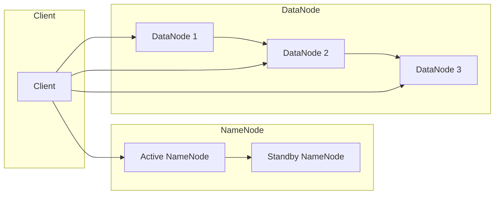

##  HDFS原理与代码实例讲解

## 1. 背景介绍

### 1.1 大数据时代的数据存储挑战

随着互联网和物联网技术的飞速发展，全球数据量呈爆炸式增长，传统的集中式存储系统已经无法满足海量数据的存储需求。主要挑战包括：

* **海量数据存储:**  传统存储系统难以处理PB级别甚至EB级别的数据。
* **高并发访问:**  数千甚至上万个节点需要同时访问数据，对存储系统的并发性能提出极高要求。
* **数据可靠性:**  如何保证海量数据在硬件故障的情况下不丢失，是分布式存储系统必须解决的关键问题。
* **可扩展性:**  随着数据量的不断增长，存储系统需要能够方便地进行扩展，以满足不断增长的存储需求。

### 1.2 分布式文件系统应运而生

为了应对上述挑战，分布式文件系统应运而生。分布式文件系统将数据分散存储在多台服务器上，通过网络进行数据交互，共同对外提供文件存储服务。与传统文件系统相比，分布式文件系统具有以下优势：

* **高容量、高扩展性:**  通过增加服务器节点，可以轻松扩展存储容量和性能。
* **高可用性:**  数据冗余存储在多个节点上，即使部分节点出现故障，也不会影响数据的完整性和可用性。
* **高并发访问:**  多个节点同时提供数据读写服务，可以有效提高数据访问的并发性能。
* **低成本:**  通常使用廉价的服务器构建分布式文件系统，可以有效降低存储成本。

### 1.3 HDFS: Hadoop分布式文件系统

HDFS (Hadoop Distributed File System) 是 Apache Hadoop 生态系统中的一个分布式文件系统，它专为存储超大文件而设计，并提供了高容错性和高吞吐量的数据访问能力。HDFS 是 Hadoop 生态系统的核心组件之一，被广泛应用于大数据存储、日志分析、机器学习等领域。

## 2. 核心概念与联系

### 2.1 HDFS 架构

HDFS 采用 Master/Slave 架构，主要由 NameNode、DataNode 和 Client 三种角色组成，如下图所示：



* **NameNode:** 
    * HDFS集群的主节点，负责管理文件系统的命名空间和数据块的映射关系。
    * 维护文件系统树及所有文件和目录的元数据，例如文件名称、权限、修改时间等。
    * 记录每个数据块在哪些 DataNode 上存储的信息。
    * 监控 DataNode 的健康状况，并进行数据块的复制和均衡。
* **DataNode:** 
    * HDFS集群的从节点，负责存储实际的数据块。
    * 接收来自 NameNode 的指令，对数据块进行读写操作。
    * 定期向 NameNode 发送心跳信息，报告自身状态和存储的数据块信息。
* **Client:** 
    * 访问 HDFS 的客户端应用程序。
    * 与 NameNode 交互，获取文件系统元数据和数据块位置信息。
    * 与 DataNode 交互，进行数据块的读写操作。

### 2.2 数据块

HDFS 将文件存储为数据块的集合，每个数据块默认大小为 128MB 或 256MB。将文件分割成数据块存储，可以有效提高数据读写效率和数据可靠性。

### 2.3 数据副本

为了保证数据可靠性，HDFS 对每个数据块都存储多个副本，副本数量可以通过配置文件进行配置，默认值为 3。

### 2.4 机架感知

HDFS 具有机架感知能力，可以将数据块副本尽可能地分布在不同的机架上，以提高数据可靠性和读写性能。

## 3. 核心算法原理具体操作步骤

### 3.1 文件写入流程

1. 客户端向 NameNode 发起文件写入请求。
2. NameNode 检查文件系统命名空间，如果文件不存在，则创建新的文件，并为文件分配数据块。
3. NameNode 根据数据块副本数量和机架感知策略，选择合适的 DataNode 节点，并将数据块写入路径返回给客户端。
4. 客户端将数据写入 DataNode 节点，数据写入采用管道的方式，依次写入第一个 DataNode 节点、第二个 DataNode 节点，直到所有副本写入完成。
5. 客户端向 NameNode 发送文件写入完成的确认信息。
6. NameNode 更新文件系统元数据，并将文件状态更新为已关闭。

### 3.2 文件读取流程

1. 客户端向 NameNode 发起文件读取请求。
2. NameNode 检查文件系统命名空间，如果文件存在，则返回文件元数据和数据块位置信息给客户端。
3. 客户端根据数据块位置信息，选择距离最近的 DataNode 节点，读取数据块。
4. 如果客户端在读取数据块的过程中出现错误，则会尝试从其他副本节点读取数据块。

## 4. 数学模型和公式详细讲解举例说明

HDFS 没有复杂的数学模型和公式，其核心原理是数据分块存储、数据副本机制和机架感知策略。

## 5. 项目实践：代码实例和详细解释说明

### 5.1 Java API 操作 HDFS

```java
import org.apache.hadoop.conf.Configuration;
import org.apache.hadoop.fs.FileSystem;
import org.apache.hadoop.fs.Path;

import java.io.IOException;

public class HdfsDemo {

    public static void main(String[] args) throws IOException {

        // 创建 HDFS 文件系统对象
        Configuration conf = new Configuration();
        conf.set("fs.defaultFS", "hdfs://namenode:9000");
        FileSystem fs = FileSystem.get(conf);

        // 创建 HDFS 文件
        Path filePath = new Path("/user/test/test.txt");
        if (!fs.exists(filePath)) {
            fs.createNewFile(filePath);
        }

        // 关闭 HDFS 文件系统对象
        fs.close();
    }
}
```

### 5.2 代码解释

* `Configuration` 类用于配置 HDFS 客户端，例如设置 NameNode 地址、用户名、密码等。
* `FileSystem` 类是 HDFS 文件系统的抽象类，提供了文件系统的各种操作方法，例如创建文件、删除文件、读取文件、写入文件等。
* `Path` 类表示 HDFS 文件系统的路径。

## 6. 实际应用场景

HDFS 被广泛应用于大数据存储、日志分析、机器学习等领域，例如：

* **电商平台:**  存储用户行为数据、商品信息、交易记录等海量数据。
* **社交网络:**  存储用户信息、好友关系、发布内容等海量数据。
* **搜索引擎:**  存储网页数据、索引数据、用户搜索记录等海量数据。
* **金融行业:**  存储交易数据、风险控制数据、客户信息等海量数据。

## 7. 总结：未来发展趋势与挑战

### 7.1 未来发展趋势

* **更高性能:**  随着硬件技术的不断发展，HDFS 的性能将会进一步提升，例如采用 NVMe SSD 存储数据、RDMA 网络传输数据等。
* **更强扩展性:**  HDFS 将会支持更大的集群规模，例如支持数十万台服务器节点的集群。
* **更智能化:**  HDFS 将会集成更多智能化功能，例如数据自动分级存储、数据预取等。

### 7.2 面临的挑战

* **数据安全:**  随着数据量的不断增长，数据安全问题日益突出，HDFS 需要提供更强大的数据安全保障机制。
* **数据一致性:**  HDFS 在保证高可用性的同时，还需要保证数据的一致性，这对于分布式系统来说是一个巨大的挑战。
* **生态兼容性:**  HDFS 需要与其他大数据生态系统组件保持良好的兼容性，例如 Spark、Flink 等。

## 8. 附录：常见问题与解答

### 8.1  HDFS 如何保证数据可靠性？

HDFS 通过数据副本机制和机架感知策略来保证数据可靠性。

### 8.2  HDFS 如何实现高可用性？

HDFS 通过 NameNode 的高可用性机制来实现高可用性。

### 8.3  HDFS 与本地文件系统有什么区别？

HDFS 是分布式文件系统，而本地文件系统是单机文件系统。