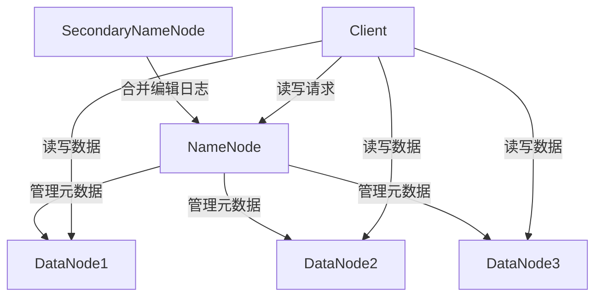
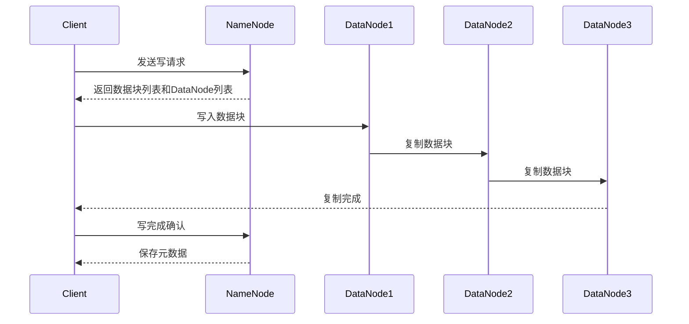
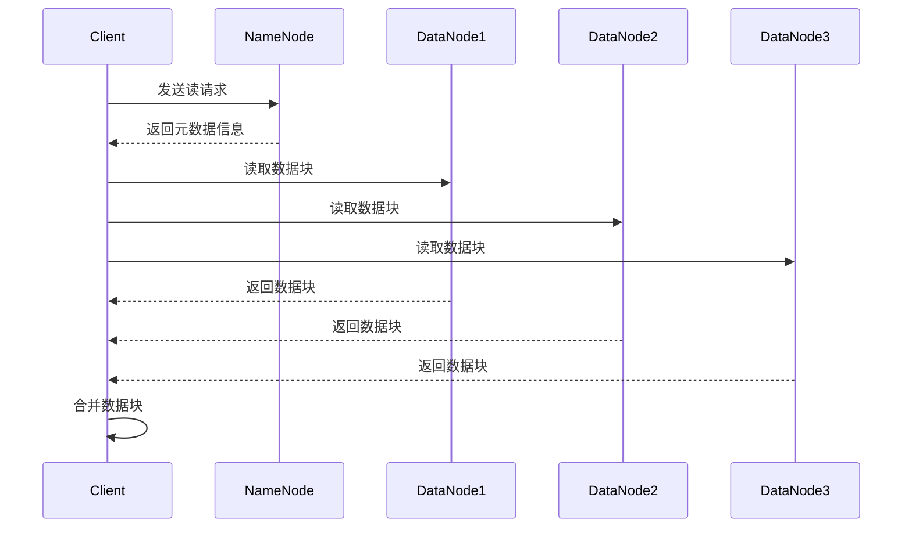

# HDFS原理与代码实例讲解

## 1.背景介绍

### 1.1 大数据时代的到来

随着互联网、移动互联网、物联网等技术的快速发展,数据量呈现出爆炸式增长。根据IDC(国际数据公司)的预测,到2025年,全球数据总量将达到175ZB(1ZB=1万亿TB)。传统的数据存储和处理系统已经无法满足如此庞大数据量的需求。因此,大数据技术应运而生,以解决海量数据存储和处理的挑战。

### 1.2 大数据处理的关键技术 - Hadoop

Apache Hadoop是一个开源的大数据分布式处理框架,由Yahoo公司开发并捐赠给Apache软件基金会。它具有可靠性高、扩展性强、容错性好、成本低等优点,可以在廉价的硬件集群上运行,能够处理PB级别的海量数据。Hadoop生态圈中最核心的两个组件是HDFS(Hadoop分布式文件系统)和MapReduce计算框架。

### 1.3 HDFS的重要性

HDFS(Hadoop Distributed File System)是Hadoop生态系统中最关键的组件之一。它是一个高度容错的分布式文件系统,设计用于在廉价的机器上运行,可以存储海量数据,并提供高吞吐量的数据访问。HDFS采用主从架构,由一个NameNode(namespace管理)和多个DataNode(存储数据块)组成。它通过数据块的复制和容错机制,可以在节点失败的情况下继续工作,从而保证数据的高可靠性。

## 2.核心概念与联系 

### 2.1 HDFS架构

HDFS采用主从架构,主要由以下三个组件组成:

1. **NameNode**:管理HDFS的命名空间和文件系统树,维护文件与数据块之间的映射关系。NameNode是HDFS的核心,存储文件系统的元数据。

2. **DataNode**:负责存储实际的数据块,执行数据块的读写操作。一个文件被拆分成一个或多个数据块,这些数据块分散存储在不同的DataNode上。

3. **SecondaryNameNode**:定期合并NameNode的编辑日志,防止NameNode元数据过于膨胀。

HDFS的架构设计使其具有高容错性、高吞吐量和可扩展性等特点。下面是HDFS的基本架构图:



### 2.2 HDFS文件读写过程

1. **写文件过程**:
   - 客户端向NameNode请求上传文件,NameNode检查目标文件是否存在
   - NameNode为文件分配一个数据块ID,并确定存储数据块的DataNode列表
   - 客户端按顺序向DataNode写入数据块,并在DataNode之间进行复制,默认复制3份
   - 写完后,客户端通知NameNode完成写操作,NameNode保存元数据

2. **读文件过程**:
   - 客户端向NameNode请求读取文件
   - NameNode获取文件的元数据,包括文件的数据块列表和DataNode位置信息
   - 客户端根据DataNode位置信息,并行从最近的DataNode读取数据
   - 客户端合并读取的数据块,最终获得完整文件

### 2.3 HDFS的数据复制策略

为了提高数据可靠性和容错性,HDFS采用数据块复制的机制。默认情况下,每个数据块会复制3份,分布在不同的DataNode上。HDFS的数据复制策略包括:

1. **机架感知复制策略**:HDFS会尽量将数据块复制到不同的机架上,以防一个机架发生故障导致数据丢失。
2. **带宽均衡复制策略**:HDFS会尽量选择网络带宽较大的DataNode作为复制目标,以提高复制效率。
3. **优先读本地策略**:客户端读取文件时,会优先从本地DataNode读取数据块,以减少网络传输开销。

通过合理的数据复制策略,HDFS可以提高数据的可靠性、可用性和读取性能。

## 3.核心算法原理具体操作步骤

### 3.1 HDFS写数据流程

1. 客户端向NameNode发送写请求,获取文件的数据块列表和DataNode列表。
2. 客户端按顺序向DataNode写入数据块,同时进行数据块复制。
3. 当数据块写入第一个DataNode后,立即开始复制到第二个DataNode。
4. 当数据块在第二个DataNode复制完成后,再复制到第三个DataNode。
5. 当数据块在第三个DataNode复制完成后,客户端向NameNode发送写完成确认。
6. NameNode记录文件的元数据信息,包括数据块列表和DataNode位置信息。



### 3.2 HDFS读数据流程

1. 客户端向NameNode发送读请求,获取文件的元数据信息。
2. NameNode返回文件的数据块列表和DataNode位置信息。
3. 客户端根据DataNode位置信息,并行从最近的DataNode读取数据块。
4. 客户端合并读取的数据块,获得完整文件。



### 3.3 HDFS容错机制

HDFS采用了多种容错机制,以保证数据的高可靠性:

1. **数据块复制**:每个数据块默认复制3份,分布在不同的DataNode上,即使部分DataNode发生故障,也不会导致数据丢失。
2. **机架感知复制策略**:数据块会复制到不同的机架上,以防一个机架发生故障导致数据丢失。
3. **心跳机制**:DataNode会定期向NameNode发送心跳信号,NameNode可以及时检测到DataNode的故障。
4. **数据块复制和重新复制**:当数据块的复制数量低于设定值时,NameNode会自动在其他DataNode上复制数据块,以维持数据的可靠性。
5. **NameNode元数据备份**:SecondaryNameNode会定期合并NameNode的编辑日志,生成NameNode元数据的检查点,以防止NameNode元数据过于膨胀。
6. **NameNode高可用**:Hadoop 2.x版本引入了NameNode高可用(HA)功能,通过配置两个冗余的NameNode实现热备份,提高了NameNode的可靠性。

通过以上机制,HDFS可以在节点发生故障时自动恢复,确保数据的高可靠性和可用性。

## 4.数学模型和公式详细讲解举例说明

在HDFS中,数据块的复制和容错策略涉及到一些数学模型和公式,用于计算数据可靠性、存储开销等指标。下面我们详细讲解这些模型和公式。

### 4.1 数据可靠性计算

假设一个数据块复制$n$份,每个DataNode的故障概率为$p$,那么数据块丢失的概率$P_{loss}$可以计算如下:

$$P_{loss} = p^n$$

例如,如果复制3份,每个DataNode的故障概率为0.1,那么数据块丢失的概率为:

$$P_{loss} = 0.1^3 = 0.001$$

也就是说,数据块丢失的概率仅为0.1%,可靠性很高。

### 4.2 存储开销计算

由于数据块复制会带来额外的存储开销,我们可以计算出存储开销率$R$:

$$R = \frac{n}{n-1}$$

其中$n$是数据块的复制份数。当$n=3$时,存储开销率为:

$$R = \frac{3}{3-1} = 1.5$$

也就是说,相比于没有复制的情况,存储开销增加了50%。

### 4.3 带宽开销计算

在写入数据块时,需要将数据传输到多个DataNode进行复制,这会带来额外的网络带宽开销。假设写入文件的大小为$S$,复制份数为$n$,那么总的带宽开销$B$为:

$$B = S \times (n-1)$$

例如,写入一个100GB的文件,复制3份,那么带宽开销为:

$$B = 100 \times (3-1) = 200GB$$

### 4.4 读取性能优化

为了提高读取性能,HDFS采用了一些优化策略,例如优先读本地策略。假设客户端读取文件的大小为$S$,本地读取的比例为$\alpha$,远程读取的比例为$1-\alpha$,本地读取带宽为$B_l$,远程读取带宽为$B_r$,那么读取所需的时间$T$可以计算如下:

$$T = \frac{S \times \alpha}{B_l} + \frac{S \times (1-\alpha)}{B_r}$$

通过优先读本地策略,可以提高读取性能。

以上是HDFS中一些常见的数学模型和公式,通过这些模型和公式,我们可以更好地理解HDFS的工作原理,并优化系统的性能和可靠性。

## 5.项目实践:代码实例和详细解释说明

为了更好地理解HDFS的工作原理,我们来看一些Java代码示例。这些示例涵盖了HDFS的基本操作,如创建目录、上传文件、读取文件等。

### 5.1 HDFS环境配置

首先,我们需要配置HDFS的开发环境。你可以在本地搭建一个伪分布式或完全分布式的HDFS集群,也可以使用云服务提供商(如AWS EMR)提供的HDFS集群。本示例假设你已经配置好了HDFS环境,并获取了HDFS的文件系统URI,例如`hdfs://localhost:9000`。

### 5.2 创建HDFS客户端实例

```java
import org.apache.hadoop.conf.Configuration;
import org.apache.hadoop.fs.FileSystem;
import org.apache.hadoop.fs.Path;

Configuration conf = new Configuration();
conf.set("fs.defaultFS", "hdfs://localhost:9000");
FileSystem hdfs = FileSystem.get(conf);
```

上述代码首先创建一个`Configuration`对象,用于配置HDFS的连接参数。然后,使用`FileSystem.get()`方法获取HDFS文件系统的实例。

### 5.3 创建目录

```java
Path dir = new Path("/user/example");
hdfs.mkdirs(dir);
```

上述代码创建了一个名为`/user/example`的目录。`Path`对象表示HDFS中的路径,`mkdirs()`方法用于创建目录及其父目录。

### 5.4 上传文件

```java
Path src = new Path("/local/data.txt");
Path dst = new Path("/user/example/data.txt");
hdfs.copyFromLocalFile(src, dst);
```

上述代码将本地文件`/local/data.txt`上传到HDFS的`/user/example/data.txt`路径。`copyFromLocalFile()`方法用于将本地文件复制到HDFS。

### 5.5 读取文件

```java
Path file = new Path("/user/example/data.txt");
FSDataInputStream in = hdfs.open(file);
// 读取文件内容
byte[] buffer = new byte[1024];
int bytesRead = 0;
while ((bytesRead = in.read(buffer)) > 0) {
    System.out.write(buffer, 0, bytesRead);
}
in.close();
```

上述代码读取HDFS上的`/user/example/data.txt`文件。首