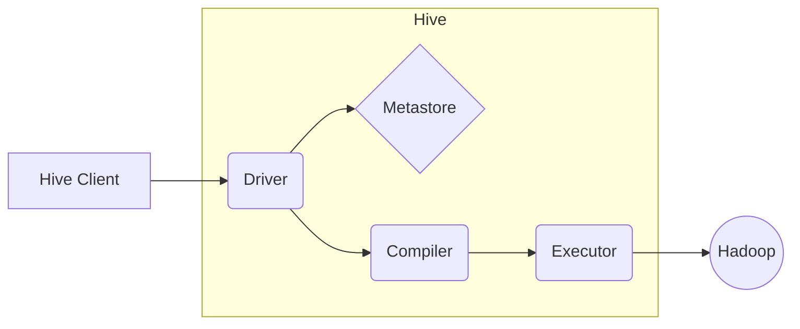

## 1. 背景介绍

### 1.1 大数据时代的数据处理挑战
随着互联网、移动互联网、物联网等技术的飞速发展，全球数据量呈爆炸式增长，人类社会已进入大数据时代。海量数据的存储、处理和分析成为企业和科研机构面临的巨大挑战。传统的数据库系统难以满足大数据处理的需求，主要体现在以下几个方面：

* **数据规模庞大:**  传统数据库难以处理PB级别甚至更大规模的数据。
* **数据类型多样:** 大数据通常包含结构化、半结构化和非结构化数据，而传统数据库主要针对结构化数据设计。
* **处理速度要求高:**  大数据分析需要对海量数据进行快速查询和计算，传统数据库难以满足实时性要求。

### 1.2 Hadoop生态系统与Hive的诞生
为了应对大数据的挑战，以Hadoop为代表的分布式计算框架应运而生。Hadoop生态系统提供了一套完整的解决方案，包括分布式存储（HDFS）、分布式计算（MapReduce、Spark）等组件。然而，Hadoop本身使用Java编写，对编程能力要求较高，不适合数据分析师等非专业程序员使用。

为了降低大数据处理的门槛，Facebook于2008年开发了Hive，并于2010年将其开源。Hive构建于Hadoop之上，提供了一种类似于SQL的查询语言——HiveQL，可以方便地对存储在HDFS上的海量数据进行查询和分析。

### 1.3 Hive的特点和优势
Hive作为Hadoop生态系统中的重要成员，具有以下特点和优势：

* **易用性:** HiveQL语法类似于SQL，易于学习和使用，降低了大数据处理的门槛。
* **可扩展性:** Hive可以运行在由成百上千台服务器组成的Hadoop集群上，能够处理PB级别甚至更大规模的数据。
* **高容错性:** Hive利用Hadoop的底层机制，具有良好的容错性，即使部分节点出现故障，也不会影响整体任务的执行。
* **丰富的功能:** Hive支持多种数据格式、数据类型和内置函数，可以满足各种数据分析需求。
* **活跃的社区:** Hive拥有庞大的用户群体和活跃的开源社区，可以获得丰富的文档、教程和技术支持。

## 2. 核心概念与联系

### 2.1 数据模型
Hive的数据模型主要包括以下几个核心概念：

* **表（Table）:**  Hive中的表类似于关系型数据库中的表，由行（Row）和列（Column）组成。
* **分区（Partition）:** 分区是将表的数据按照某个字段的值进行划分，可以提高查询效率。
* **桶（Bucket）:** 桶是将表的数据按照某个字段的哈希值进行划分，可以提高数据抽样和连接操作的效率。

### 2.2 数据类型
Hive支持多种数据类型，包括：

* **基本数据类型:**  如TINYINT、SMALLINT、INT、BIGINT、FLOAT、DOUBLE、STRING、BOOLEAN等。
* **复杂数据类型:**  如ARRAY、MAP、STRUCT等。

### 2.3 HiveQL语法
HiveQL语法类似于SQL，支持常见的查询语句，包括：

* **数据定义语言（DDL）:**  如CREATE TABLE、ALTER TABLE、DROP TABLE等。
* **数据操作语言（DML）:**  如INSERT INTO、LOAD DATA、SELECT、UPDATE、DELETE等。
* **数据控制语言（DCL）:**  如GRANT、REVOKE等。
* **查询语句:**  如SELECT、FROM、WHERE、GROUP BY、HAVING、ORDER BY、LIMIT等。

### 2.4 Hive架构
Hive的架构主要包括以下几个组件：

* **Hive Client:**  用户与Hive交互的接口，可以提交HiveQL语句。
* **Metastore:**  存储Hive元数据，如表结构、分区信息等。
* **Driver:**  接收HiveQL语句，将其解析成可执行计划。
* **Compiler:**  将可执行计划转换成MapReduce任务。
* **Executor:**  执行MapReduce任务。

### 2.5 Mermaid流程图



## 3. 核心算法原理具体操作步骤

### 3.1 查询执行流程
当用户提交一条HiveQL查询语句时，Hive会按照以下步骤执行查询：

1. **解析:**  Hive Driver接收HiveQL语句，并将其解析成抽象语法树（AST）。
2. **语义分析:**  Hive Driver对AST进行语义分析，检查语法错误和语义错误。
3. **逻辑计划生成:**  Hive Driver根据语义分析的结果生成逻辑执行计划。
4. **物理计划生成:**  Hive Compiler将逻辑执行计划转换成物理执行计划，选择合适的执行引擎（如MapReduce、Spark）。
5. **任务提交:**  Hive Executor将物理执行计划转换成MapReduce任务，并提交到Hadoop集群上执行。
6. **结果返回:**  Hive Driver将执行结果返回给Hive Client。

### 3.2 数据存储格式
Hive支持多种数据存储格式，常见的格式包括：

* **TEXTFILE:**  默认格式，以文本形式存储数据，每行一条记录，字段之间用分隔符分隔。
* **ORC:**  Optimized Row Columnar，一种列式存储格式，可以提高查询效率。
* **Parquet:**  一种列式存储格式，支持嵌套数据类型，可以与多种数据处理框架兼容。

### 3.3 数据压缩
Hive支持多种数据压缩算法，可以减少存储空间和网络传输量，常见的压缩算法包括：

* **GZIP:**  一种常用的压缩算法，压缩率较高。
* **Snappy:**  一种压缩速度较快的算法，压缩率相对较低。

## 4. 数学模型和公式详细讲解举例说明

### 4.1 数据倾斜问题
数据倾斜是指在进行数据处理时，某些值出现的频率远高于其他值，导致这些值所在的Reduce任务执行时间过长，成为性能瓶颈。

### 4.2 数据倾斜的解决方法
解决数据倾斜问题的方法主要包括：

* **预处理数据:**  对数据进行预处理，将倾斜的值进行拆分或组合。
* **调整参数:**  调整Hive的参数，如设置mapred.reduce.tasks、hive.skewjoin.key等。
* **使用其他工具:**  使用Spark等其他数据处理框架，可以更好地处理数据倾斜问题。

## 5. 项目实践：代码实例和详细解释说明

### 5.1 创建表
```sql
CREATE TABLE employees (
  id INT,
  name STRING,
  salary DOUBLE,
  department STRING
)
ROW FORMAT DELIMITED
FIELDS TERMINATED BY ','
STORED AS TEXTFILE;
```

### 5.2 加载数据
```sql
LOAD DATA LOCAL INPATH '/path/to/employees.csv' INTO TABLE employees;
```

### 5.3 查询数据
```sql
SELECT department, AVG(salary) AS avg_salary
FROM employees
GROUP BY department;
```

### 5.4 创建分区表
```sql
CREATE TABLE employees_partitioned (
  id INT,
  name STRING,
  salary DOUBLE
)
PARTITIONED BY (department STRING)
ROW FORMAT DELIMITED
FIELDS TERMINATED BY ','
STORED AS TEXTFILE;
```

### 5.5 加载数据到分区表
```sql
LOAD DATA LOCAL INPATH '/path/to/employees_it.csv' INTO TABLE employees_partitioned PARTITION (department='IT');
```

### 5.6 查询分区表
```sql
SELECT *
FROM employees_partitioned
WHERE department = 'IT';
```

## 6. 实际应用场景

### 6.1 数据仓库
Hive可以作为数据仓库的查询引擎，用于存储和分析海量数据。

### 6.2 日志分析
Hive可以用于分析网站和应用程序的日志数据，提取用户行为模式和系统性能指标。

### 6.3 机器学习
Hive可以用于准备机器学习模型的训练数据，例如进行数据清洗、特征提取等操作。

## 7. 总结：未来发展趋势与挑战

### 7.1 未来发展趋势
* **SQL on Anything:**  Hive将支持更多的数据源和数据格式，例如NoSQL数据库、JSON文件等。
* **更快的查询速度:**  Hive将继续优化查询引擎，提高查询速度，例如使用矢量化执行引擎、代码生成等技术。
* **更智能的优化器:**  Hive将使用更智能的优化器，自动选择最佳的执行计划，提高查询效率。

### 7.2 面临的挑战
* **与其他数据处理框架的集成:**  Hive需要与Spark、Flink等其他数据处理框架更好地集成，提供更完整的解决方案。
* **数据安全和隐私保护:**  随着数据量的增加，数据安全和隐私保护变得越来越重要，Hive需要提供更强大的安全机制。
* **人才缺口:**  Hive的开发和运维需要专业的技术人才，人才缺口是制约Hive发展的一个重要因素。

## 8. 附录：常见问题与解答

### 8.1 如何查看Hive的版本？
```
hive --version
```

### 8.2 如何查看Hive的配置参数？
```
hive -e 'SET;'
```

### 8.3 如何查看Hive的日志文件？
Hive的日志文件通常存储在`${HIVE_HOME}/logs`目录下。

### 8.4 如何解决Hive连接MySQL数据库失败的问题？
需要将MySQL的JDBC驱动程序jar包添加到Hive的classpath中。

### 8.5 如何解决Hive查询速度慢的问题？
可以尝试以下方法：

* 对数据进行分区或分桶。
* 使用ORC或Parquet等列式存储格式。
* 对数据进行压缩。
* 调整Hive的参数，如设置mapred.reduce.tasks、hive.skewjoin.key等。
* 使用Spark等其他数据处理框架。


## 9. 附录：参考资料

* [Apache Hive](https://hive.apache.org/)
* [HiveQL Language Manual](https://cwiki.apache.org/confluence/display/Hive/LanguageManual)
* [Hive Tutorial](https://www.tutorialspoint.com/hive/index.htm)