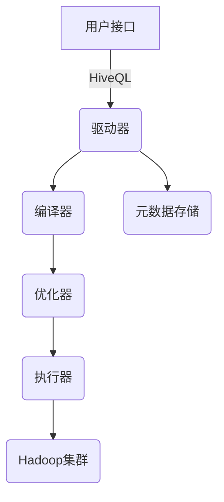
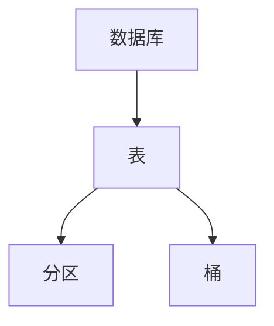
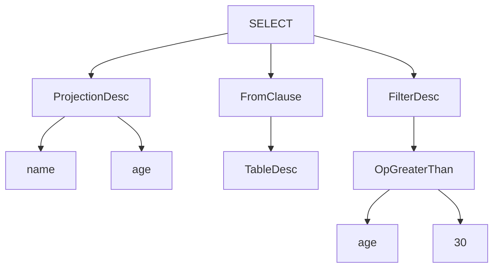

# Hive原理与代码实例讲解

## 1.背景介绍

Apache Hive是一个建立在Hadoop之上的数据仓库基础架构，它提供了一种类似SQL的查询语言HiveQL，使用户可以轻松地分析存储在Hadoop分布式文件系统(HDFS)中的大规模数据。Hive的出现解决了MapReduce编程复杂且效率低下的问题，使得数据分析人员无需直接编写MapReduce程序即可进行大数据查询和分析。

### 1.1 Hive的优势

- **SQL类查询语言**：Hive提供了类似SQL的查询语言HiveQL，使用户可以编写类似SQL的查询语句来进行数据分析，降低了编程门槛。
- **可扩展性**：Hive建立在Hadoop之上，因此可以充分利用Hadoop的可扩展性和容错性。随着数据量的增加，只需增加计算节点即可轻松扩展。
- **成本低廉**：Hive基于Hadoop，可以在廉价的硬件集群上运行，降低了数据分析的成本。
- **容错性**：Hive继承了Hadoop的容错特性，可以自动处理节点故障并重新调度任务。
- **多格式数据处理**：Hive可以处理多种格式的数据，如文本文件、SequenceFile、RCFile等。

### 1.2 Hive的应用场景

Hive非常适合用于离线数据分析场景，如网络日志分析、网站点击流分析、推荐系统等。对于需要低延迟响应的在线查询场景，Hive可能不太适合。

## 2.核心概念与联系

### 2.1 Hive的架构

Hive的架构主要包括以下几个核心组件：

1. **用户接口**：命令行接口(CLI)、JDBC/ODBC接口等，用于提交HiveQL查询语句。
2. **驱动器(Driver)**：将HiveQL语句转换为查询计划。
3. **编译器(Compiler)**：将查询计划转换为一系列MapReduce任务。
4. **优化器(Optimizer)**：优化查询计划以提高查询效率。
5. **执行器(Executor)**：在Hadoop集群上执行MapReduce任务。
6. **元数据存储(Metastore)**：存储Hive的元数据信息，如表、视图、分区等。

下图展示了Hive的整体架构:



### 2.2 Hive的数据模型

Hive中的数据模型主要包括以下几个概念：

1. **数据库(Database)**：Hive中的命名空间，用于存放表和视图。
2. **表(Table)**：表是Hive中存储数据的基本单元，每个表都有一个关联的数据文件。
3. **分区(Partition)**：表可以根据一个或多个列进行分区，分区可以提高查询效率。
4. **桶(Bucket)**：桶是对表进行hash分区的一种方式，可以提高join操作的效率。

下图展示了Hive的数据模型:



## 3.核心算法原理具体操作步骤

Hive的核心算法主要包括以下几个部分：

### 3.1 查询解析

当用户提交一个HiveQL查询语句时，Hive的驱动器首先会对查询语句进行解析，生成一个抽象语法树(AST)。

示例HiveQL语句:

```sql
SELECT name, age
FROM users
WHERE age > 30;
```

对应的AST结构如下:



### 3.2 查询优化

Hive的优化器会对AST进行一系列的优化操作，以提高查询效率。优化策略包括但不限于：

1. **投影列剪裁**：只读取查询需要的列，减少IO开销。
2. **分区剪裁**：根据查询条件只扫描需要的分区数据。
3. **常量折叠**：将表达式中的常量提前计算。
4. **谓词下推**：将查询条件下推到MapReduce任务中。
5. **Join重排序**：优化Join的执行顺序。

### 3.3 执行计划生成

经过优化后的AST会被编译器转换为一个执行计划，执行计划由一系列的MapReduce任务组成。每个MapReduce任务都会被分配给Hadoop集群中的TaskTracker进行执行。

示例执行计划:


上图展示了一个简单的查询执行计划，包括以下几个阶段:

1. **TableScan**：扫描表数据。
2. **FilterOperator**：过滤掉不满足条件的记录。
3. **SelectOperator**：选择需要的列。
4. **FileSinkOperator**：将结果写入文件。

## 4.数学模型和公式详细讲解举例说明

在Hive中，常见的数学模型和公式主要应用于以下几个场景:

### 4.1 数据采样

在处理大规模数据集时，常常需要先对数据进行采样以加快计算速度。Hive中可以使用以下公式来计算采样率:

$$
采样率 = \frac{期望采样数据量}{总数据量}
$$

示例:

```sql
-- 从users表中采样10%的数据
SELECT *
FROM users
TABLESAMPLE(10 PERCENT);
```

### 4.2 数据聚合

聚合函数是Hive中常用的数据分析工具，如`SUM`、`AVG`、`COUNT`等。其中`COUNT`函数可以使用以下公式计算:

$$
COUNT(x) = \sum_{i=1}^n \begin{cases}
1 & \text{if } x_i \text{ is not null} \\
0 & \text{if } x_i \text{ is null}
\end{cases}
$$

示例:

```sql
-- 计算users表中记录的总数
SELECT COUNT(*) FROM users;

-- 计算不同age的记录数
SELECT age, COUNT(*) AS count
FROM users
GROUP BY age;
```

### 4.3 相似度计算

在推荐系统等场景中，常需要计算两个向量之间的相似度。Hive中可以使用余弦相似度公式:

$$
\text{cos\_sim}(\vec{a}, \vec{b}) = \frac{\vec{a} \cdot \vec{b}}{|\vec{a}| \times |\vec{b}|}
$$

其中$\vec{a}$和$\vec{b}$分别表示两个向量，$\vec{a} \cdot \vec{b}$表示向量点积，$|\vec{a}|$和$|\vec{b}|$分别表示向量的模长。

示例:

```sql
-- 计算两个向量的余弦相似度
SELECT
    cos_similarity(
        array(1, 2, 3),
        array(4, 5, 6)
    );
```

上述查询会返回两个向量$(1, 2, 3)$和$(4, 5, 6)$的余弦相似度值。

## 4.项目实践：代码实例和详细解释说明

接下来我们通过一个实际的项目案例来展示如何使用Hive进行数据分析。我们将使用一个包含网站访问日志的数据集，并对其进行处理和分析。

### 4.1 数据准备

我们的示例数据集包含以下几个字段:

- `date`：访问日期
- `user_id`：访问用户ID
- `url`：访问URL
- `referer`：来源URL
- `ip`：访问IP地址

数据格式为纯文本，每行表示一条记录，字段之间用制表符(`\t`)分隔。

```
2023-05-01  1001    /index.html     http://www.google.com     10.0.0.1
2023-05-01  1002    /about.html     http://www.bing.com       10.0.0.2
2023-05-02  1001    /product.html   /index.html               10.0.0.1
2023-05-02  1003    /contact.html   http://www.yahoo.com      10.0.0.3
```

首先，我们需要在HDFS上创建一个目录来存放数据文件:

```bash
hdfs dfs -mkdir -p /user/hive/warehouse/logs
```

然后将数据文件上传到HDFS:

```bash
hdfs dfs -put access_logs.txt /user/hive/warehouse/logs/
```

### 4.2 创建Hive表

接下来，我们在Hive中创建一个表来映射上传的数据文件:

```sql
CREATE EXTERNAL TABLE access_logs (
    date STRING,
    user_id INT,
    url STRING,
    referer STRING,
    ip STRING
)
ROW FORMAT DELIMITED
FIELDS TERMINATED BY '\t'
LOCATION '/user/hive/warehouse/logs';
```

上述语句创建了一个外部表`access_logs`，表结构与数据文件字段一一对应。`ROW FORMAT DELIMITED`子句指定了数据文件的格式，`FIELDS TERMINATED BY '\t'`表示字段之间使用制表符分隔。`LOCATION`子句指定了数据文件在HDFS上的存储位置。

### 4.3 数据分析

接下来我们可以使用HiveQL对数据进行各种分析操作。

#### 4.3.1 统计每天的访问量

```sql
SELECT date, COUNT(*) AS visit_count
FROM access_logs
GROUP BY date;
```

上述查询会按照日期对访问记录进行分组，并计算每天的访问量。

#### 4.3.2 统计每个URL的访问量

```sql
SELECT url, COUNT(*) AS visit_count
FROM access_logs
GROUP BY url;
```

上述查询会按照URL对访问记录进行分组，并计算每个URL的访问量。

#### 4.3.3 统计每个用户的访问量

```sql
SELECT user_id, COUNT(*) AS visit_count
FROM access_logs
GROUP BY user_id;
```

上述查询会按照用户ID对访问记录进行分组，并计算每个用户的访问量。

#### 4.3.4 统计每个来源URL的访问量

```sql
SELECT referer, COUNT(*) AS visit_count
FROM access_logs
WHERE referer IS NOT NULL
GROUP BY referer;
```

上述查询会按照来源URL对访问记录进行分组，并计算每个来源URL的访问量。由于`referer`字段可能为空，因此我们添加了`WHERE`子句过滤掉空值。

#### 4.3.5 统计每个IP的访问量

```sql
SELECT ip, COUNT(*) AS visit_count
FROM access_logs
GROUP BY ip;
```

上述查询会按照IP地址对访问记录进行分组，并计算每个IP的访问量。

通过上述示例，我们可以看到Hive提供了类似SQL的查询语言，使得数据分析变得非常简单和高效。同时，Hive也支持更复杂的分析操作，如Join、Window函数等，可以满足各种数据分析需求。

## 5.实际应用场景

Hive作为一种大数据分析工具，在许多领域都有广泛的应用，下面列举了一些典型的应用场景:

### 5.1 网络日志分析

互联网公司通常会收集大量的网络日志数据，如用户访问日志、点击流日志等。使用Hive可以对这些海量日志数据进行高效的分析和挖掘，如统计网站流量、分析用户行为模式、发现热门页面等。

### 5.2 电商数据分析

在电商领域，Hive可以用于分析用户购买行为、交易数据、商品销售情况等。通过对这些数据的分析，可以发现潜在的商机，优化产品策略和营销活动。

### 5.3 金融风控

金融机构需要对大量的交易数据进行实时监控和分析，以发现可疑交易和潜在风险。Hive可以用于构建金融风控系统，对历史交易数据进行分析和建模，从而提高风险识别能力。

### 5.4 推荐系统

推荐系统需要对海量的用户行为数据进行分析，以挖掘用户偏好并给出个性化推荐。Hive可以用于处理这些用户数据，并与机器学习算法相结合，构建高效的推荐引擎。

### 5.5 广告投放优化

在互联网广告领域，Hive可以用于分析用户点击流数据、投放效果等，从而优化广告投放策略，提高广告的精准度和转化率。