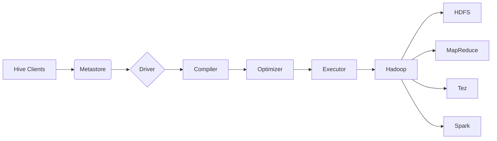

# Hive数据仓库原理与HQL代码实例讲解

作者：禅与计算机程序设计艺术

## 1. 背景介绍

### 1.1 大数据时代的数据存储与分析挑战

随着互联网、物联网等技术的快速发展，全球数据量呈爆炸式增长，传统的关系型数据库难以满足海量数据的存储和分析需求。大数据技术的出现为解决这些挑战提供了新的思路和方法。

### 1.2 Hive的诞生背景及优势

Hive诞生于Facebook，旨在解决海量结构化和半结构化数据的存储、查询和分析问题。作为基于Hadoop构建的数据仓库系统，Hive具有以下优势：

* **高可扩展性:** Hive可以运行在由数千台服务器组成的Hadoop集群上，轻松处理PB级别的数据。
* **低成本:** Hive基于开源的Hadoop生态系统构建，可以节省大量的硬件和软件成本。
* **易用性:** Hive提供类似SQL的查询语言HQL，易于学习和使用，降低了数据分析的门槛。
* **灵活性:** Hive支持多种数据格式，包括文本文件、CSV、JSON等，并可以与其他大数据工具集成使用。

### 1.3 Hive的应用场景

Hive广泛应用于各种数据分析场景，例如：

* **数据仓库:** 构建企业级数据仓库，用于存储和分析历史数据。
* **日志分析:** 分析海量日志数据，提取有价值的信息，例如用户行为、系统性能等。
* **ETL处理:** 从不同数据源中抽取、转换和加载数据到Hive中，进行数据清洗和整合。
* **机器学习:** 作为机器学习的数据预处理和特征工程平台。

## 2. 核心概念与联系

### 2.1 数据模型

#### 2.1.1 表(Table)

Hive中的表类似于关系型数据库中的表，由行和列组成。每行数据称为一条记录，每列数据称为一个字段。Hive支持多种数据类型，包括基本数据类型（例如INT、STRING、BOOLEAN）和复杂数据类型（例如ARRAY、MAP、STRUCT）。

#### 2.1.2 分区(Partition)

分区是将表水平划分为多个逻辑部分，每个分区对应于表中的一部分数据。分区可以根据数据的某个或多个字段进行划分，例如日期、地区等。分区可以提高查询效率，因为Hive只需要扫描与查询条件匹配的分区数据。

#### 2.1.3 桶(Bucket)

桶是将表的数据进一步划分为更小的逻辑单元，每个桶存储表中的一部分数据。桶可以根据数据的某个字段进行哈希划分，例如用户ID、商品ID等。桶可以提高查询效率，因为Hive只需要扫描与查询条件匹配的桶数据。

### 2.2 架构

#### 2.2.1 Hive架构图



#### 2.2.2 架构组件说明

* **Hive Clients:**  Hive客户端，用于连接Hive服务器并提交查询请求。
* **Metastore:**  元数据存储，存储Hive表的元数据信息，例如表名、列名、数据类型、分区信息等。
* **Driver:** 驱动程序，接收客户端的查询请求，并将其转换为可执行的计划。
* **Compiler:** 编译器，将HQL查询语句编译成可执行的计划。
* **Optimizer:** 优化器，对编译后的计划进行优化，例如选择合适的执行引擎、调整数据读取顺序等。
* **Executor:** 执行器，负责执行优化后的计划，并返回查询结果。
* **Hadoop:**  分布式计算框架，为Hive提供底层存储和计算资源。
* **HDFS:** Hadoop分布式文件系统，用于存储Hive表的数据文件。
* **MapReduce:** Hadoop的批处理计算引擎，可以用于执行Hive查询。
* **Tez:**  Hadoop的DAG（有向无环图）计算引擎，可以用于执行Hive查询。
* **Spark:**  内存计算框架，可以用于执行Hive查询。

## 3. 核心算法原理具体操作步骤

### 3.1 HQL查询执行流程

1. **解析:** Hive将HQL查询语句解析成抽象语法树(AST)。
2. **语义分析:** Hive对AST进行语义分析，例如检查表和列是否存在、数据类型是否匹配等。
3. **逻辑计划生成:** Hive根据语义分析结果生成逻辑执行计划，例如选择哪些表、连接哪些表、过滤哪些数据等。
4. **物理计划生成:** Hive根据逻辑执行计划生成物理执行计划，例如选择哪些执行引擎、如何分配计算资源等。
5. **执行:** Hive将物理执行计划提交给Hadoop集群执行，并返回查询结果。

### 3.2 数据存储格式

#### 3.2.1 TEXTFILE

TEXTFILE是Hive默认的数据存储格式，以文本文件的形式存储数据，每行数据对应一个记录，字段之间使用分隔符分隔。TEXTFILE格式简单易用，但存储空间占用较大，查询效率较低。

#### 3.2.2 ORC

ORC（Optimized Row Columnar）是一种列式存储格式，将数据按列存储，可以提高查询效率，并节省存储空间。ORC格式支持压缩、索引等特性，可以进一步提高查询性能。

#### 3.2.3 Parquet

Parquet是一种列式存储格式，与ORC格式类似，也支持压缩、索引等特性。Parquet格式是Hadoop生态系统中常用的数据存储格式，可以与其他大数据工具集成使用。

## 4. 数学模型和公式详细讲解举例说明

### 4.1 数据倾斜问题

数据倾斜是指在进行数据处理时，某些键值的数据量远远大于其他键值的数据量，导致这些键值的数据处理速度变慢，影响整体处理效率。

#### 4.1.1 数据倾斜的原因

* **数据分布不均:**  原始数据本身就存在数据倾斜。
* **数据连接操作:**  在进行数据连接操作时，如果连接键的数据分布不均，会导致数据倾斜。
* **分组聚合操作:**  在进行分组聚合操作时，如果分组键的数据分布不均，会导致数据倾斜。

#### 4.1.2 数据倾斜的解决方案

* **数据预处理:**  对原始数据进行预处理，例如对数据进行抽样、过滤、数据清洗等，尽量使数据分布均匀。
* **调整连接方式:**  对于数据连接操作，可以尝试使用其他连接方式，例如广播连接、排序合并连接等。
* **使用MapReduce combiner:**  对于分组聚合操作，可以使用MapReduce combiner在Map阶段进行局部聚合，减少数据传输量。
* **使用Spark broadcast join:**  对于数据连接操作，可以使用Spark broadcast join将小表广播到所有节点，避免数据倾斜。

### 4.2 数据压缩

数据压缩是指使用特定的算法对数据进行压缩，以减少数据存储空间和网络传输量。

#### 4.2.1 压缩算法

* **GZIP:**  一种常用的压缩算法，压缩率较高，但压缩速度较慢。
* **Snappy:**  一种压缩速度较快的压缩算法，压缩率相对较低。
* **LZO:**  一种压缩速度和压缩率都比较均衡的压缩算法。

#### 4.2.2 压缩选择

选择合适的压缩算法需要考虑以下因素：

* **压缩率:**  压缩率越高，节省的存储空间和网络传输量越多。
* **压缩速度:**  压缩速度越快，数据处理速度越快。
* **解压缩速度:**  解压缩速度越快，数据读取速度越快。

## 5. 项目实践：代码实例和详细解释说明

### 5.1 创建表

```sql
CREATE TABLE employees (
  id INT,
  name STRING,
  salary FLOAT,
  department STRING
)
ROW FORMAT DELIMITED
FIELDS TERMINATED BY ','
STORED AS TEXTFILE;
```

**解释:**

* `CREATE TABLE employees`: 创建名为 `employees` 的表。
* `id INT, name STRING, salary FLOAT, department STRING`: 定义表的列名和数据类型。
* `ROW FORMAT DELIMITED`: 指定行格式为分隔符分隔。
* `FIELDS TERMINATED BY ','`: 指定字段分隔符为逗号。
* `STORED AS TEXTFILE`: 指定数据存储格式为TEXTFILE。

### 5.2 加载数据

```sql
LOAD DATA LOCAL INPATH '/path/to/employees.csv' INTO TABLE employees;
```

**解释:**

* `LOAD DATA LOCAL INPATH '/path/to/employees.csv'`: 指定要加载的数据文件路径。
* `INTO TABLE employees`: 指定要将数据加载到哪个表。

### 5.3 查询数据

```sql
SELECT department, AVG(salary) AS avg_salary
FROM employees
GROUP BY department;
```

**解释:**

* `SELECT department, AVG(salary) AS avg_salary`: 查询每个部门的平均工资。
* `FROM employees`: 指定要查询的表。
* `GROUP BY department`: 按部门分组。

## 6. 实际应用场景

### 6.1 电商网站用户行为分析

**场景描述:**  分析电商网站用户的浏览、搜索、购买等行为，为用户推荐个性化商品，提高用户购买转化率。

**数据源:**  用户访问日志、用户注册信息、商品信息、订单信息等。

**Hive解决方案:**

1. 将数据源导入Hive表中。
2. 使用HQL对用户行为数据进行清洗、转换和分析。
3. 使用机器学习算法对用户行为进行建模，例如用户画像、商品推荐等。

### 6.2 金融风控系统

**场景描述:**  构建金融风控系统，识别和防范金融风险，例如欺诈交易、信用风险等。

**数据源:**  用户交易记录、用户身份信息、黑名单信息等。

**Hive解决方案:**

1. 将数据源导入Hive表中。
2. 使用HQL对交易数据进行实时监控和分析，例如识别异常交易、高风险用户等。
3. 使用机器学习算法构建风控模型，例如欺诈检测模型、信用评分模型等。

## 7. 工具和资源推荐

### 7.1 Hive工具

* **Hive Shell:**  Hive的命令行工具，用于连接Hive服务器并执行HQL查询语句。
* **Hive Web UI:**  Hive的Web界面，用于浏览Hive表、执行HQL查询语句、查看查询历史等。
* **Hue:**  Hadoop生态系统的Web UI工具，提供了Hive、Pig、Oozie等工具的图形化界面。

### 7.2 Hive学习资源

* **Apache Hive官网:** https://hive.apache.org/
* **Hive教程:** https://cwiki.apache.org/confluence/display/Hive/Tutorial
* **Hive书籍:** 《Hive编程指南》、《Hive权威指南》

## 8. 总结：未来发展趋势与挑战

### 8.1 未来发展趋势

* **云原生Hive:**  随着云计算的普及，Hive将更加云原生化，例如支持云存储、云计算资源等。
* **实时数据仓库:**  Hive将支持更加实时的数据处理和分析，例如使用Spark Streaming、Flink等实时计算引擎。
* **机器学习集成:**  Hive将更加紧密地与机器学习平台集成，例如支持TensorFlow、PyTorch等机器学习框架。

### 8.2 面临的挑战

* **性能优化:**  随着数据量的不断增长，Hive需要不断优化查询性能，以满足大规模数据分析的需求。
* **数据安全:**  Hive需要更加关注数据安全问题，例如数据加密、访问控制等。
* **生态系统发展:**  Hive需要与Hadoop生态系统中的其他工具更加紧密地集成，以构建更加完善的大数据解决方案。

## 9. 附录：常见问题与解答

### 9.1 Hive和关系型数据库的区别

| 特性       | Hive                      | 关系型数据库                |
| ---------- | -------------------------- | ---------------------------- |
| 数据规模     | PB级别                    | TB级别                      |
| 数据结构     | 结构化、半结构化数据       | 结构化数据                  |
| 查询语言     | HQL（类似SQL）           | SQL                        |
| 数据更新     | 不支持实时更新，支持批量更新 | 支持实时更新              |
| 数据一致性     | 最终一致性                  | 事务一致性                  |
| 查询性能     | 较低                      | 较高                        |

### 9.2 Hive数据倾斜的解决方法

* 数据预处理
* 调整连接方式
* 使用MapReduce combiner
* 使用Spark broadcast join

### 9.3 Hive数据压缩的选择

* GZIP
* Snappy
* LZO

选择合适的压缩算法需要考虑压缩率、压缩速度和解压缩速度。
