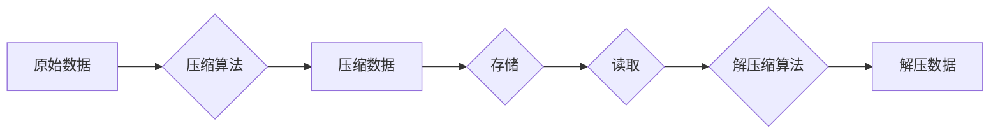

## 1. 背景介绍

### 1.1 大数据时代的存储挑战

随着互联网和物联网的蓬勃发展，全球数据量呈爆炸式增长，大数据时代已经到来。海量数据的存储和处理成为企业面临的巨大挑战之一。为了应对这一挑战，各种数据存储和处理技术应运而生，其中，Hadoop生态系统中的Hive数据仓库以其强大的数据处理能力和灵活的SQL查询语言成为大数据领域的佼佼者。

然而，Hive数据仓库在存储方面也面临着巨大的压力。Hive默认使用文本格式存储数据，这种格式占用空间大，查询效率低。为了解决这一问题，Hive提供了多种数据压缩技术，可以有效地减少数据存储空间，提高查询效率。

### 1.2 数据压缩的意义

数据压缩是指在不丢失有用信息的前提下，通过减少数据冗余来减小数据存储空间的技术。数据压缩具有以下几个重要意义：

* **节省存储空间:** 数据压缩可以显著减少数据存储所需的磁盘空间，降低存储成本。
* **提高查询效率:** 压缩后的数据体积更小，读取速度更快，可以提高查询效率。
* **降低网络传输成本:** 压缩后的数据在网络传输过程中占用的带宽更少，可以降低网络传输成本。
* **提高数据安全性:**  一些压缩算法还提供加密功能，可以提高数据的安全性。

## 2. 核心概念与联系

### 2.1 Hive数据压缩格式

Hive支持多种数据压缩格式，包括：

* **TEXTFILE:** 默认格式，不进行压缩，占用空间大，查询效率低。
* **GZIP:** 使用GZIP算法压缩数据，压缩率高，但压缩和解压缩速度较慢。
* **BZIP2:** 使用BZIP2算法压缩数据，压缩率比GZIP更高，但压缩和解压缩速度更慢。
* **SNAPPY:** 使用Snappy算法压缩数据，压缩率和压缩速度适中，适合对压缩速度要求较高的场景。
* **LZO:** 使用LZO算法压缩数据，压缩率和压缩速度都比较高，但需要安装LZO库。
* **ORC:** Optimized Row Columnar (ORC)格式，是一种高效的列式存储格式，具有高压缩率、高查询效率和高数据质量等优点。
* **Parquet:**  Parquet格式也是一种高效的列式存储格式，与ORC格式类似，具有高压缩率、高查询效率和高数据质量等优点。

### 2.2 Hive数据压缩参数

Hive提供了以下参数用于控制数据压缩：

* `hive.exec.compress.output`: 控制Hive是否压缩查询结果。
* `mapred.output.compression.codec`: 指定压缩算法。
* `hive.exec.compress.intermediate`: 控制Hive是否压缩中间结果。

### 2.3 压缩算法的选择

选择合适的压缩算法需要考虑以下因素：

* **压缩率:**  不同的压缩算法具有不同的压缩率，应根据数据特点选择压缩率较高的算法。
* **压缩速度:**  压缩速度越快，数据处理效率越高，应根据数据处理速度要求选择压缩速度较快的算法。
* **解压缩速度:**  解压缩速度越快，查询效率越高，应根据查询效率要求选择解压缩速度较快的算法。
* **CPU占用率:**  压缩和解压缩过程会占用CPU资源，应根据服务器CPU资源情况选择CPU占用率较低的算法。

## 3. 核心算法原理具体操作步骤

### 3.1 GZIP压缩算法

GZIP压缩算法是一种基于LZ77算法的压缩算法，它使用滑动窗口技术来查找重复的数据模式，并将重复的数据替换为更短的代码。GZIP压缩算法的压缩率较高，但压缩和解压缩速度较慢。

**操作步骤:**

1. 将数据分成多个块。
2. 对每个块使用LZ77算法进行压缩。
3. 将压缩后的块写入输出文件。

### 3.2 BZIP2压缩算法

BZIP2压缩算法是一种基于Burrows-Wheeler变换的压缩算法，它通过对数据进行排序和转换来减少数据冗余。BZIP2压缩算法的压缩率比GZIP更高，但压缩和解压缩速度更慢。

**操作步骤:**

1. 对数据进行Burrows-Wheeler变换。
2. 对变换后的数据进行游程编码。
3. 使用霍夫曼编码对游程编码后的数据进行压缩。

### 3.3 Snappy压缩算法

Snappy压缩算法是一种基于块排序的压缩算法，它将数据分成多个块，并对每个块进行排序，然后使用LZ77算法进行压缩。Snappy压缩算法的压缩率和压缩速度适中，适合对压缩速度要求较高的场景。

**操作步骤:**

1. 将数据分成多个块。
2. 对每个块进行排序。
3. 对排序后的块使用LZ77算法进行压缩。

### 3.4 LZO压缩算法

LZO压缩算法是一种基于LZ77算法的压缩算法，它使用滑动窗口技术来查找重复的数据模式，并将重复的数据替换为更短的代码。LZO压缩算法的压缩率和压缩速度都比较高，但需要安装LZO库。

**操作步骤:**

1. 将数据分成多个块。
2. 对每个块使用LZ77算法进行压缩。
3. 将压缩后的块写入输出文件。

## 4. 数学模型和公式详细讲解举例说明

### 4.1 压缩率

压缩率是指压缩后数据大小与压缩前数据大小的比率。压缩率越高，表示压缩效果越好。

**公式:**

```
压缩率 = 压缩后数据大小 / 压缩前数据大小
```

**举例说明:**

假设有一个100MB的文件，压缩后大小为20MB，则压缩率为：

```
压缩率 = 20MB / 100MB = 0.2 = 20%
```

### 4.2 压缩比

压缩比是指压缩前数据大小与压缩后数据大小的比率。压缩比越高，表示压缩效果越好。

**公式:**

```
压缩比 = 压缩前数据大小 / 压缩后数据大小
```

**举例说明:**

假设有一个100MB的文件，压缩后大小为20MB，则压缩比为：

```
压缩比 = 100MB / 20MB = 5
```

## 5. 项目实践：代码实例和详细解释说明

### 5.1 创建Hive表并加载数据

```sql
CREATE TABLE employees (
  id INT,
  name STRING,
  salary DOUBLE
)
ROW FORMAT DELIMITED
FIELDS TERMINATED BY ','
STORED AS TEXTFILE;

LOAD DATA LOCAL INPATH '/path/to/employees.csv' INTO TABLE employees;
```

### 5.2 使用GZIP压缩数据

```sql
SET hive.exec.compress.output=true;
SET mapred.output.compression.codec=org.apache.hadoop.io.compress.GzipCodec;

INSERT OVERWRITE TABLE employees_compressed
SELECT * FROM employees;
```

### 5.3 使用Snappy压缩数据

```sql
SET hive.exec.compress.output=true;
SET mapred.output.compression.codec=org.apache.hadoop.io.compress.SnappyCodec;

INSERT OVERWRITE TABLE employees_compressed
SELECT * FROM employees;
```

### 5.4 使用ORC格式存储数据

```sql
CREATE TABLE employees_orc (
  id INT,
  name STRING,
  salary DOUBLE
)
STORED AS ORC;

INSERT OVERWRITE TABLE employees_orc
SELECT * FROM employees;
```

## 6. 实际应用场景

### 6.1 日志数据压缩

在互联网行业，日志数据量巨大，使用数据压缩技术可以有效地减少日志数据存储空间，降低存储成本。

### 6.2 数据仓库压缩

数据仓库中存储了大量的历史数据，使用数据压缩技术可以有效地减少数据仓库存储空间，提高查询效率。

### 6.3 数据传输压缩

在数据传输过程中，使用数据压缩技术可以减少数据传输量，降低网络传输成本。

## 7. 工具和资源推荐

### 7.1 Hadoop压缩工具

Hadoop提供了多种压缩工具，包括GZIP、BZIP2、Snappy和LZO等。

### 7.2 Hive压缩参数

Hive提供了多种压缩参数，可以控制数据压缩方式和压缩算法。

### 7.3 压缩算法比较

可以参考各种压缩算法的比较文章，选择合适的压缩算法。

## 8. 总结：未来发展趋势与挑战

### 8.1 未来发展趋势

* **更高效的压缩算法:**  随着数据量的不断增长，对更高效的压缩算法的需求越来越迫切。
* **智能化压缩:**  未来，数据压缩技术将更加智能化，可以根据数据特点自动选择合适的压缩算法。
* **硬件加速压缩:**  未来，硬件加速压缩技术将得到更广泛的应用，可以进一步提高压缩效率。

### 8.2 面临的挑战

* **压缩效率和解压缩速度的平衡:**  在追求更高压缩效率的同时，也需要保证解压缩速度，以满足查询效率的要求。
* **压缩算法的兼容性:**  不同的压缩算法之间存在兼容性问题，需要解决算法兼容性问题，才能实现数据的互操作性。

## 9. 附录：常见问题与解答

### 9.1 如何选择合适的压缩算法？

选择合适的压缩算法需要考虑数据特点、压缩率、压缩速度、解压缩速度和CPU占用率等因素。

### 9.2 如何在Hive中启用数据压缩？

可以通过设置Hive参数 `hive.exec.compress.output` 和 `mapred.output.compression.codec` 来启用数据压缩。

### 9.3 ORC格式和Parquet格式有什么区别？

ORC格式和Parquet格式都是高效的列式存储格式，具有高压缩率、高查询效率和高数据质量等优点。ORC格式更注重查询效率，而Parquet格式更注重数据质量。


## 10.  Mermaid流程图


