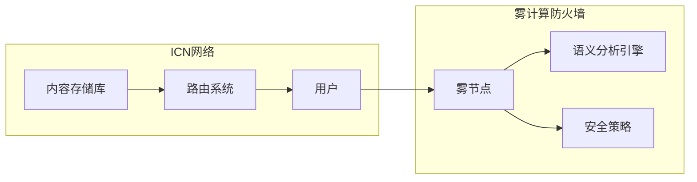

## 1. 背景介绍

### 1.1 信息中心网络(ICN)的兴起与安全挑战

信息中心网络 (ICN) 作为一种全新的网络架构，近年来受到了广泛关注。与传统IP网络不同，ICN以内容为中心，用户通过名称请求内容，网络节点根据内容名称进行路由和转发。这种模式摆脱了对特定服务器地址的依赖，提高了内容获取效率和网络安全性。

然而，ICN的普及也带来了新的安全挑战。由于内容可以在网络中任意节点缓存，传统的基于IP地址的防火墙策略难以有效实施。攻击者可以利用ICN的特性，发起各种新型攻击，例如：

* **内容污染攻击**: 攻击者将恶意内容注入到ICN网络中，用户请求正常内容时可能会获取到被污染的内容。
* **缓存投毒攻击**: 攻击者利用ICN的缓存机制，将恶意内容缓存到网络节点中，使得用户即使请求正常内容，也可能会从缓存中获取到恶意内容。
* **拒绝服务攻击**: 攻击者可以向ICN网络发送大量请求，耗尽网络资源，导致合法用户无法正常访问内容。

### 1.2 雾计算的安全增强作用

雾计算作为一种新兴的计算模式，将计算、存储、控制和网络功能扩展到网络边缘，更靠近用户和数据源。雾计算的分布式特性使其能够有效地应对ICN的安全挑战。

* **分布式防御**: 雾节点可以部署在网络边缘，形成分布式防御体系，有效抵御大规模 DDoS 攻击。
* **本地化安全策略**: 雾节点可以根据本地网络环境和用户需求，制定更加精细化的安全策略，提高安全防护的针对性和有效性。
* **实时安全分析**: 雾节点可以实时收集和分析网络流量，及时识别和阻止恶意行为。

### 1.3 语义分析技术的应用

传统的防火墙主要依赖于IP地址、端口号等信息进行安全策略匹配，难以识别ICN中基于内容名称的攻击行为。语义分析技术可以提取内容的语义信息，例如内容主题、关键词、情感倾向等，为ICN安全防护提供更细粒度的控制手段。

## 2. 核心概念与联系

### 2.1 ICN网络架构

ICN网络架构的核心是**内容存储库**和**路由系统**。内容存储库负责存储和管理各种内容，路由系统负责将用户请求路由到存储相应内容的节点。用户通过**内容名称**请求内容，网络节点根据内容名称进行路由和转发。

### 2.2 雾计算防火墙

雾计算防火墙部署在网络边缘的雾节点上，通过分析网络流量、识别恶意行为、执行安全策略等手段，保护ICN网络安全。

### 2.3 语义分析引擎

语义分析引擎负责提取内容的语义信息，为防火墙提供更细粒度的控制手段。

### 2.4 关系图



## 3. 核心算法原理具体操作步骤

### 3.1 语义特征提取

语义分析引擎首先对内容进行分词、词性标注、命名实体识别等预处理，然后利用深度学习模型提取内容的语义特征，例如：

* **主题**: 内容所属的主题类别，例如科技、娱乐、体育等。
* **关键词**: 内容中最重要的关键词，例如人工智能、区块链、云计算等。
* **情感**: 内容表达的情感倾向，例如积极、消极、中性等。

### 3.2 安全策略匹配

防火墙根据语义特征和预先定义的安全策略进行匹配，例如：

* 阻止包含特定关键词的内容，例如暴力、色情等。
* 限制来自特定主题的内容访问，例如限制来自娱乐主题的内容访问。
* 允许访问具有特定情感倾向的内容，例如只允许访问积极情感的内容。

### 3.3 行为分析与响应

防火墙还可以分析用户行为，例如访问频率、访问时间、访问内容类型等，识别异常行为并采取相应的措施，例如：

* 限制特定用户访问特定内容。
* 阻止来自特定IP地址的访问。
* 记录异常行为并进行报警。

## 4. 数学模型和公式详细讲解举例说明

### 4.1 TF-IDF算法

TF-IDF算法是一种常用的文本特征提取算法，用于计算词语在文本中的权重。

**TF (Term Frequency)**: 词语在文本中出现的频率。
**IDF (Inverse Document Frequency)**: 词语在所有文本中出现的频率的倒数。

TF-IDF值越高，表示词语在文本中的重要性越高。

**公式:**

```
TF-IDF(t, d) = TF(t, d) * IDF(t)
```

**示例:**

假设有一篇关于人工智能的文本，其中“人工智能”一词出现了10次，文本长度为1000个词，所有文本中包含“人工智能”一词的文本数量为100篇。

```
TF("人工智能", 文本) = 10 / 1000 = 0.01
IDF("人工智能") = log(1000 / 100) = 2
TF-IDF("人工智能", 文本) = 0.01 * 2 = 0.02
```

### 4.2 LDA主题模型

LDA (Latent Dirichlet Allocation) 是一种常用的主题模型，用于将文本集合分成不同的主题。

LDA模型假设每个文本都是由多个主题混合而成，每个主题都是由多个词语组成。

**公式:**

```
P(w|d) = \sum_{k=1}^K P(w|z_k)P(z_k|d)
```

**示例:**

假设有一篇关于人工智能的文本，LDA模型将其分成了两个主题：“机器学习”和“深度学习”。

```
P("人工智能"|文本) = P("人工智能"|"机器学习") * P("机器学习"|文本) + P("人工智能"|"深度学习") * P("深度学习"|文本)
```

## 5. 项目实践：代码实例和详细解释说明

### 5.1 语义分析引擎实现

```python
import nltk
from sklearn.feature_extraction.text import TfidfVectorizer
from gensim.models import LdaModel
from gensim.corpora import Dictionary

# 分词、词性标注、命名实体识别
text = "人工智能是计算机科学的一个分支，它涉及到智能代理的设计和开发。"
tokens = nltk.word_tokenize(text)
tagged = nltk.pos_tag(tokens)
entities = nltk.chunk.ne_chunk(tagged)

# TF-IDF特征提取
vectorizer = TfidfVectorizer()
tfidf = vectorizer.fit_transform([text])

# LDA主题建模
dictionary = Dictionary([tokens])
corpus = [dictionary.doc2bow(tokens)]
lda = LdaModel(corpus, id2word=dictionary, num_topics=2)
topics = lda.get_document_topics(corpus[0])

# 输出语义特征
print("TF-IDF:", tfidf)
print("主题:", topics)
```

### 5.2 防火墙策略配置

```
# 阻止包含“暴力”关键词的内容
rule:
    condition:
        - keyword: "暴力"
    action:
        - block

# 限制来自“娱乐”主题的内容访问
rule:
    condition:
        - topic: "娱乐"
    action:
        - limit

# 允许访问具有“积极”情感倾向的内容
rule:
    condition:
        - sentiment: "积极"
    action:
        - allow
```

## 6. 实际应用场景

### 6.1 智能家居安全

ICN网络可以用于构建智能家居系统，雾计算防火墙可以保护智能家居设备免受网络攻击。

### 6.2 车联网安全

ICN网络可以用于构建车联网系统，雾计算防火墙可以保护车辆免受网络攻击。

### 6.3 工业互联网安全

ICN网络可以用于构建工业互联网系统，雾计算防火墙可以保护工业设备免受网络攻击。

## 7. 总结：未来发展趋势与挑战

### 7.1 趋势

* **人工智能技术将进一步提升语义分析的精度和效率。**
* **雾计算将更加普及，为ICN安全提供更强大的支持。**
* **区块链技术可以用于构建可信的内容分发网络，增强ICN安全。**

### 7.2 挑战

* **语义分析技术需要不断改进，以应对不断变化的网络攻击手段。**
* **雾计算环境的复杂性对防火墙的设计和部署提出了更高的要求。**
* **ICN安全标准和规范尚未完善，需要进一步研究和制定。**

## 8. 附录：常见问题与解答

### 8.1 ICN与传统IP网络的区别？

ICN以内容为中心，用户通过内容名称请求内容，网络节点根据内容名称进行路由和转发。传统IP网络以主机为中心，用户通过IP地址访问主机，网络节点根据IP地址进行路由和转发。

### 8.2 雾计算与云计算的区别？

雾计算将计算、存储、控制和网络功能扩展到网络边缘，更靠近用户和数据源。云计算将计算、存储和网络功能集中在数据中心，为用户提供按需服务。

### 8.3 语义分析技术的应用场景？

语义分析技术可以用于文本分类、情感分析、信息检索、机器翻译等领域。