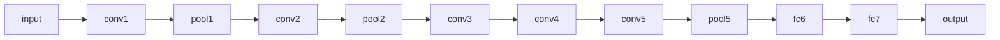

## 1. 背景介绍

### 1.1 图像识别的演进

图像识别，顾名思义，是指计算机对图像进行分析和理解，以识别不同对象、场景和概念的能力。它是计算机视觉领域的核心问题之一，也是人工智能发展的重要方向。从早期的简单模式识别到如今的深度学习，图像识别技术经历了漫长的发展历程。

早期的图像识别主要依赖于人工设计的特征提取器，例如 SIFT、HOG 等算法。这些算法通过提取图像的局部特征，并将其组合成全局特征向量，然后使用分类器进行识别。然而，这些人工设计的特征往往难以捕捉图像的复杂性和多样性，导致识别精度有限。

随着深度学习技术的兴起，图像识别领域迎来了革命性的突破。深度学习模型，例如卷积神经网络（CNN），能够自动学习图像的层次化特征表示，从而大幅提升识别精度。特别是 ImageNet 数据集的出现，为训练大规模深度学习模型提供了海量数据，进一步推动了图像识别技术的快速发展。

### 1.2 ImageNet 数据集的诞生

ImageNet 数据集是由斯坦福大学李飞飞教授团队创建的大规模图像数据集，包含超过 1400 万张图像，涵盖 2 万多个类别。ImageNet 数据集的规模和多样性为训练高性能图像识别模型提供了前所未有的机遇，也为图像识别领域的快速发展奠定了基础。

ImageNet 数据集的创建过程充满了挑战。首先，需要收集和标注海量图像数据。为了确保数据的准确性和一致性，ImageNet 团队采用了众包的方式，利用 Amazon Mechanical Turk 平台招募了大量志愿者进行图像标注。其次，需要对图像进行分类和组织。ImageNet 团队采用了 WordNet 词典作为分类体系，将图像按照语义层次进行组织。

### 1.3 ImageNet 挑战赛的影响

为了推动图像识别技术的进步，ImageNet 团队自 2010 年起每年举办 ImageNet 大规模视觉识别挑战赛（ILSVRC）。该比赛吸引了全球顶尖的计算机视觉研究团队参与，极大地促进了图像识别算法的创新和发展。

在 ILSVRC 比赛中，参赛团队需要使用 ImageNet 数据集训练图像识别模型，并在测试集上进行评估。比赛结果表明，深度学习模型在图像识别任务上取得了显著的优势，并且随着模型规模和数据量的增加，识别精度不断提高。

## 2. 核心概念与联系

### 2.1 卷积神经网络（CNN）

卷积神经网络（CNN）是一种专门用于处理图像数据的深度学习模型。CNN 的核心思想是利用卷积操作提取图像的局部特征，并通过池化操作降低特征维度，最终将提取的特征输入全连接层进行分类。

#### 2.1.1 卷积层

卷积层是 CNN 的核心组件，它通过卷积核对输入图像进行卷积操作，提取图像的局部特征。卷积核是一个小的权重矩阵，它在输入图像上滑动，并计算卷积核与对应图像区域的点积。

#### 2.1.2 池化层

池化层用于降低特征维度，减少计算量，并提高模型的鲁棒性。常见的池化操作包括最大池化和平均池化。

#### 2.1.3 全连接层

全连接层将卷积层和池化层提取的特征进行整合，并输出分类结果。

### 2.2 迁移学习

迁移学习是指将预训练的模型应用于新的任务，以提高模型的性能和效率。在图像识别领域，迁移学习是一种常用的技术，可以利用 ImageNet 等大规模数据集上预训练的模型，快速构建针对特定任务的图像识别模型。

### 2.3 数据增强

数据增强是指通过对训练数据进行变换，增加数据量和多样性，以提高模型的泛化能力。常见的数据增强方法包括旋转、缩放、裁剪、翻转等。

## 3. 核心算法原理具体操作步骤

### 3.1 AlexNet

AlexNet 是第一个在 ILSVRC 比赛中取得突破性成果的 CNN 模型，它由多伦多大学 Hinton 教授团队提出。AlexNet 的网络结构包含 5 个卷积层、3 个池化层和 3 个全连接层。

#### 3.1.1 网络结构



#### 3.1.2 训练过程

AlexNet 的训练过程包括以下步骤：

1. 数据预处理：对输入图像进行归一化处理，并进行数据增强。
2. 前向传播：将输入图像输入网络，计算网络输出。
3. 计算损失函数：计算网络输出与真实标签之间的差异。
4. 反向传播：根据损失函数计算梯度，并更新网络参数。
5. 重复步骤 2-4，直至模型收敛。

### 3.2 VGGNet

VGGNet 是牛津大学 Visual Geometry Group 提出的 CNN 模型，它以更深的网络结构和更小的卷积核为特点，进一步提升了图像识别精度。

#### 3.2.1 网络结构

VGGNet 的网络结构包含 16 或 19 层，其中卷积层均采用 3x3 的卷积核。

#### 3.2.2 训练过程

VGGNet 的训练过程与 AlexNet 类似，但采用了更小的学习率和更长的训练时间。

### 3.3 ResNet

ResNet 是微软研究院提出的 CNN 模型，它引入了残差连接，解决了深度网络训练过程中的梯度消失问题，使得训练更深的网络成为可能。

#### 3.3.1 网络结构

ResNet 的网络结构包含多个残差块，每个残差块包含两个卷积层和一个跳跃连接。

#### 3.3.2 训练过程

ResNet 的训练过程与 VGGNet 类似，但采用了更深的网络结构和更小的学习率。

## 4. 数学模型和公式详细讲解举例说明

### 4.1 卷积操作

卷积操作是 CNN 的核心数学运算，它通过卷积核对输入图像进行卷积运算，提取图像的局部特征。

#### 4.1.1 公式

$$
y_{i,j} = \sum_{m=1}^{M} \sum_{n=1}^{N} w_{m,n} x_{i+m-1,j+n-1}
$$

其中，$y_{i,j}$ 是输出特征图的第 $(i,j)$ 个元素，$w_{m,n}$ 是卷积核的第 $(m,n)$ 个元素，$x_{i+m-1,j+n-1}$ 是输入图像的第 $(i+m-1,j+n-1)$ 个元素。

#### 4.1.2 举例说明

假设输入图像是一个 5x5 的矩阵，卷积核是一个 3x3 的矩阵，则卷积操作的计算过程如下：

```
输入图像：
1 2 3 4 5
6 7 8 9 0
1 2 3 4 5
6 7 8 9 0
1 2 3 4 5

卷积核：
1 0 1
0 1 0
1 0 1

输出特征图：
10 12 14
16 18 20
10 12 14
```

### 4.2 池化操作

池化操作用于降低特征维度，减少计算量，并提高模型的鲁棒性。

#### 4.2.1 最大池化

最大池化操作选择池化区域内的最大值作为输出。

#### 4.2.2 平均池化

平均池化操作计算池化区域内所有元素的平均值作为输出。

## 5. 项目实践：代码实例和详细解释说明

### 5.1 使用 TensorFlow 训练 AlexNet 模型

```python
import tensorflow as tf

# 定义 AlexNet 模型
def alexnet(input_shape, num_classes):
  # 输入层
  input_layer = tf.keras.Input(shape=input_shape)

  # 卷积层 1
  x = tf.keras.layers.Conv2D(filters=96, kernel_size=11, strides=4, padding='same', activation='relu')(input_layer)
  x = tf.keras.layers.MaxPool2D(pool_size=3, strides=2)(x)

  # 卷积层 2
  x = tf.keras.layers.Conv2D(filters=256, kernel_size=5, padding='same', activation='relu')(x)
  x = tf.keras.layers.MaxPool2D(pool_size=3, strides=2)(x)

  # 卷积层 3
  x = tf.keras.layers.Conv2D(filters=384, kernel_size=3, padding='same', activation='relu')(x)

  # 卷积层 4
  x = tf.keras.layers.Conv2D(filters=384, kernel_size=3, padding='same', activation='relu')(x)

  # 卷积层 5
  x = tf.keras.layers.Conv2D(filters=256, kernel_size=3, padding='same', activation='relu')(x)
  x = tf.keras.layers.MaxPool2D(pool_size=3, strides=2)(x)

  # 全连接层 1
  x = tf.keras.layers.Flatten()(x)
  x = tf.keras.layers.Dense(units=4096, activation='relu')(x)
  x = tf.keras.layers.Dropout(rate=0.5)(x)

  # 全连接层 2
  x = tf.keras.layers.Dense(units=4096, activation='relu')(x)
  x = tf.keras.layers.Dropout(rate=0.5)(x)

  # 输出层
  output_layer = tf.keras.layers.Dense(units=num_classes, activation='softmax')(x)

  # 创建模型
  model = tf.keras.Model(inputs=input_layer, outputs=output_layer)

  return model

# 创建 AlexNet 模型
model = alexnet(input_shape=(227, 227, 3), num_classes=1000)

# 编译模型
model.compile(optimizer='adam', loss='categorical_crossentropy', metrics=['accuracy'])

# 训练模型
model.fit(x_train, y_train, epochs=10, batch_size=32)

# 评估模型
loss, accuracy = model.evaluate(x_test, y_test)
print('Loss:', loss)
print('Accuracy:', accuracy)
```

### 5.2 使用 PyTorch 训练 ResNet 模型

```python
import torch
import torch.nn as nn
import torchvision
import torchvision.transforms as transforms

# 定义 ResNet 模型
class ResNet(nn.Module):
  def __init__(self, num_classes=1000):
    super(ResNet, self).__init__()
    self.conv1 = nn.Conv2d(3, 64, kernel_size=7, stride=2, padding=3)
    self.bn1 = nn.BatchNorm2d(64)
    self.relu = nn.ReLU(inplace=True)
    self.maxpool = nn.MaxPool2d(kernel_size=3, stride=2, padding=1)
    self.layer1 = self._make_layer(64, 64, 3)
    self.layer2 = self._make_layer(128, 128, 4, stride=2)
    self.layer3 = self._make_layer(256, 256, 6, stride=2)
    self.layer4 = self._make_layer(512, 512, 3, stride=2)
    self.avgpool = nn.AdaptiveAvgPool2d((1, 1))
    self.fc = nn.Linear(512, num_classes)

  def _make_layer(self, in_channels, out_channels, blocks, stride=1):
    layers = []
    layers.append(Bottleneck(in_channels, out_channels, stride))
    for i in range(1, blocks):
      layers.append(Bottleneck(out_channels, out_channels))
    return nn.Sequential(*layers)

  def forward(self, x):
    x = self.conv1(x)
    x = self.bn1(x)
    x = self.relu(x)
    x = self.maxpool(x)

    x = self.layer1(x)
    x = self.layer2(x)
    x = self.layer3(x)
    x = self.layer4(x)

    x = self.avgpool(x)
    x = torch.flatten(x, 1)
    x = self.fc(x)

    return x

class Bottleneck(nn.Module):
  expansion = 4

  def __init__(self, in_channels, out_channels, stride=1, downsample=None):
    super(Bottleneck, self).__init__()
    self.conv1 = nn.Conv2d(in_channels, out_channels, kernel_size=1, bias=False)
    self.bn1 = nn.BatchNorm2d(out_channels)
    self.conv2 = nn.Conv2d(out_channels, out_