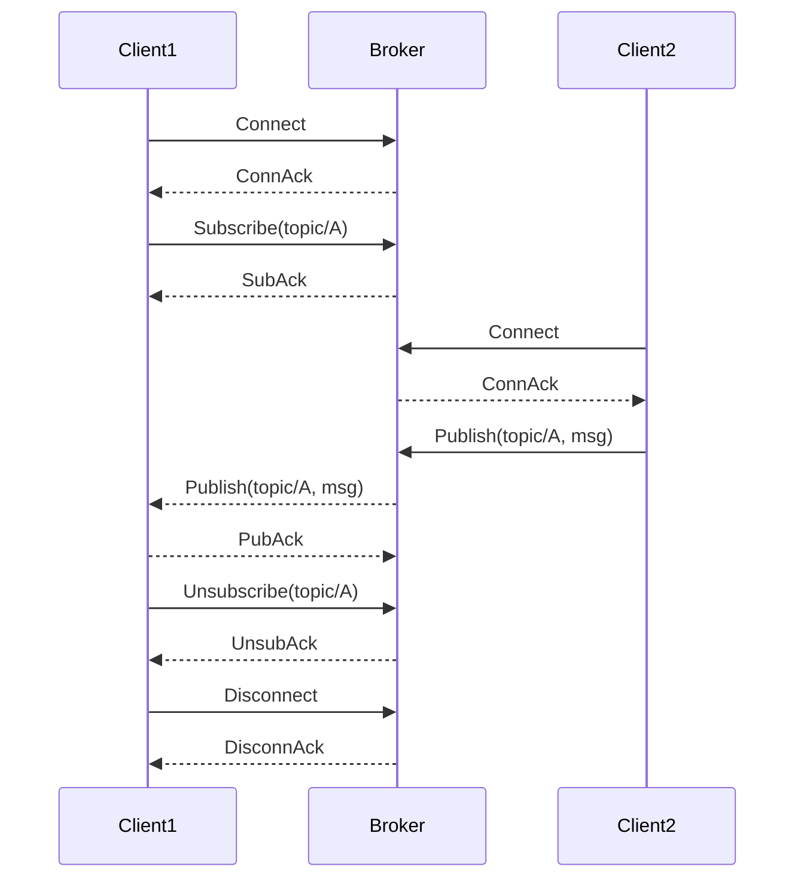
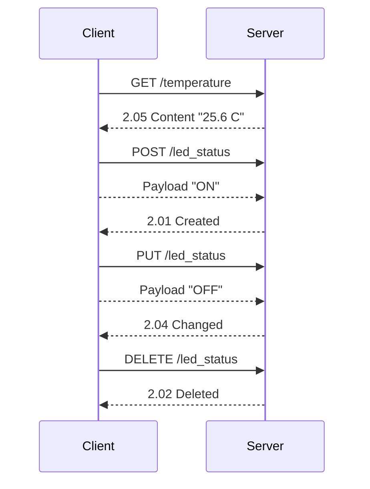
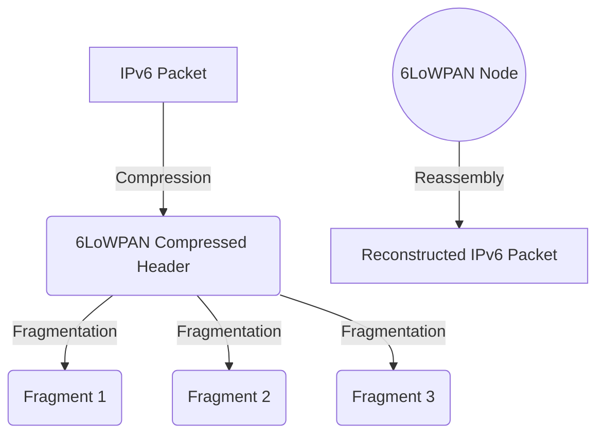
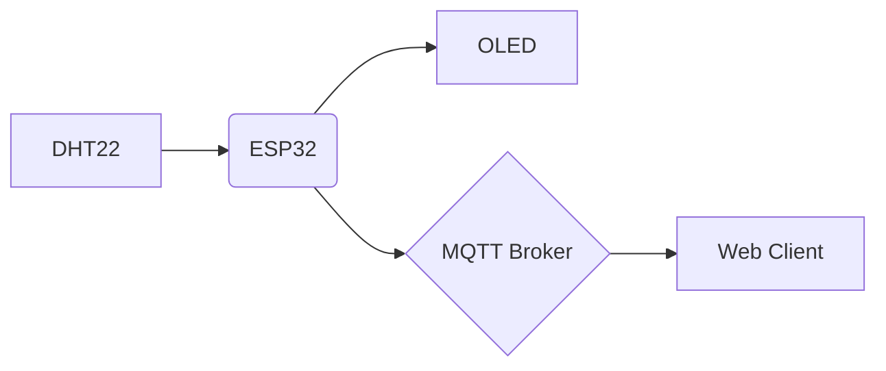

# Internet of Things 原理与代码实战案例讲解

## 1. 背景介绍

### 1.1 物联网的兴起

随着互联网、移动通信和传感器技术的不断发展,物联网(Internet of Things, IoT)应运而生。物联网旨在将各种物体与互联网相连接,实现信息的高效传递和智能化管理。

### 1.2 物联网的重要性

物联网正在深刻改变我们的生活、工作和社会运行方式,为制造业、农业、医疗、交通、环境监测等众多领域带来革命性变革。通过物联网,我们可以实时监控和控制连接的设备,提高效率、节约资源、创造新的商业模式。

### 1.3 物联网的挑战

尽管物联网前景广阔,但也面临着诸多挑战,如网络安全、隐私保护、海量数据处理、设备互操作性、能源管理等,需要不断创新以应对这些挑战。

## 2. 核心概念与联系

### 2.1 物联网体系结构

物联网一般包括三个主要层面:

#### 2.1.1 感知层

感知层由各种传感器设备组成,用于采集环境数据,如温度、湿度、压力、图像、声音等。常见的传感器有温度传感器、红外传感器、图像传感器、声音传感器等。

#### 2.1.2 网络层

网络层负责在设备之间传输数据,包括有线网络(如以太网)和无线网络(如Wi-Fi、蓝牙、ZigBee、LoRaWAN等)。网络协议需要满足物联网的低功耗、低延迟、高可靠性等要求。

#### 2.1.3 应用层

应用层提供各种应用程序,如数据处理、存储、可视化、设备控制等,以实现特定的业务目标。应用层通常采用云计算技术,提供可扩展的计算和存储资源。

### 2.2 物联网关键技术

#### 2.2.1 嵌入式系统

嵌入式系统是物联网设备的核心,负责数据采集、处理和通信。常见的嵌入式系统包括单片机、微控制器、系统级芯片(SoC)等。

#### 2.2.2 传感器技术

传感器是物联网感知层的基础,用于采集各种物理量、化学量和生物量数据。传感器需要具备低功耗、高灵敏度、高可靠性等特点。

#### 2.2.3 无线通信技术

无线通信技术是物联网网络层的关键,包括近距离无线通信技术(如蓝牙、ZigBee)和远距离无线通信技术(如LoRaWAN、NB-IoT)。不同技术有不同的传输距离、带宽、功耗和成本特点。

#### 2.2.4 网络协议

物联网需要特殊的网络协议来满足低功耗、大规模设备接入、高可靠性等要求。常见的协议有MQTT、CoAP、XMPP等。

#### 2.2.5 云计算和大数据

云计算为物联网提供了可扩展的计算和存储资源,而大数据技术则用于处理海量物联网数据,发现隐藏的模式和价值。

#### 2.2.6 人工智能

人工智能技术在物联网中发挥着越来越重要的作用,如预测性维护、智能决策、异常检测等,提高了系统的智能化水平。

## 3. 核心算法原理具体操作步骤

### 3.1 MQTT协议原理

MQTT(Message Queuing Telemetry Transport)是一种轻量级的发布/订阅模式的消息传输协议,非常适合于物联网场景。它的工作原理如下:

1. **连接建立**:客户端(如传感器设备)向服务器发送连接请求。
2. **主题订阅**:客户端向服务器发送订阅请求,订阅一个或多个主题。
3. **消息发布**:发布者客户端向服务器发送消息,并指定发布主题。
4. **消息分发**:服务器将消息转发给订阅了该主题的所有客户端。
5. **断开连接**:客户端与服务器断开连接。

MQTT协议的核心优势包括:

- 极少的协议开销,非常轻量
- 支持 QoS 保证消息传输质量
- 支持最后一次消息传输
- 支持离线消息传输

MQTT 协议流程图:

### 3.2 CoAP 协议原理

CoAP(Constrained Application Protocol)是一种基于UDP的轻量级应用层协议,专为资源受限的物联网设备而设计。它的工作原理类似于 HTTP,但更加简单高效。

CoAP 支持以下四种类型的交互:

1. **GET 请求**: 客户端向服务器请求资源
2. **POST 请求**: 客户端向服务器创建新资源
3. **PUT 请求**: 客户端更新服务器上的资源
4. **DELETE 请求**: 客户端删除服务器上的资源

CoAP 协议流程图:

CoAP 的主要优势包括:

- 支持可扩展和可靠的通信
- 支持多播通信
- 支持资源发现
- 支持块传输大型数据

### 3.3 6LoWPAN 适配层原理

6LoWPAN(IPv6 over Low-Power Wireless Personal Area Networks)是一种将IPv6数据包传输到低功耗无线个域网络的适配层协议。它的主要作用是将IPv6数据包头部压缩,以减小传输开销。

6LoWPAN 适配层的核心步骤包括:

1. **头部压缩**: 压缩 IPv6 数据包头部,去掉不必要的前缀和其他字段。
2. **分片**: 将较大的 IPv6 数据包分成多个较小的分片进行传输。
3. **重组**: 在目的端重新组装分片数据包。

6LoWPAN 压缩和分片示意图:

6LoWPAN 可以与多种无线技术配合使用,如 IEEE 802.15.4、Bluetooth LE、DECT-ULE 等,使这些低功耗无线网络能够传输 IPv6 数据包。

## 4. 数学模型和公式详细讲解举例说明

### 4.1 信号编码与调制

在物联网系统中,模拟信号需要被编码和调制,以便在数字通信信道中传输。常用的编码和调制技术包括:

#### 4.1.1 脉冲编码调制(PCM)

PCM 是一种将模拟信号编码为数字信号的方法。它包括以下几个步骤:

1. **采样**: 以一定的采样频率 $f_s$ 对模拟信号进行采样,得到一系列采样值。
2. **量化**: 将每个采样值量化为有限的量化级别。
3. **编码**: 将量化后的值编码为二进制码字。

量化误差可以用均方根误差 $e_{rms}$ 表示:

$$e_{rms} = \frac{q}{\sqrt{12}}$$

其中 $q$ 是量化步长。为了减小量化噪声,可以增加量化级数或采用非均匀量化。

#### 4.1.2 脉冲位移键控(PDM)

PDM 是一种对二进制信号进行编码的方法,常用于传感器数据的编码。编码规则为:

- 对于逻辑"1",发送一个脉冲
- 对于逻辑"0",不发送脉冲

PDM 编码的主要优点是简单、节能,但精度有限。

#### 4.1.3 正交频分复用(OFDM)

OFDM 是一种将高速数据流分成多个低速子流并调制到不同正交子载波上的技术,广泛应用于现代无线通信系统中。

设有 $N$ 个正交子载波,则第 $k$ 个子载波的基函数为:

$$\phi_k(t) = \frac{1}{\sqrt{T}}e^{j2\pi k\Delta ft},\qquad 0\leq t<T$$

其中 $T$ 为OFDM符号周期, $\Delta f = 1/T$ 为子载波间隔。

发送信号为各子载波的线性叠加:

$$s(t) = \sum\limits_{k=0}^{N-1}X_k\phi_k(t)$$

其中 $X_k$ 为第 $k$ 个子载波的调制符号。

OFDM 具有抗多路衰落能力强、频谱利用率高等优点,是物联网无线通信的重要技术之一。

### 4.2 信道估计与均衡

无线信道会对传输信号造成衰落、多径效应等干扰,因此需要进行信道估计和均衡。

#### 4.2.1 最小均方误差(LMMSE)信道估计

LMMSE 信道估计是一种常用的线性无偏估计方法,其目标函数为:

$$\min\limits_{\mathbf{w}}\mathbb{E}\left[\left\|\mathbf{h}-\mathbf{w}^H\mathbf{y}\right\|^2\right]$$

其中 $\mathbf{h}$ 为信道脉冲响应, $\mathbf{y}$ 为接收信号向量, $\mathbf{w}$ 为权向量。

解析解为:

$$\mathbf{w}_{LMMSE} = \mathbf{R}_{yy}^{-1}\mathbf{R}_{yh}$$

其中 $\mathbf{R}_{yy}$ 和 $\mathbf{R}_{yh}$ 分别为 $\mathbf{y}$ 的自相关矩阵和 $\mathbf{y}$ 与 $\mathbf{h}$ 的互相关矩阵。

#### 4.2.2 最小均方(LMS)均衡

LMS 算法是一种自适应均衡算法,可以根据误差反馈不断调整均衡器系数,以最小化均方误差。

设均衡器系数向量为 $\mathbf{w}(n)$,输出误差为 $e(n) = d(n) - \mathbf{w}^H(n)\mathbf{x}(n)$,则 LMS 算法为:

$$\mathbf{w}(n+1) = \mathbf{w}(n) + \mu e^*(n)\mathbf{x}(n)$$

其中 $\mu$ 为步长参数,控制收敛速度与均方误差之间的权衡。

LMS 算法简单且计算复杂度低,适合于硬件资源受限的物联网设备。

## 5. 项目实践: 代码实例和详细解释说明

本节将通过一个具体的物联网项目实践案例,结合代码示例来深入理解物联网的实现细节。

### 5.1 项目概述

我们将构建一个基于 ESP32 开发板的家庭环境监控系统。该系统包括以下组件:

- ESP32 开发板
- DHT22 温湿度传感器
- OLED 显示屏
- MQTT 代理服务器
- Web 客户端

系统架构如下:

### 5.2 硬件连接

1. 将 DHT22 