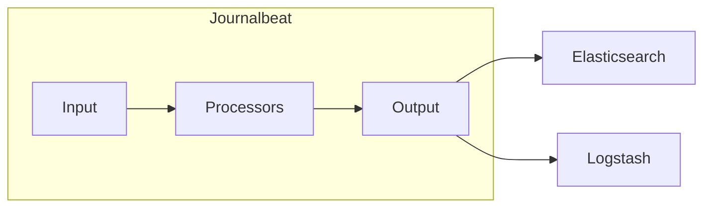

# Journalbeat工作原理：systemd日志的采集专家

## 1. 背景介绍

### 1.1 日志数据的重要性

在当今数字化时代，日志数据已经成为企业和组织运营中不可或缺的一部分。从应用程序性能监控到安全审计，日志数据提供了宝贵的洞察力，帮助我们了解系统行为、诊断问题和做出明智的决策。

### 1.2 systemd日志管理的兴起

随着 Linux 系统的不断发展，传统的 syslog 日志系统已经无法满足现代应用程序的需求。systemd 的出现引入了一种全新的日志管理方式，它使用 journald 守护进程来收集、存储和查询系统日志。相比于传统的 syslog，systemd 日志具有以下优势：

* **结构化日志记录:** systemd 日志以结构化的 JSON 格式存储，方便机器解析和分析。
* **可靠性高:** journald 使用二进制格式存储日志，并支持持久化存储，即使系统崩溃也能保证日志完整性。
* **查询效率高:** journald 提供了强大的查询功能，可以根据各种条件快速检索日志信息。

### 1.3 Journalbeat：systemd 日志采集的利器

为了更好地利用 systemd 日志，我们需要一个高效、可靠的日志采集工具。Journalbeat 作为 Elastic Stack 中的一员，专门用于采集和转发 systemd 日志数据。它具有以下特点：

* **轻量级:** Journalbeat 占用系统资源少，不会对系统性能造成明显影响。
* **易于配置:** Journalbeat 使用 YAML 格式的配置文件，简单易懂。
* **与 Elastic Stack 无缝集成:** Journalbeat 可以将采集到的日志数据直接发送到 Elasticsearch 进行索引和分析，也可以通过 Kibana 进行可视化展示。

## 2. 核心概念与联系

### 2.1 Journalbeat 架构

Journalbeat 采用插件化的架构设计，主要由以下几个核心组件构成：

* **Input:** 用于配置数据源，例如 systemd journal。
* **Processors:** 用于对采集到的数据进行处理，例如字段解析、数据转换等。
* **Output:** 用于配置数据输出目的地，例如 Elasticsearch、Logstash 等。

下图展示了 Journalbeat 的基本架构：



### 2.2 systemd journal 相关概念

* **journald:** systemd 日志系统的主要守护进程，负责收集、存储和查询日志数据。
* **journal:** systemd 日志数据存储在一个名为 journal 的二进制文件中。
* **journalctl:** 一个命令行工具，用于查询和管理 systemd 日志。

### 2.3 Journalbeat 与 systemd journal 的交互流程

1. Journalbeat 通过 systemd 提供的 API 读取 journal 文件中的日志数据。
2. Journalbeat 对读取到的日志数据进行解析和处理，例如提取字段、添加标签等。
3. Journalbeat 将处理后的日志数据发送到配置的输出目的地，例如 Elasticsearch。

## 3. 核心算法原理具体操作步骤

### 3.1 Journalbeat 读取 journal 数据的原理

Journalbeat 使用 libjournal 库来读取 journal 文件中的日志数据。libjournal 库提供了一组 API，允许应用程序以流式的方式读取 journal 数据。

Journalbeat 读取 journal 数据的主要步骤如下：

1. 打开 journal 文件。
2. 创建一个 journal reader 对象。
3. 循环读取 journal reader 对象中的日志记录。
4. 对读取到的日志记录进行解析和处理。
5. 关闭 journal 文件。

### 3.2 Journalbeat 解析 journal 数据的原理

Journalbeat 使用正则表达式和字段映射来解析 journal 数据。

* **正则表达式:** 用于从日志消息中提取关键信息，例如时间戳、进程 ID、消息级别等。
* **字段映射:** 用于将提取到的信息映射到 Elasticsearch 中的字段。

### 3.3 Journalbeat 发送数据的原理

Journalbeat 支持多种输出方式，例如 Elasticsearch、Logstash 等。

* **Elasticsearch:** Journalbeat 可以将数据直接发送到 Elasticsearch 集群进行索引。
* **Logstash:** Journalbeat 可以将数据发送到 Logstash 进行进一步处理和转换。

## 4. 数学模型和公式详细讲解举例说明

本节不涉及数学模型和公式。

## 5. 项目实践：代码实例和详细解释说明

### 5.1 安装 Journalbeat

```
sudo apt-get update
sudo apt-get install journalbeat
```

### 5.2 配置 Journalbeat

Journalbeat 的配置文件位于 `/etc/journalbeat/journalbeat.yml`。

以下是一个简单的 Journalbeat 配置文件示例：

```yaml
journalbeat.inputs:
- type: systemd
  # Paths that should be crawled and fetched.
  paths:
    - /var/log/journal
  # Exclude files.
  ignore_older: 1h

output.elasticsearch:
  # Array of hosts to connect to.
  hosts: ["localhost:9200"]

# Processors to run on events before the output.
processors:
- add_host_meta ~
- add_cloud_meta ~
```

### 5.3 启动 Journalbeat

```
sudo systemctl enable journalbeat
sudo systemctl start journalbeat
```

## 6. 实际应用场景

### 6.1 系统性能监控

Journalbeat 可以采集 systemd 日志中的系统性能指标，例如 CPU 使用率、内存使用率、磁盘 I/O 等。通过将这些指标发送到 Elasticsearch 进行分析和可视化，可以实时监控系统性能，及时发现并解决性能瓶颈。

### 6.2 应用程序性能监控

Journalbeat 可以采集应用程序生成的日志数据，例如应用程序错误日志、访问日志等。通过分析这些日志数据，可以监控应用程序的运行状况，识别性能问题和异常行为。

### 6.3 安全审计

Journalbeat 可以采集 systemd 日志中的安全事件，例如用户登录、文件访问、权限更改等。通过分析这些安全事件，可以识别潜在的安全威胁，并采取相应的安全措施。

## 7. 工具和资源推荐

* **Elasticsearch:** 开源的分布式搜索和分析引擎。
* **Kibana:** Elasticsearch 的可视化工具，用于创建图表、仪表盘和地图。
* **Logstash:** 开源的数据处理管道，用于收集、解析和转换数据。

## 8. 总结：未来发展趋势与挑战

### 8.1 未来发展趋势

* **容器化部署:** 随着容器技术的普及，Journalbeat 将会更加方便地部署和管理在容器环境中。
* **边缘计算:** 随着边缘计算的兴起，Journalbeat 将会扮演更加重要的角色，用于采集和转发边缘设备上的日志数据。
* **机器学习:** Journalbeat 可以与机器学习算法结合，用于日志数据的异常检测和故障预测。

### 8.2 面临的挑战

* **海量日志数据的处理:** 随着系统规模的扩大，Journalbeat 需要处理的日志数据量将会越来越大，这对 Journalbeat 的性能和可扩展性提出了更高的要求。
* **日志数据的安全:** 日志数据中可能包含敏感信息，Journalbeat 需要采取相应的安全措施来保护日志数据的安全。

## 9. 附录：常见问题与解答

### 9.1 如何解决 Journalbeat 无法读取 journal 数据的问题？

首先，确保 Journalbeat 已经正确安装和配置。然后，检查 Journalbeat 的日志文件 `/var/log/journalbeat/journalbeat`，查看是否有错误信息。如果问题仍然存在，可以尝试重启 Journalbeat 服务。

### 9.2 如何过滤 Journalbeat 采集的日志数据？

可以在 Journalbeat 的配置文件中使用 `include_fields` 和 `exclude_fields` 参数来过滤日志数据。

### 9.3 如何将 Journalbeat 采集的日志数据发送到多个输出目的地？

可以在 Journalbeat 的配置文件中配置多个 output 部分，每个 output 部分对应一个输出目的地。