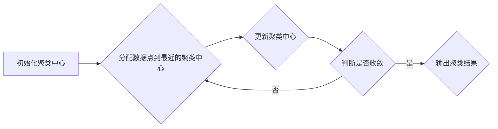

# K-Means聚类的Top10数据集与基准测试

作者：禅与计算机程序设计艺术

## 1. 背景介绍

### 1.1 聚类分析概述
在机器学习和数据挖掘领域，聚类分析是一种无监督学习方法，旨在将数据集中相似的数据点分组到一起，形成不同的簇。K-Means算法作为一种经典的聚类算法，以其简单性、高效性和可扩展性而被广泛应用于各个领域，例如图像分割、客户细分、异常检测等。

### 1.2 K-Means算法简介
K-Means算法的基本思想是迭代地将数据点分配给最近的聚类中心，并更新聚类中心的位置，直到聚类结果稳定为止。其核心步骤包括：
1. **初始化:** 随机选择K个数据点作为初始聚类中心。
2. **分配数据点:** 计算每个数据点到各个聚类中心的距离，将数据点分配给距离最近的聚类中心。
3. **更新聚类中心:** 计算每个簇中所有数据点的平均值，将平均值作为新的聚类中心。
4. **重复步骤2-3，直到聚类结果稳定为止。**

### 1.3 数据集和基准测试的重要性
选择合适的评估指标和基准数据集对于评估和比较不同聚类算法的性能至关重要。一个好的数据集应该具有以下特点：
* **代表性:** 数据集应该能够代表目标应用场景中的数据分布。
* **多样性:** 数据集应该包含不同大小、形状和密度的簇。
* **可访问性:** 数据集应该易于获取和使用。

基准测试则可以帮助我们了解不同算法在不同数据集上的性能表现，从而为算法选择和参数调优提供参考。

## 2. 核心概念与联系

### 2.1 数据点、簇和聚类中心
* **数据点:**  是指数据集中的单个样本，通常用一个多维向量表示。
* **簇:** 是指数据集中一组相似的数据点的集合。
* **聚类中心:** 是指每个簇的中心点，通常用一个多维向量表示，代表了该簇中所有数据点的平均特征。

### 2.2 距离度量
距离度量用于衡量数据点之间的相似度，常用的距离度量包括：
* **欧氏距离:**  最常用的距离度量方法，计算两点之间的直线距离。
* **曼哈顿距离:**  计算两点之间坐标轴上的距离之和。
* **余弦相似度:**  计算两个向量夹角的余弦值，用于衡量两个向量的方向相似度。

### 2.3 评估指标
常用的聚类评估指标包括：
* **轮廓系数 (Silhouette Coefficient):**  衡量每个数据点在其所属簇中的紧密程度以及与其他簇的分离程度。
* **Calinski-Harabasz 指数 (Calinski-Harabasz Index):**  衡量簇间距离与簇内距离的比值。
* **Davies-Bouldin 指数 (Davies-Bouldin Index):**  衡量簇之间的重叠程度。

## 3. 核心算法原理具体操作步骤

### 3.1 算法流程


### 3.2 具体操作步骤
1. **初始化:**  从数据集中随机选择K个数据点作为初始聚类中心。
2. **分配数据点:**  计算每个数据点到各个聚类中心的距离，将数据点分配给距离最近的聚类中心。
   * 对于每个数据点 $x_i$，计算其到每个聚类中心 $c_j$ 的距离 $d(x_i, c_j)$。
   * 将 $x_i$ 分配给距离最近的聚类中心，即  $cluster(x_i) = argmin_j d(x_i, c_j)$。
3. **更新聚类中心:**  计算每个簇中所有数据点的平均值，将平均值作为新的聚类中心。
   * 对于每个簇 $C_j$，计算其新的聚类中心 $c_j = \frac{1}{|C_j|} \sum_{x_i \in C_j} x_i$。
4. **判断是否收敛:**  如果所有聚类中心的位置不再发生变化，或者迭代次数达到预设的最大值，则算法停止迭代，否则返回步骤2。
5. **输出聚类结果:**  将每个数据点所属的簇作为聚类结果输出。

## 4. 数学模型和公式详细讲解举例说明

### 4.1 目标函数
K-Means算法的目标是最小化所有数据点与其所属簇的聚类中心之间的距离之和，也称为**簇内平方和 (Within-Cluster Sum of Squares, WCSS)**:

$$
WCSS = \sum_{j=1}^K \sum_{x_i \in C_j} ||x_i - c_j||^2
$$

其中，$K$ 表示簇的数量，$C_j$ 表示第 $j$ 个簇，$x_i$ 表示第 $i$ 个数据点，$c_j$ 表示第 $j$ 个簇的聚类中心，$||...||$ 表示欧氏距离。

### 4.2 举例说明
假设我们有以下数据集：

| 数据点 | x | y |
|---|---|---|
| A | 1 | 1 |
| B | 2 | 1 |
| C | 1 | 2 |
| D | 2 | 2 |
| E | 5 | 5 |
| F | 6 | 5 |
| G | 5 | 6 |
| H | 6 | 6 |

我们希望将这些数据点分成两组 ($K=2$)。

1. **初始化:** 随机选择数据点 A 和 E 作为初始聚类中心：
   * $c_1 = (1, 1)$
   * $c_2 = (5, 5)$

2. **分配数据点:** 计算每个数据点到两个聚类中心的距离，并将数据点分配给距离最近的聚类中心：

   | 数据点 | 距离到 c1 | 距离到 c2 | 分配到 |
   |---|---|---|---|
   | A | 0 | 5.66 | c1 |
   | B | 1 | 5 | c1 |
   | C | 1 | 5 | c1 |
   | D | 1.41 | 4.24 | c1 |
   | E | 5.66 | 0 | c2 |
   | F | 5 | 1 | c2 |
   | G | 5 | 1 | c2 |
   | H | 5.66 | 1.41 | c2 |

3. **更新聚类中心:** 
   * $c_1 = (\frac{1+2+1+2}{4}, \frac{1+1+2+2}{4}) = (1.5, 1.5)$
   * $c_2 = (\frac{5+6+5+6}{4}, \frac{5+5+6+6}{4}) = (5.5, 5.5)$

4. **重复步骤2-3，直到聚类结果稳定为止。**

## 5. 项目实践：代码实例和详细解释说明

### 5.1 Python 代码实现
```python
import numpy as np
from sklearn.cluster import KMeans

# 数据集
X = np.array([[1, 1], [2, 1], [1, 2], [2, 2], 
              [5, 5], [6, 5], [5, 6], [6, 6]])

# 创建 KMeans 模型
kmeans = KMeans(n_clusters=2, random_state=0)

# 训练模型
kmeans.fit(X)

# 获取聚类标签
labels = kmeans.labels_

# 获取聚类中心
centers = kmeans.cluster_centers_

# 打印结果
print("聚类标签:", labels)
print("聚类中心:", centers)
```

### 5.2 代码解释
* 首先，我们导入必要的库，包括 `numpy` 用于数组操作和 `sklearn.cluster` 中的 `KMeans` 类。
* 然后，我们定义数据集 `X`，它是一个 8x2 的数组，表示 8 个数据点，每个数据点有两个特征。
* 接下来，我们创建 `KMeans` 模型，并设置 `n_clusters=2`，表示将数据点分成两组，`random_state=0` 用于确保每次运行代码时都能得到相同的初始聚类中心。
* 然后，我们使用 `fit` 方法训练模型，并将数据集 `X` 传递给它。
* 训练完成后，我们可以使用 `labels_` 属性获取每个数据点所属的簇的标签，使用 `cluster_centers_` 属性获取每个簇的聚类中心。
* 最后，我们打印聚类标签和聚类中心。

## 6. 实际应用场景

### 6.1 图像分割
K-Means算法可以用于图像分割，将图像分割成不同的区域。例如，可以将一张风景照片分割成天空、树木、草地等区域。

### 6.2 客户细分
K-Means算法可以用于客户细分，将具有相似购买行为、人口统计特征或其他特征的客户分组到一起。例如，可以将电商平台的用户分成高价值客户、普通客户和低价值客户。

### 6.3 异常检测
K-Means算法可以用于异常检测，将远离正常数据点的数据点识别为异常点。例如，可以利用信用卡交易数据检测信用卡欺诈行为。

## 7. 工具和资源推荐

### 7.1 Python 库
* **scikit-learn:**  一个流行的机器学习库，包含 KMeans 算法的实现。
* **SciPy:**  一个科学计算库，包含距离度量和聚类评估指标的实现。

### 7.2 数据集
* **UCI 机器学习库:**  一个包含大量数据集的网站，其中许多数据集适合用于聚类分析。
* **Kaggle:**  一个数据科学竞赛平台，也包含许多数据集。

## 8. 总结：未来发展趋势与挑战

### 8.1 未来发展趋势
* **大规模数据集上的聚类:**  随着数据量的不断增长，开发能够处理大规模数据集的聚类算法变得越来越重要。
* **流数据聚类:**  流数据是指连续生成的数据，例如传感器数据和社交媒体数据。开发能够实时处理流数据的聚类算法是一个挑战。
* **深度聚类:**  将深度学习技术应用于聚类分析，可以提高聚类性能。

### 8.2 挑战
* **确定最佳簇数:**  K-Means算法需要预先指定簇的数量，而确定最佳簇数是一个挑战。
* **处理噪声和异常值:**  K-Means算法对噪声和异常值很敏感。
* **可解释性:**  K-Means算法生成的聚类结果有时难以解释。

## 9. 附录：常见问题与解答

### 9.1 如何确定最佳簇数？
* **肘部法则 (Elbow Method):**  绘制 WCSS 值随簇数变化的曲线，曲线的“肘部”对应的簇数通常是最佳簇数。
* **轮廓系数:**  计算不同簇数下的轮廓系数，选择轮廓系数最高的簇数。

### 9.2 如何处理噪声和异常值？
* **数据预处理:**  在进行聚类分析之前，对数据进行预处理，例如去除噪声和异常值。
* **使用对噪声和异常值不敏感的聚类算法:**  例如，DBSCAN 算法。

### 9.3 如何提高 K-Means 算法的性能？
* **数据标准化:**  将数据缩放到相同的范围，可以提高算法的性能。
* **多次运行算法:**  由于 K-Means 算法的初始聚类中心是随机选择的，因此多次运行算法并选择 WCSS 值最小的结果可以提高算法的稳定性。
