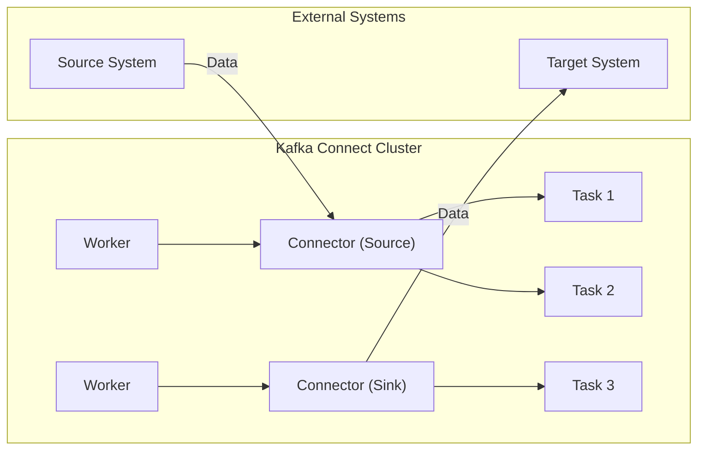

##  1. 背景介绍

### 1.1.  消息队列与数据同步的挑战
在当今数据驱动的世界中，企业和组织需要处理来自各种来源的海量数据。为了有效地利用这些数据，需要将数据从不同的数据源（如数据库、日志文件、传感器等）实时地传输到数据处理系统或数据仓库中。消息队列系统，如 Apache Kafka，已成为构建实时数据管道和实现数据同步的流行选择。

然而，将数据导入和导出 Kafka 集群通常需要编写大量的代码来处理数据格式转换、错误处理和容错等问题。这不仅增加了开发的复杂性，还可能导致数据管道变得脆弱且难以维护。

### 1.2. Kafka Connect 的诞生背景和意义
Kafka Connect 应运而生，它提供了一个可扩展、可靠且容错的框架，用于在 Apache Kafka 和其他系统之间进行数据同步。 Kafka Connect 简化了连接到 Kafka 的过程，并提供了一种统一的方式来管理和监控数据管道。

**Kafka Connect 的主要优势包括：**

* **简化数据管道开发：**  Kafka Connect 提供了预构建的连接器，用于连接到各种数据源和目标系统，从而无需编写大量代码。
* **可扩展性和可靠性：**  Kafka Connect 构建在 Kafka 之上，继承了 Kafka 的可扩展性和可靠性，可以处理高吞吐量的数据流。
* **容错性：**  Kafka Connect 提供了内置的容错机制，可以处理连接器和任务故障，确保数据管道的高可用性。
* **可管理性：**  Kafka Connect 提供了用于管理和监控连接器和任务的 REST API 和命令行工具。


## 2. 核心概念与联系

### 2.1.  Connectors（连接器）

连接器是 Kafka Connect 的核心组件，负责连接到外部系统并读取或写入数据。连接器可以是：

* **Source Connector（源连接器）：** 从外部数据源读取数据并将其转换为 Kafka 消息。
* **Sink Connector（目标连接器）：** 从 Kafka 主题读取消息并将其写入外部系统。

Kafka Connect 提供了各种预构建的连接器，用于连接到常见的数据源和目标系统，例如：

* **数据库：** MySQL、PostgreSQL、MongoDB
* **消息队列：** RabbitMQ、ActiveMQ
* **云存储：** AWS S3、Azure Blob Storage
* **大数据平台：** Hadoop、Spark

### 2.2. Tasks（任务）

每个连接器可以实例化为一个或多个任务，任务是实际执行数据复制的单元。任务可以并行运行，以提高数据管道的吞吐量。

### 2.3. Workers（工作节点）

Worker 是运行连接器任务的进程。Kafka Connect 集群可以包含多个 Worker，以提供高可用性和容错性。

### 2.4. Converters（转换器）

转换器负责在 Kafka 消息和外部系统的数据格式之间进行转换。Kafka Connect 提供了一些默认的转换器，例如：

* **JSON Converter：** 将数据转换为 JSON 格式。
* **Avro Converter：** 将数据转换为 Avro 格式。
* **String Converter：** 将数据转换为字符串格式。

### 2.5.  核心概念间的关系

下图展示了 Kafka Connect 的核心概念及其之间的关系：



**数据流向：**

1. 源系统将数据发送到 Source Connector。
2. Source Connector 将数据转换为 Kafka 消息，并将其发送到 Kafka 主题。
3. Sink Connector 从 Kafka 主题读取消息。
4. Sink Connector 将消息转换为目标系统的数据格式，并将其发送到目标系统。


## 3. 核心算法原理具体操作步骤

### 3.1. Source Connector 工作原理

Source Connector 负责从外部数据源读取数据，并将其转换为 Kafka 消息。它通过实现 `SourceTask` 接口来定义如何从数据源读取数据，并使用 `Record` 对象表示每条数据记录。

**Source Connector 的工作流程如下：**

1. **配置连接器：**  首先，需要配置 Source Connector，包括连接器类型、数据源连接信息、主题名称等。
2. **启动连接器：**  当启动连接器时，Kafka Connect 会创建一个或多个任务来执行数据复制。
3. **读取数据：**  每个任务都会定期轮询数据源，以检查是否有新数据可用。
4. **数据转换：**  如果发现新数据，任务会使用配置的转换器将数据转换为 Kafka 消息。
5. **发送消息：**  最后，任务将转换后的消息发送到 Kafka 主题。

### 3.2. Sink Connector 工作原理

Sink Connector 负责从 Kafka 主题读取消息，并将其写入外部系统。它通过实现 `SinkTask` 接口来定义如何处理 Kafka 消息，并使用 `SinkRecord` 对象表示每条消息记录。

**Sink Connector 的工作流程如下：**

1. **配置连接器：**  首先，需要配置 Sink Connector，包括连接器类型、目标系统连接信息、主题名称等。
2. **启动连接器：**  当启动连接器时，Kafka Connect 会创建一个或多个任务来执行数据复制。
3. **读取消息：**  每个任务都会从 Kafka 主题读取消息。
4. **数据转换：**  任务会使用配置的转换器将 Kafka 消息转换为目标系统的数据格式。
5. **写入数据：**  最后，任务将转换后的数据写入目标系统。

## 4. 项目实践：代码实例和详细解释说明

### 4.1.  使用 Kafka Connect 将数据从 MySQL 同步到 Elasticsearch

**需求：** 将 MySQL 数据库中的 `users` 表实时同步到 Elasticsearch 索引中。

**步骤：**

1. **安装必要的软件：**
    * Apache Kafka
    * Kafka Connect
    * MySQL JDBC 驱动程序
    * Elasticsearch 连接器

2. **配置 MySQL Source Connector：**
    ```properties
    name=mysql-source-connector
    connector.class=io.confluent.connect.jdbc.JdbcSourceConnector
    tasks.max=1
    connection.url=jdbc:mysql://localhost:3306/mydb
    connection.user=user
    connection.password=password
    table.whitelist=users
    mode=incrementing
    incrementing.column.name=id
    topic.prefix=mysql-
    ```

    * `name`：连接器的名称。
    * `connector.class`：连接器的类名。
    * `tasks.max`：任务数量。
    * `connection.url`：MySQL 数据库连接 URL。
    * `connection.user`：MySQL 数据库用户名。
    * `connection.password`：MySQL 数据库密码。
    * `table.whitelist`：要同步的表名。
    * `mode`：同步模式，这里使用 `incrementing` 模式，表示只同步增量数据。
    * `incrementing.column.name`：用于标识增量数据的列名。
    * `topic.prefix`：Kafka 主题前缀。

3. **配置 Elasticsearch Sink Connector：**
    ```properties
    name=elasticsearch-sink-connector
    connector.class=io.confluent.connect.elasticsearch.ElasticsearchSinkConnector
    tasks.max=1
    topics=mysql-users
    connection.url=http://localhost:9200
    type.name=user
    key.ignore=true
    ```

    * `name`：连接器的名称。
    * `connector.class`：连接器的类名。
    * `tasks.max`：任务数量。
    * `topics`：要消费的 Kafka 主题。
    * `connection.url`：Elasticsearch 集群连接 URL。
    * `type.name`：Elasticsearch 索引类型。
    * `key.ignore`：是否忽略 Kafka 消息的 key。

4. **启动连接器：**
    ```bash
    # 启动 MySQL Source Connector
    curl -X POST -H "Content-Type: application/json" \
         --data @mysql-source-connector.json \
         http://localhost:8083/connectors

    # 启动 Elasticsearch Sink Connector
    curl -X POST -H "Content-Type: application/json" \
         --data @elasticsearch-sink-connector.json \
         http://localhost:8083/connectors
    ```

5. **测试数据同步：**
    * 在 MySQL 数据库中插入一条数据。
    * 检查 Elasticsearch 索引中是否出现了这条数据。

### 4.2. 代码示例

**MySQL Source Connector 代码示例：**

```java
public class MySourceConnector extends SourceConnector {

    @Override
    public String version() {
        return "1.0";
    }

    @Override
    public void start(Map<String, String> props) {
        // 读取配置信息
    }

    @Override
    public List<Map<String, String>> taskConfigs(int maxTasks) {
        // 创建任务配置列表
    }

    @Override
    public Class<? extends Task> taskClass() {
        return MySourceTask.class;
    }

    @Override
    public void stop() {
        // 停止连接器
    }
}

public class MySourceTask extends SourceTask {

    @Override
    public String version() {
        return "1.0";
    }

    @Override
    public void start(Map<String, String> props) {
        // 初始化数据源连接
    }

    @Override
    public List<SourceRecord> poll() throws InterruptedException {
        // 读取数据源数据
    }

    @Override
    public void stop() {
        // 关闭数据源连接
    }
}
```

**Elasticsearch Sink Connector 代码示例：**

```java
public class MySinkConnector extends SinkConnector {

    @Override
    public String version() {
        return "1.0";
    }

    @Override
    public void start(Map<String, String> props) {
        // 读取配置信息
    }

    @Override
    public List<Map<String, String>> taskConfigs(int maxTasks) {
        // 创建任务配置列表
    }

    @Override
    public Class<? extends Task> taskClass() {
        return MySinkTask.class;
    }

    @Override
    public void stop() {
        // 停止连接器
    }
}

public class MySinkTask extends SinkTask {

    @Override
    public String version() {
        return "1.0";
    }

    @Override
    public void start(Map<String, String> props) {
        // 初始化 Elasticsearch 客户端
    }

    @Override
    public void put(Collection<SinkRecord> records) {
        // 写入数据到 Elasticsearch
    }

    @Override
    public void stop() {
        // 关闭 Elasticsearch 客户端
    }
}
```

## 5. 实际应用场景

Kafka Connect 适用于各种数据同步场景，例如：

* **实时数据仓库：** 将来自各种数据源的数据实时同步到数据仓库，例如 Hadoop、Spark 等，以进行分析和报表。
* **数据库复制：**  将数据从一个数据库实时复制到另一个数据库，例如将数据从生产环境复制到测试环境。
* **应用程序日志收集：**  将应用程序日志从应用程序服务器收集到集中式日志管理系统，例如 Elasticsearch、Splunk 等。
* **物联网数据处理：**  将来自物联网设备的数据实时同步到数据处理系统，例如 Kafka Streams、Apache Flink 等。

## 6. 工具和资源推荐

* **Apache Kafka 官网：** https://kafka.apache.org/
* **Kafka Connect 文档：** https://docs.confluent.io/platform/current/connect/index.html
* **Confluent Platform：** https://www.confluent.io/
* **Kafka Connect 连接器列表：** https://www.confluent.io/hub/

## 7. 总结：未来发展趋势与挑战

Kafka Connect 已经成为构建实时数据管道的重要工具，并且在未来将会继续发展和改进。

**未来发展趋势：**

* **更丰富的连接器生态系统：**  将会出现更多连接器，用于连接到各种数据源和目标系统。
* **更强大的数据转换功能：**  Kafka Connect 将会提供更强大的数据转换功能，例如数据过滤、数据聚合等。
* **更完善的监控和管理工具：**  将会出现更完善的监控和管理工具，用于监控数据管道运行状态和管理连接器。

**挑战：**

* **数据安全性：**  随着数据量的增加和数据安全性的重要性日益提高，Kafka Connect 需要提供更强大的数据加密和访问控制功能。
* **数据一致性：**  在某些情况下，需要保证数据同步的一致性，例如数据库复制。Kafka Connect 需要提供更强的数据一致性保障机制。
* **性能优化：**  随着数据量的增加，Kafka Connect 需要不断优化性能，以满足高吞吐量和低延迟的要求。

## 8. 附录：常见问题与解答

### 8.1.  Kafka Connect 和 Kafka Streams 有什么区别？

Kafka Connect 和 Kafka Streams 都是构建在 Apache Kafka 之上的数据处理工具，但它们有不同的用途。

* **Kafka Connect：**  用于在 Kafka 和其他系统之间进行数据同步。它提供了一种可扩展、可靠且容错的方式来导入和导出数据。
* **Kafka Streams：**  用于在 Kafka 中进行实时数据流处理。它提供了一种简单易用的 API 来构建实时数据处理应用程序。

### 8.2.  如何监控 Kafka Connect 的运行状态？

Kafka Connect 提供了 REST API 和 JMX 指标，用于监控连接器和任务的运行状态。可以使用工具（例如 Confluent Control Center、Prometheus）来收集和可视化这些指标。

### 8.3.  如何处理 Kafka Connect 的错误？

Kafka Connect 提供了内置的容错机制，可以处理连接器和任务故障。可以通过配置重试策略和死字母队列来处理错误。

### 8.4.  如何扩展 Kafka Connect 集群？

可以通过添加更多 Worker 节点来扩展 Kafka Connect 集群。新节点加入集群后，会自动均衡连接器任务，以确保负载均衡。
