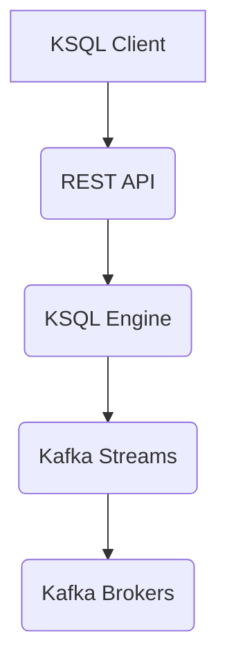

## 1. 背景介绍

### 1.1 大数据时代的实时数据处理需求

随着互联网、物联网、移动互联网的快速发展，数据规模呈爆炸式增长，传统的批处理方式已经无法满足实时性要求。实时数据处理技术应运而生，其目标是在数据产生的同时进行处理和分析，从而实现对数据的实时洞察和决策。

### 1.2 Kafka：高吞吐量分布式消息队列

Kafka 作为一款高吞吐量、低延迟的分布式消息队列，在大数据领域得到了广泛应用。它可以高效地处理海量数据流，并提供可靠的消息传递机制。

### 1.3 KSQL：基于 Kafka 的流式 SQL 引擎

KSQL 是 Kafka Streams 的 SQL 扩展，它允许用户使用类似 SQL 的语法来查询和处理 Kafka 中的流式数据。KSQL 简化了流式数据处理的开发流程，提高了开发效率。

## 2. 核心概念与联系

### 2.1 Streams 与 Tables

KSQL 中有两个核心概念：Streams 和 Tables。

* **Streams**：表示无界、持续更新的数据流，例如传感器数据、用户行为数据等。
* **Tables**：表示有限、更新频率较低的数据集，例如用户账户信息、商品目录等。

Streams 和 Tables 之间可以相互转换，例如可以通过窗口函数将 Stream 转换为 Table，也可以通过连接操作将 Table 转换为 Stream。

### 2.2 Queries and Statements

KSQL 提供了丰富的查询和语句，用于对 Streams 和 Tables 进行操作。

* **CREATE STREAM/TABLE**：创建 Stream 或 Table。
* **SELECT**：查询 Stream 或 Table 中的数据。
* **INSERT INTO**：将数据插入 Stream 或 Table。
* **UPDATE**：更新 Table 中的数据。
* **DELETE FROM**：删除 Table 中的数据。

### 2.3 KSQL Server and CLI

KSQL 提供了两种交互方式：

* **KSQL Server**：提供 RESTful API，可以通过编程方式与 KSQL 交互。
* **KSQL CLI**：提供命令行界面，可以通过交互式命令操作 KSQL。

## 3. 核心算法原理具体操作步骤

### 3.1 KSQL Engine 架构

KSQL Engine 是 KSQL 的核心组件，它负责处理 KSQL 查询和语句。其架构如下：



* **KSQL Client**：用户通过 KSQL Client 提交 KSQL 查询和语句。
* **REST API**：KSQL Server 提供 RESTful API，用于接收和处理 KSQL Client 的请求。
* **KSQL Engine**：KSQL Engine 负责解析 KSQL 查询和语句，并将它们转换为 Kafka Streams API。
* **Kafka Streams**：Kafka Streams 是 Kafka 的流式处理框架，它负责执行 KSQL Engine 转换后的 API。
* **Kafka Brokers**：Kafka Brokers 负责存储和分发 Kafka 中的消息。

### 3.2 KSQL 查询执行流程

当用户提交 KSQL 查询时，KSQL Engine 会执行以下步骤：

1. **解析 SQL 语句**：将 SQL 语句解析为抽象语法树 (AST)。
2. **语义分析**：检查 SQL 语句的语义是否正确，例如表和列是否存在、数据类型是否匹配等。
3. **逻辑计划优化**：对 SQL 语句进行逻辑优化，例如选择合适的索引、重排操作顺序等。
4. **物理计划生成**：将逻辑计划转换为物理计划，即 Kafka Streams API。
5. **提交到 Kafka Streams**：将物理计划提交到 Kafka Streams 进行执行。

### 3.3 KSQL 语句执行流程

KSQL 语句的执行流程与查询类似，只是不需要进行逻辑计划优化和物理计划生成。

## 4. 数学模型和公式详细讲解举例说明

KSQL 使用 Kafka Streams 的时间窗口函数来处理流式数据。时间窗口函数可以将无限的 Stream 转换为有限的 Table，方便进行聚合和分析。

### 4.1 时间窗口函数

KSQL 支持以下时间窗口函数：

* **TUMBLING_WINDOW**：将 Stream 按照固定时间间隔切分为多个窗口。
* **HOPPING_WINDOW**：将 Stream 按照固定时间间隔切分为多个重叠的窗口。
* **SESSION_WINDOW**：根据数据流中的时间间隔将 Stream 切分为多个窗口。

### 4.2 聚合函数

KSQL 支持以下聚合函数：

* **COUNT**：统计窗口内数据的数量。
* **SUM**：计算窗口内数据的总和。
* **AVG**：计算窗口内数据的平均值。
* **MAX**：获取窗口内数据的最大值。
* **MIN**：获取窗口内数据的最小值。

### 4.3 举例说明

假设我们有一个名为 `pageviews` 的 Stream，其中包含用户的页面浏览记录，每条记录包含以下字段：

* `user_id`：用户 ID。
* `page_id`：页面 ID。
* `timestamp`：浏览时间戳。

我们可以使用以下 KSQL 语句来统计每小时每个用户的页面浏览次数：

```sql
CREATE TABLE pageviews_hourly AS
SELECT user_id, COUNT(*) AS pageview_count
FROM pageviews
WINDOW TUMBLING (SIZE 1 HOUR)
GROUP BY user_id;
```

该语句将 `pageviews` Stream 按照 1 小时的间隔切分为多个窗口，然后对每个窗口内的记录进行分组统计，最终将结果写入 `pageviews_hourly` Table 中。

## 5. 项目实践：代码实例和详细解释说明

### 5.1 创建 Kafka Topic

首先，我们需要创建一个名为 `pageviews` 的 Kafka Topic，用于存储用户的页面浏览记录。可以使用 Kafka 命令行工具创建 Topic：

```bash
kafka-topics.sh --create --zookeeper localhost:2181 --topic pageviews --partitions 1 --replication-factor 1
```

### 5.2 启动 KSQL Server

接下来，我们需要启动 KSQL Server。可以使用 Docker 启动 KSQL Server：

```bash
docker run -d --name ksql-server -p 8088:8088 confluentplatform/ksql-cli:latest
```

### 5.3 创建 KSQL Stream

启动 KSQL CLI，连接到 KSQL Server：

```bash
ksql http://localhost:8088
```

创建名为 `pageviews` 的 KSQL Stream：

```sql
CREATE STREAM pageviews (
  user_id VARCHAR,
  page_id VARCHAR,
  timestamp BIGINT
) WITH (
  KAFKA_TOPIC = 'pageviews',
  VALUE_FORMAT = 'JSON'
);
```

### 5.4 插入数据

使用 Kafka Producer 向 `pageviews` Topic 插入数据：

```json
{"user_id": "user1", "page_id": "page1", "timestamp": 1621645600000}
{"user_id": "user2", "page_id": "page2", "timestamp": 1621646200000}
{"user_id": "user1", "page_id": "page3", "timestamp": 1621646800000}
```

### 5.5 创建 KSQL Table

创建名为 `pageviews_hourly` 的 KSQL Table，用于统计每小时每个用户的页面浏览次数：

```sql
CREATE TABLE pageviews_hourly AS
SELECT user_id, COUNT(*) AS pageview_count
FROM pageviews
WINDOW TUMBLING (SIZE 1 HOUR)
GROUP BY user_id;
```

### 5.6 查询数据

查询 `pageviews_hourly` Table 中的数据：

```sql
SELECT * FROM pageviews_hourly;
```

结果如下：

```
+---------+-----------------+
|USER_ID  |PAGEVIEW_COUNT  |
+---------+-----------------+
|user1    |2               |
|user2    |1               |
+---------+-----------------+
```

## 6. 实际应用场景

### 6.1 实时数据分析

KSQL 可以用于实时数据分析，例如：

* **网站流量分析**：统计网站的实时访问量、用户行为等。
* **物联网数据分析**：分析传感器数据的实时趋势、异常检测等。
* **金融交易监控**：监控金融交易的实时风险、欺诈检测等。

### 6.2 数据管道

KSQL 可以作为数据管道的一部分，用于：

* **数据清洗**：对数据流进行实时清洗，例如过滤无效数据、格式转换等。
* **数据聚合**：对数据流进行实时聚合，例如计算总和、平均值等。
* **数据路由**：将数据流路由到不同的目标，例如数据库、消息队列等。

## 7. 工具和资源推荐

### 7.1 Confluent Platform

Confluent Platform 是 Kafka 的商业发行版，它提供了 KSQL、Kafka Connect、Schema Registry 等组件，方便用户构建完整的流式数据处理平台。

### 7.2 Kafka Tutorials

Apache Kafka 官方网站提供了丰富的 Kafka 教程，涵盖了 Kafka 的基本概念、安装配置、API 使用等方面。

### 7.3 KSQL Documentation

KSQL 官方文档提供了 KSQL 的详细介绍、语法参考、示例代码等内容。

## 8. 总结：未来发展趋势与挑战

### 8.1 未来发展趋势

* **更强大的 SQL 支持**：KSQL 将支持更丰富的 SQL 语法，例如子查询、JOIN 操作等。
* **更灵活的部署方式**：KSQL 将支持更灵活的部署方式，例如云原生部署、边缘计算部署等。
* **更智能的优化策略**：KSQL 将采用更智能的优化策略，例如自动索引选择、查询计划缓存等。

### 8.2 面临的挑战

* **性能优化**：随着数据规模的增长，KSQL 需要不断优化性能，以满足实时性要求。
* **安全性**：KSQL 需要提供可靠的安全机制，以保护数据的安全性和完整性。
* **易用性**：KSQL 需要不断提升易用性，降低用户学习和使用门槛。

## 9. 附录：常见问题与解答

### 9.1 如何创建 KSQL Stream？

可以使用 `CREATE STREAM` 语句创建 KSQL Stream，例如：

```sql
CREATE STREAM pageviews (
  user_id VARCHAR,
  page_id VARCHAR,
  timestamp BIGINT
) WITH (
  KAFKA_TOPIC = 'pageviews',
  VALUE_FORMAT = 'JSON'
);
```

### 9.2 如何查询 KSQL Table？

可以使用 `SELECT` 语句查询 KSQL Table，例如：

```sql
SELECT * FROM pageviews_hourly;
```

### 9.3 如何插入数据到 KSQL Stream？

可以使用 Kafka Producer 向 KSQL Stream 对应的 Kafka Topic 插入数据，例如：

```json
{"user_id": "user1", "page_id": "page1", "timestamp": 1621645600000}
```
