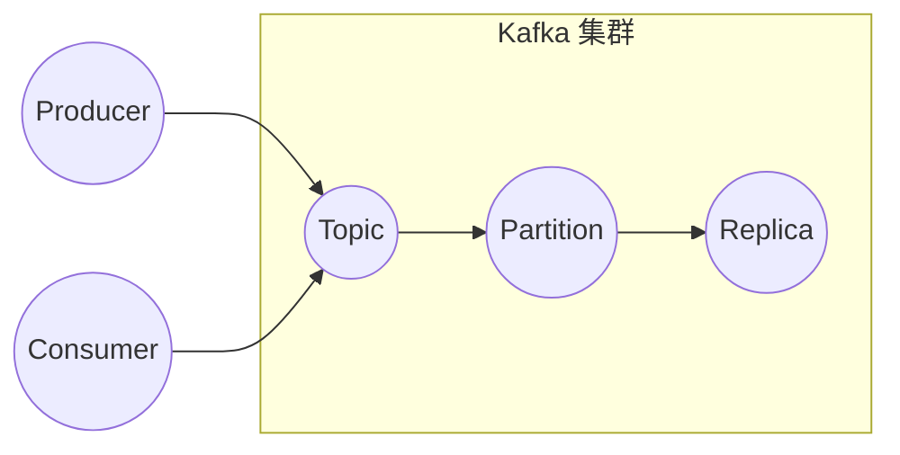

# Kafka Producer原理与代码实例讲解

作者：禅与计算机程序设计艺术

## 1. 背景介绍

### 1.1 消息队列概述

消息队列（Message Queue）是一种异步通信协议，用于在分布式系统中不同应用程序或服务之间传递消息。消息生产者（Producer）将消息发送到消息队列，而消息消费者（Consumer）则从消息队列中接收消息。消息队列充当了消息缓冲区，允许生产者和消费者以不同的速率进行操作，从而提高了系统的可靠性、可扩展性和性能。

### 1.2 Kafka 简介

Apache Kafka 是一个分布式流处理平台，由 LinkedIn 开发并开源。它具有高吞吐量、低延迟、容错性强等特点，被广泛应用于实时数据流处理、日志收集、事件驱动架构等场景。

### 1.3 Kafka Producer 的作用

Kafka Producer 是 Kafka 生态系统中的一个重要组件，负责将消息发布到 Kafka 集群。它提供了丰富的 API 和配置选项，以满足不同应用场景的需求。

## 2. 核心概念与联系

### 2.1 主题（Topic）

主题是 Kafka 中消息的逻辑分类，类似于数据库中的表。生产者将消息发布到特定的主题，而消费者则订阅感兴趣的主题以接收消息。

### 2.2 分区（Partition）

为了提高并发性和可扩展性，Kafka 将每个主题划分为多个分区。每个分区都是一个有序的消息队列，消息在分区内的偏移量（Offset）是唯一的。

### 2.3 副本（Replica）

为了确保数据的高可用性，Kafka 为每个分区维护多个副本。副本分为领导者副本（Leader Replica）和跟随者副本（Follower Replica）。领导者副本负责处理所有读写请求，而跟随者副本则同步领导者副本的数据。

### 2.4 生产者（Producer）

生产者是将消息发布到 Kafka 主题的应用程序或服务。

### 2.5 消费者（Consumer）

消费者是从 Kafka 主题订阅和消费消息的应用程序或服务。

### 2.6 关系图



## 3. 核心算法原理具体操作步骤

### 3.1 消息发送流程

1. 生产者将消息发送到 Kafka 集群。
2. Kafka 集群根据消息的 Key 计算目标分区。
3. 生产者将消息发送到目标分区的领导者副本。
4. 领导者副本将消息写入本地日志。
5. 跟随者副本从领导者副本同步消息。
6. 当所有同步副本都确认写入消息后，生产者收到确认消息。

### 3.2 分区策略

Kafka 提供了多种分区策略，用于确定消息应该发送到哪个分区。

* **轮询分区策略（Round-Robin Partitioner）：** 将消息依次发送到每个分区。
* **随机分区策略（Random Partitioner）：** 随机选择一个分区发送消息。
* **按 Key 分区策略（Key-Based Partitioner）：** 根据消息的 Key 计算目标分区。

### 3.3 消息确认机制

Kafka 提供了三种消息确认机制，用于确保消息的可靠性。

* **acks=0：** 生产者不等待任何确认消息，消息可能丢失。
* **acks=1：** 生产者等待领导者副本确认写入消息，消息可能会重复。
* **acks=all：** 生产者等待所有同步副本确认写入消息，消息不会丢失或重复。

## 4. 数学模型和公式详细讲解举例说明

### 4.1 消息吞吐量计算

消息吞吐量是指单位时间内 Kafka 集群可以处理的消息数量。

```
消息吞吐量 = 消息大小 * 消息数量 / 时间
```

**示例：**

假设消息大小为 1 KB，每秒发送 1000 条消息，则消息吞吐量为：

```
消息吞吐量 = 1 KB * 1000 / 1 秒 = 1 MB/秒
```

### 4.2 消息延迟计算

消息延迟是指从生产者发送消息到消费者接收到消息之间的时间间隔。

```
消息延迟 = 网络延迟 + 处理延迟
```

**示例：**

假设网络延迟为 10 毫秒，处理延迟为 5 毫秒，则消息延迟为：

```
消息延迟 = 10 毫秒 + 5 毫秒 = 15 毫秒
```

## 5. 项目实践：代码实例和详细解释说明

```java
import org.apache.kafka.clients.producer.*;
import org.apache.kafka.common.serialization.StringSerializer;

import java.util.Properties;

public class KafkaProducerExample {

    public static void main(String[] args) {
        // 设置 Kafka 集群地址
        Properties props = new Properties();
        props.put(ProducerConfig.BOOTSTRAP_SERVERS_CONFIG, "localhost:9092");

        // 设置 Key 和 Value 的序列化类
        props.put(ProducerConfig.KEY_SERIALIZER_CLASS_CONFIG, StringSerializer.class.getName());
        props.put(ProducerConfig.VALUE_SERIALIZER_CLASS_CONFIG, StringSerializer.class.getName());

        // 创建 Kafka 生产者
        KafkaProducer<String, String> producer = new KafkaProducer<>(props);

        // 发送消息
        for (int i = 0; i < 10; i++) {
            String message = "Hello Kafka " + i;
            ProducerRecord<String, String> record = new ProducerRecord<>("my-topic", message);
            producer.send(record, new Callback() {
                @Override
                public void onCompletion(RecordMetadata metadata, Exception exception) {
                    if (exception == null) {
                        System.out.println("消息发送成功：" + metadata.toString());
                    } else {
                        System.err.println("消息发送失败：" + exception.getMessage());
                    }
                }
            });
        }

        // 关闭 Kafka 生产者
        producer.close();
    }
}
```

**代码解释：**

1. 首先，我们设置 Kafka 集群地址、Key 和 Value 的序列化类。
2. 然后，我们创建 Kafka 生产者。
3. 在循环中，我们创建消息并使用 `producer.send()` 方法发送消息。
4. `send()` 方法接受一个 `ProducerRecord` 对象和一个可选的 `Callback` 对象。
5. `ProducerRecord` 对象包含消息的主题、Key 和 Value。
6. `Callback` 对象用于异步处理消息发送结果。
7. 最后，我们关闭 Kafka 生产者。

## 6. 实际应用场景

* **日志收集：** 将应用程序日志收集到 Kafka 集群，以便进行集中式存储、分析和监控。
* **实时数据管道：** 将实时数据流（如用户行为、传感器数据）传输到 Kafka 集群，以便进行实时处理和分析。
* **事件驱动架构：** 将事件发布到 Kafka 集群，以便其他服务可以订阅和处理这些事件。

## 7. 总结：未来发展趋势与挑战

### 7.1 未来发展趋势

* **更高的吞吐量和更低的延迟：** 随着数据量的不断增长，Kafka 需要不断提高其吞吐量和降低延迟。
* **更强大的流处理能力：** Kafka Streams 和 KSQL 等流处理工具将变得更加强大和易用。
* **更完善的安全性和可靠性：** Kafka 将继续增强其安全性，以保护敏感数据，并提高其可靠性，以确保数据不丢失。

### 7.2 面临的挑战

* **消息顺序性保证：** 在某些应用场景下，需要保证消息的顺序性，Kafka 需要提供更完善的机制来满足这一需求。
* **数据一致性保证：** 当 Kafka 集群发生故障时，需要确保数据的一致性。
* **运维管理复杂性：** 随着 Kafka 集群规模的扩大，运维管理的复杂性也随之增加。

## 8. 附录：常见问题与解答

### 8.1 如何选择合适的分区策略？

选择分区策略取决于具体的应用场景。如果需要保证消息的顺序性，则应该使用按 Key 分区策略。如果对消息的顺序性没有要求，则可以使用轮询分区策略或随机分区策略。

### 8.2 如何提高消息发送的可靠性？

可以通过设置 `acks` 参数来提高消息发送的可靠性。`acks=all` 可以确保消息不会丢失或重复，但会降低消息发送的性能。

### 8.3 如何监控 Kafka Producer 的性能？

可以使用 Kafka 提供的监控工具或第三方监控工具来监控 Kafka Producer 的性能指标，如消息吞吐量、消息延迟等。