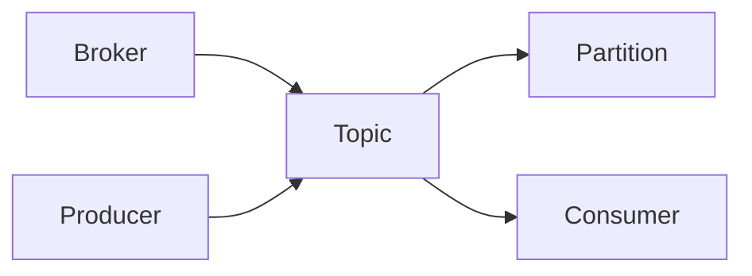

# Kafka Topic原理与代码实例讲解

作者：禅与计算机程序设计艺术

## 1.背景介绍

### 1.1 消息队列的重要性
在现代分布式系统中,消息队列扮演着至关重要的角色。它能够解耦服务,缓冲流量高峰,确保系统的可靠性和可扩展性。而在众多的消息队列中,Apache Kafka以其高吞吐、低延迟、可扩展的特点脱颖而出,成为了大数据时代不可或缺的基础设施之一。

### 1.2 Kafka简介
Kafka是一个分布式的流处理平台,它具有三个关键功能:
1. 发布和订阅消息流,类似于消息队列或企业消息传递系统。  
2. 以容错的持久方式存储消息流。
3. 处理消息流。

Kafka通常用于两大类应用:
1. 构建实时流数据管道,以可靠地在系统或应用程序之间获取数据
2. 构建实时流应用程序,对这些流进行转换或者响应

### 1.3 本文目的
在Kafka的诸多概念中,Topic是理解和使用Kafka的基础。本文将深入探讨Kafka Topic的原理,并结合代码实例对其进行详细讲解,帮助读者全面理解这一重要概念,为构建基于Kafka的流处理应用打下坚实基础。

## 2.核心概念与联系

### 2.1 Broker
Broker是Kafka集群的组成部分。每个集群都有一个或多个Broker,每个Broker都有一个唯一的ID。Broker存储Topic的分区,并处理来自生产者和消费者的请求。

### 2.2 Topic
Topic是Kafka中的消息的类别或订阅名称。Kafka中的消息都是以 Topic 来分类的。生产者将消息发布到特定的Topic,消费者订阅感兴趣的Topic并消费其中的消息。 

### 2.3 Partition
Partition是Topic物理上的分组。一个Topic可以分为多个Partition,每个Partition是一个有序的、不可变的消息序列。Partition中的每条消息都分配了一个连续的id号,称为offset,用于在Partition内唯一标识一条消息。

### 2.4 Producer & Consumer
Producer是发布消息到Kafka的Broker中的Topic上的客户端应用程序。 Consumer是订阅Topic并处理其中发布的消息的客户端应用程序。

### 2.5 关系总结



一个典型的Kafka集群由多个Broker组成。每个Broker包含某个Topic的一个或多个Partition。生产者向特定Topic发布消息,Topic的Partition存储消息。消费者订阅Topic并消费其中的消息。

## 3.核心算法原理具体操作步骤

### 3.1 Topic创建
创建Topic时,需要指定如下属性:
1. Topic名称
2. Partition数量
3. 副本因子(Replication Factor)

副本因子控制每个Partition将被复制到多少个Broker上。例如,副本因子为3意味着每个Partition将在集群中有3个副本。

创建Topic的基本步骤如下:
1. 客户端向任意一个Broker发送创建Topic的请求
2. 该Broker作为Controller,负责处理请求
3. Controller检查Topic是否已存在,如果不存在,创建新的Topic并更新元数据
4. Controller将更新的元数据发送给所有的Broker
5. 所有Broker更新自己的元数据信息

### 3.2 生产者发布消息
生产者发布消息的基本步骤如下:
1. 生产者向任意一个Broker发送元数据请求,获取Topic的元数据信息,包括Topic的Partition信息和Leader Broker信息
2. 生产者对消息进行序列化
3. 生产者根据分区算法选择要发送的Partition
4. 生产者将消息发送给该Partition的Leader Broker
5. Leader Broker将消息写入本地日志
6. Follower Broker从Leader Broker拉取消息,写入自己的本地日志,并向Leader发送ACK
7. Leader Broker收到所有ISR中的副本的ACK后,向生产者发送ACK

### 3.3 消费者消费消息
消费者消费消息的基本步骤如下:
1. 消费者向任意一个Broker发送元数据请求,获取Topic的元数据信息
2. 消费者根据元数据信息,确定要消费的Partition和Offset
3. 消费者向Partition的Leader Broker发送获取消息的请求
4. Leader Broker返回消息给消费者
5. 消费者处理消息
6. 消费者定期向Broker发送自己的Offset,Broker将Offset commit到__consumer_offsets

## 4.数学模型和公式详细讲解举例说明

### 4.1 生产者分区算法
当生产者发送消息到一个Topic时,需要决定将消息发送到哪个Partition。这涉及到分区算法。默认的分区算法如下:

$partition = hash(key) \% numPartitions$

其中:
- key: 消息的key,如果没有指定key,则使用Round-Robin算法
- numPartitions: Topic的Partition数量

举例说明:
假设一个Topic有4个Partition,有以下3条消息:

| Key | Value |
|-----|-------|
| null | "message1" |  
| "key1" | "message2" |
| "key2" | "message3" |

对于第一条消息,因为没有指定Key,所以使用Round-Robin算法,假设选择了Partition 0。
对于第二条消息:
$partition = hash("key1") \% 4 = 1$
所以第二条消息会发送到Partition 1。

同理,对于第三条消息:
$partition = hash("key2") \% 4 = 2$  
所以第三条消息会发送到Partition 2。

### 4.2 Consumer Rebalance
当消费者组内的消费者出现变化(新消费者加入或现有消费者离开)时,就会触发Rebalance。Rebalance的目的是重新分配消费者和Partition的对应关系。

假设有一个消费者组,有2个消费者C1和C2,订阅了一个有4个Partition(P0, P1, P2, P3)的Topic。最初的分配可能是:

C1: P0, P1
C2: P2, P3

如果这时有一个新的消费者C3加入,就会触发Rebalance,重新分配可能变成:

C1: P0, P1
C2: P2  
C3: P3

如果C1离开了消费者组,重新分配可能变成:

C2: P0, P1
C3: P2, P3

Rebalance 使用了"The Range Partition Assignment Strategy"(范围分区分配策略),此策略是基于数学模型的:

$$\begin{aligned}
n &= \left\lfloor\frac{N - i}{C}\right\rfloor \\
r &= (N - i) \% C
\end{aligned}$$

其中:
- $N$: Partition的总数  
- $C$: 消费者的总数
- $i$: 第i个消费者(从0开始)
- $n$: 第i个消费者分配到的Partition数量
- $r$: 前r个消费者每个多分配一个Partition

## 5. 项目实践：代码实例和详细解释说明

### 5.1 创建Topic
使用Kafka提供的kafka-topics.sh脚本可以方便地创建Topic。例如:

```bash
bin/kafka-topics.sh --create --topic my-topic --bootstrap-server localhost:9092 --partitions 4 --replication-factor 2
```

这个命令会创建一个名为"my-topic"的Topic,它有4个Partition,副本因子为2。

也可以使用Kafka的AdminClient API以编程方式创建Topic:

```java
String topicName = "my-topic";
Short replicationFactor = 2;
Integer numPartitions = 4;

Properties props = new Properties();
props.put(AdminClientConfig.BOOTSTRAP_SERVERS_CONFIG, "localhost:9092");

try (AdminClient adminClient = AdminClient.create(props)) {
    NewTopic newTopic = new NewTopic(topicName, numPartitions, replicationFactor);
    CreateTopicsResult result = adminClient.createTopics(Collections.singleton(newTopic));
    
    // 获取 future 对象， 该对象跟踪 topic 的创建情况。
    KafkaFuture<Void> future = result.values().get(topicName);
    
    // 调用 get() 方法等待 topic 创建完成
    future.get();
}
```

### 5.2 生产者发送消息

下面是一个简单的生产者示例,它发送一批字符串消息到Kafka:

```java
Properties props = new Properties();
props.put("bootstrap.servers", "localhost:9092");
props.put("key.serializer", "org.apache.kafka.common.serialization.StringSerializer");
props.put("value.serializer", "org.apache.kafka.common.serialization.StringSerializer");

Producer<String, String> producer = new KafkaProducer<>(props);

for (int i = 0; i < 10; i++) {
    producer.send(new ProducerRecord<>("my-topic", Integer.toString(i), "Message: " + i));
}

producer.close();
```

这个例子中,生产者向名为"my-topic"的Topic发送了10条消息,其中Key和Value都是字符串。生产者的主要配置包括:
- bootstrap.servers: Kafka集群的地址
- key.serializer: 消息Key的序列化器 
- value.serializer: 消息Value的序列化器

### 5.3 消费者消费消息

下面是一个简单的消费者示例,它从Kafka消费消息并打印:

```java
Properties props = new Properties();
props.setProperty("bootstrap.servers", "localhost:9092");
props.setProperty("group.id", "test");
props.setProperty("key.deserializer", "org.apache.kafka.common.serialization.StringDeserializer");
props.setProperty("value.deserializer", "org.apache.kafka.common.serialization.StringDeserializer");

KafkaConsumer<String, String> consumer = new KafkaConsumer<>(props);
consumer.subscribe(Arrays.asList("my-topic"));

while (true) {
    ConsumerRecords<String, String> records = consumer.poll(Duration.ofMillis(100));
    for (ConsumerRecord<String, String> record : records)
        System.out.printf("offset = %d, key = %s, value = %s%n", record.offset(), record.key(), record.value());
}
```

这个例子中,消费者订阅了名为"my-topic"的Topic,并持续地从Kafka拉取消息。消费者的主要配置包括:
- bootstrap.servers: Kafka集群的地址
- group.id: 消费者所属的消费者组
- key.deserializer: 消息Key的反序列化器
- value.deserializer: 消息Value的反序列化器

## 6.实际应用场景

Kafka作为一个通用的消息系统,可以应用于多种场景。以下是一些常见的应用场景:

### 6.1 消息队列
Kafka可以作为一个消息队列,应用程序可以发布消息到Kafka,其他应用程序可以订阅并处理这些消息。这可以帮助解耦生产者和消费者,缓冲消息,提高系统的可靠性和可扩展性。

### 6.2 网站活动跟踪
Kafka常被用于跟踪网站的各种活动,例如页面浏览量、搜索、点击等。这些活动数据可以被发布到Kafka,然后被实时或批处理程序消费,用于监控、分析、推荐等目的。

### 6.3 日志聚合
Kafka可以作为一个日志聚合系统,用于从多个服务器收集日志,然后供下游系统订阅和处理。这可以帮助集中管理和分析分散的日志数据。

### 6.4 流处理
Kafka常被用作流处理的数据源或数据汇。数据可以从Kafka实时读取,经过流处理程序处理,然后写回Kafka或其他系统。Kafka的分区和复制机制可以保证数据的有序性和可靠性,非常适合流处理场景。

## 7.工具和资源推荐

以下是一些实用的Kafka工具和资源:

### 7.1 Kafka官方文档
Kafka的官方文档提供了全面且深入的指南,从入门到高级主题都有详细的说明。强烈建议通读官方文档以掌握Kafka的核心概念和使用方法。  
链接: https://kafka.apache.org/documentation/

### 7.2 Kafka Tool
Kafka Tool是一个Kafka的GUI管理工具,提供了Topic、Broker、消费者等的可视化管理界面,可以方便地查看Kafka集群的状态和数据。
链接: https://www.kafkatool.com/

### 7.3 Kafka Manager
Kafka Manager是 Yahoo 开源的 Kafka 管理工具,提供了 Kafka 集群的管理、监控、告警等功能。
链接: https://github.com/yahoo/kafka-manager

### 7.4 Confluent Platform
Confluent Platform是Confluent公司提供的一个完整的流数据平台,包括Kafka以及周边的各种工具和组件,如Kafka Connect、KSQL、Schema Registry等,提供了从数据