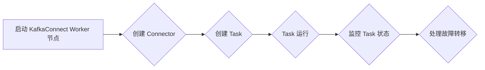

##  KafkaConnect：单节点模式探究

作者：禅与计算机程序设计艺术

## 1. 背景介绍

### 1.1 数据流式处理的兴起

随着互联网的快速发展，数据的产生和流动速度越来越快，传统的批处理方式已经无法满足实时性的需求。数据流式处理技术应运而生，它能够实时地采集、处理和分析数据，为企业提供更及时、更准确的决策支持。

### 1.2 KafkaConnect 的诞生

在数据流式处理领域，Apache Kafka 是一款高吞吐量、低延迟的分布式消息队列系统，被广泛应用于实时数据管道和流式处理平台。然而，Kafka 本身并不具备连接外部数据源和数据目标的能力，这就需要一个桥梁来实现数据的输入和输出。KafkaConnect 正是为此而生，它是一个可扩展的、可靠的、容错的工具，用于在 Apache Kafka 和其他系统之间流式传输数据。

### 1.3 KafkaConnect 的优势

* **可扩展性:** KafkaConnect 采用分布式架构，可以轻松地扩展到处理大规模数据流。
* **可靠性:** KafkaConnect 利用 Kafka 的持久性和容错机制，确保数据传输的可靠性。
* **容错性:** KafkaConnect 支持任务的故障转移，即使单个节点出现故障，也不会影响整个数据流。
* **易用性:** KafkaConnect 提供了丰富的配置选项和易于使用的 REST API，方便用户进行管理和监控。

## 2. 核心概念与联系

### 2.1 Connectors

Connector 是 KafkaConnect 的核心组件，它定义了如何从数据源读取数据或将数据写入数据目标。KafkaConnect 提供了丰富的 Connector 库，涵盖了各种常见的数据源和数据目标，例如：

* **数据源 Connector:** JDBC、File、Elasticsearch、MongoDB、MQTT 等
* **数据目标 Connector:** JDBC、File、Elasticsearch、MongoDB、Kafka 等

### 2.2 Tasks

Task 是 Connector 的执行单元，它负责实际的数据读取或写入操作。每个 Connector 可以配置多个 Task，以实现并行处理和提高吞吐量。

### 2.3 Workers

Worker 是 KafkaConnect 的运行实例，它负责管理 Connectors 和 Tasks。每个 Worker 可以运行多个 Connectors 和 Tasks。

### 2.4 核心概念联系图


## 3. 单节点模式工作原理

### 3.1 单节点模式概述

单节点模式是 KafkaConnect 最简单的部署模式，它只包含一个 Worker 节点。在这种模式下，所有的 Connectors 和 Tasks 都运行在同一个节点上。单节点模式适用于开发测试和小型生产环境。

### 3.2 工作流程

1. 启动 KafkaConnect Worker 节点。
2. 使用 REST API 或命令行工具创建 Connector，并配置数据源或数据目标。
3. KafkaConnect Worker 会根据 Connector 的配置创建 Task，并分配给 Worker 节点。
4. Task 开始从数据源读取数据或将数据写入数据目标。
5. KafkaConnect Worker 监控 Task 的运行状态，并处理故障转移。

### 3.3 工作流程图



## 4. 数学模型和公式详细讲解举例说明

### 4.1 数据吞吐量计算

KafkaConnect 的数据吞吐量取决于多个因素，例如：

* **数据源或数据目标的性能**
* **Connector 的配置**
* **Task 的数量**
* **Worker 节点的硬件资源**

我们可以使用以下公式来估算 KafkaConnect 的数据吞吐量：

```
吞吐量 = Task 数量 * 单个 Task 吞吐量
```

其中，单个 Task 吞吐量可以通过测试或监控指标获取。

### 4.2 举例说明

假设我们有一个 JDBC Connector，它从数据库中读取数据，并写入 Kafka。我们配置了 10 个 Task，每个 Task 的吞吐量为 1000 条消息/秒。那么，KafkaConnect 的总吞吐量为：

```
吞吐量 = 10 * 1000 = 10000 条消息/秒
```

## 5. 项目实践：代码实例和详细解释说明

### 5.1 文件流式传输示例

以下是一个使用 KafkaConnect 将文件数据流式传输到 Kafka 的示例：

**1. 创建 FileStreamSource Connector**

```
curl -X PUT http://localhost:8083/connectors/file-source-connector -H "Content-Type: application/json" -d '{
  "name": "file-source-connector",
  "config": {
    "connector.class": "FileStreamSource",
    "tasks.max": "1",
    "file": "/path/to/input/file.txt",
    "topic": "file-stream-topic"
  }
}'
```

**2. 解释说明**

* `connector.class`: 指定 Connector 的类型，这里使用 `FileStreamSource`。
* `tasks.max`: 指定 Task 的数量，这里设置为 1。
* `file`: 指定输入文件的路径。
* `topic`: 指定 Kafka 的目标主题。

### 5.2 数据库数据同步示例

以下是一个使用 KafkaConnect 将数据库数据同步到 Elasticsearch 的示例：

**1. 创建 JDBCSource Connector**

```
curl -X PUT http://localhost:8083/connectors/jdbc-source-connector -H "Content-Type: application/json" -d '{
  "name": "jdbc-source-connector",
  "config": {
    "connector.class": "io.confluent.connect.jdbc.JdbcSourceConnector",
    "tasks.max": "1",
    "connection.url": "jdbc:mysql://localhost:3306/mydatabase",
    "connection.user": "user",
    "connection.password": "password",
    "table.whitelist": "mytable",
    "mode": "incrementing",
    "incrementing.column.name": "id",
    "topic.prefix": "jdbc-"
  }
}'
```

**2. 创建 ElasticsearchSink Connector**

```
curl -X PUT http://localhost:8083/connectors/elasticsearch-sink-connector -H "Content-Type: application/json" -d '{
  "name": "elasticsearch-sink-connector",
  "config": {
    "connector.class": "io.confluent.connect.elasticsearch.ElasticsearchSinkConnector",
    "tasks.max": "1",
    "connection.url": "http://localhost:9200",
    "topics": "jdbc-mytable",
    "type.name": "mytable"
  }
}'
```

**3. 解释说明**

* `connector.class`: 指定 Connector 的类型，JDBCSource Connector 使用 `io.confluent.connect.jdbc.JdbcSourceConnector`，ElasticsearchSink Connector 使用 `io.confluent.connect.elasticsearch.ElasticsearchSinkConnector`。
* `tasks.max`: 指定 Task 的数量，这里设置为 1。
* `connection.url`: 指定数据库连接 URL 或 Elasticsearch 连接 URL。
* `table.whitelist`: 指定要同步的数据库表名。
* `mode`: 指定同步模式，`incrementing` 表示增量同步。
* `incrementing.column.name`: 指定增量同步的列名。
* `topic.prefix`: 指定 Kafka 的目标主题前缀。
* `topics`: 指定 Kafka 的源主题。
* `type.name`: 指定 Elasticsearch 的文档类型。

## 6. 实际应用场景

### 6.1 数据库实时同步

KafkaConnect 可以将数据库中的数据实时同步到 Kafka 或其他数据目标，例如 Elasticsearch、MongoDB 等。这对于构建实时数据仓库、实时报表和实时监控系统非常有用。

### 6.2 文件数据采集

KafkaConnect 可以从文件中读取数据，并将其流式传输到 Kafka。这对于处理日志文件、CSV 文件和其他文本文件非常有用。

### 6.3 IoT 数据采集

KafkaConnect 可以从各种 IoT 设备中采集数据，并将其流式传输到 Kafka。这对于构建智能家居、智能城市和工业物联网平台非常有用。

## 7. 工具和资源推荐

### 7.1 KafkaConnect 官方文档

KafkaConnect 官方文档提供了详细的配置选项、Connector 库和使用指南：https://kafka.apache.org/documentation/#connect

### 7.2 Confluent Hub

Confluent Hub 是一个 Connector 库，提供了各种数据源和数据目标的 Connector：https://www.confluent.io/hub/

### 7.3 Kafka Connect UI

Kafka Connect UI 是一个图形化工具，可以方便地管理和监控 KafkaConnect 集群：https://github.com/lensesio/kafka-connect-ui

## 8. 总结：未来发展趋势与挑战

### 8.1 未来发展趋势

* **更丰富的 Connector 库:** KafkaConnect 将继续扩展其 Connector 库，以支持更多的数据源和数据目标。
* **更强大的功能:** KafkaConnect 将提供更强大的功能，例如数据转换、数据过滤和数据聚合。
* **更易于使用:** KafkaConnect 将提供更易于使用的工具和 API，以简化配置和管理。

### 8.2 面临的挑战

* **安全性:** 随着数据量的增加，KafkaConnect 需要提供更强大的安全机制来保护数据安全。
* **性能:** KafkaConnect 需要不断优化其性能，以处理更大的数据量和更高的吞吐量。
* **可管理性:** 随着 KafkaConnect 集群规模的扩大，管理和监控 KafkaConnect 集群变得更加复杂。

## 9. 附录：常见问题与解答

### 9.1 如何解决 KafkaConnect 连接超时问题？

连接超时问题可能是由网络问题、数据源或数据目标性能问题或 KafkaConnect 配置问题引起的。您可以尝试以下方法解决问题：

* 检查网络连接是否正常。
* 检查数据源或数据目标的性能是否满足要求。
* 增加 KafkaConnect 的连接超时时间。

### 9.2 如何监控 KafkaConnect 的性能？

您可以使用 KafkaConnect 提供的 REST API 或 JMX 指标来监控 KafkaConnect 的性能。例如，您可以监控以下指标：

* Task 的吞吐量
* Task 的延迟
* Worker 节点的 CPU 使用率
* Worker 节点的内存使用率

### 9.3 如何处理 KafkaConnect 的故障转移？

KafkaConnect 支持任务的故障转移。当一个 Task 出现故障时，KafkaConnect 会将该 Task 重新分配给其他 Worker 节点。您可以通过配置 `tasks.max` 参数来控制 Task 的数量，以提高容错性。