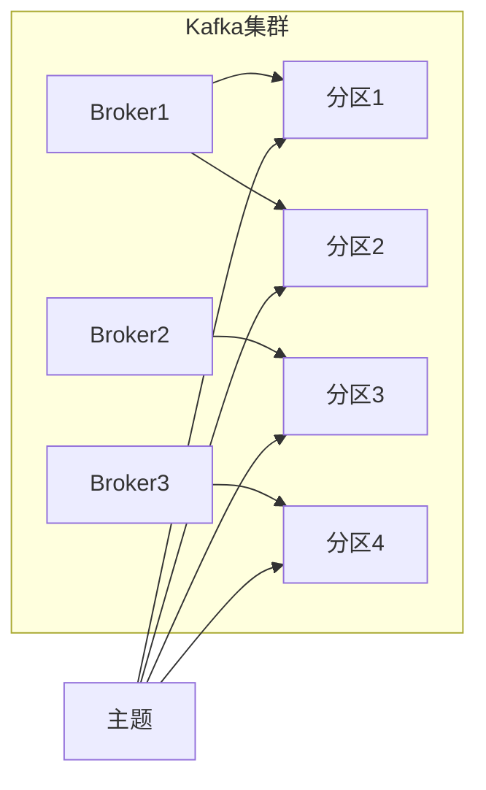
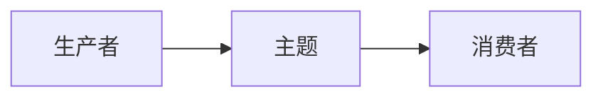

# Kafka主题与分区：数据的组织之道

作者：禅与计算机程序设计艺术

## 1. 背景介绍

### 1.1 消息引擎与Kafka的崛起

在当今数据驱动的世界中，应用程序需要高效可靠地处理海量数据流。消息引擎作为一种关键的基础架构组件，应运而生，为应用程序提供了一种异步、松耦合的通信方式。Apache Kafka作为一款高吞吐量、分布式的发布-订阅消息系统，凭借其可扩展性、容错性和高性能等优势，迅速成为消息引擎领域的领头羊，被广泛应用于实时数据管道、日志收集、事件驱动架构等场景。

### 1.2 Kafka如何组织数据：主题与分区的概念

Kafka通过**主题（Topic）**和**分区（Partition）**的概念来组织和存储数据，这两者是理解Kafka工作原理的关键。

- **主题**：逻辑上的数据分类，类似于数据库中的表，用于对消息进行分类存储。生产者将消息发布到特定的主题，消费者订阅感兴趣的主题以接收消息。
- **分区**：主题的物理划分，一个主题可以被分为多个分区，每个分区都是一个有序、不可变的消息序列。分区的存在是为了实现数据的并行处理和水平扩展。

### 1.3 为什么需要主题和分区

主题和分区的引入，为Kafka带来了以下优势：

- **可扩展性**：通过增加分区数量，可以将数据分布到更多的broker节点上，从而提高系统的吞吐量和处理能力。
- **容错性**：每个分区都有多个副本，即使某个broker节点宕机，其他副本仍然可以提供服务，保证了数据的可靠性。
- **并行处理**：多个消费者可以并行地消费同一个主题的不同分区，从而提高消息的处理速度。

## 2. 核心概念与联系

### 2.1 主题、分区与Broker的关系

- **Broker**：Kafka集群中的服务器节点，负责存储消息、处理消息的读写请求。
- **主题**：逻辑上的消息分类，一个主题可以被分配到多个Broker上。
- **分区**：主题的物理划分，一个分区只能属于一个Broker，但一个Broker可以拥有多个分区。

**关系图：**



### 2.2 生产者、消费者与主题的关系

- **生产者**：将消息发布到指定的主题。
- **消费者**：订阅感兴趣的主题，并从主题中消费消息。

**关系图：**



### 2.3 分区与消息顺序的关系

每个分区都是一个有序的消息序列，这意味着在同一个分区内，消息的顺序是严格按照生产者发送的顺序进行存储和消费的。

## 3. 核心算法原理具体操作步骤

### 3.1 生产者发送消息到主题的流程

1. **选择主题**：生产者需要指定要发送消息的目标主题。
2. **确定分区**：Kafka根据指定的**分区策略**将消息分配到主题的某个分区。常见的策略包括：
    - **轮询策略**：将消息依次分配到各个分区，保证数据均匀分布。
    - **随机策略**：随机选择一个分区发送消息。
    - **键值哈希策略**：根据消息的键计算哈希值，并根据哈希值将消息分配到对应的分区，确保相同键的消息被发送到同一个分区。
3. **发送消息**：生产者将消息发送到目标分区的leader副本。
4. **消息确认**：leader副本收到消息后，写入本地磁盘，并返回确认信息给生产者。

### 3.2 消费者从主题消费消息的流程

1. **订阅主题**：消费者需要订阅感兴趣的主题。
2. **加入消费者组**：多个消费者可以组成一个消费者组，共同消费同一个主题的消息。
3. **分配分区**：Kafka会将主题的所有分区分配给消费者组中的各个消费者，每个分区只能由一个消费者消费。
4. **拉取消息**：消费者定期地从分配到的分区中拉取消息。
5. **消息确认**：消费者成功消费消息后，会向Kafka提交偏移量，标识已经消费的最后一条消息的位置。

## 4. 数学模型和公式详细讲解举例说明

### 4.1 消息吞吐量计算

假设一个主题有 $P$ 个分区，每个分区每秒可以处理 $M$ 条消息，那么该主题的理论最大吞吐量为：

$$
吞吐量 = P * M
$$

例如，一个主题有 3 个分区，每个分区每秒可以处理 1000 条消息，那么该主题的理论最大吞吐量为 3 * 1000 = 3000 条/秒。

### 4.2 消费者组消费能力计算

假设一个消费者组有 $C$ 个消费者，一个主题有 $P$ 个分区，那么每个消费者平均需要消费的分区数量为：

$$
每个消费者平均消费的分区数量 = P / C
$$

例如，一个消费者组有 2 个消费者，一个主题有 3 个分区，那么每个消费者平均需要消费 3 / 2 = 1.5 个分区。由于分区数量必须为整数，因此一个消费者会消费 2 个分区，另一个消费者会消费 1 个分区。

## 5. 项目实践：代码实例和详细解释说明

### 5.1 生产者代码示例（Java）

```java
import org.apache.kafka.clients.producer.KafkaProducer;
import org.apache.kafka.clients.producer.ProducerConfig;
import org.apache.kafka.clients.producer.ProducerRecord;
import org.apache.kafka.common.serialization.StringSerializer;

import java.util.Properties;

public class ProducerDemo {

    public static void main(String[] args) {
        // 设置 Kafka 生产者配置
        Properties props = new Properties();
        props.put(ProducerConfig.BOOTSTRAP_SERVERS_CONFIG, "localhost:9092");
        props.put(ProducerConfig.KEY_SERIALIZER_CLASS_CONFIG, StringSerializer.class.getName());
        props.put(ProducerConfig.VALUE_SERIALIZER_CLASS_CONFIG, StringSerializer.class.getName());

        // 创建 Kafka 生产者
        KafkaProducer<String, String> producer = new KafkaProducer<>(props);

        // 发送消息
        for (int i = 0; i < 10; i++) {
            ProducerRecord<String, String> record = new ProducerRecord<>("my-topic", "message-" + i);
            producer.send(record);
        }

        // 关闭生产者
        producer.close();
    }
}
```

**代码解释：**

- 首先，需要设置 Kafka 生产者的配置，包括 Kafka 集群地址、键值序列化器等。
- 然后，创建 Kafka 生产者对象。
- 在循环中，创建 ProducerRecord 对象，指定目标主题、消息键和消息值，并使用 `producer.send()` 方法发送消息。
- 最后，关闭 Kafka 生产者对象。

### 5.2 消费者代码示例（Java）

```java
import org.apache.kafka.clients.consumer.ConsumerConfig;
import org.apache.kafka.clients.consumer.ConsumerRecord;
import org.apache.kafka.clients.consumer.ConsumerRecords;
import org.apache.kafka.clients.consumer.KafkaConsumer;
import org.apache.kafka.common.serialization.StringDeserializer;

import java.time.Duration;
import java.util.Arrays;
import java.util.Properties;

public class ConsumerDemo {

    public static void main(String[] args) {
        // 设置 Kafka 消费者配置
        Properties props = new Properties();
        props.put(ConsumerConfig.BOOTSTRAP_SERVERS_CONFIG, "localhost:9092");
        props.put(ConsumerConfig.GROUP_ID_CONFIG, "my-group");
        props.put(ConsumerConfig.KEY_DESERIALIZER_CLASS_CONFIG, StringDeserializer.class.getName());
        props.put(ConsumerConfig.VALUE_DESERIALIZER_CLASS_CONFIG, StringDeserializer.class.getName());

        // 创建 Kafka 消费者
        KafkaConsumer<String, String> consumer = new KafkaConsumer<>(props);

        // 订阅主题
        consumer.subscribe(Arrays.asList("my-topic"));

        // 消费消息
        while (true) {
            ConsumerRecords<String, String> records = consumer.poll(Duration.ofMillis(10