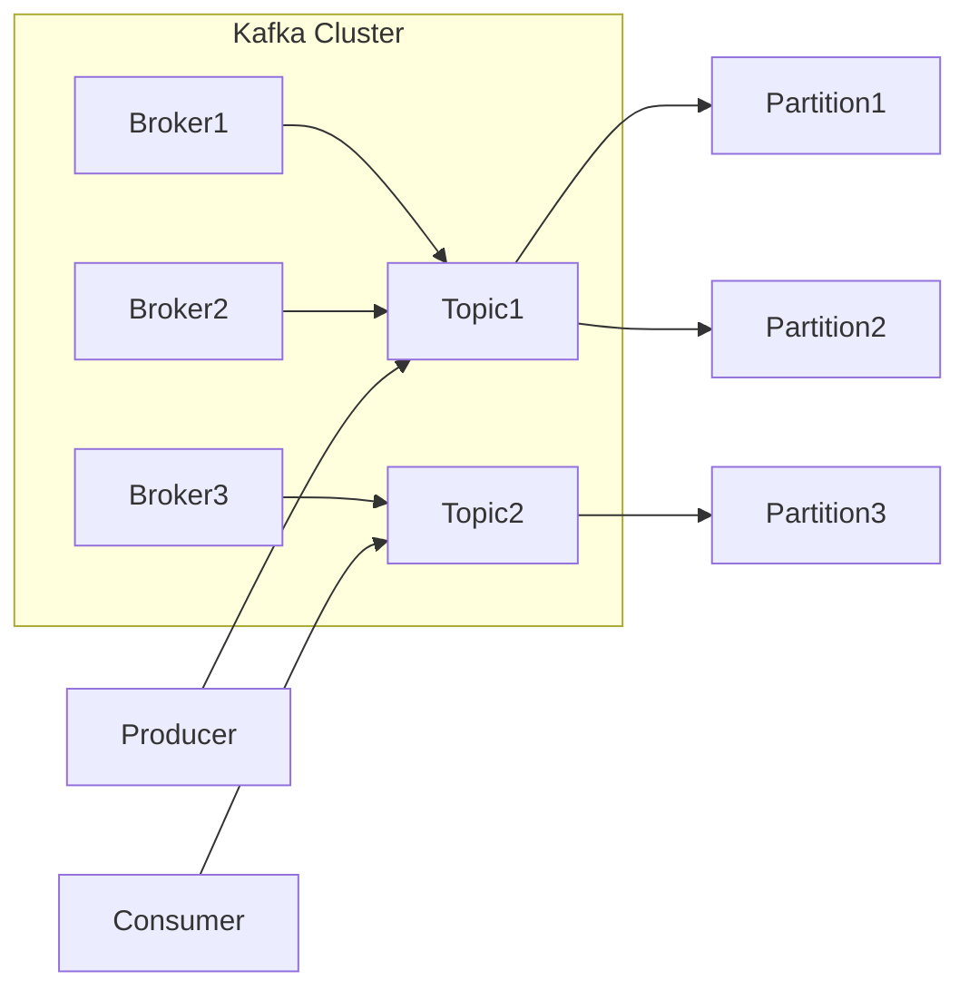

## 1. 背景介绍

### 1.1 分布式系统的消息队列需求

随着互联网的迅速发展，分布式系统越来越普及。在分布式系统中，不同服务之间需要进行可靠的数据交换。消息队列作为一种重要的中间件，可以有效地解决分布式系统中消息传递的可靠性、解耦性、异步性等问题。

### 1.2 Kafka的诞生与发展

Kafka最初由LinkedIn公司开发，用于处理高吞吐量的网站活动跟踪数据。后来，Kafka发展成为一个通用的分布式流平台，被广泛应用于各种场景，例如：

* **消息传递:** 在微服务架构中，服务之间通过消息队列进行异步通信。
* **网站活动跟踪:** 收集用户行为数据，例如页面浏览、点击、搜索等，用于数据分析和推荐系统。
* **日志收集:** 收集应用程序的日志信息，用于监控和故障排除。
* **流处理:** 对实时数据流进行处理，例如实时数据分析、欺诈检测等。

## 2. 核心概念与联系

### 2.1 主题（Topic）与分区（Partition）

Kafka的核心概念是**主题**和**分区**。**主题**是消息的逻辑分类，类似于数据库中的表。**分区**是主题的物理分组，每个分区包含一部分消息数据。Kafka将主题划分为多个分区，并将分区分布到不同的Kafka broker节点上，以实现负载均衡和高可用性。

### 2.2 生产者（Producer）与消费者（Consumer）

**生产者**负责将消息发送到Kafka主题。**消费者**订阅Kafka主题，并接收来自该主题的消息。Kafka支持多个生产者和消费者同时读写同一个主题。

### 2.3 Broker与集群（Cluster）

**Broker**是Kafka的服务器节点，负责存储消息数据、处理消息请求。**集群**是由多个Broker组成的分布式系统，提供高可用性和容错性。

### 2.4 消息格式与序列化

Kafka消息由**键值对**组成，键和值都可以是任意字节序列。Kafka支持多种序列化格式，例如JSON、Avro、Protobuf等。

### 2.5 核心概念联系图



## 3. 核心算法原理具体操作步骤

### 3.1 生产者发送消息

1. 生产者将消息序列化为字节数组。
2. 生产者根据消息的键计算消息的目标分区。
3. 生产者将消息发送到目标分区所在的Broker节点。
4. Broker节点将消息追加到分区日志文件的末尾。

### 3.2 消费者消费消息

1. 消费者订阅感兴趣的主题。
2. Kafka将主题的分区分配给消费者组的成员。
3. 消费者从分配的分区中读取消息。
4. 消费者根据消息的偏移量跟踪消费进度。
5. 消费者将消息反序列化为原始数据类型。

### 3.3 数据复制与高可用性

Kafka通过数据复制机制保证高可用性。每个分区都有多个副本，其中一个副本是领导者，其他副本是跟随者。领导者负责处理所有读写请求，跟随者从领导者同步数据。当领导者节点故障时，Kafka会自动选举新的领导者，确保服务的连续性。

## 4. 数学模型和公式详细讲解举例说明

### 4.1 消息传递的可靠性保障

Kafka通过以下机制保证消息传递的可靠性：

* **数据复制:** 每个分区都有多个副本，确保数据冗余。
* **消息确认:** 生产者可以选择等待Broker确认消息写入成功。
* **消费者偏移量:** 消费者跟踪消费进度，确保消息不会丢失或重复消费。

### 4.2 分区分配策略

Kafka提供了多种分区分配策略，例如：

* **Range分配:** 将连续的分区分配给消费者。
* **RoundRobin分配:** 循环分配分区给消费者。
* **Sticky分配:** 尽量保持消费者与分区之间的分配关系，减少分区迁移带来的开销。

### 4.3 消息保留机制

Kafka可以根据时间或大小来配置消息的保留策略，例如：

* **保留时间:** 超过指定时间的旧消息会被删除。
* **保留大小:** 当分区的大小超过指定阈值时，旧消息会被删除。

## 5. 项目实践：代码实例和详细解释说明

### 5.1 生产者代码示例

```java
import org.apache.kafka.clients.producer.KafkaProducer;
import org.apache.kafka.clients.producer.ProducerConfig;
import org.apache.kafka.clients.producer.ProducerRecord;
import org.apache.kafka.common.serialization.StringSerializer;

import java.util.Properties;

public class KafkaProducerExample {

    public static void main(String[] args) {
        // 配置Kafka生产者
        Properties props = new Properties();
        props.put(ProducerConfig.BOOTSTRAP_SERVERS_CONFIG, "localhost:9092");
        props.put(ProducerConfig.KEY_SERIALIZER_CLASS_CONFIG, StringSerializer.class.getName());
        props.put(ProducerConfig.VALUE_SERIALIZER_CLASS_CONFIG, StringSerializer.class.getName());

        // 创建Kafka生产者实例
        KafkaProducer<String, String> producer = new KafkaProducer<>(props);

        // 发送消息
        for (int i = 0; i < 10; i++) {
            ProducerRecord<String, String> record = new ProducerRecord<>("my-topic", "key-" + i, "value-" + i);
            producer.send(record);
        }

        // 关闭生产者
        producer.close();
    }
}
```

### 5.2 消费者代码示例

```java
import org.apache.kafka