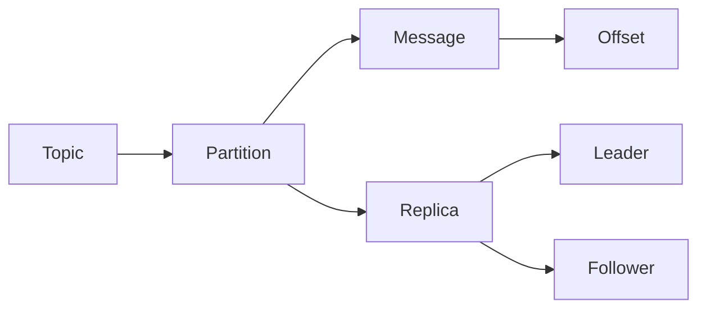

## Kafka数据存储：深入文件系统

作者：禅与计算机程序设计艺术

## 1. 背景介绍

### 1.1 消息队列与Kafka

在当今互联网时代，海量数据的实时处理和分析需求日益增长。消息队列作为一种异步通信机制，能够有效地解耦生产者和消费者，提高系统的吞吐量和可扩展性。Kafka作为一款高吞吐量、低延迟的分布式发布-订阅消息系统，凭借其优秀的数据存储和处理能力，在实时数据流处理、日志收集、事件驱动架构等领域得到了广泛应用。

### 1.2 Kafka数据存储挑战

Kafka的核心功能之一是持久化存储消息数据。与传统的关系型数据库不同，Kafka采用了一种基于文件系统的简单而高效的存储机制。然而，随着数据规模的不断扩大，Kafka的数据存储面临着一些挑战：

* **海量数据存储：** Kafka需要处理海量消息数据，这对文件系统的存储容量和读写性能提出了很高的要求。
* **数据可靠性：** 作为关键基础设施，Kafka需要保证数据的可靠性和一致性，防止数据丢失或损坏。
* **高效的数据检索：** Kafka需要支持快速的消息检索，以满足实时数据处理和分析的需求。

### 1.3 本文目标

本文旨在深入探讨Kafka数据存储的核心机制，揭示其文件系统架构和工作原理。通过本文的学习，读者将能够：

* 理解Kafka数据存储的基本概念和原理
* 掌握Kafka文件系统的组织结构和关键组件
* 了解Kafka数据存储的关键技术和优化策略
* 能够根据实际应用场景选择合适的Kafka配置和优化方案

## 2. 核心概念与联系

### 2.1 主题（Topic）和分区（Partition）

在Kafka中，消息以主题（Topic）为单位进行逻辑划分。主题可以理解为消息的类别或频道。为了提高系统的吞吐量和可扩展性，Kafka将每个主题进一步划分为多个分区（Partition）。每个分区都是一个有序的消息队列，消息按照写入顺序追加到分区的末尾。

### 2.2 消息（Message）和偏移量（Offset）

消息是Kafka中最小的数据单元，由一个可选的键（Key）和一个值（Value）组成。键可以用于消息的路由和分区，而值则存储实际的消息内容。每个消息在分区内都有一个唯一的偏移量（Offset），用于标识消息在分区中的位置。

### 2.3 副本（Replica）和领导者（Leader）

为了保证数据的高可用性，Kafka为每个分区维护多个副本（Replica）。副本之间的数据是完全同步的。其中一个副本被选举为领导者（Leader），负责处理所有来自生产者和消费者的请求。其他副本作为追随者（Follower），从领导者同步数据。

### 2.4 文件系统组织结构

Kafka将所有数据存储在磁盘上的文件系统中。每个主题都有一个对应的目录，目录名与主题名相同。每个分区在主题目录下对应一个子目录，子目录名格式为"topic-partition"，例如"my-topic-0"。

```
kafka-logs
└── my-topic
    ├── partition-0
    │   ├── 00000000000000000000.log
    │   ├── 00000000000000000000.index
    │   ├── 00000000000000010000.log
    │   └── 00000000000000010000.index
    └── partition-1
        ├── 00000000000000000000.log
        ├── 00000000000000000000.index
        ├── 00000000000000010000.log
        └── 00000000000000010000.index
```

### 2.5 核心概念关系图



## 3. 核心算法原理具体操作步骤

### 3.1 消息写入流程

1. **生产者发送消息：** 生产者将消息发送到Kafka集群中的某个Broker节点。
2. **Broker接收消息：** Broker节点接收到消息后，根据消息的主题和分区信息，将消息写入到对应的分区副本中。
3. **数据写入磁盘：** Broker节点将消息追加写入到分区对应的日志文件（.log）的末尾。
4. **更新索引文件：** Broker节点同时更新分区对应的索引文件（.index），记录消息在日志文件中的偏移量。
5. **确认消息写入：** 当所有同步副本都成功写入消息后，Broker节点向生产者发送确认消息。

### 3.2 消息读取流程

1. **消费者发送请求：** 消费者向Kafka集群中的某个Broker节点发送消息读取请求，指定要读取的主题、分区和偏移量。
2. **Broker处理请求：** Broker节点接收到请求后，根据请求信息定位到对应的分区副本。
3. **读取消息数据：** Broker节点从分区副本的日志文件中读取指定偏移量之后的消息数据。
4. **返回消息数据：** Broker节点将读取到的消息数据返回给消费者。

## 4. 数学模型和公式详细讲解举例说明

### 4.1 消息存储模型

Kafka采用了一种基于日志段（Log Segment）的消息存储模型。每个分区对应多个日志段，每个日志段对应一个日志文件和一个索引文件。日志文件存储实际的消息数据，索引文件存储消息偏移量和在日志文件中的位置信息。

### 4.2 索引文件结构

索引文件采用稀疏索引的方式，只为部分消息建立索引。每个索引项包含两个部分：

* **相对偏移量（Relative Offset）：** 相对于日志段起始偏移量的偏移量。
* **消息位置（Position）：** 消息在日志文件中的物理地址。

### 4.3 查找消息

当需要查找某个偏移量的消息时，首先需要找到该偏移量所在的日志段，然后在该日志段的索引文件中查找对应的索引项，最后根据索引项中的消息位置读取消息数据。

**举例说明：**

假设要查找偏移量为100的消息，日志段大小为1000，索引项间隔为100。

1. 首先计算目标消息所在的日志段：100 / 1000 = 0，即目标消息在第一个日志段中。
2. 然后计算目标消息在日志段中的相对偏移量：100 % 1000 = 100。
3. 接着在索引文件中查找相对偏移量为100的索引项，假设该索引项的值为500，表示该消息在日志文件中的物理地址为500。
4. 最后读取日志文件中从地址500开始的消息数据，即可找到偏移量为100的消息。

## 5. 项目实践：代码实例和详细解释说明

### 5.1 生产者示例代码

```java
Properties props = new Properties();
props.put("bootstrap.servers", "localhost:9092");
props.put("key.serializer", "org.apache.kafka.common.serialization.StringSerializer");
props.put("value.serializer", "org.apache.kafka.common.serialization.StringSerializer");

KafkaProducer<String, String> producer = new KafkaProducer<>(props);

for (int i = 0; i < 100; i++) {
  ProducerRecord<String, String> record = new ProducerRecord<>("my-topic", "key-" + i, "value-" + i);
  producer.send(record);
}

producer.close();
```

### 5.2 消费者示例代码

```java
Properties props = new Properties();
props.put("bootstrap.servers", "localhost:9092");
props.put("group.id", "my-group");
props.put("key.deserializer",