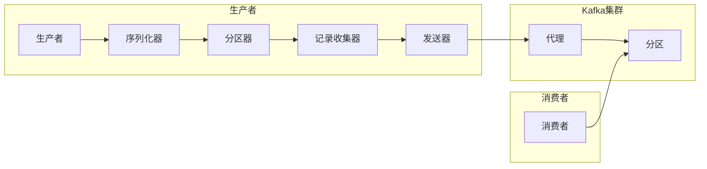

# Kafka源码解析：生产者发送消息流程

作者：禅与计算机程序设计艺术

## 1. 背景介绍

### 1.1 消息队列概述

消息队列中间件是分布式系统中不可或缺的组件，主要解决应用耦合、异步消息、流量削峰等问题。Kafka作为一款高吞吐量、低延迟、高可扩展性的分布式消息队列系统，在实时数据处理、日志收集、监控告警等场景中得到了广泛应用。

### 1.2 Kafka生产者概述

Kafka生产者是消息的生产者，负责将消息发送到Kafka集群。生产者发送消息的过程是一个复杂的过程，涉及到消息序列化、分区选择、网络传输等多个环节。

### 1.3 本文目标

本文将深入分析Kafka生产者发送消息的流程，从源码层面剖析其内部机制，帮助读者更好地理解Kafka生产者的工作原理，以及如何优化生产者性能。

## 2. 核心概念与联系

### 2.1 消息

消息是Kafka中最基本的数据单元，每条消息包含一个key和一个value，以及一些元数据信息，例如topic、partition、offset等。

### 2.2 主题（Topic）

主题是逻辑上的消息分类，生产者将消息发送到指定的主题，消费者订阅感兴趣的主题消费消息。

### 2.3 分区（Partition）

分区是主题的物理划分，一个主题可以包含多个分区，每个分区都是一个有序的消息队列。分区机制保证了消息的顺序性，同时也提高了Kafka的吞吐量。

### 2.4 生产者（Producer）

生产者负责将消息发送到Kafka集群，生产者可以选择同步发送或异步发送消息。

### 2.5 代理（Broker）

代理是Kafka集群中的服务器节点，每个代理负责管理一部分分区数据。

### 2.6 消费者（Consumer）

消费者负责从Kafka集群中消费消息，消费者可以消费指定主题下的所有分区数据。

### 2.7 关系图



## 3. 核心算法原理具体操作步骤

### 3.1 生产者发送消息流程

生产者发送消息的主要步骤如下：

1.  **消息序列化：** 生产者将消息对象序列化成字节数组，以便在网络中传输。

2.  **选择分区：** 生产者根据消息的key和分区策略选择消息要发送到的分区。

3.  **消息缓存：** 生产者将消息添加到消息缓存中，等待发送到Kafka集群。

4.  **批量发送：** 当消息缓存达到一定阈值或等待时间超过指定时间后，生产者将缓存中的消息批量发送到Kafka集群。

5.  **网络传输：** 生产者使用网络将消息发送到Kafka集群。

6.  **消息确认：** Kafka集群收到消息后，会向生产者发送确认消息。

### 3.2 核心代码分析

#### 3.2.1 消息发送入口

生产者发送消息的入口方法是`KafkaProducer#send`方法，该方法接收一个`ProducerRecord`对象和一个回调函数作为参数。

```java
public Future<RecordMetadata> send(ProducerRecord<K, V> record, Callback callback) {
    // ...
}
```

#### 3.2.2 消息序列化

`send`方法首先调用`partition`方法选择消息要发送到的分区，然后调用`append`方法将消息追加到消息缓存中。

```java
private long append(TopicPartition tp,
                   long timestamp,
                   byte[] key,
                   byte[] value,
                   Headers headers,
                   Callback callback,
                   long maxTimeToWait,
                   boolean abortOnNewBatch) throws InterruptedException {
    // ...
    // 序列化消息
    byte[] serializedKey = keySerializer.serialize(record.topic(), headers, record.key());
    byte[] serializedValue = valueSerializer.serialize(record.topic(), headers, record.value());
    // ...
}
```

#### 3.2.3 选择分区

`partition`方法根据消息的key和分区策略选择消息要发送到的分区。

```java
private int partition(ProducerRecord<K, V> record, byte[] serializedKey, int partitionCount) {
    // ...
    // 如果消息指定了分区，则直接返回
    if (record.partition() != null) {
        return record.partition();
    }
    // 如果消息没有指定分区，则根据分区策略选择分区
    return this.partitioner.partition(
            record.topic(), record.key(), serializedKey, record.value(), cluster.partitionForTopic(record.topic()), rng);
}
```

#### 3.2.4 消息缓存

`append`方法将消息追加到消息缓存中，消息缓存是一个`RecordAccumulator`对象，它维护了一个`ConcurrentMap<TopicPartition, Deque<ProducerBatch>>>`类型的缓存，用于缓存每个分区的消息。

```java
private long append(TopicPartition tp,
                   long timestamp,
                   byte[] key,
                   byte[] value,
                   Headers headers,
                   Callback callback,
                   long maxTimeToWait,
                   boolean abortOnNewBatch) throws InterruptedException {
    // ...
    // 获取分区对应的消息队列
    Deque<ProducerBatch> dq = batches.get(tp);
    // ...
    // 创建消息批次
    ProducerBatch batch = new ProducerBatch(tp, ByteBuffer.allocate(batchSize), compression,
            Deque.class.cast(dq).peekLast().baseSequence() + Deque.class.cast(dq).peekLast().recordCount(), now);
    // 将消息添加到消息批次中
    FutureRecordMetadata future = batch.tryAppend(timestamp, key, value, headers, callback, now);
    // ...
}
```

#### 3.2.5 批量发送

`Sender`线程负责将消息缓存中的消息批量发送到Kafka集群，`Sender`线程会定期检查消息缓存是否已满或等待时间是否超过指定时间，如果满足条件，则将缓存中的消息批量发送到Kafka集群。

```java
public void run() {
    // ...
    // 获取待发送的消息批次
    Map<Cluster, List<ProducerBatch>> batches = this.accumulator.drain(
            cluster,
            Collections.emptyMap(),
            this.maxRequestSize,
            this.maxBlockTimeMs
    );
    // ...
    // 发送消息
    for (Cluster cluster : batches.keySet()) {
        // ...
        for (ProducerBatch batch : batches.get(cluster)) {
            // ...
            this.client.send(clientRequest, now);
            // ...
        }
    }
    // ...
}
```

#### 3.2.6 网络传输

`Sender`线程使用`NetworkClient`发送消息到Kafka集群，`NetworkClient`使用Java NIO实现网络通信。

```java
public void send(ClientRequest request, long now) {
    // ...
    // 发送请求
    this.selector.send(request.request());
    // ...
}
```

#### 3.2.7 消息确认

Kafka集群收到消息后，会向生产者发送确认消息，生产者收到确认消息后，会将消息从消息缓存中移除。

## 4. 数学模型和公式详细讲解举例说明

### 4.1 消息队列长度

消息队列的长度是指消息队列中未被消费的消息数量。

### 4.2 生产者吞吐量

生产者吞吐量是指生产者每秒发送的消息数量。

### 4.3 消费者吞吐量

消费者吞吐量是指消费者每秒消费的消息数量。

### 4.4 消息延迟

消息延迟是指消息从生产者发送到消费者消费的时间间隔。

## 5. 项目实践：代码实例和详细解释说明

### 5.1 生产者配置

```java
Properties props = new Properties();
props.put("bootstrap.servers", "localhost:9092");
props.put("acks", "all");
props.put("retries", 0);
props.put("batch.size", 16384);
props.put("linger.ms", 1);
props.put("buffer.memory", 