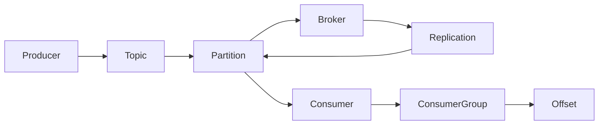

# Kafka：开启流式数据之旅

## 1.背景介绍

### 1.1 数据处理的演进

在当今的数字时代，数据无疑成为了企业和组织的命脉。从传统的批处理系统到现代的实时流式处理架构,数据处理的范式经历了一场翻天覆地的变革。这种转变源于对实时数据的需求不断增长,以及对大规模数据集的有效处理的需求。

传统的数据处理系统通常采用批处理的方式,将大量数据周期性地加载到数据仓库或数据湖中,然后执行分析任务。这种方法虽然可以处理海量数据,但存在着固有的延迟,难以满足实时处理的需求。

随着物联网、移动设备和社交媒体的兴起,实时数据源变得越来越普遍。这些数据源产生了大量的连续数据流,需要被实时捕获、处理和分析,以便及时做出反应和决策。这就催生了流式处理架构的出现,旨在实时处理持续到来的数据流。

### 1.2 Kafka的崛起

在这种背景下,Apache Kafka应运而生,成为流式处理领域的佼佼者。Kafka最初由LinkedIn公司开发,旨在解决其内部大规模日志处理的问题。后来,它被捐献给Apache软件基金会,成为一个开源项目,并迅速在业界获得广泛采用。

Kafka的核心设计理念是将数据流作为一种新型的可持久化、可复制的分区日志,提供了一种统一的数据管道,能够可靠地在不同的数据源和数据处理系统之间移动数据。它的分布式、高吞吐、容错和可扩展的特性使其成为实时数据管道的理想之选。

### 1.3 流式处理的优势

与传统的批处理系统相比,流式处理架构具有诸多优势:

1. **实时性**: 流式处理系统能够在数据到达时立即处理,而无需等待批处理周期,从而实现近乎实时的数据处理。
2. **连续性**: 流式处理系统可以持续不断地处理数据流,而无需定期重启。
3. **可扩展性**: 流式处理系统通常采用分布式架构,可以通过增加节点来水平扩展,满足不断增长的数据量和计算需求。
4. **容错性**: 流式处理系统通常具有容错和故障恢复机制,能够保证数据处理的可靠性和一致性。
5. **低延迟**: 流式处理系统能够实现毫秒级的低延迟,满足对实时响应的需求。

凭借这些优势,流式处理架构已经广泛应用于各个领域,如实时监控、物联网、金融交易、在线广告、网络安全等。Kafka作为流式处理的核心组件,扮演着关键的角色。

## 2.核心概念与联系

在深入探讨Kafka的核心原理之前,我们需要先了解一些关键概念,以及它们之间的关系。

### 2.1 核心概念

1. **Topic(主题)**: Topic是Kafka中的基本概念,可以被视为一个持久化、分区的日志流。生产者将消息发布到特定的Topic中,而消费者则从Topic中消费消息。每个Topic可以划分为多个Partition(分区),以实现水平扩展。

2. **Partition(分区)**: Partition是Topic的一个逻辑子集,用于提高并行度和可扩展性。每个Partition中的消息是有序的,并且由一个单独的Broker(代理)管理。

3. **Broker(代理)**: Broker是Kafka集群中的单个节点实例。它负责维护Topic的Partition,处理生产者和消费者的请求,以及与其他Broker进行通信和数据复制。

4. **Producer(生产者)**: Producer是向Kafka集群发送消息的客户端应用程序或服务。它将消息发布到指定的Topic中。

5. **Consumer(消费者)**: Consumer是从Kafka集群中消费消息的客户端应用程序或服务。它从一个或多个Topic中订阅并消费消息。

6. **Consumer Group(消费者组)**: Consumer Group是一组共享相同消费进度的Consumer实例。每个Partition只能被同一个Consumer Group中的一个Consumer实例消费,以确保消息的有序性和消费的平衡性。

7. **Offset(偏移量)**: Offset是消息在Partition中的位置标识符。Consumer需要跟踪自己消费的Offset,以便在重启或失败后能够从上次的位置继续消费。

8. **Replication(复制)**: Kafka支持在多个Broker之间复制Topic的Partition,以实现高可用性和容错性。每个Partition有一个Leader Broker和若干Follower Broker,Leader负责读写操作,而Follower则同步Leader的数据。

### 2.2 核心概念之间的关系

这些核心概念之间存在着密切的关系,构成了Kafka的整体架构和工作流程。下图展示了它们之间的关系:



1. Producer将消息发送到Topic中。
2. Topic被划分为多个Partition,每个Partition由一个Broker管理。
3. Partition中的数据通过Replication机制在多个Broker之间复制,以实现高可用性。
4. Consumer从Partition中消费消息,并维护自己的Offset。
5. 多个Consumer可以组成一个ConsumerGroup,共享消费进度和负载均衡。

通过这种设计,Kafka实现了高吞吐、可扩展、容错和有序性等关键特性,成为流式处理架构的核心组件。

## 3.核心算法原理具体操作步骤

### 3.1 生产者发送消息

当生产者向Kafka发送消息时,会经历以下步骤:

1. 生产者建立与Kafka集群的连接,并获取Topic的元数据信息,包括Partition的分布情况。
2. 根据配置的分区策略(如round-robin、key-based等),生产者选择一个Partition来发送消息。
3. 生产者将消息序列化为字节数组,并发送给该Partition的Leader Broker。
4. Leader Broker将消息写入本地日志文件,并向生产者返回一个offset作为消息的位置标识。
5. Leader Broker将消息异步复制到所有Follower Broker。
6. 当所有同步复制完成后,Leader Broker向生产者发送一个确认响应。

### 3.2 消费者消费消息

消费者从Kafka消费消息的过程如下:

1. 消费者向Kafka集群发送一个订阅请求,指定要消费的Topic及其Partition列表。
2. Kafka根据Consumer Group的策略为消费者分配Partition的消费权限。
3. 消费者从分配的Partition中获取最新的offset,并开始消费消息。
4. 消费者定期向Kafka发送心跳信号,以维护自己在Consumer Group中的活跃状态。
5. 如果消费者长时间未发送心跳,Kafka会认为它已经失效,并将其分配的Partition重新分配给其他活跃的消费者。
6. 消费者处理完消息后,将offset提交给Kafka,以便在重启后能够继续从上次的位置消费。

### 3.3 复制和故障恢复

为了实现高可用性和容错性,Kafka采用了复制和故障恢复机制:

1. 每个Partition都有一个Leader Broker和多个Follower Broker。
2. Leader Broker负责读写操作,并将消息复制到所有Follower Broker。
3. 如果Leader Broker发生故障,其中一个Follower Broker会被选举为新的Leader。
4. 新的Leader会从上一个Leader的最后一个完整复制的offset位置开始,继续处理读写请求。
5. 如果某个Follower Broker长时间未能与Leader同步,它会被视为已失效,并从ISR(In-Sync Replica)列表中移除。
6. 当失效的Follower重新加入集群时,它会从Leader那里重新复制所有缺失的消息。

通过这种复制和故障恢复机制,Kafka可以确保数据不会丢失,并且在发生故障时能够快速恢复服务。

## 4.数学模型和公式详细讲解举例说明

在Kafka的设计和实现中,涉及到一些数学模型和公式,用于优化性能、均衡负载和确保一致性。

### 4.1 Partition分配策略

Kafka采用一种基于散列的Partition分配策略,以实现消息在不同Partition之间的均匀分布。这种策略可以确保负载均衡,并提高并行度和吞吐量。

假设有N个Partition和M个消费者,则每个消费者应该被分配 $\lceil \frac{N}{M} \rceil$ 个Partition。具体的分配算法如下:

1. 计算每个消费者应该分配的Partition数量: $n = \lceil \frac{N}{M} \rceil$
2. 对每个Partition计算一个散列值: $h_i = \text{hash}(topic, partition_id)$
3. 对消费者编号: $c_0, c_1, \ldots, c_{M-1}$
4. 将Partition $i$ 分配给消费者 $c_j$,其中 $j = h_i \bmod M$

通过这种分配策略,可以确保相同的Partition总是被分配给同一个消费者,并且Partition在消费者之间基本均匀分布。

### 4.2 复制协议

Kafka采用了一种基于ISR(In-Sync Replica)的复制协议,以确保数据的一致性和持久性。当Leader接收到生产者发送的消息时,它会将消息写入本地日志,并将消息复制到所有ISR中的Follower。只有当所有ISR中的Follower都成功复制了消息,Leader才会向生产者发送确认响应。

假设有一个Topic的Partition,其复制因子为N,即有N个Replica(包括Leader和Follower)。令 $R_i$ 表示第i个Replica,其中 $R_0$ 是Leader。定义ISR集合为:

$$
ISR = \{R_i | R_i \text{ is in-sync with the leader}\}
$$

当Leader收到一条消息M时,它会执行以下步骤:

1. 将M写入本地日志
2. 将M发送给所有 $R_i \in ISR$
3. 等待所有 $R_i \in ISR$ 确认已复制M
4. 如果收到所有 $R_i \in ISR$ 的确认,则向生产者发送确认响应

如果某个 $R_i$ 长时间未与Leader保持同步,它将被从ISR中移除。当 $R_i$ 重新与Leader同步时,它需要从Leader那里获取所有缺失的消息,以重新加入ISR。

通过这种复制协议,Kafka可以在保证数据一致性的同时,提高可用性和容错性。

## 4.项目实践:代码实例和详细解释说明

为了更好地理解Kafka的工作原理,让我们通过一个简单的示例项目来实践一下。在这个示例中,我们将创建一个Producer发送消息,并使用一个Consumer来消费这些消息。

### 4.1 环境准备

首先,我们需要安装Kafka。你可以从官方网站下载最新版本的Kafka,并按照说明进行安装。安装完成后,启动ZooKeeper和Kafka服务器。

```bash
# 启动ZooKeeper
bin/zookeeper-server-start.sh config/zookeeper.properties

# 启动Kafka服务器
bin/kafka-server-start.sh config/server.properties
```

### 4.2 创建Topic

接下来,我们需要创建一个Topic,用于发送和接收消息。我们将创建一个名为"my-topic"的Topic,具有3个Partition和1个副本。

```bash
bin/kafka-topics.sh --create --bootstrap-server localhost:9092 --replication-factor 1 --partitions 3 --topic my-topic
```

### 4.3 Producer示例

现在,让我们编写一个简单的Producer,向"my-topic"发送一些消息。我们将使用Java语言进行编码,并利用Kafka提供的Producer API。

```java
import org.apache.kafka.clients.producer.KafkaProducer;
import org.apache.kafka.clients.producer.ProducerRecord;
import java.util.Properties;

public class SimpleProducer {
    public static void main(String[] args) {
        // 配置Producer属性
        Properties props = new Properties();
        props.put("bootstrap.servers", "localhost:9092");
        props.put("key.serializer", "org.apache.kafka.common.serialization.StringSerializer");
        props.put("value.serializer", "org.apache.kafka.common.serialization.StringSerializer");

        // 创建Producer实例
        KafkaProducer<String, String> producer = new KafkaProducer<>(props);

        // 发送消息