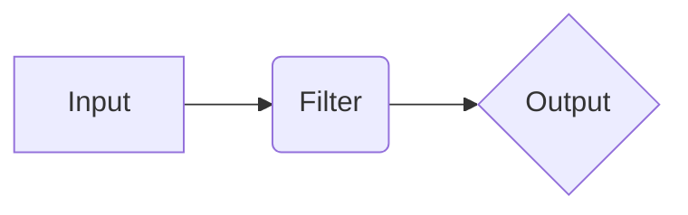

## 1. 背景介绍

### 1.1 海量数据处理的挑战

随着互联网和物联网的快速发展，数据量呈爆炸式增长，如何高效地处理海量数据成为企业面临的巨大挑战。传统的日志分析工具难以应对海量数据的收集、处理和分析需求，迫切需要一种更强大、更灵活的解决方案。

### 1.2 ELK Stack的兴起

为了解决海量数据处理的难题，Elastic Stack应运而生。Elastic Stack是一套开源的、基于Java开发的日志分析平台，由Elasticsearch、Logstash、Kibana和Beats四个核心组件组成。其中，Logstash作为数据管道，负责收集、解析、转换和存储各种类型的数据，为Elasticsearch提供高质量的数据源。

### 1.3 Logstash的优势

Logstash具有以下优势：

* **灵活的数据处理能力**: Logstash支持多种数据输入和输出方式，可以处理各种类型的数据，例如日志文件、数据库、消息队列等。
* **强大的插件生态系统**: Logstash拥有丰富的插件生态系统，用户可以根据需求选择合适的插件来扩展Logstash的功能。
* **易于配置和管理**: Logstash使用简洁易懂的配置文件，用户可以轻松地配置和管理Logstash实例。
* **可扩展性**: Logstash可以横向扩展，以处理更大的数据量。

## 2. 核心概念与联系

### 2.1 数据流转流程

Logstash的核心功能是数据流转，其基本流程如下：

1. **输入**: Logstash从各种数据源收集数据，例如文件、数据库、消息队列等。
2. **过滤器**: Logstash使用过滤器对数据进行解析、转换和 enrich，例如解析日志格式、提取字段、添加标签等。
3. **输出**: Logstash将处理后的数据输出到各种目的地，例如Elasticsearch、文件、数据库等。

### 2.2 核心组件

Logstash由以下核心组件组成：

* **Input**: 输入插件负责从数据源收集数据。
* **Filter**: 过滤器插件负责对数据进行解析、转换和 enrich。
* **Output**: 输出插件负责将处理后的数据输出到目的地。
* **Codec**: 编解码器负责对数据进行编码和解码。

### 2.3 组件之间的联系

Logstash的各个组件之间通过管道连接，数据在管道中依次经过输入、过滤器和输出组件进行处理。



## 3. 核心算法原理具体操作步骤

### 3.1 输入插件的工作原理

输入插件负责从数据源收集数据，其工作原理如下：

1. **配置数据源**: 用户需要在Logstash配置文件中指定数据源的类型、地址、端口等信息。
2. **建立连接**: 输入插件根据配置信息建立与数据源的连接。
3. **读取数据**: 输入插件从数据源读取数据，并将数据转换为Logstash事件。

### 3.2 过滤器插件的工作原理

过滤器插件负责对数据进行解析、转换和 enrich，其工作原理如下：

1. **匹配规则**: 过滤器插件根据预先定义的规则匹配Logstash事件。
2. **数据处理**: 过滤器插件对匹配的事件进行解析、转换和 enrich，例如解析日志格式、提取字段、添加标签等。
3. **输出事件**: 过滤器插件将处理后的事件输出到下一个过滤器插件或输出插件。

### 3.3 输出插件的工作原理

输出插件负责将处理后的数据输出到目的地，其工作原理如下：

1. **配置目的地**: 用户需要在Logstash配置文件中指定目的地的类型、地址、端口等信息。
2. **建立连接**: 输出插件根据配置信息建立与目的地的连接。
3. **写入数据**: 输出插件将Logstash事件写入目的地。

## 4. 数学模型和公式详细讲解举例说明

Logstash没有特定的数学模型和公式，其核心算法是基于规则匹配和数据转换。

**举例说明**:

假设我们需要从Apache Web服务器的访问日志中提取访问IP地址、访问时间、请求方法和请求路径，并将这些信息存储到Elasticsearch中。

**Logstash配置文件**:

```
input {
  file {
    path => "/var/log/apache2/access.log"
  }
}

filter {
  grok {
    match => { "message" => "%{COMBINEDAPACHELOG}" }
  }
  date {
    match => [ "timestamp", "dd/MMM/yyyy:HH:mm:ss Z" ]
  }
}

output {
  elasticsearch {
    hosts => ["localhost:9200"]
    index => "apache-logs"
  }
}
```

**配置文件解释**:

* **input**: 使用 `file` 输入插件从 `/var/log/apache2/access.log` 文件中读取数据。
* **filter**: 使用 `grok` 过滤器插件解析 Apache Web 服务器的访问日志格式，提取访问IP地址、访问时间、请求方法和请求路径等信息。使用 `date` 过滤器插件将访问时间转换为 Elasticsearch 可识别的日期格式。
* **output**: 使用 `elasticsearch` 输出插件将处理后的数据写入 Elasticsearch 中的 `apache-logs` 索引。

## 5. 项目实践：代码实例和详细解释说明

### 5.1 安装Logstash

Logstash可以从Elastic官方网站下载安装包进行安装。

### 5.2 编写配置文件

Logstash使用配置文件来定义数据流转流程。配置文件使用YAML或JSON格式编写。

**示例配置文件**:

```yaml
input {
  stdin { }
}

filter {
  uppercase { }
}

output {
  stdout { }
}
```

**配置文件解释**:

* **input**: 使用 `stdin` 输入插件从标准输入读取数据。
* **filter**: 使用 `uppercase` 过滤器插件将输入数据转换为大写。
* **output**: 使用 `stdout` 输出插件将处理后的数据输出到标准输出。

### 5.3 运行Logstash

使用以下命令运行Logstash：

```
bin/logstash -f config.yml
```

其中，`config.yml` 是配置文件的路径。

## 6. 实际应用场景

Logstash的实际应用场景非常广泛，例如：

* **日志分析**: Logstash可以收集、解析和分析各种类型的日志数据，例如应用程序日志、系统日志、安全日志等。
* **安全监控**: Logstash可以收集和分析安全事件，例如入侵检测、恶意软件分析等。
* **业务指标监控**: Logstash可以收集和分析业务指标，例如网站流量、用户行为等。
* **数据仓库**: Logstash可以将数据从各种数据源收集到数据仓库中，例如Hadoop、Spark等。

## 7. 总结：未来发展趋势与挑战

### 7.1 未来发展趋势

* **云原生**: Logstash将更加紧密地集成到云原生环境中，例如 Kubernetes、Docker 等。
* **机器学习**: Logstash将集成机器学习算法，以实现更智能的数据分析和处理。
* **数据流分析**: Logstash将支持更强大的数据流分析功能，例如实时数据分析、异常检测等。

### 7.2 面临的挑战

* **性能优化**: 随着数据量的不断增长，Logstash需要不断优化性能，以应对海量数据的处理需求。
* **安全性**: Logstash需要确保数据的安全性和完整性，以防止数据泄露和篡改。
* **易用性**: Logstash需要不断提高易用性，以方便用户配置和管理。

## 8. 附录：常见问题与解答

### 8.1 如何解决Logstash启动失败的问题？

Logstash启动失败的原因有很多，例如配置文件错误、插件缺失、Java环境问题等。可以通过查看Logstash日志文件来排查问题。

### 8.2 如何提高Logstash的性能？

可以通过以下方式提高Logstash的性能：

* **增加Logstash实例数量**: 横向扩展Logstash实例，以处理更大的数据量。
* **优化过滤器配置**: 避免使用过于复杂的过滤器配置，以减少数据处理时间。
* **使用缓存**: 使用缓存来存储 frequently accessed data，以减少数据读取时间。

### 8.3 如何监控Logstash的运行状态？

可以使用Logstash提供的监控工具来监控Logstash的运行状态，例如：

* **Logstash Web UI**: Logstash提供了一个 Web UI，可以查看Logstash的运行状态、统计信息和配置信息。
* **Metricbeat**: Metricbeat可以收集Logstash的指标数据，并将其发送到Elasticsearch进行分析和可视化。