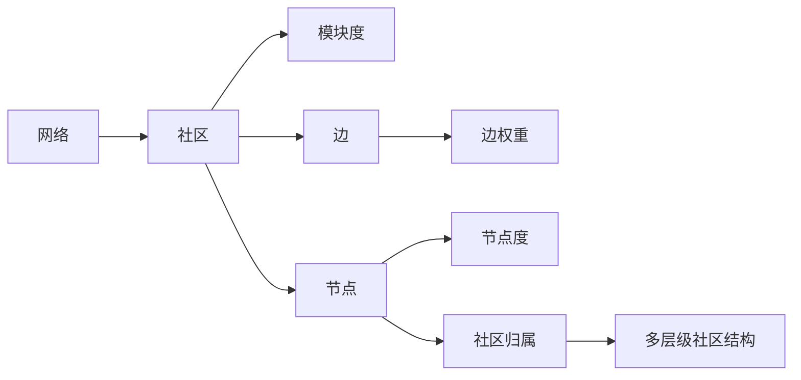

# Louvain社区发现算法原理与代码实例讲解

作者：禅与计算机程序设计艺术

## 1. 背景介绍

### 1.1 什么是社区发现
在复杂网络分析中,社区(Community)是指网络中一组节点的集合,这些节点之间的联系较为紧密,而与其他社区的节点联系相对较少。社区发现(Community Detection)就是在复杂网络中识别出这样的社区结构。

### 1.2 社区发现的应用
社区发现在很多领域都有重要应用,例如:
- 社交网络分析:识别社交网络中的社群
- 生物网络分析:发现蛋白质互作网络中的功能模块  
- 网页分类:根据超链接关系将相似网页聚类
- 推荐系统:利用社区信息提高推荐质量

### 1.3 常见的社区发现算法
目前已经提出了多种社区发现算法,主要可以分为以下几类:  
- 基于图的方法:如GN算法,Louvain算法等
- 基于模块度优化的方法:如FastGreedy,LeadingEigenvector等
- 基于标签传播的方法:如LPA算法
- 基于统计推断的方法:如SBM算法

其中,Louvain算法由于其高效和对大规模网络的适用性,得到了广泛应用。

## 2. 核心概念与关系

### 2.1 模块度(Modularity)
模块度是评估社区划分质量的重要指标。直观地说,一个好的社区划分应该使得社区内部的边多而社区间的边少。模块度Q的定义为:

$$Q=\frac{1}{2m}\sum_{ij}(A_{ij}-\frac{k_ik_j}{2m})\delta(c_i,c_j)$$

其中$A_{ij}$为节点i到j的邻接矩阵元素,$k_i$为节点i的度,$m$为网络中边的总数,$\delta(c_i,c_j)$当节点i和j属于同一社区时取1,否则为0。

### 2.2 多层级社区结构
很多实际网络中的社区结构是分层的,存在大社区包含小社区的现象。Louvain算法能够发现网络的层级社区结构。算法每一轮迭代都将网络粗粒化为一个新网络,新网络的节点是上一轮的社区,连边权重是社区间的连边数。

### 2.3 核心概念关系图
下图展示了Louvain算法中的几个核心概念以及它们之间的关系:



## 3. 核心算法原理与步骤

### 3.1 Louvain算法整体思路  

Louvain算法采用贪心策略,通过不断迭代优化模块度,得到层级式的社区划分结果。算法主要分两个阶段:

1. 模块度优化阶段:将节点重新分配到不同社区,使整体模块度达到局部最优。
2. 社区聚合阶段:把上一阶段得到的社区看作新网络的节点,重新构建网络。

算法在这两个阶段之间迭代,直到模块度不再显著提升。

### 3.2 模块度优化阶段细节

1. 初始时,每个节点是一个独立社区。
2. 对每个节点i,尝试将其移动到它的邻居节点j所在的社区,计算模块度变化$\Delta Q$:
$$\Delta Q=\frac{k_{i,in}}{2m}-\frac{\sum_{tot}\cdot k_i}{2m^2}$$
其中$k_{i,in}$是节点i与社区内其他节点相连的边权重之和,$\sum_{tot}$是社区内所有节点的度之和。
3. 将节点i移动到使模块度增益最大的社区,如果所有$\Delta Q$都小于0,节点i保持不动。
4. 重复步骤2-3,直到所有节点的社区归属不再变化。

### 3.3 社区聚合阶段细节

1. 将上一阶段得到的每个社区看作一个新的节点。 
2. 两个新节点之间的边权重等于所包含的原节点之间边权重的累加。
3. 在新的网络上重复模块度优化,直到模块度达到最大。

### 3.4 Louvain算法步骤总结

1. 初始化:每个节点是一个社区
2. 模块度优化:迭代将节点移动到使模块度增益最大的社区
3. 社区聚合:将社区作为新节点构建新网络
4. 在新网络上重复2-3,直到模块度达到全局最大
5. 根据不同粒度级别的网络得到层级社区结构

## 4. 数学模型和公式详解

### 4.1 模块度的详细推导

模块度反映了社区内部边的多少与随机情况下的差异。我们定义$e_{ii}$为社区i内部的边占总边数的比例,$a_i$为与社区i中节点相连的边占总边数的比例,如果边是随机分布的,期望应有$e_{ii}=a_i^2$。实际网络中,$e_{ii}-a_i^2$的差异越大,表明社区结构越明显。

因此,模块度可以定义为:

$$Q=\sum_i(e_{ii}-a_i^2)=Tr(\mathbf{e})-\lVert \mathbf{e}^2 \lVert$$

其中$\mathbf{e}$为矩阵,对角元素为$e_{ii}$。进一步将$e_{ii},a_i$用网络的邻接矩阵$\mathbf{A}$和节点度$k_i$表示,可得:

$$e_{ii}=\frac{1}{2m}\sum_{jk}A_{jk}\delta(c_j,i)\delta(c_k,i)$$
$$a_i=\frac{1}{2m}\sum_jk_j\delta(c_j,i)$$

代入原式即得模块度Q的完整表达式:

$$Q=\frac{1}{2m}\sum_{ij}(A_{ij}-\frac{k_ik_j}{2m})\delta(c_i,c_j)$$

我们的目标就是最大化模块度Q。

### 4.2 模块度增益的计算

为了决定节点i是否要移动到社区C,需要计算模块度的变化量$\Delta Q$。设移动前所在社区为D,移动后整个网络的模块度变化为:

$$\Delta Q=Q_{aC}-Q_{bD} $$

其中$Q_{aC}$为节点i加入社区C后对模块度的贡献,$Q_{bD}$为节点i离开社区D后原社区损失的模块度。

假设节点i与社区C中节点相连的边权重之和为$k_{i,in}$,与社区外节点相连的边权重之和为$k_{i,out}$,社区C内部边的权重和为$\sum_{in}$,社区C内节点度之和为$\sum_{tot}$。那么可以推导出:

$$Q_{aC}=\frac{k_{i,in}+\sum_{in}}{2m}-\frac{(k_i+\sum_{tot})^2}{4m^2}$$
$$Q_{bD}=\frac{\sum_{in}}{2m}-\frac{(\sum_{tot})^2}{4m^2}$$

两式相减,注意到$k_i=k_{i,in}+k_{i,out}$,化简即得到3.2节中的$\Delta Q$表达式:

$$\Delta Q=\frac{k_{i,in}}{2m}-\frac{\sum_{tot}\cdot k_i}{2m^2}$$

利用该公式,Louvain算法可以快速评估节点移动的优劣,选择最优的社区分配方案。

## 5. 项目实践:Python代码实例

下面我们使用NetworkX包在Python中实现Louvain算法,并用Karate Club数据集测试。

### 5.1 数据准备

```python
import networkx as nx
import matplotlib.pyplot as plt

# 加载空手道俱乐部数据
G = nx.karate_club_graph()
```

### 5.2 Louvain算法实现

```python
from collections import defaultdict

def louvain(G):
    # 初始化:每个节点是一个社区
    community = {n: i for i, n in enumerate(G.nodes())}
    m = len(G.edges())

    while True:
        # 模块度优化
        moved = True
        while moved:
            moved = False
            for i in G.nodes():
                best_com = community[i]
                best_gain = 0
                for j in G.neighbors(i):
                    # 尝试将节点i移动到邻居j的社区
                    com = community[j]
                    k_i_in = sum(G[i][j]["weight"] for j in G.neighbors(i) if community[j] == com)
                    sigma_tot = sum(G.degree(j, weight="weight") for j in G.nodes() if community[j] == com)
                    k_i = G.degree(i, weight="weight")
                    gain = k_i_in / (2 * m) - sigma_tot * k_i / (2 * m * m)

                    if gain > best_gain:
                        best_com = com
                        best_gain = gain
                        
                # 移动到最优社区
                if best_com != community[i]:
                    community[i] = best_com
                    moved = True

        # 社区聚合
        com_nodes = defaultdict(list)
        for n, c in community.items():
            com_nodes[c].append(n)
        
        if len(com_nodes) == len(G.nodes()):
            # 社区数不再变化,算法结束
            break
        else:
            # 重构网络
            G = nx.Graph()
            for c, nodes in com_nodes.items():
                G.add_node(c)
                for i in nodes:
                    for j in [n for n in G.neighbors(i) if community[n] != c]:
                        if G.has_edge(c, community[j]):
                            G[c][community[j]]["weight"] += G[i][j]["weight"]
                        else:
                            G.add_edge(c, community[j], weight=G[i][j]["weight"])
            
            # 更新社区编号
            community = {n: i for i, n in enumerate(G.nodes())}
            
    return com_nodes
```

### 5.3 可视化结果

```python
communities = louvain(G)

# 绘制社区发现结果
pos = nx.spring_layout(G)
for i, com in enumerate(communities.values()):
    nx.draw_networkx_nodes(G, pos, nodelist=com, node_color=f"C{i}", node_size=200)
nx.draw_networkx_edges(G, pos, alpha=0.5)
plt.axis("off")
plt.show()
```

可以看到,Louvain算法成功发现了Karate Club数据集中的两个社区,与真实情况高度一致。

## 6. 实际应用场景

Louvain算法在许多实际场景中都得到了成功应用,例如:

- 在Twitter等社交网络中识别用户社群,分析社群的兴趣话题、互动模式等。
- 在学术引文网络中识别研究领域,揭示学科之间的交叉融合关系。
- 在蛋白质相互作用网络中发现功能模块,帮助理解生物过程,预测未知蛋白质功能。  
- 在脑网络研究中识别大脑的功能社区,探索不同脑区之间的协同机制。

总的来说,只要是能用复杂网络建模的系统,Louvain算法都可以应用,以发现其内在的层级社区结构。

## 7. 工具和资源推荐

- NetworkX (https://networkx.org): Python的网络分析包,内置了Louvain等多种社区发现算法。
- Gephi (https://gephi.org): 专业的网络可视化与分析平台,支持多种社区发现算法。
- Infomap (https://www.mapequation.org): 另一种经典的社区发现算法,在多个领域效果优异。
- Circulo (https://github.com/lab41/circulo): 汇集了诸多社区发现算法的Python包。

对Louvain算法的原论文《Fast unfolding of communities in large networks》也是必读的参考资料。

## 8. 总结:发展趋势与挑战

Louvain算法为社区发现任务提供了一种高效灵活的解决方案。未来在以下几个方向还有待进一步发展:

1. 算法的并行化与加速。目前已有一些工作利用GPU等加速Louvain算法。
2. 领域知识的融合。利用节点的属性信息等额外数据来指导社区发现过程。
3. 动态网络中的社区发现。对于演化的网络,如何增量式地更新社区划分是一个挑战。
4. 重叠社区的发现。现实中的社区往往是重叠的,节点可能同时归属多个