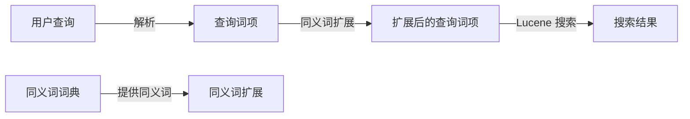

# Lucene同义词搜索：扩展搜索范围

作者：禅与计算机程序设计艺术

## 1. 背景介绍

### 1.1 搜索引擎的核心：精准与召回

现代搜索引擎的核心目标在于：在海量数据中，快速且准确地找到与用户查询意图最匹配的结果。这一目标可以拆解为两个关键指标：**精准率(Precision)** 和 **召回率(Recall)**。

*   **精准率**: 指的是检索到的文档中，真正与用户查询相关的文档比例。
*   **召回率**: 指的是所有与用户查询相关的文档中，被成功检索到的文档比例。

这两个指标往往相互制约：追求高精准率，可能会漏掉一些相关结果，降低召回率；而追求高召回率，则可能引入一些不相关的结果，降低精准率。

### 1.2  Lucene：强大的开源搜索引擎库

Apache Lucene 是一个基于 Java 的高性能、功能全面的文本搜索引擎库。它允许开发者将全文检索功能嵌入到自己的应用程序中。Lucene 使用倒排索引技术，能够快速高效地检索包含特定词项的文档。

### 1.3 同义词搜索：提升召回率的关键

然而，传统的基于关键词匹配的搜索方式，往往难以捕捉到用户查询背后的真实语义。例如，用户搜索 "手机" 时，可能也希望看到包含 "移动电话"、"智能手机" 等词语的结果。

**同义词搜索** (Synonym Search) 应运而生。它允许用户在搜索时，不仅匹配完全一致的关键词，还能匹配其同义词、近义词、缩写词等语义相似的词语，从而有效提升搜索结果的召回率，帮助用户发现更多相关信息。

## 2. 核心概念与联系

### 2.1 同义词(Synonym)

同义词是指含义相同或相近的词语，例如 "手机" 和 "移动电话"。

### 2.2 同义词词典(Synonym Dictionary)

同义词词典是存储同义词关系的数据结构，例如：

```
手机, 移动电话, 智能手机
汽车, 机动车, 小汽车
```

### 2.3 Lucene 同义词过滤器(Synonym Filter)

Lucene 提供了 `SynonymFilter`，它是一个 TokenFilter，可以在索引和搜索阶段，将查询词项替换为其同义词，从而实现同义词搜索。

### 2.4 关系图



## 3. 核心算法原理具体操作步骤

### 3.1 创建同义词词典

首先，我们需要创建一个同义词词典。可以使用以下几种方式：

*   **手动创建**:  将同义词关系存储在文本文件或数据库中。
*   **自动构建**: 使用自然语言处理技术，从语料库中自动挖掘同义词关系。

### 3.2 配置 SynonymFilter

在 Lucene 中使用 `SynonymFilter`，需要将其配置到索引和搜索的分析器(Analyzer)中。

```java
// 创建同义词词典
SynonymMap.Builder builder = new SynonymMap.Builder(true);
builder.add(new CharsRef("手机"), new CharsRef("移动电话"), true);
SynonymMap synonymMap = builder.build();

// 创建 TokenStream
TokenStream tokenStream = new StandardTokenizer();

// 创建 SynonymFilter
SynonymFilter synonymFilter = new SynonymFilter(tokenStream, synonymMap, true);

// 创建索引时的分析器
Analyzer indexAnalyzer = new CustomAnalyzer(synonymFilter);

// 搜索时的分析器
Analyzer searchAnalyzer = new CustomAnalyzer(synonymFilter);
```

### 3.3  搜索过程中的同义词扩展

当用户提交查询时，`SynonymFilter` 会将查询词项与其同义词进行替换，生成扩展后的查询词项集合。Lucene 会使用扩展后的查询词项集合进行搜索，并将匹配的文档返回给用户。

## 4. 数学模型和公式详细讲解举例说明

### 4.1  Jaccard 相似度

Jaccard 相似度是一种常用的文本相似度计算方法，可以用于衡量两个集合之间的相似程度。

$$
Jaccard(A,B) = \frac{|A \cap B|}{|A \cup B|}
$$

其中，$A$ 和 $B$ 分别表示两个集合，$|A \cap B|$ 表示两个集合的交集元素个数，$|A \cup B|$ 表示两个集合的并集元素个数。

例如，假设有两个文档：

*   文档 1: "我 喜欢 使用 手机"
*   文档 2: "我 喜欢 使用 移动电话"

则这两个文档的 Jaccard 相似度为：

$$
Jaccard(文档1, 文档2) = \frac{3}{5} = 0.6
$$

### 4.2  同义词扩展对搜索结果的影响

假设用户搜索 "手机"，同义词词典中包含 "手机" 和 "移动电话" 这两个同义词。

*   **未进行同义词扩展**: Lucene 只会搜索包含 "手机" 的文档。
*   **进行同义词扩展**: Lucene 会搜索包含 "手机" 或 "移动电话" 的文档。

通过同义词扩展，可以有效提升搜索结果的召回率。

## 5. 项目实践：代码实例和详细解释说明

### 5.1 创建 Lucene 索引

```java
// 创建索引目录
Directory indexDir = FSDirectory.open(Paths.get("/path/to/index"));

// 创建分析器
Analyzer analyzer = new StandardAnalyzer();

// 创建索引配置
IndexWriterConfig config = new IndexWriterConfig(analyzer);

// 创建索引写入器
IndexWriter writer = new IndexWriter(indexDir, config);

// 创建文档
Document doc = new Document();
doc.add(new TextField("title", "手机评测", Field.Store.YES));
doc.add(new TextField("content", "这是一篇关于手机的评测文章。", Field.Store.YES));
writer.addDocument(doc);

// 关闭索引写入器
writer.close();
```

### 5.2  创建同义词词典

```java
// 创建同义词词典
SynonymMap.Builder builder = new SynonymMap.Builder(true);
builder.add(new CharsRef("手机"), new CharsRef("移动电话"), true);
SynonymMap synonymMap = builder.build();
```

### 5.3  创建 SynonymFilter

```java
// 创建 TokenStream
TokenStream tokenStream = new StandardTokenizer();

// 创建 SynonymFilter
SynonymFilter synonymFilter = new SynonymFilter(tokenStream, synonymMap, true);
```

### 5.4  搜索

```java
// 创建索引读取器
IndexReader reader = DirectoryReader.open(indexDir);

// 创建搜索器
IndexSearcher searcher = new IndexSearcher(reader);

// 创建查询解析器
QueryParser parser = new QueryParser("content", new StandardAnalyzer());

// 创建查询
Query query = parser.parse("手机");

// 搜索
TopDocs docs = searcher.search(query, 10);

// 打印搜索结果
for (ScoreDoc scoreDoc : docs.scoreDocs) {
    Document doc = searcher.doc(scoreDoc.doc);
    System.out.println(doc.get("title"));
}

// 关闭索引读取器
reader.close();
```

## 6. 实际应用场景

### 6.1  电商网站

在电商网站中，可以使用同义词搜索来扩展用户的搜索范围，例如：

*   用户搜索 "连衣裙" 时，可以匹配 "长裙"、"短裙"、"半身裙" 等同义词。
*   用户搜索 "笔记本电脑" 时，可以匹配 "笔记本"、"电脑"、"超级本" 等同义词。

### 6.2  新闻网站

在新闻网站中，可以使用同义词搜索来帮助用户找到更多相关新闻，例如：

*   用户搜索 "新冠肺炎" 时，可以匹配 "COVID-19"、"新型冠状病毒" 等同义词。
*   用户搜索 "美国大选" 时，可以匹配 "总统选举"、"特朗普"、"拜登" 等同义词。

## 7. 工具和资源推荐

*   **Apache Lucene**: [https://lucene.apache.org/](https://lucene.apache.org/)
*   **Lucene in Action**: 一本关于 Lucene 的经典书籍。

## 8. 总结：未来发展趋势与挑战

### 8.1  未来发展趋势

*   **语义搜索**:  未来的搜索引擎将会更加注重语义理解，能够更好地理解用户查询背后的真实意图。
*   **个性化搜索**:  搜索引擎将会根据用户的搜索历史、兴趣爱好等信息，提供更加个性化的搜索结果。
*   **多模态搜索**:  搜索引擎将会支持多种搜索方式，例如文本搜索、图片搜索、语音搜索等。

### 8.2  挑战

*   **同义词词典的构建**:  构建高质量的同义词词典是一项 challenging 的任务。
*   **搜索效率**:  同义词扩展会增加搜索的复杂度，需要不断优化搜索算法，提升搜索效率。
*   **搜索结果的排序**:  如何对同义词扩展后的搜索结果进行排序，也是一个需要解决的问题。

## 9. 附录：常见问题与解答

### 9.1 如何评估同义词搜索的效果？

可以使用精准率、召回率等指标来评估同义词搜索的效果。

### 9.2 如何处理多个同义词的情况？

如果一个词语有多个同义词，可以使用以下几种方法：

*   **全部替换**: 将查询词项替换为所有同义词。
*   **选择性替换**: 根据一定的规则，选择部分同义词进行替换。
*   **加权替换**: 为不同的同义词赋予不同的权重，根据权重进行替换。

### 9.3 如何避免同义词冲突？

在构建同义词词典时，需要注意避免同义词冲突，例如 "苹果" 既可以指水果，也可以指公司。可以通过添加上下文信息来解决同义词冲突问题，例如 "苹果手机" 和 "苹果派"。
