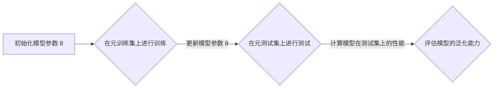

# MAML在自然语言处理中的创新应用

作者：禅与计算机程序设计艺术

## 1. 背景介绍

### 1.1. 自然语言处理的挑战与机遇

自然语言处理（NLP）旨在让计算机能够理解和处理人类语言，是人工智能领域的关键挑战之一。近年来，深度学习的兴起为NLP带来了革命性的突破，催生了机器翻译、情感分析、问答系统等众多应用。然而，传统的深度学习模型通常需要大量的标注数据进行训练，难以适应NLP任务的多样性和数据稀缺性。

### 1.2. 元学习：迈向通用人工智能之路

元学习（Meta-learning）, 又称为“学习如何学习”，旨在让机器学习算法能够从少量数据中快速学习新的任务。与传统的机器学习方法不同，元学习的目标并非训练一个在特定任务上表现优异的模型，而是训练一个能够快速适应新任务的“元模型”。

### 1.3. MAML：一种高效的元学习算法

模型无关元学习（Model-Agnostic Meta-Learning，MAML）是一种简单而有效的元学习算法，其核心思想是通过学习一个良好的参数初始化点，使得模型能够在少量梯度更新后快速适应新的任务。MAML具有模型无关性、易于实现等优点，在图像分类、强化学习等领域取得了显著成果。

## 2. 核心概念与联系

### 2.1. 元学习的基本概念

* **任务（Task）**: 指的是一个具体的学习问题，例如对一组图像进行分类、对一段文本进行情感分析等。
* **元训练集（Meta-training set）**: 由多个任务组成，用于训练元模型。
* **元测试集（Meta-test set）**: 由未在元训练集中出现的新任务组成，用于评估元模型的泛化能力。
* **元模型（Meta-model）**: 通过元学习算法训练得到的模型，能够快速适应新的任务。

### 2.2. MAML的核心思想

MAML的核心思想是通过学习一个良好的参数初始化点，使得模型能够在少量梯度更新后快速适应新的任务。具体来说，MAML算法包括以下两个步骤：

1. **元训练阶段**: 在元训练集上，对于每个任务，先使用少量数据对模型进行训练，然后计算模型在该任务上的损失函数。接着，将所有任务的损失函数加和，并使用梯度下降法更新模型参数。
2. **元测试阶段**: 在元测试集上，对于每个新任务，先使用MAML算法初始化模型参数，然后使用少量数据对模型进行微调。

### 2.3. MAML与传统深度学习的区别

与传统的深度学习方法相比，MAML具有以下几个优势：

* **数据效率高**: MAML能够从少量数据中快速学习新的任务，适用于数据稀缺的场景。
* **泛化能力强**: MAML学习到的参数初始化点能够使模型快速适应新的任务，具有良好的泛化能力。
* **模型无关性**: MAML可以应用于各种类型的深度学习模型，例如卷积神经网络、循环神经网络等。

## 3. 核心算法原理具体操作步骤

### 3.1. MAML算法流程

MAML算法的流程图如下所示：



### 3.2. 具体操作步骤

1. **初始化模型参数** $\theta$。
2. **元训练阶段**:
    * 从元训练集中随机抽取一批任务 $T_i = \{ (x_1, y_1), ..., (x_K, y_K) \}$，其中 $K$ 表示每个任务的样本数量。
    * 对于每个任务 $T_i$:
        * 使用少量数据 $(x_1, y_1), ..., (x_j, y_j)$ 对模型进行训练，得到参数 $\theta_i'$。
        * 使用剩余数据 $(x_{j+1}, y_{j+1}), ..., (x_K, y_K)$ 计算模型的损失函数 $L_{T_i}(\theta_i')$。
    * 将所有任务的损失函数加和，得到总损失函数 $L(\theta) = \sum_{i=1}^N L_{T_i}(\theta_i')$。
    * 使用梯度下降法更新模型参数 $\theta \leftarrow \theta - \alpha \nabla_\theta L(\theta)$，其中 $\alpha$ 为学习率。
3. **元测试阶段**:
    * 从元测试集中随机抽取一个新任务 $T$。
    * 使用MAML算法初始化模型参数 $\theta' = \theta$。
    * 使用少量数据对模型进行微调，得到参数 $\theta^*$。
    * 使用模型参数 $\theta^*$ 计算模型在新任务 $T$ 上的性能。

## 4. 数学模型和公式详细讲解举例说明

### 4.1. MAML的目标函数

MAML的目标函数是找到一个参数初始化点 $\theta$，使得模型能够在少量梯度更新后快速适应新的任务。具体来说，MAML的目标函数可以表示为：

$$
\min_\theta \mathbb{E}_{T \sim p(T)} [ L_T(\theta') ]
$$

其中，$p(T)$ 表示任务的分布，$L_T(\theta')$ 表示模型在任务 $T$ 上的损失函数，$\theta' = \theta - \alpha \nabla_\theta L_{T_i}(\theta)$ 表示经过一次梯度更新后的模型参数。

### 4.2. 二阶梯度下降

为了最小化MAML的目标函数，需要计算目标函数对参数 $\theta$ 的梯度。由于目标函数中包含了另一个优化过程（即内部循环中的梯度下降），因此需要使用二阶梯度下降法来计算梯度。

MAML的二阶梯度可以表示为：

$$
\nabla_\theta L_T(\theta') = \nabla_\theta L_T(\theta) + \alpha \nabla^2_{\theta \theta} L_{T_i}(\theta) \nabla_\theta L_{T_i}(\theta)
$$

其中，$\nabla^2_{\theta \theta} L_{T_i}(\theta)$ 表示损失函数 $L_{T_i}(\theta)$ 对参数 $\theta$ 的 Hessian 矩阵。

### 4.3. 举例说明

假设我们有一个图像分类任务，元训练集包含 5 个类别，每个类别有 10 张图像。我们使用一个简单的卷积神经网络作为模型，并使用 MAML 算法进行训练。

在元训练阶段，我们从元训练集中随机抽取一批任务，例如类别 1 和类别 2。对于每个任务，我们使用 5 张图像对模型进行训练，然后使用剩余的 5 张图像计算模型的损失函数。我们将所有任务的损失函数加和，并使用梯度下降法更新模型参数。

在元测试阶段，我们从元测试集中随机抽取一个新任务，例如类别 3。我们使用 MAML 算法初始化模型参数，然后使用 5 张图像对模型进行微调。最后，我们使用模型对类别 3 的图像进行分类，并评估模型的准确率。

## 5. 项目实践：代码实例和详细解释说明

### 5.1. 代码实例

以下是一个使用 PyTorch 实现 MAML 算法的简单示例：

```python
import torch
import torch.nn as nn
import torch.optim as optim

class MAML(nn.Module):
    def __init__(self, model, inner_lr, meta_lr):
        super(MAML, self).__init__()
        self.model = model
        self.inner_lr = inner_lr
        self.meta_lr = meta_lr
        self.meta_optimizer = optim.Adam(self.model.parameters(), lr=self.meta_lr)

    def forward(self, x_spt, y_spt, x_qry, y_qry):
        """
        x_spt: support set input data
        y_spt: support set output data
        x_qry: query set input data
        y_qry: query set output data
        """
        task_num = x_spt.size(0)
        querysz = x_qry.size(1)

        losses_q = [0 for _ in range(task_num)]
        corrects = [0 for _ in range(task_num)]

        for i in range(task_num):
            # 1. run the i-th task and compute loss for k=0
            logits = self.model(x_spt[i])
            loss = F.cross_entropy(logits, y_spt[i])
            grad = torch.autograd.grad(loss, self.model.parameters())
            fast_weights = list(map(lambda p: p[1] - self.inner_lr * p[0], zip(grad, self.model.parameters())))

            # 2. compute grad on query set with theta_prime
            with torch.no_grad():
                logits_q = self.model(x_qry[i], fast_weights)
                loss_q = F.cross_entropy(logits_q, y_qry[i])
                losses_q[i] += loss_q

            # 3. compute grad on support set with theta_prime
            logits = self.model(x_spt[i], fast_weights)
            loss = F.cross_entropy(logits, y_spt[i])
            grad = torch.autograd.grad(loss, fast_weights)

            # 4. update meta parameters
            for k, weight in enumerate(self.model.parameters()):
                weight.grad = weight.grad + grad[k] / task_num

        # 5. update meta parameters
        self.meta_optimizer.step()

        accs = np.array(corrects) / querysz
        return accs.mean()
```

### 5.2. 代码解释

* `MAML` 类继承自 `nn.Module`，表示一个 PyTorch 模型。
* `__init__` 方法初始化 MAML 模型，包括内部循环学习率 `inner_lr`、元学习率 `meta_lr` 和元优化器 `meta_optimizer`。
* `forward` 方法定义了 MAML 算法的前向传播过程，包括以下步骤：
    * 对于每个任务：
        * 使用支持集数据计算模型的损失函数和梯度。
        * 使用计算得到的梯度更新模型参数，得到快速权重 `fast_weights`。
        * 使用快速权重计算查询集数据的损失函数 `loss_q`。
        * 使用快速权重计算支持集数据的损失函数和梯度。
        * 将所有任务的梯度加和，并更新元参数。
* `meta_optimizer.step()` 方法更新元参数。

## 6. 实际应用场景

### 6.1. 少样本学习

MAML 可以用于解决少样本学习问题，例如：

* **图像分类**: 在只有少量标注数据的情况下，使用 MAML 算法训练一个图像分类模型。
* **文本分类**: 在只有少量标注数据的情况下，使用 MAML 算法训练一个文本分类模型。

### 6.2. 领域自适应

MAML 可以用于解决领域自适应问题，例如：

* **情感分析**: 将一个在电影评论数据集上训练的情感分析模型，迁移到产品评论数据集上。
* **机器翻译**: 将一个在英语-法语数据集上训练的机器翻译模型，迁移到英语-德语数据集上。

### 6.3. 强化学习

MAML 可以用于解决强化学习问题，例如：

* **机器人控制**: 在只有少量交互数据的情况下，使用 MAML 算法训练一个机器人控制策略。
* **游戏 AI**: 在只有少量游戏数据的情况下，使用 MAML 算法训练一个游戏 AI。

## 7. 工具和资源推荐

* **PyTorch**: 一个开源的深度学习框架，提供了 MAML 算法的实现。
* **TensorFlow**: 另一个开源的深度学习框架，也提供了 MAML 算法的实现。
* **MAML 代码库**: 一些开源的 MAML 代码库，例如 [https://github.com/cbfinn/maml](https://github.com/cbfinn/maml) 和 [https://github.com/dragen1860/MAML-Pytorch](https://github.com/dragen1860/MAML-Pytorch)。

## 8. 总结：未来发展趋势与挑战

### 8.1. 未来发展趋势

* **更强大的元学习算法**: 研究人员正在探索更强大、更通用的元学习算法，以解决更复杂的任务。
* **元学习与其他技术的结合**: 将元学习与其他技术相结合，例如强化学习、迁移学习等，以解决更广泛的问题。
* **元学习的应用**: 将元学习应用于更广泛的领域，例如医疗保健、金融等。

### 8.2. 挑战

* **计算复杂度**: MAML 算法的计算复杂度较高，尤其是在处理大型数据集时。
* **过拟合**: MAML 算法容易出现过拟合问题，尤其是在元训练数据较少的情况下。
* **理论基础**: MAML 算法的理论基础尚不完善，需要进一步研究。

## 9. 附录：常见问题与解答

### 9.1. 什么是元学习？

元学习是一种机器学习方法，旨在让机器学习算法能够从少量数据中快速学习新的任务。

### 9.2. MAML 是如何工作的？

MAML 通过学习一个良好的参数初始化点，使得模型能够在少量梯度更新后快速适应新的任务。

### 9.3. MAML 的优点是什么？

MAML 的优点包括数据效率高、泛化能力强和模型无关性。

### 9.4. MAML 的应用场景有哪些？

MAML 可以用于解决少样本学习、领域自适应和强化学习等问题。